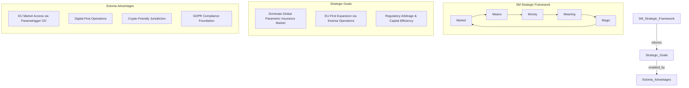

# Triggerr: Strategy & Execution Plan

**Document Version**: 2.0
**Date**: January 2025
**Status**: Active & Maintained (with AI Agent Integration)
**Objective**: To provide a single, high-level source of truth for our company's **Strategy** (our long-term theory of how to win) and our **Plan** (the tactical roadmap for executing that strategy). This document serves as the primary guide for all decision-making.

---

## 1. Our Strategy: The Theory of How We Win

Our strategy is our compass. It defines our unique position in the market, our competitive advantages, and our long-term vision. It is designed to be stable, guiding our choices over a 3-5 year horizon.

We use the **5M Framework** to articulate our strategy:



### **Market: Where We Compete**
We compete in the **global parametric insurance market**, starting with **specialty insurance**, and expanding to other industries characterized by complex, manual processes reliant on traditional tools like spreadsheets and email. Our approach is **Estonia-centric, EU-first**:
1.  **Phase 1 (Foundation)**: Establish technology platform and regulatory framework with **Nevada incorporation** for optimal regulatory arbitrage.
2.  **Phase 2 (EU Launch)**: Launch in **European Union** market via `Parametrigger OÜ` (Estonia), leveraging digital-first operations and crypto-friendly jurisdiction.
3.  **Phase 3 (US Expansion)**: Enter **United States** market through `Triggerr Direct LLC`, targeting crypto-industry professionals and tech-savvy travelers.
4.  **Phase 4 (Global Marketplace)**: Evolve into a **B2B Parametric Risk Marketplace**, enabling third-party providers across multiple jurisdictions.

### **Means: Our Core Capabilities**
Our victory is enabled by two key capabilities:
1.  **Superior AI Agent Technology Stack**: A highly modular, API-first, and open-core architecture powered by **specialized AI agents** that automate distinct parts of complex workflows (e.g., data extraction, comparison, anomaly detection, response drafting). This enables a sophisticated **Data Aggregation Layer** for verifiable accuracy and a fully automated **Payout Engine** for instant claim settlement, ultimately automating entire business processes that currently rely on manual effort.
2.  **Frictionless, AI-Driven User Experience**: A "chat-first" interface integrated with our AI agents, combined with an anonymous purchase flow that removes traditional barriers, making complex financial products simple, fast, and accessible through intelligent interaction.

### **Money: Our Financial Model**
Our growth is funded by a diversified and robust financial model:
1.  **Direct-to-Consumer Revenue**: Sales of first-party insurance products through `Triggerr Direct LLC`.
2.  **Platform Fees**: A target 15% commission from third-party providers using our B2B marketplace.
3.  **DeFi Yield Generation**: Earning yield on capital held within our secure escrow pools.
4.  **High-Efficiency Distribution & Market Penetration**: A dynamic playbook designed for rapid, cost-effective lead acquisition and conversion, built around:
    *   **Value-Driven Content**: Flooding platforms like LinkedIn, X (Twitter), and YouTube with 60-second video solutions addressing real industry pain points.
    *   **Strategic Lead Magnets**: Ending every video with a free lead magnet (e.g., specialized AI agent templates, industry calculators, mini-reports, community access) to capture high-intent leads.
    *   **Agile Paid Amplification**: Pouring advertising spend into winning content (videos with 2%+ CTR) to maximize reach and efficiency.
    *   **Scalable Lead Factory**: Targeting a cost of $3 per lead with an aim for 100+ leads per day, continuously building new lead magnets every 4 weeks to maintain momentum.
5.  **Venture Capital**: Strategic funding rounds to accelerate market penetration and platform development.

### **Meaning: Our Purpose & Mission**
We exist to make insurance **transparent, fair, and instant**. Our mission is to eliminate the opaque, slow, and often adversarial process of traditional insurance claims and, by extension, **automate any complex business process currently hindered by manual, human-intensive tasks and disparate data sources** by using objective, verifiable data triggers and automated, real-time payouts.

### **Magic: Our Unfair Advantage**
Our defensible moat and "secret sauce" is threefold:
1.  **Masterful Regulatory Arbitrage**: Our multi-entity corporate structure across favorable jurisdictions (Nevada, USA & Estonia, EU) creates a powerful legal and financial firewall. This isolates risk and dramatically reduces compliance costs and tax burdens, giving us a competitive advantage worth an estimated **$1.05M - $4.5M annually**. This is our most difficult-to-replicate asset.
2.  **Estonia Digital Advantage**: Operating from Estonia provides unique benefits - EU market access, crypto-friendly regulations, digital-first government infrastructure, and GDPR compliance foundation. This positions us ahead of traditional insurers in the digital asset economy.
3.  **Powerful Open Core AI Agent Ecosystem**: Our commitment to an open-core model fosters a developer community around our modular AI agents and workflow automation playbooks. This creates a powerful network effect and a defensible moat that closed-source competitors cannot easily cross, driving innovation and platform adoption across various contract-driven industries (e.g., insurance policies, equipment leases, real estate agreements).

### **Our Strategy Summarized:**

> **To become the dominant global platform for AI-powered parametric risk automation** by leveraging Estonia-based EU operations, sophisticated regulatory arbitrage, and an open-core **AI agent ecosystem**. This allows us to deliver transparent, automated, and competitively priced insurance products and **scalable automation playbooks** through a superior technology stack, capturing both direct-to-consumer and B2B marketplace revenue while maintaining regulatory advantages across multiple jurisdictions.

---

## 2. Our Plan: The Roadmap to Execution

The Plan is the tactical, living roadmap for executing our strategy. It breaks down our long-term vision into concrete phases, tasks, and milestones. This section serves as a high-level table of contents, linking to detailed implementation plans and completion reports.

```mermaid
gantt
    title MVP Completion Plan (Architect Mode)
    dateFormat  YYYY-MM-DD
    axisFormat %m-%d

    section Foundation (COMPLETE)
    Phase 1: Foundation Repair     :crit, done, 2024-06-01, 2024-12-15
    Phase 2: Service Implementation :crit, done, 2024-06-08, 2024-12-20
    Phase 3: Data Aggregation Layer :crit, done, 2024-06-22, 2024-12-25
    Phase 4: Payout Engine          :crit, done, 2024-06-29, 2025-01-10
    
    section Current Execution
    Phase 0: Infrastructure Setup   :active, 2025-01-13, 2d
    Phase 1: Branding Migration     :2025-01-14, 3d
    Phase 2: API Testing Framework  :2025-01-15, 4d
    
    section Feature Completion
    Phase 3: LLM Integration        :2025-01-18, 4d
    Phase 4: E2E Testing           :2025-01-21, 4d
    Phase 5: Deployment Prep       :2025-01-24, 4d

```

### **📋 CORE PLATFORM FOUNDATION (COMPLETED ✅)**

#### **Phase 1: Foundation Repair (COMPLETED ✅)**
- **Objective**: Stabilize the build system and resolve critical ORM and dependency conflicts.
- **Status**: ✅ **COMPLETED** - Enterprise TypeScript build system operational
- **Documentation**: [Build System Architecture](../development/04_BUILD_SYSTEM_ARCHITECTURE.md)

#### **Phase 2: Service Implementation & Integration (COMPLETED ✅)**
- **Objective**: Implement and integrate the core services required for the insurance lifecycle, from quoting to policy creation.
- **Status**: ✅ **COMPLETED** - Quote, Policy, and Database integration operational
- **Documentation**: [Task 2.3 Completion Report: Policy Engine](../development/TASK_2_3_COMPLETION_REPORT.md)

#### **Phase 3: Data Aggregation Layer (COMPLETED ✅)**
- **Objective**: Build the core data aggregators for flight and weather data, establishing a resilient data pipeline.
- **Status**: ✅ **COMPLETED** - Multi-source aggregation with 90%+ quality scores
- **Documentation**: [Task 3.1 Completion Report: Core Aggregators](../development/TASK_3_1_COMPLETION_REPORT.md)

#### **Phase 4: Payout Engine Implementation (COMPLETED ✅)**
- **Objective**: Build the automated payout engine to monitor policies and process claims based on real-time data.
- **Status**: ✅ **COMPLETED** - Real-time monitoring and automated payouts operational
- **Documentation**: [Task 4.1 Completion Report: Payout Engine](../development/TASK_4_1_COMPLETION_REPORT.md)

### **📋 ARCHITECT MODE: PRODUCTION COMPLETION (ACTIVE 🚀)**

#### **Phase 0: Infrastructure Foundation (ACTIVE 🚀)**
- **Objective**: Establish dual database architecture (local + Supabase) and validate PayGo blockchain integration
- **Status**: ⏳ **ACTIVE** - Critical path for all subsequent phases
- **Timeline**: 2 days
- **Estonia Focus**: Local PostgreSQL setup, timezone considerations

#### **Phase 1: Branding Migration (PENDING ⏳)**
- **Objective**: Complete systematic removal of legacy branding (formerly "InsureInnie") and implement Triggerr as the unified brand with Parametrigger as the Estonia-compliant business entity structure
- **Status**: ⏳ **PENDING** - Blocks API testing
- **Timeline**: 3 days
- **Estonia Focus**: Parametrigger OÜ integration, EU compliance headers

#### **Phase 2: API Testing Framework (PENDING ⏳)**
- **Objective**: Create comprehensive API validation using Postman + automated tests, including PayGo blockchain operations
- **Status**: ⏳ **PENDING** - Foundation for LLM integration
- **Timeline**: 4 days
- **Estonia Focus**: EU timezone testing, GDPR compliance validation

#### **Phase 3: LLM Integration (PENDING ⏳)**
- **Objective**: Complete DeepSeek chat-to-quote functionality with entity-aware responses
- **Status**: ⏳ **PENDING** - Architecture ready for implementation
- **Timeline**: 4 days
- **Estonia Focus**: Multi-jurisdiction entity responses

#### **Phase 4: E2E Testing & Validation (PENDING ⏳)**
- **Objective**: End-to-end user journey validation including Estonia-specific compliance testing
- **Status**: ⏳ **PENDING** - Quality assurance phase
- **Timeline**: 4 days
- **Estonia Focus**: EU user journeys, GDPR compliance

#### **Phase 5: Deployment Preparation (PENDING ⏳)**
- **Objective**: Containerization, monitoring, and CI/CD pipeline for production readiness
- **Status**: ⏳ **PENDING** - Final launch preparation
- **Timeline**: 4 days
- **Estonia Focus**: EU deployment considerations

### **📋 EXECUTION METHODOLOGY**
- **API-First Strategy**: Complete backend validation before UI development
- **Estonia-Centric**: Parametrigger OÜ entity integration throughout
- **Dual Database**: Local testing + Supabase production
- **Comprehensive Testing**: Postman collections + automated test suites
- **Blockchain Integration**: Full PayGo testnet validation

---

## 3. Strategic Governance & Current Status

### **Strategic Position (January 2025)**
- **Core Platform**: ✅ **OPERATIONAL** - All fundamental services completed and validated
- **Technical Debt**: ✅ **RESOLVED** - Enterprise-grade TypeScript build system implemented
- **Regulatory Framework**: ✅ **ESTABLISHED** - Multi-jurisdiction entity structure documented
- **Estonia Operations**: 🚀 **ACTIVATING** - Parametrigger OÜ integration in progress
- **Production Readiness**: ⏳ **21 DAYS** - Architect mode execution plan active

### **Key Achievements to Date**
1. **Technical Excellence**: Zero build errors, 28 packages building successfully
2. **Service Integration**: Complete quote-to-policy-to-payout workflow operational
3. **Data Pipeline**: Multi-source aggregation with 90%+ confidence scores
4. **Regulatory Arbitrage**: $1.05M-$4.5M annual value framework established
5. **Estonia Foundation**: Parametrigger OÜ entity ready for EU market operations

### **Immediate Strategic Focus**
- **API Validation**: Complete backend testing before UI development
- **Estonia Integration**: Parametrigger OÜ entity awareness throughout platform
- **Blockchain Operations**: PayGo testnet integration and validation
- **Production Launch**: 21-day architect mode execution to market readiness

### **Strategic Governance**
This is a living document maintained from **Estonia** headquarters.
- **Strategy** will be formally reviewed **quarterly** given rapid execution pace
- **Plan** is updated **daily** during architect mode execution phase
- **Estonia Perspective**: All decisions consider EU-first market strategy
- **Regulatory Monitoring**: Continuous tracking of Nevada and Estonia regulatory landscapes