# triggerr: Decentralized Parametric Insurance Experts - Vision & Architecture v1.0

**Document Version**: 1.0
**Last Updated**: June 16, 2025
**Status**: Master Architectural Blueprint (Definitive Source of Truth)
**Primary Goal**: Build and launch `triggerr.com` as the leading parametric insurance platform with a chat-based interface, PayGo wallets for seamless onboarding, and automated payouts (Phase 1); expand with new products and user wallet self-custody options (Phase 2); and integrate flight booking via the distinct `FlightHub Connect` entity (Phase 3).

```mermaid
graph TD
    subgraph "User Interaction Layer (Client: apps/web/src/frontend)"
        WebApp["Web Application (Next.js Frontend + React Router)"]
    end

    subgraph "API Gateway Layer (apps/web/app/api/v1)"
        APIRoutes["Next.js API Routes"]
    end

    subgraph "Authentication & Session Management"
        BetterAuth["Better-Auth Library (Google OAuth, Session JWTs)"]
    end

    subgraph "Core Business Services (packages/services)"
        ConversationService["ConversationService (LLM, Chat Logic)"]
        QuoteEngineService["QuoteEngineService (Insurance Premium Calc)"]
        PolicyService["PolicyService (Lifecycle, Escrow Orchestration, Payouts)"]
        UserWalletService["UserWalletService (Custodial Wallets, Faucet)"]
        PaymentService["PaymentService (Stripe Orchestration)"]
        FlightDataService["FlightDataService (Flight Info for Insurance)"]
        FlightMonitorService["FlightMonitorService (Background Task - Flight Tracking)"]
    end

    subgraph "Integration Layer (packages/integrations)"
        PayGoService["PayGoService (Direct `@witnessco/paygo-ts-client` Usage)"]
        StripeService["StripeService"]
        LLMService["LLMService (e.g., Gemini/Claude Client or Self-Hosted Llama Wrapper)"]
        KmsService["KmsService (Key Encryption/Decryption for Custodial Wallets)"]
        AviationStackClient["AviationStackClient"]
        FlightAwareClient["FlightAwareClient"]
        OpenSkyClient["OpenSkyClient"]
    end

    subgraph "Shared Core & Data Layer (packages/core, packages/shared)"
        Database["Database (PostgreSQL + Drizzle ORM - `schema.ts`)"]
        SharedTypes["Shared Types (`packages/shared-types`)"]
        SharedConstants["Constants (`packages/shared/constants`)"]
        SharedValidators["Validators (`packages/shared/validators`)"]
        SharedNotifications["Notifications (`packages/shared/notifications`)"]
    end

    %% User to API
    WebApp -->|HTTP Requests| APIRoutes

    %% API Routes to Services & Auth
    APIRoutes -->|User Requests: Chat, Quote, Policy| ConversationService
    APIRoutes -->|Policy Purchase, User Data| PolicyService
    APIRoutes -->|Wallet Info, Faucet| UserWalletService
    APIRoutes -->|Stripe Payment Intent, Webhooks| PaymentService
    APIRoutes -->|Authentication Handling| BetterAuth

    %% Service to Service Interactions
    ConversationService -->|Get Flight Context via internal API| FlightDataService
    ConversationService -->|Request Quotes| QuoteEngineService
    ConversationService -->|LLM Interaction| LLMService
    ConversationService -->|Save/Load Chat| Database

    PolicyService -->|Manage User Wallet for Escrow| UserWalletService
    PolicyService -->|Stripe Payment Confirmation| PaymentService
    PolicyService -->|Create/Release PayGo Escrow| PayGoService
    PolicyService -->|Store/Update Policy| Database
    PolicyService -->|Triggered by| FlightMonitorService

    UserWalletService -->|Create/Manage PayGo Wallet Ops| PayGoService
    UserWalletService -->|Encrypt/Decrypt Private Keys| KmsService
    UserWalletService -->|Store/Update Wallet Info| Database

    QuoteEngineService -->|Get Flight Risk Data| FlightDataService
    QuoteEngineService -->|Access Product Rules| Database

    PaymentService -->|Stripe API Calls| StripeService
    PaymentService -->|Store Payment Records| Database

    FlightMonitorService -->|Get Flight Status| FlightDataService

    %% Services to Integration Layer
    FlightDataService -->|Fetch Data| AviationStackClient
    FlightDataService -->|Fetch Data| FlightAwareClient
    FlightDataService -->|Fetch Data| OpenSkyClient

    %% Services to Core Infrastructure
    UserWalletService --> Database
    PolicyService --> Database
    ConversationService --> Database
    QuoteEngineService --> Database
    PaymentService --> Database

    %% Shared Packages Usage (Conceptual - Many services use these)
    ConversationService --> SharedTypes
    PolicyService --> SharedTypes
    UserWalletService --> SharedTypes
    SharedValidators --> APIRoutes
    SharedNotifications --> PolicyService
    SharedNotifications --> UserWalletService

    classDef service fill:#D6EAF8,stroke:#3498DB,stroke-width:2px;
    classDef integration fill:#D1F2EB,stroke:#1ABC9C,stroke-width:2px;
    classDef core fill:#FCF3CF,stroke:#F1C40F,stroke-width:2px;
    classDef api fill:#EBDEF0,stroke:#8E44AD,stroke-width:2px;
    classDef user fill:#FDEDEC,stroke:#E74C3C,stroke-width:2px;
    classDef auth fill:#E8DAEF,stroke:#9B59B6,stroke-width:2px;

    class WebApp user;
    class APIRoutes api;
    class BetterAuth auth;
    class ConversationService,QuoteEngineService,PolicyService,UserWalletService,PaymentService,FlightDataService,FlightMonitorService service;
    class PayGoService,StripeService,LLMService,KmsService,AviationStackClient,FlightAwareClient,OpenSkyClient integration;
    class Database,SharedTypes,SharedConstants,SharedValidators,SharedNotifications core;
```



---

## Table of Contents

1.  **Executive Summary & Strategic Vision**
    *   Strategic Objectives
    *   Phased Approach Overview
2.  **Strategic Overview & Core Principles**
    *   Phased Rollout Strategy
        *   Phase 1: Insurance Platform Launch ("The Parametric Insurance Experts") - Custodial Wallet MVP
        *   Phase 2: Enhanced Insurance Features & User Wallet Evolution (Towards Self-Custody)
        *   Phase 3: OTA Integration - `FlightHub Connect` Launch
    *   Brand Positioning & Key Differentiators (MVP Focus for `triggerr`)
    *   Anonymous-to-Authenticated User Journey
3.  **Business Model & Entity Structure**
    *   Platform Strategy & Revenue Streams
    *   Entity Roles & Operations
    *   Regulatory Compliance & Risk Management
4.  **API Architecture & Endpoints**
    *   API-First Architecture Principles
    *   Public User-Facing APIs (Anonymous & Authenticated Shared)
    *   Authenticated User Management APIs (User-Specific Actions)
    *   Internal System APIs (System & Backend Operations)
    *   B2B Integration APIs (Partner Ecosystem)
    *   API Tracking, Versioning & Deployment
    *   Phase-Based API Rollout
5.  **User Experience (UX) & Interface Design**
    *   Chat-First Interface Architecture & Inspirations
    *   Three-Panel Layout System (Desktop) & Key UI Components
    *   Key Pages & UI Components (Phased: MVP Insurance, Phase 3 OTA)
    *   Mobile-First Responsive Design
    *   User Dashboard & Anonymous Policy Tracking
    *   Footer Design
6.  **Technical Architecture**
    *   Technology Stack & Project Structure
    *   Data Flow Architecture (Insurance MVP & Future OTA)
    *   Security Model (RLS, Better-Auth, Data Protection)
7.  **Database Architecture**
    *   Core Philosophy & Schema Overview (PostgreSQL, Drizzle ORM)
    *   Key Table Definitions (Conceptual DDL; Drizzle is Source of Truth)
    *   Enum Definitions
    *   Reference Data & Seeding Strategy
    *   Row Level Security (RLS) Implementation
8.  **Core User Flows (Detailed by Phase)**
    *   Phase 1: Insurance Platform Launch (Custodial Wallet & Insurance Focus)
    *   Phase 2: Enhanced Features & User Wallet Evolution
    *   Phase 3: `FlightHub Connect` OTA Integration
9.  **PayGo Wallet Management**
    *   Custodial Wallet (Phase 1 MVP): Creation, Secure Key Management (KMS, Ephemeral Decryption), Usage
    *   Phase 2 Evolution: Secure Private Key Export (User Interaction & Security), User Education, Linking External Wallets
    *   Security Architecture for Custodial Keys
    *   Faucet Functionality (Alpha/Testnet)
10. **Payment Integration Strategy**
    *   Multi-Provider Architecture (Stripe, PayGo for MVP)
    *   Fiat-to-Crypto & Direct Crypto Escrow Funding Flows (Detailed)
    *   Flight Payments (Phase 3 - `FlightHub Connect`)
11. **Conversational AI (LLM Integration)**
    *   Phase 1 Scope (Insurance Focus)
    *   Phase 2 Enhancements
    *   Phase 3 Scope (OTA Integration)
    *   Technology Choice Considerations (Self-hosted vs. Managed API & Cost) & Data Storage
12. **Flight Data & Booking APIs**
    *   Phase 1 (Insurance Underwriting & Monitoring)
    *   Phase 3 (OTA - `FlightHub Connect` - Flight Search & Booking)
13. **Analytics & Reporting**
    *   Phase 2 Analytics Scope (User Behavior, Market Intelligence)
    *   Dashboards & APIs
14. **Implementation Roadmap & Timeline (High-Level)**
    *   Phase 1: Insurance Platform Launch (Months 1-4)
    *   Phase 2: Enhanced Features & Wallet Evolution (Months 5-8)
    *   Phase 3: `FlightHub Connect` Launch (Months 9-14)
15. **Future Considerations & Advanced Features**

---

## 1. Executive Summary & Strategic Vision

### Strategic Objectives
triggerr aims to revolutionize parametric insurance by launching `triggerr.com` as a user-friendly, chat-based platform specializing in flight delay insurance. The long-term vision is to expand into a comprehensive travel ecosystem. Key objectives include:
- **Phase 1**: Launch a robust parametric insurance platform (`triggerr.com`) with an intuitive chat-first interface, seamless custodial PayGo wallets for all users, and automated payouts. Establish `triggerr` as "The Parametric Insurance Experts."
- **Phase 2**: Introduce new parametric insurance products (e.g., baggage delay, weather disruptions). Empower users by enabling secure PayGo wallet private key export and education on self-custody. Begin onboarding third-party insurers to the marketplace and implement advanced analytics.
- **Phase 3**: Integrate flight search and booking capabilities via a distinct entity, `FlightHub Connect` (e.g., `flighthubconnect.com`), offering bundled insurance and flight purchases seamlessly through the `triggerr.com` platform.
- **Long-Term**: Explore deeper DeFi integrations, NFT-based policies, AI-driven personalization, and expansion into a full travel ecosystem (hotels, car rentals, etc.).

### Phased Approach Overview
- **Phase 1 (Months 1-4 Target)**: Build the core API-first insurance platform, focusing on parametric flight delay insurance, custodial PayGo wallets, and LLM-powered conversational AI for quoting and support.
- **Phase 2 (Months 5-8 Target)**: Enhance with new insurance products, introduce user wallet self-custody options (key export, external wallet linking), and develop B2B analytics and provider onboarding capabilities.
- **Phase 3 (Months 9-14 Target)**: Launch `FlightHub Connect` for flight search and booking, integrating its services into the `triggerr.com` experience.

---

## 2. Strategic Overview & Core Principles

### Phased Rollout Strategy

#### Phase 1: Insurance Platform Launch ("The Parametric Insurance Experts") - Custodial Wallet MVP (Months 1-4)
- **Goal**: Establish `triggerr.com` as the premier, user-friendly, and trusted platform for parametric flight delay insurance, characterized by its simplicity and automatic payouts.
- **Product Focus**: Exclusively parametric flight delay insurance offered by `triggerr Direct`.
- **Wallet Strategy (MVP)**: **Custodial PayGo wallets**. `triggerr` will create and manage user PayGo wallets. Private keys will be securely encrypted (using a Key Management Service - KMS) and stored by the system, ensuring the smoothest possible onboarding and transaction experience for users, regardless of prior crypto familiarity. Users will have full visibility (address, balance, transactions) and control over their custodial wallet's funds via the platform dashboard.
- **Key Features (MVP Detail)**:
    - User Onboarding: Seamless Google sign-up via Better-Auth. Backend automatically creates a custodial PayGo wallet.
    - Smart Flight Contextualization: `ConversationService` uses flight data APIs (AviationStack, etc.) to understand flight details from user queries for accurate insurance quoting. Flight data is used for context, not for user-browsable flight search in this phase.
    - Conversational UI: LLM-assisted interface (`InsuranceChatPage.tsx`) for presenting insurance quotes, answering basic FAQs (using RAG on curated knowledge), and guiding users.
    - Policy Purchase:
        - **Stripe (Fiat Gateway):** User pays premium with card. `triggerr Direct` (system) receives fiat, then uses its operational PayGo wallet to fund the policy-specific PayGo escrow.
        - **Custodial PayGo Wallet:** User authorizes payment from their `triggerr`-managed custodial PayGo wallet. The backend securely orchestrates the transaction to fund the policy escrow.
    - Automated Flight Monitoring & Parametric Payouts: Continuous tracking of insured flights; validated delays trigger automatic PayGo escrow payout to the user\'s custodial wallet.
    - User Dashboard: Sections for "My Policies" (status, details), "My Wallet" (address, balance, transaction history link, Alpha/Testnet Faucet request button).
    - Anonymous Policy Tracking: Via verification code (Escrow ID).
- **Brand**: `triggerr` - "The Parametric Insurance Experts." All UX and messaging are 100% insurance-focused.

#### Phase 2: Enhanced Insurance Features & User Wallet Evolution (Towards Self-Custody) (Months 5-8)
- **Goal**: Expand `triggerr`’s insurance product suite, improve platform intelligence, and begin empowering users with greater control over their PayGo wallets, fostering education on self-custody.
- **Key Features**:
    - New parametric insurance products (e.g., weather-related travel disruptions, baggage delay).
    - **User Wallet Self-Custody Option**: Implement secure private key export for custodial wallets. Provide comprehensive user education on self-custody responsibilities and benefits.
    - (Optional) Allow linking of external, user-managed PayGo wallets for receiving payouts or making payments.
    - Enhanced LLM capabilities (better context, follow-ups).
    - Pilot onboarding of 1-2 third-party insurance providers.
    - Advanced analytics dashboards and B2B APIs.

#### Phase 3: OTA Integration - `FlightHub Connect` Launch (Months 9-14)
- **Goal**: Introduce comprehensive flight search and booking capabilities as a valuable, complementary service, operated under the distinct `FlightHub Connect` brand.
- **Entity & Brand**: `FlightHub Connect` (new, separate brand, e.g., on `flighthubconnect.com`) operates as the OTA.
- **Platform Integration**: `FlightHub Connect` services seamlessly integrated into `triggerr.com`, allowing users to search for flights (via `FlightHub Connect`) and then easily add `triggerr` insurance.
- **Technology**: Duffel (primary) and Amadeus Self-Service (secondary) for flight search, offers, and booking.
- **Product Focus**: Flight search, booking, bundled flight + `triggerr` insurance packages.

### Brand Positioning & Key Differentiators (MVP Focus for `triggerr`)
- **Brand**: `triggerr` - The most reliable, transparent, and user-friendly platform for parametric travel insurance.
- **Tagline Concepts**: "Flight Delays, Instantly Covered.", "Parametric Insurance: Simple, Transparent, Automatic."
- **Key Differentiators (MVP)**:
    - **Automatic & Instant Payouts**: Core value, leveraging PayGo.
    *   **Utmost User Simplicity**: No complex claims. Intuitive, conversational UX.
    *   **Transparency**: Clear terms, verifiable escrows (via Policy Verification Codes/Escrow IDs).
    *   **Seamless Custodial Wallet Experience (MVP)**: Hassle-free onboarding, with a clear path to user self-custody in later phases.
    *   **Insurance Specialization**: Deep focus on parametric insurance expertise.

### Anonymous-to-Authenticated User Journey
- **Anonymous Experience**: Users can interact with the chat interface (`/api/v1/chat/message`) to get flight context (for insurance) and receive insurance quotes. Conversation history may be temporarily stored using `anonymousSessionId`. They can add quotes to a temporary "Quote Cart." Policies can be tracked via `/track-policy` using a verification code.
- **Authentication Triggers**: Purchasing a policy, attempting to save conversation history permanently, accessing the user dashboard, or using advanced wallet features.
- **Post-Authentication Benefits**: Persistent conversation history (`conversations` table linked to `user_id`). Automatic creation of custodial PayGo wallet. Access to dashboard for policy and wallet management. Seamless synchronization of any pre-authentication activity (e.g., Quote Cart contents) to the user\'s account, if technically feasible.

---

## 3. Business Model & Entity Structure
*(Reflects `triggerr/docs/business_structure.md` with planned evolution)*

### Platform Strategy & Revenue Streams
Our multi-chain, API-first architecture directly enables three distinct business verticals, providing diversified revenue streams and multiple paths to market.

1.  **B2C Platform (The "triggerr" Brand)**
    *   **Business Model**: Direct-to-consumer parametric insurance sold via our flagship web application.
    *   **Target Audience**: Individual travelers and tech-savvy users.
    *   **Key Enablers**:
        *   The **custodial wallet** flow allows non-crypto-native users to purchase policies seamlessly.
        *   The **non-custodial wallet** flow caters to crypto-native users, expanding our market reach.
    *   **Revenue Stream**: We capture the full premium from policies sold directly on our platform.

2.  **B2B Partnerships (The "Insurance as a Service" API)**
    *   **Business Model**: A classic API-based SaaS model, likely with a subscription fee plus a per-transaction fee. This is our primary distribution strategy.
    *   **Target Audience**: Online Travel Agencies (OTAs), flight booking websites, and other businesses who wish to offer parametric insurance without the technical overhead.
    *   **Key Enablers**:
        *   Our `api-sdk` provides a simple and secure way for partners to integrate our products.
        *   By managing all blockchain complexity on our backend, we offer our partners a low-risk, high-value integration.
    *   **Revenue Stream**: Recurring SaaS fees and per-policy commissions.

3.  **Enterprise Platform Licensing (The "White-Label Engine")**
    *   **Business Model**: High-value, high-touch enterprise licensing for our core insurance engine.
    *   **Target Audience**: Large, sophisticated strategic partners like major airlines or financial institutions who want to build their own custom, white-label solutions on their own infrastructure.
    *   **Key Enablers**:
        *   The **generic `IBlockchainService` interface** and the **`BlockchainServiceRegistry`** are the core assets we would license.
        *   The **provider choice** feature (allowing a provider to set their `preferredChain`) is a key selling point, enabling us to cater to partners in different blockchain ecosystems (e.g., a Solana-native partner).
    *   **Revenue Stream**: Significant annual licensing fees, setup and integration fees, and premium support contracts.

### Primary Revenue Streams for `triggerr` Ecosystem:
  - **Direct Insurance Premiums (`triggerr Direct` - Phase 1+):** Majority of revenue from policies sold by the first-party insurer, after reinsurance and operational costs.
  - **Platform Commissions (Phase 2+):** Fees (e.g., 15-25%) on premiums from third-party insurers utilizing the `triggerr.com` marketplace.
  - **x402 Protocol API Revenue (Phase 2.5+):** Micropayments for API access via x402 protocol - $0.001-0.05 per API call, targeting AI agents and programmatic access. Projected $60,000+ annual revenue with potential for 10x growth as AI agent adoption increases. See [x402 Integration Architecture](03_X402_INTEGRATION_ARCHITECTURE.md) for detailed analysis.
  - **Flight Booking Revenue (`FlightHub Connect` - Phase 3):** Commissions/markups on flight tickets, fees for ancillary services.
  - **B2B Financial Services (`Preterag Financial Solutions` - Phase 2+):** SaaS fees for white-label platforms, API access fees, revenue from risk analytics products, consulting.
  - **Data Licensing (Future):** Monetization of anonymized, aggregated risk data and travel trends (with strict adherence to privacy).

### Entity Roles & Operations
1.  **`triggerr` (Insurance Platform & Technology Parent)**:
    *   Operates `triggerr.com`, the core chat interface, and the insurance marketplace.
    *   Develops and owns the core technology: APIs, AI/LLM services, PayGo integration layer, wallet management system, frontend applications.
    *   Manages overall brand strategy, user acquisition for the platform, and platform-level analytics.
    *   Collects platform commissions from third-party insurers and `FlightHub Connect` (for integrated services).
    *   Domain: `triggerr.com`.
2.  **`triggerr Direct` (First-Party Insurer - MVP Focus)**:
    *   Primary insurer on `triggerr.com` for Phase 1, offering parametric flight delay products.
    *   Manages its own underwriting risk, policy terms, capital/reinsurance, and insurance regulatory compliance.
    *   Utilizes the `triggerr` platform technology and pays platform fees.
    *   Manages an operational PayGo wallet for funding policy escrows after fiat (Stripe) payments.
    *   Domain: `direct.triggerr.com` (for B2B/regulatory interface; user interaction via `triggerr.com`).
3.  **`FlightHub Connect` (OTA Entity - Phase 3)**:
    *   Operates as an independent Online Travel Agency, likely under its own brand (e.g., "FlightHub Connect, an triggerr partner") and domain (e.g., `flighthubconnect.com`).
    *   Manages flight search/booking (Duffel, Amadeus), airline/GDS relationships, payment processing for flights, and OTA-specific compliance (IATA, seller of travel).
    *   Integrates its services into `triggerr.com` for a unified user experience (e.g., flight search results on `triggerr.com` are powered by `FlightHub Connect`).
4.  **`Preterag Financial Solutions` (B2B Financial Services - Phase 2+)**:
    *   Offers specialized B2B services: API-as-a-Service for parametric insurance, white-label insurance platforms, risk analytics, compliance consulting to other travel businesses.

### Regulatory Compliance & Risk Management
- **Insurance Licensing**: `triggerr Direct` (and future third-party insurers) must secure appropriate licenses for parametric insurance products in target jurisdictions (e.g., US states, EU countries, UK). Compliance with NAIC (US), EIOPA (EU), FCA (UK) guidelines. Reinsurance partnerships to manage capital adequacy.
- **Data Privacy**: Strict adherence to GDPR (EU), CCPA (California), PIPEDA (Canada), and other relevant data protection laws. Implement data minimization, user consent mechanisms, data subject rights (access, erasure, portability). Strong encryption for data at rest and in transit. Anonymized data for analytics.
- **Blockchain & Crypto Compliance**: For PayGo transactions (escrows, wallet operations): AML/KYC considerations, especially as users transition to self-custody or link external wallets (Phase 2+). Audit trails for escrow creation/payouts. Adherence to FinCEN (US) and FATF recommendations for virtual asset service providers (VASPs) if applicable to `triggerr`\'s role as a custodial wallet provider.
- **OTA Compliance (Phase 3 - `FlightHub Connect`)**: Secure IATA accreditation if issuing tickets directly. Comply with seller of travel laws in relevant jurisdictions. PCI DSS compliance for handling card payments for flights.
- **Risk Management Framework**: Comprehensive risk assessment covering operational risks (API downtime, system failures), security risks (data breaches, KMS compromise, private key management for custodial wallets), financial risks (underwriting losses for `triggerr Direct`, payment fraud), and regulatory risks (changes in laws). Regular security audits, penetration testing, business continuity, and disaster recovery plans.

---

## 4. API Architecture & Endpoints

### API-First Architecture Principles
- **Design**: RESTful APIs adhering to OpenAPI specifications, utilizing JSON for payloads. APIs will be versioned (e.g., `/api/v1/...`). Comprehensive documentation generated via Swagger/OpenAPI tools.
- **Modularity & B2B Focus**: Designed for internal service communication and to support external B2B integrations (third-party insurers, travel agencies, white-label platforms). Future consideration for x402 (API payment/orchestration standard) compatibility.
- **Scalability & Resilience**: Implement rate limiting, caching strategies (e.g., Redis), and consider asynchronous processing for long-running tasks using message queues (e.g., RabbitMQ, BullMQ).
- **Security**: JWT-based authentication for protected endpoints (via Better-Auth). Role-Based Access Control (RBAC) and Row Level Security (RLS) in the database. OWASP Top 10 security practices followed for input validation and output encoding.
- **Observability**:
    - **Logging**: Comprehensive logging of API requests/responses (excluding sensitive data like PII or raw private keys), status codes, latency, user/provider IDs. Store logs in a dedicated system (e.g., ELK stack, or cloud provider logging service). An `api_logs` table in the primary database can store critical transaction metadata and request IDs for audit and correlation.
    - **Metrics**: Track API usage (request counts, active users), error rates, performance metrics (latency percentiles). Integrate with monitoring tools like Prometheus/Grafana or cloud provider equivalents.
    - **Analytics Integration**: Feed API usage data into analytics platforms (e.g., PostHog, Mixpanel) for product insights.
- **Deployment**: Backend APIs (Next.js API Routes) will be part of the `apps/web/` deployment. Deployment via Vercel (leveraging serverless functions) for MVP and early phases. Consider containerization (Docker) and orchestration (Kubernetes) for more complex scaling needs or self-hosted components (like LLMs) in later phases.

### Distribution Strategy: API-First with an Enterprise SDK

Our go-to-market strategy is **API-First**, which provides the best balance of security, control, and ease of use for the vast majority of our partners. For specialized enterprise partners, a future "headless" library option will be considered.

*   **Primary Distribution (API-First)**:
    *   **What it is**: Our primary product is a set of secure, server-side RESTful API endpoints, which partners interact with via our `@triggerr/api-sdk`.
    *   **Why**: This model gives us full control over the execution environment, security, and business logic. It provides maximum safety for our partners and their users, as we manage all blockchain interactions and key management. The integrator's responsibility is simply to make authenticated HTTP requests.
    *   **Use Case**: The ideal choice for online travel agencies, booking platforms, and other companies who want to integrate our insurance products without taking on the complexity and risk of managing blockchain logic themselves.

*   **Secondary Distribution (Future Enterprise Library)**:
    *   **What it is**: A potential future offering where our core logic packages (e.g., `escrow-engine`, `wallet-service`) are distributed as a private npm package.
    *   **Why**: This would be for large, strategic enterprise partners who have the technical sophistication and security infrastructure to run our core logic directly on their own servers, giving them maximum flexibility and control.
    *   **Use Case**: A major airline or financial institution that wants to build a deeply customized, white-label parametric insurance product and has its own stringent security and infrastructure requirements. This would be a high-touch, high-cost enterprise solution.

### Public User-Facing APIs (Anonymous & Authenticated Shared - Base Path: `/api/v1`)
*These endpoints can be accessed by anonymous users (relying on `anonymousSessionId` for context) or authenticated users (session token carries user context). Backend logic differentiates behavior.*

*   **`POST /chat/message`**
    *   **Description**: Core endpoint for all conversational interactions. Handles insurance queries, FAQ, and in Phase 3, flight search queries.
    *   **Request Interface `ChatMessageRequest`**:
        ```typescript
        interface ChatMessageRequest {
          message_content: string;
          conversation_id?: string; // UUID, for continuing existing conversation
          anonymous_session_id?: string; // For tracking anonymous user conversations
        }
        ```
    *   **Response Interface `ChatMessageResponse`**:
        ```typescript
        interface ChatMessageResponse {
          assistant_response_content: string;
          conversation_id: string; // UUID, new or existing
          ui_elements?: {
            type: 'INSURANCE_QUOTE_CARDS' | 'FLIGHT_OFFER_CARDS' | 'FAQ_RESULTS' | 'ERROR_MESSAGE' | 'FLIGHT_CONTEXT_INFO';
            data: any[]; // Array of InsuranceQuoteCardData, FlightOfferCardData, etc.
          };
          suggested_follow_up_questions?: string[];
        }
        ```
    *   **Authentication**: Optional.

*   **`POST /insurance/quote` (Structured Quote Request - Alternative to Chat)**
    *   **Description**: Allows direct, structured request for insurance quotes.
    *   **Request Interface `InsuranceQuoteRequest`**:
        ```typescript
        interface InsuranceQuoteRequest {
          flight_details: {
            flight_number?: string;
            origin_iata?: string;
            destination_iata?: string;
            departure_datetime_utc: string; // ISO 8601
            arrival_datetime_utc?: string; // ISO 8601
          };
          passenger_count: number;
          coverage_preferences?: {
            max_premium_cents?: number;
            min_coverage_cents?: number;
            delay_trigger_minutes?: number;
          };
        }
        ```
    *   **Response Interface `InsuranceQuoteResponse`**:
        ```typescript
        interface InsuranceQuoteResponse {
          quotes: InsuranceQuoteCardData[]; // Array of quote structures for UI
          flight_risk_assessment?: {
            delay_probability_percentage?: number;
            primary_risk_factors?: string[];
          };
        }
        ```
    *   **Authentication**: Optional.

*   **`GET /insurance/products`**
    *   **Description**: Lists available public insurance products.
    *   **Response Interface `InsuranceProductsResponse`**:
        ```typescript
        interface InsuranceProductsResponse {
          products: {
            product_id: string;
            name: string;
            description: string;
            category: string; // e.g., "PARAMETRIC_FLIGHT_DELAY"
            provider_name: string; // e.g., "triggerr Direct"
          }[];
        }
        ```
    *   **Authentication**: Public.

*   **`GET /policy/track`**
    *   **Description**: Allows anonymous users to track policy status.
    *   **Query Parameters**: `?verification_code=<policy_verification_code_or_escrow_id>`
    *   **Response Interface `TrackPolicyResponse`**:
        ```typescript
        interface TrackPolicyResponse {
          policy_id: string;
          flight_details: {
            flight_number?: string;
            origin_iata?: string;
            destination_iata?: string;
            scheduled_departure_utc: string;
            current_status_description: string;
          };
          policy_status: string; // 'ACTIVE', 'EXPIRED', 'PAID_OUT', 'PENDING_PAYOUT'
          coverage_summary: string;
          payout_status?: string; // 'NOT_TRIGGERED', 'PENDING_CONFIRMATION', 'PAID_OUT_SUCCESS', 'PAID_OUT_FAILED'
          payout_amount_cents?: number;
          payout_transaction_id?: string;
        }
        ```
    *   **Authentication**: Public.

### Authenticated User Management APIs (User-Specific Actions - Base Path: `/api/v1/user`)
*All endpoints in this section require user authentication (Better-Auth session token).*

*   **`POST /auth/complete-signup`**
    *   **Description**: Called by frontend after first successful Better-Auth login for a new user. Triggers custodial PayGo wallet creation.
    *   **Request Body**: (Empty or minimal client context).
    *   **Response Interface `UserSignupCompletionResponse`**:
        ```typescript
        interface UserSignupCompletionResponse {
          user_id: string;
          wallet_created: boolean;
          paygo_address?: string;
          message: string;
        }
        ```

*   **`GET /conversations`**
    *   **Description**: Lists the authenticated user's conversation threads.
    *   **Query Parameters**: `?page=<number>&limit=<number>&sort_by=<field>&sort_order=<asc|desc>`
    *   **Response Interface `UserConversationListResponse`**:
        ```typescript
        interface UserConversationListResponse {
          conversations: {
            id: string; // conversation_id
            title: string;
            last_message_snippet: string;
            last_updated_at: string; // ISO 8601
            message_count: number;
          }[];
          pagination: { current_page: number; total_pages: number; total_items: number; };
        }
        ```

*   **`POST /conversations/:conversationId/sync-anonymous`**
    *   **Description**: Synchronizes an anonymous conversation to an authenticated user's account.
    *   **Path Parameter**: `conversationId` (UUID of the target authenticated user's conversation).
    *   **Request Interface `SyncAnonymousConversationRequest`**:
        ```typescript
        interface SyncAnonymousConversationRequest {
          anonymous_session_id: string;
        }
        ```
    *   **Response Interface `SyncAnonymousConversationResponse`**:
        ```typescript
        interface SyncAnonymousConversationResponse {
          synced_conversation_id: string;
          message_count_synced: number;
          status: 'SUCCESS' | 'NOT_FOUND' | 'ALREADY_SYNCED';
        }
        ```

*   **`GET /policies`**
    *   **Description**: Lists all insurance policies for the authenticated user.
    *   **Query Parameters**: `?status=<active|past|all>&page=<number>&limit=<number>`
    *   **Response Interface `UserPolicyListResponse`**:
        ```typescript
        interface UserPolicyListResponse {
          policies: {
            policy_id: string;
            flight_summary: string;
            status: string; // 'ACTIVE', 'EXPIRED', 'PAID_OUT'
            premium_paid_display: string;
            coverage_amount_display: string;
            purchase_date: string; // ISO 8601
            verification_code: string;
          }[];
          pagination: { current_page: number; total_pages: number; total_items: number; };
        }
        ```
*   **`GET /policies/:policyId`**
    *   **Description**: Retrieves detailed information for a specific policy owned by the user.
    *   **Path Parameter**: `policyId` (UUID of the policy).
    *   **Response**: (Detailed Policy Object - align with `TrackPolicyResponse` but potentially more admin/user details)
    *   **Authentication**: Required.

*   **`POST /policies/purchase`**
    *   **Description**: Initiates the purchase of an insurance policy from a selected quote.
    *   **Request Interface `PolicyPurchaseRequest`**:
        ```typescript
        interface PolicyPurchaseRequest {
          quote_id: string; // From InsuranceQuoteCardData
          payment_method_type: 'STRIPE' | 'CUSTODIAL_PAYGO';
          policyholder_details: { name: string; email: string; /* ... */ };
          // if STRIPE and PaymentMethod already exists and verified with user:
          // stripe_payment_method_id?: string;
        }
        ```
    *   **Response Interface (depends on payment_method_type)**:
        *   If `STRIPE`:
            ```typescript
            interface StripePurchaseInitiationResponse {
              policy_id: string; // Provisional policy ID
              status: 'PENDING_STRIPE_PAYMENT';
              stripe_client_secret: string; // For frontend Stripe Elements
              // This verification_code becomes active after successful payment webhook
              verification_code_on_success: string;
            }
            ```
        *   If `CUSTODIAL_PAYGO` (assuming synchronous success/fail for escrow from custodial wallet):
            ```typescript
            interface CustodialPayGoPurchaseResponse {
              policy_id: string;
              status: 'ACTIVE' | 'FAILED'; // 'ACTIVE' if escrow funded successfully
              verification_code?: string; // Escrow ID, if successful
              escrow_id?: string;
              error_message?: string; // If failed
            }
            ```
    *   **Note**: For Stripe, the backend creates a policy in a `PENDING_PAYMENT` state. Actual activation to `ACTIVE` and validation of the `verification_code` occurs after the successful Stripe webhook is processed by `/api/v1/webhooks/stripe`.

*   **`GET /wallet/info`**
    *   **Description**: Retrieves information for the authenticated user\'s custodial PayGo wallet.
    *   **Response Interface `UserWalletInfoResponse`**:
        ```typescript
        interface UserWalletInfoResponse {
          paygo_address: string;
          balance_amount_str: string; // Balance as a string
          balance_currency: string;
          is_key_exported: boolean; // (Phase 2+)
        }
        ```

*   **`POST /wallet/faucet`** (Alpha/Testnet ONLY)
    *   **Description**: Requests test tokens for the user\'s custodial PayGo wallet.
    *   **Response Interface `UserFaucetResponse`**:
        ```typescript
        interface UserFaucetResponse {
          message: string;
          transaction_hash?: string;
          new_balance_estimate_str?: string;
        }
        ```

### Internal System APIs (System & Backend Operations - Base Path: `/api/v1/internal`)
*Require specific system-level authentication.*

*   **`POST /flight-context-lookup`** (Replaces public `/flights/search` for MVP internal use)
    *   **Description**: Internal utility used by `ConversationService` to get flight context (existence, basic schedule) for insurance quoting when a user provides ambiguous flight details.
    *   **Request Interface `InternalFlightContextRequest`**:
        ```typescript
        interface InternalFlightContextRequest {
          query_string?: string; // e.g., "flight to Paris tomorrow"
          flight_number?: string;
          departure_date_utc?: string; // YYYY-MM-DD
          origin_iata?: string;
          destination_iata?: string;
        }
        ```
    *   **Response Interface `InternalFlightContextResponse`**:
        ```typescript
        interface InternalFlightContextResponse {
          flight_options_summary: { // Could be an array if multiple matches
            flight_identifier: string; // e.g., "BA245 on 2024-09-15"
            origin: string;
            destination: string;
            scheduled_departure_utc: string;
            // ... other minimal data needed for ConversationService to form context
          }[];
          match_quality: 'EXACT' | 'PARTIAL' | 'NONE';
        }
        ```

*   **`POST /monitoring/flight-status-check`**
    *   **Description**: Triggered by `FlightMonitorService` to check/update statuses of active insured flights.
    *   **Request Interface `FlightStatusCheckRequest`**:
        ```typescript
        interface FlightStatusCheckRequest {
          policy_ids_to_check?: string[]; // Optional: specific policies, else check all active
        }
        ```
    *   **Response Interface `FlightStatusCheckResponse`**:
        ```typescript
        interface FlightStatusCheckResponse {
          checked_count: number;
          updated_policy_statuses_count: number;
        }
        ```

*   **`POST /payouts/process-triggered`**
    *   **Description**: Triggered when a policy's parametric conditions are met. Processes PayGo escrow payout.
    *   **Request Interface `ProcessPayoutsRequest`**:
        ```typescript
        interface ProcessPayoutsRequest {
          policy_ids_for_payout: string[];
        }
        ```
    *   **Response Interface `ProcessPayoutsResponse`**:
        ```typescript
        interface ProcessPayoutsResponse {
          processed_payouts: {
            policy_id: string;
            escrow_id: string;
            payout_status: 'SUCCESS' | 'FAILED';
            payout_transaction_hash?: string;
            error_message?: string;
          }[];
        }
        ```

*   **`GET /analytics/platform-metrics`** (Phase 2+)
    *   **Description**: Provides key platform metrics.
    *   **Response Interface `PlatformMetricsResponse`**: (Details TBD, e.g., total users, active policies, premiums, payouts)

### B2B Integration APIs (Partner Ecosystem - Base Path: `/api/v1/b2b`)
*(Require partner-specific API key authentication. Detailed for Phase 2+)*

*   **`POST /provider/register`** (Phase 2+)
    *   **Response Interface `B2BProviderRegisterResponse`**: `{ provider_id: string; api_key_generated: string; status: 'PENDING_APPROVAL' | 'ACTIVE'; }`
*   **`POST /insurance/product/create`** (Phase 2+)
    *   **Response Interface `B2BProductCreateResponse`**: `{ product_id: string; status: 'PENDING_REVIEW' | 'ACTIVE'; }`
*   **(Other B2B APIs as listed in user's `triggerr_vision.md` Section 4: `/policies/list`, `/white-label/config`, `/risk-assessment`, `/provider/insights`)**

### Webhooks (Base Path: `/api/v1/webhooks`)
*   **`POST /stripe`**
    *   **Description**: Securely handles incoming Stripe webhook events.
    *   **Action**: Verifies signature, processes events (e.g., `payment_intent.succeeded` triggers final policy activation and escrow funding by `triggerr Direct`).
    *   **Authentication**: Stripe webhook signature verification.

### API Tracking, Versioning & Deployment
- **Versioning**: All production APIs are versioned at `/api/v1/`. Future breaking changes will use `/api/v2/`, etc. Non-breaking changes (new optional fields, new endpoints) can be added to `/api/v1/`.
- **Tracking & Observability**:
    - **Logging**: Comprehensive request/response logging (excluding sensitive data) stored in a dedicated `api_logs` table (columns: `timestamp`, `request_id`, `user_id`, `api_key_id`, `endpoint`, `method`, `status_code`, `latency_ms`, `ip_address`, `user_agent`, `request_payload_hash`, `response_payload_hash`) and/or a centralized logging service (e.g., ELK, Datadog).
    - **Metrics**: Real-time monitoring of API usage, error rates, latency (Prometheus/Grafana or cloud provider tools).
- **Documentation**: OpenAPI (Swagger) specification automatically generated and available at `/api/docs` (or similar).
- **Deployment**: APIs are part of the Next.js application (`apps/web/app/api/`). Deployment via Vercel (serverless functions) for initial phases.

### Phase-Based API Rollout
- **Phase 1 (MVP Insurance Focus)**:
    - **Chat & Quoting**: `/api/v1/chat/message`, `/api/v1/insurance/quote`, `/api/v1/insurance/products`.
    - **Policy Management**: `/api/v1/policy/track`, `/api/v1/user/policies/purchase`, `/api/v1/user/policies` (list & details).
    - **User Auth & Wallet**: BetterAuth routes, `/api/v1/user/auth/complete-signup`, `/api/v1/user/wallet/info`, `/api/v1/user/wallet/faucet`.
    - **Webhooks**: `/api/v1/webhooks/stripe`.
    - **Internal System**: `/api/v1/internal/flight-context-lookup`, `/api/v1/internal/monitoring/flight-status-check`, `/api/v1/internal/payouts/process-triggered`.
- **Phase 2 (Enhanced Insurance & Wallet Evolution)**:
    - **New User Wallet**: `/api/v1/user/wallet/export-key-request`, `/api/v1/user/wallet/link-external`.
    - **New B2B**: `/api/v1/b2b/provider/register`, `/api/v1/b2b/insurance/product/create`, `/api/v1/b2b/risk-assessment`.
    - **New Internal/Analytics**: `/api/v1/internal/analytics/platform-metrics`, `/api/v1/b2b/provider/insights`.
- **Phase 3 (`FlightHub Connect` OTA Integration)**:
    *   **New FlightHub**: (All under `/api/v1/flighthub/` prefix) `POST /search-offers`, `GET /offer/:externalOfferId/verify-price`, `POST /create-booking`, `GET /booking/:bookingId`, etc.
    *   **New B2B**: `/api/v1/b2b/white-label/config`.
    *   Enhancements to `/api/v1/chat/message` to route flight queries to `FlightBookingService`.

---

## 5. User Experience (UX) & Interface Design

### Chat-First Interface Architecture & Inspirations
- **Core Principle**: Prioritize conversational interaction for insurance quoting (MVP) and extend to flight search/booking assistance (Phase 3).
- **Inspirations**:
    - Chat Interface: `Chat0` (for conversational flow, history).
    - Landing Page: `scira`-like (clean, modern, single primary call-to-action/search).
    - Search Input: `flights.google.com`-like (smart single input on landing, with option for advanced structured fields).
    - Footer: `Polar.sh`-like (well-organized, comprehensive).

### Three-Panel Layout System (Desktop) & Key UI Components
*This layout is primarily for the main interactive views like chat/quoting and flight search results on larger screens.*
1.  **Left Panel: Conversation/Search History & Navigation**:
    *   Lists past insurance search threads (MVP) or flight search threads (Phase 3). E.g., “Insurance for BA245 - Jan 28”.
    *   Quick actions: "New Insurance Quote," "New Flight Search" (Phase 3), link to Dashboard, Settings.
    *   Clean sidebar, items with hover states, clear active state.
2.  **Center Panel: Main Interaction Area (Chat Interface / Results Display)**:
    *   **Insurance MVP**: Smart input for natural language insurance queries. Displays conversation flow (user messages, assistant responses from LLM). `InsuranceQuoteCard.tsx` components embedded in chat.
    *   **Flight Search (Phase 3)**: Can also be conversational, or display `FlightOfferCard.tsx` components in a more traditional list/grid after initial query.
3.  **Right Panel: "Quote Cart" & Contextual Tools**:
    *   **MVP ("Quote Cart")**: Displays insurance quotes the user has "Added to Cart" from the center panel. Shows summary, total premium, "Proceed to Checkout" button.
    *   Could also contain quick links to relevant FAQs or a "Help" button.
    *   Collapsible on smaller screens, persistent but perhaps narrower on desktop.

### Key Pages & UI Components (Phased: MVP Insurance, Phase 3 OTA)

#### Phase 1: `triggerr` Insurance Focus (Frontend in `apps/web/src/frontend/`)
*   **`pages/HomePage.tsx` (`/`)**:
    *   **Navbar (`components/layout/Navbar.tsx`)**: `triggerr` Logo (left). Right (conditional): "Login" button OR User Avatar > Dropdown (User Email, "Wallet: [Balance]" - async fetched, links to Dashboard sections, Logout). "Quote Cart" icon (with item count).
    *   **Hero Section**: Prominent insurance-focused headline (e.g., "Flight Delayed? Get Paid Instantly."). Large, smart search input field: "Enter flight number or 'City to City & Date' for an insurance quote." (No global search in navbar on landing page).
    *   **Content Sections**: "How It Works" (simple illustrated steps for parametric insurance), Trust Badges ("Automatic Payouts," "PayGo Secured Escrows"), Social Proof (if any).
*   **`pages/InsuranceChatPage.tsx` (e.g., route `/quote` or `/insurance-chat` - navigated to after initial search from `HomePage`)**:
    *   Implements the Three-Panel Layout.
    *   Center panel is the chat interface for insurance quoting.
*   **`pages/CheckoutPage.tsx` (`/checkout`)**:
    *   Review selected insurance policy/policies from "Quote Cart."
    *   Policyholder details form.
    *   Payment method selection: "Pay with my triggerr Wallet (PayGo)" (uses custodial wallet), "Pay with Card (via Stripe)."
    *   Post-purchase confirmation with Policy Verification Code.
*   **`pages/DashboardPage.tsx` (`/dashboard`)**:
    *   Tabbed/Sectioned Layout:
        *   "My Policies": List of insurance policies, status, verification code.
        *   "My Wallet": Displays custodial `paygo_address`, current balance. "Request Test Tokens (Alpha)" button. (Phase 2 adds "Export Private Key").
        *   "Settings": Profile info.
*   **`pages/TrackPolicyPage.tsx` (`/track`)**: Public page. Input for Policy Verification Code. Displays policy & flight status.
*   **Static Pages**: `AboutPage.tsx`, `FaqPage.tsx` (can be LLM RAG-powered + static content), `TermsPage.tsx`, `PrivacyPage.tsx`, `ContactPage.tsx`.
*   **Modal Components (`components/modals/`)**:
    *   `LoginModal.tsx` (initiates BetterAuth Google flow).
    *   `WalletReadyModal.tsx` (MVP): Informs user their custodial wallet is set up and ready.
    *   `PolicyTermsModal.tsx`.
    *   `FaucetRequestModal.tsx`.
    *   (Phase 2) `PrivateKeyExportModal.tsx`.

#### Phase 3: `FlightHub Connect` OTA Integration (Frontend enhancements on `triggerr.com`)
*   **`HomePage.tsx` Search Evolution**: Smart search input enhanced to parse queries for *both* insurance and flights (e.g., "flights from LHR to JFK"). "Advanced Search" option shows relevant fields based on query type.
*   **`pages/FlightSearchPage.tsx` (e.g., route `/flights`, navigated to after flight search)**:
    *   Can use Three-Panel Layout or a more traditional flight results layout.
    *   Center Panel: Displays `components/flights/FlightOfferCard.tsx` (airline, itinerary, price, "Book via FlightHub Connect" button).
    *   Right Panel: Could show flight filters or selected flight summary.
*   **Flight Booking Flow UI Components (within `/flights/...` routes or modals)**:
    *   Passenger details forms.
    *   Payment forms for flights (leveraging OTA API provider's payment elements if applicable).
    *   Clear display of `FlightHub Connect` branding during flight booking.
    *   Seamless option to add `triggerr` insurance to the flight booking.
*   **`DashboardPage.tsx` Enhancement**: New "My Flight Bookings" section.

### Mobile-First Responsive Design
- **Mobile (<768px)**: Prioritize single-column content. For three-panel views, left/right panels might become drawers or tabbed sections. Touch-friendly controls.
- **Tablet (768-1024px)**: May support a two-panel view (e.g., history + chat) with the third (Cart) as a slide-out or modal.
- **Desktop (>1024px)**: Full three-panel layout where applicable. Utilize screen real estate for information density and ease of use.

### User Dashboard & Anonymous Policy Tracking
*(Details covered in Key Pages section above)*

### Footer Design (`components/layout/Footer.tsx`)
- Inspired by `Polar.sh`: Clean, multi-column layout.
- **Columns (example)**:
    - `triggerr` (Insurance): Flight Delay Insurance, How It Works, Track Policy, Insurance FAQs.
    - `FlightHub Connect` (Flights - Phase 3 Links): Search Flights (Phase 3), Manage Bookings (Phase 3 link).
    - Company: About Us, Careers, Press, Blog.
    - Support: Contact Us, Help Center, System Status.
    - Legal: Terms of Service (`triggerr`, separate for `FlightHub Connect` if needed), Privacy Policy, Cookie Policy.
- Copyright notice, social media links.

---

## 6. Technical Architecture

### Technology Stack & Project Structure
- **Frontend**: Next.js (App Router, with `apps/web/src/app/shell/page.tsx` bootstrapping client-side React Router in `apps/web/src/frontend/app.tsx`), TailwindCSS, Shadcn/UI (or similar component library).
    *   **Proposed Frontend Directory Structure (`apps/web/src/frontend/`)**:
        ```
        ├── app.tsx                   // Main React Router setup
        ├── layouts/                  // Overall page layouts (e.g., ChatLayout, DashboardLayout)
        ├── pages/                    // Top-level page components (HomePage, InsuranceChatPage, etc.)
        ├── components/
        │   ├── common/               // Buttons, Modals, Loaders, etc.
        │   ├── auth/                 // LoginModal, Auth-related UI
        │   ├── chat/                 // ChatSidebar, ChatInterface, MessageBubble
        │   ├── insurance/            // InsuranceQuoteCard, PolicyDetails
        │   ├── flights/              // (Phase 3) FlightOfferCard, FlightBookingForms
        │   ├── dashboard/            // Sections for policy list, wallet, settings
        │   ├── layout/               // Navbar, Footer, PageShell
        │   └── cart/                 // QuoteCartDisplay, CartItem
        ├── hooks/                    // Custom React hooks (e.g., useAuth, useConversation, useWallet)
        ├── services/                 // Client-side API service wrappers (typed wrappers around fetch)
        ├── store/                    // Client-side state management (e.g., Zustand, Jotai, or React Context)
        ├── styles/                   // Global styles, Tailwind config extensions
        └── utils/                    // Helper functions, constants
        ```
- **Backend**: Next.js API Routes (located in `apps/web/app/api/`).
    *   **Proposed Backend API Directory Structure (`apps/web/app/api/v1/`)**:
        ```
        ├── chat/                     // message/route.ts
        ├── insurance/                // quote/route.ts, products/route.ts
        ├── policy/                   // track/route.ts
        ├── user/
        │   ├── auth/                 // complete-signup/route.ts (BetterAuth routes separate)
        │   ├── conversations/        // route.ts, [conversationId]/sync-anonymous/route.ts
        │   ├── policies/             // route.ts, purchase/route.ts, [policyId]/route.ts
        │   └── wallet/               // info/route.ts, faucet/route.ts, (Phase 2) export-key-request/route.ts
        ├── internal/                 // flight-context-lookup/route.ts, monitoring/, payouts/, analytics/
        ├── b2b/                      // (Phase 2+) provider/, insurance/product/, etc.
        ├── flighthub/                // (Phase 3) search-offers/route.ts, offer/, create-booking/route.ts, etc.
        └── webhooks/                 // stripe/route.ts
        ```
- **Database**: PostgreSQL, Drizzle ORM (`packages/core/database/schema.ts`).
- **Authentication**: Better-Auth (Google OAuth), JWTs for sessions. (`packages/core/auth/`).
- **Blockchain**: PayGo Protocol via `@witnessco/paygo-ts-client`. Abstracted by `PayGoService` in `packages/integrations/paygo/`.
- **Payments (MVP)**: Stripe (via `StripeService` in `packages/integrations/stripe/`), PayGo.
- **Flight Data APIs (MVP Insurance Logic)**: AviationStack, FlightAware, OpenSky. Clients in `packages/integrations/`.
- **Flight Booking APIs (Phase 3 OTA)**: Duffel, Amadeus. Clients in `packages/integrations/`.
- **Conversational AI (LLM)**: Selected model (e.g., Llama-3-8B self-hosted or efficient API like Gemini Flash/Claude Haiku). Logic in `ConversationService` (`packages/services/conversation/`).
- **Monorepo Structure (`packages/`)**:
    - `core`: `database` (schema, Drizzle client, seed), `auth` (Better-Auth config).
    - `integrations`: Clients for all third-party services (PayGo, Stripe, Flight APIs, LLM, OTA APIs).
    - `services`: Core business logic (UserWalletService, PolicyService, QuoteEngineService, etc.).
    - `shared-types`: TypeScript interfaces, enums, utils shared across the project.

### Data Flow Architecture (Insurance MVP & Future OTA)
*(Detailed narrative flows are covered in Section 8: Core User Flows. This section can summarize key interaction patterns.)*
- **Insurance Quoting (MVP)**: Frontend Chat UI -> `/api/v1/chat/message` -> `ConversationService` (LLM NLU, RAG) -> `FlightDataService` (context) -> `QuoteEngineService` -> Response with Quote Cards.
- **Insurance Policy Purchase (MVP - Stripe)**: User Pays on Frontend (Stripe Elements) -> `/api/v1/user/policies/purchase` (initiates) -> Stripe Webhook -> Backend Confirms Payment -> `triggerr Direct` System Wallet Funds PayGo Escrow.
- **Insurance Policy Purchase (MVP - Custodial PayGo)**: User Confirms on Frontend -> `/api/v1/user/policies/purchase` -> Backend `PolicyService` uses `UserWalletService` to sign & fund PayGo Escrow from user's custodial wallet.
- **Flight Booking (Phase 3 - `FlightHub Connect`)**: Frontend UI -> `/api/v1/flighthub/search-offers` -> `FlightBookingService` (queries Duffel/Amadeus) -> Offers to Frontend. User Selects -> `/api/v1/flighthub/create-booking` (with passenger & payment info) -> `FlightBookingService` (creates booking with Duffel/Amadeus, which handle card payment) -> Confirmation.

### Security Model (RLS, Better-Auth, Data Protection)
- **Authentication & Authorization**: Better-Auth for Google OAuth. JWTs for session management. API endpoints protected, requiring valid session tokens unless public.
- **Row Level Security (RLS) in PostgreSQL**:
    - Enforce that users can only access their own data (wallets, policies, conversations).
    - Providers (Phase 2+) can only access data relevant to their products/policies.
    - Example Policies (Conceptual - actual implementation via Drizzle with RLS helper functions):
        ```sql
        -- User can only see their own wallet
        ALTER TABLE user_wallets ENABLE ROW LEVEL SECURITY;
        CREATE POLICY select_own_user_wallet ON user_wallets FOR SELECT
          USING (user_id = DriscollClient.getCurrentUserId()); -- Placeholder for actual RLS user ID function

        -- User can only see their own conversations
        ALTER TABLE conversations ENABLE ROW LEVEL SECURITY;
        CREATE POLICY select_own_conversations ON conversations FOR SELECT
          USING (user_id = DriscollClient.getCurrentUserId() OR anonymous_session_id = DriscollClient.getCurrentAnonymousSessionId());
        ```
- **Data Protection**:
    - **Encryption at Rest**: Sensitive data in database (like `encrypted_private_key` in `user_wallets`, API keys for B2B) encrypted using strong algorithms (AES-256-GCM). Database-level encryption for full disk.
    - **Encryption in Transit**: HTTPS/TLS for all API communication and external service calls.
    - **Input Validation & Output Encoding**: OWASP Top 10 practices to prevent XSS, SQLi, etc.
- **API Security**: Rate limiting on public and authenticated APIs. Secure API key management for B2B and internal system APIs. IP whitelisting for highly sensitive internal APIs if applicable.
- **Custodial Wallet Key Security**: Detailed in Section 9.

---

## 7. Database Architecture

### Core Philosophy & Schema Overview (PostgreSQL, Drizzle ORM)
- **Database**: PostgreSQL, chosen for its robustness, reliability, JSONB support, and mature RLS capabilities.
- **ORM**: Drizzle ORM for type-safe schema definition (in `packages/core/database/schema.ts`), migrations, and query building, promoting maintainability and reducing SQL errors.
- **Design Principles**: Data integrity through constraints and foreign keys, scalability considerations (indexing, connection pooling), security via RLS.
- **Disclaimer on DDL**: The following SQL DDL snippets are provided for conceptual understanding of the table structures and relationships. The definitive source of truth for the database schema, including exact table and column names, types, constraints, and Drizzle-specific relations, is the Drizzle ORM schema defined in `packages/core/database/schema.ts`. Implementation must adhere to the Drizzle schema.

### Key Table Definitions (Conceptual DDL aligned with Drizzle)
```sql
-- Users (Managed by Better-Auth, extended here)
-- Assumes Better-Auth provides a 'users' table or equivalent that can be referenced.
-- If Better-Auth doesn't create a users table Drizzle can see,
-- a local 'users' table shadowing/extending Better-Auth user info is needed.
-- For this DDL, we assume a 'users' table exists with at least an 'id UUID PRIMARY KEY'.

-- User Wallets (Custodial for MVP)
CREATE TABLE IF NOT EXISTS user_wallets (
  id UUID PRIMARY KEY DEFAULT gen_random_uuid(),
  user_id UUID NOT NULL REFERENCES users(id) ON DELETE CASCADE UNIQUE,
  paygo_address VARCHAR(255) NOT NULL UNIQUE,
  encrypted_private_key TEXT NOT NULL, -- Encrypted with KMS-managed key
  wallet_name VARCHAR(100) DEFAULT 'My triggerr Wallet',
  is_primary BOOLEAN DEFAULT true,
  key_exported_at TIMESTAMPTZ, -- For Phase 2+
  created_at TIMESTAMPTZ DEFAULT NOW() NOT NULL,
  updated_at TIMESTAMPTZ DEFAULT NOW() NOT NULL,
  last_balance_check TIMESTAMPTZ,
  cached_balance_amount TEXT DEFAULT '0', -- String for BigInt
  balance_currency VARCHAR(20) DEFAULT 'PAYGO_TOKEN'
);

-- User Payment Methods (e.g., Stripe cards)
CREATE TABLE IF NOT EXISTS user_payment_methods (
  id UUID PRIMARY KEY DEFAULT gen_random_uuid(),
  user_id UUID NOT NULL REFERENCES users(id) ON DELETE CASCADE,
  payment_provider VARCHAR(50) NOT NULL, -- Enum: 'STRIPE', 'POLAR_SH'
  provider_customer_id VARCHAR(255), -- Stripe Customer ID
  provider_method_id VARCHAR(255) NOT NULL UNIQUE, -- Stripe PaymentMethod ID
  method_type VARCHAR(50), -- e.g., 'CARD'
  details JSONB, -- Card brand, last4, expiry
  is_default BOOLEAN DEFAULT false,
  is_active BOOLEAN DEFAULT true,
  created_at TIMESTAMPTZ DEFAULT NOW() NOT NULL,
  updated_at TIMESTAMPTZ DEFAULT NOW() NOT NULL
);

-- Conversations (for LLM Chat Interface)
CREATE TABLE IF NOT EXISTS conversations ( -- Renamed from conversation_threads
  id UUID PRIMARY KEY DEFAULT gen_random_uuid(),
  user_id UUID REFERENCES users(id) ON DELETE SET NULL,
  anonymous_session_id VARCHAR(255) UNIQUE,
  title TEXT, -- Auto-generated or user-editable summary
  initial_search_query TEXT,
  current_flight_context JSONB,
  current_insurance_preferences JSONB,
  current_ota_context JSONB, -- For Phase 3 flight searches
  created_at TIMESTAMPTZ DEFAULT NOW() NOT NULL,
  updated_at TIMESTAMPTZ DEFAULT NOW() NOT NULL,
  metadata JSONB -- Other contextual data
);

CREATE TABLE IF NOT EXISTS conversation_messages (
  id UUID PRIMARY KEY DEFAULT gen_random_uuid(),
  conversation_id UUID NOT NULL REFERENCES conversations(id) ON DELETE CASCADE,
  role VARCHAR(20) NOT NULL CHECK (role IN ('user', 'assistant', 'system')), -- 'system' for context priming
  content TEXT NOT NULL,
  ui_elements JSONB, -- e.g., { type: 'INSURANCE_QUOTE_CARDS', data: [...] }
  metadata JSONB, -- LLM call details, timestamps
  created_at TIMESTAMPTZ DEFAULT NOW() NOT NULL
);

-- Quote Cart / Selected Insurance Items (Replaces 'insurance_selections')
CREATE TABLE IF NOT EXISTS quote_cart_items (
  id UUID PRIMARY KEY DEFAULT gen_random_uuid(),
  user_id UUID REFERENCES users(id) ON DELETE SET NULL, -- Can be anonymous via session
  anonymous_session_id VARCHAR(255), -- Link for anonymous cart
  -- conversation_id UUID REFERENCES conversations(id), -- Optional: if added from a specific chat
  insurance_product_id TEXT NOT NULL, -- Reference to a defined product
  flight_context_snapshot JSONB NOT NULL, -- Snapshot of flight details for this quote
  quoted_premium_cents INTEGER NOT NULL,
  quoted_coverage_cents INTEGER NOT NULL,
  quote_details JSONB NOT NULL, -- Full quote parameters and terms snapshot
  added_at TIMESTAMPTZ DEFAULT NOW() NOT NULL,
  status VARCHAR(20) DEFAULT 'ACTIVE' CHECK (status IN ('ACTIVE', 'PURCHASED', 'EXPIRED', 'REMOVED')),
  CONSTRAINT uq_cart_user_product UNIQUE (user_id, insurance_product_id, flight_context_snapshot) WHERE user_id IS NOT NULL,
  CONSTRAINT uq_cart_anon_product UNIQUE (anonymous_session_id, insurance_product_id, flight_context_snapshot) WHERE anonymous_session_id IS NOT NULL
);


-- Providers (InsureCo, triggerr Direct, FlightHub Connect, Duffel, Amadeus, etc.)
CREATE TABLE IF NOT EXISTS providers (
  id UUID PRIMARY KEY DEFAULT gen_random_uuid(),
  name TEXT NOT NULL UNIQUE,
  category VARCHAR(50) NOT NULL, -- Enum: 'FIRST_PARTY_INSURER', 'THIRD_PARTY_INSURER', 'B2B_FINANCIAL_SERVICES', 'OTA_PROVIDER', 'FLIGHT_AGGREGATOR'
  status VARCHAR(20) DEFAULT 'ACTIVE' NOT NULL, -- Enum: 'ACTIVE', 'INACTIVE', 'PENDING_APPROVAL'
  api_key VARCHAR(255) UNIQUE, -- For B2B access if applicable
  configuration_details JSONB, -- Specific settings for this provider
  created_at TIMESTAMPTZ DEFAULT NOW() NOT NULL,
  updated_at TIMESTAMPTZ DEFAULT NOW() NOT NULL
);

-- Insurance Policies
CREATE TABLE IF NOT EXISTS policies (
  id UUID PRIMARY KEY DEFAULT gen_random_uuid(),
  user_id UUID REFERENCES users(id) ON DELETE SET NULL, -- Nullable for anonymous purchases if verification code is primary key
  provider_id UUID NOT NULL REFERENCES providers(id), -- e.g., triggerr Direct
  -- Drizzle schema would have product_id from provider_products
  -- provider_product_id UUID NOT NULL REFERENCES provider_products(id),
  paygo_escrow_id TEXT UNIQUE, -- The actual Escrow ID from PayGo blockchain, primary link to on-chain state
  policy_verification_code VARCHAR(255) NOT NULL UNIQUE, -- User-facing code, can be same as paygo_escrow_id or a mapping
  flight_details_snapshot JSONB NOT NULL, -- Snapshot of flight info at time of purchase
  premium_amount_cents INTEGER NOT NULL,
  premium_currency VARCHAR(3) NOT NULL DEFAULT 'USD',
  coverage_amount_cents INTEGER NOT NULL,
  coverage_currency VARCHAR(3) NOT NULL DEFAULT 'USD',
  status VARCHAR(50) NOT NULL, -- Enum: 'PENDING_PAYMENT', 'ACTIVE', 'EXPIRED', 'PAYOUT_PENDING', 'PAID_OUT', 'CANCELLED'
  payment_transaction_id TEXT, -- e.g., Stripe Charge ID or PayGo Tx Hash for premium payment
  payout_transaction_hash TEXT, -- PayGo Tx Hash for payout
  effective_at TIMESTAMPTZ NOT NULL, -- When coverage starts
  expires_at TIMESTAMPTZ NOT NULL, -- When coverage ends
  created_at TIMESTAMPTZ DEFAULT NOW() NOT NULL,
  updated_at TIMESTAMPTZ DEFAULT NOW() NOT NULL
);

-- PayGo Escrows (Tracking on-chain escrows related to policies)
-- Note: This table tracks escrows. The 'escrow' Drizzle object from context is more detailed.
-- This DDL is a simplified version for conceptual understanding.
CREATE TABLE IF NOT EXISTS policy_escrows (
  id UUID PRIMARY KEY DEFAULT gen_random_uuid(),
  policy_id UUID NOT NULL REFERENCES policies(id) UNIQUE,
  paygo_escrow_address TEXT NOT NULL UNIQUE, -- The PayGo Escrow ID / Address
  funder_paygo_address TEXT NOT NULL, -- Address that funded the escrow (system or user)
  beneficiary_paygo_address TEXT NOT NULL, -- User's custodial wallet address for payout
  escrowed_amount_str TEXT NOT NULL, -- Amount as string for BigInt
  escrow_currency VARCHAR(20) DEFAULT 'PAYGO_TOKEN',
  status VARCHAR(50) NOT NULL, -- Enum: 'FUNDED', 'PAYOUT_TRIGGERED', 'RELEASED_TO_BENEFICIARY', 'RECLAIMED_BY_FUNDER', 'DISPUTED'
  paygo_creation_tx_hash TEXT,
  paygo_release_tx_hash TEXT,
  created_at TIMESTAMPTZ DEFAULT NOW() NOT NULL,
  updated_at TIMESTAMPTZ DEFAULT NOW() NOT NULL
);


-- Flight Offers (Phase 3 - From Duffel, Amadeus)
CREATE TABLE IF NOT EXISTS flight_offers (
  id UUID PRIMARY KEY DEFAULT gen_random_uuid(),
  api_source VARCHAR(50) NOT NULL, -- Enum: 'DUFFEL', 'AMADEUS'
  external_offer_id TEXT NOT NULL,
  offer_data JSONB NOT NULL, -- Raw API payload from source
  -- Denormalized fields for quick searching/display (optional)
  -- total_price_cents INTEGER,
  -- currency VARCHAR(3),
  expires_at TIMESTAMPTZ,
  created_at TIMESTAMPTZ DEFAULT NOW() NOT NULL,
  CONSTRAINT uq_flight_offer_source_external_id UNIQUE (api_source, external_offer_id)
);

-- Flight Bookings (Phase 3 - `FlightHub Connect`)
CREATE TABLE IF NOT EXISTS flight_bookings (
  id UUID PRIMARY KEY DEFAULT gen_random_uuid(),
  user_id UUID NOT NULL REFERENCES users(id) ON DELETE CASCADE,
  api_source VARCHAR(50) NOT NULL, -- Enum: 'DUFFEL', 'AMADEUS'
  external_booking_id TEXT NOT NULL, -- PNR or Order ID from source
  booking_data JSONB NOT NULL, -- Raw booking confirmation from source
  status VARCHAR(50) NOT NULL, -- Enum: 'PENDING_PAYMENT', 'CONFIRMED', 'CANCELLED', 'TICKETED', 'FAILED'
  total_amount_paid_cents INTEGER NOT NULL,
  payment_currency VARCHAR(3) NOT NULL,
  payment_gateway_reference_id TEXT, -- Ref from OTA payment system
  linked_insurance_policy_id UUID REFERENCES policies(id) ON DELETE SET NULL,
  created_at TIMESTAMPTZ DEFAULT NOW() NOT NULL,
  updated_at TIMESTAMPTZ DEFAULT NOW() NOT NULL,
  CONSTRAINT uq_flight_booking_source_external_id UNIQUE (api_source, external_booking_id)
);

-- API Logs Table
CREATE TABLE IF NOT EXISTS api_logs (
    id BIGSERIAL PRIMARY KEY,
    request_id UUID DEFAULT gen_random_uuid(),
    timestamp TIMESTAMPTZ DEFAULT NOW() NOT NULL,
    user_id UUID REFERENCES users(id) ON DELETE SET NULL,
    api_key_id UUID REFERENCES api_key(id) ON DELETE SET NULL, -- If using API keys
    endpoint TEXT NOT NULL,
    method VARCHAR(10) NOT NULL,
    status_code INTEGER NOT NULL,
    latency_ms INTEGER,
    ip_address INET,
    user_agent TEXT,
    request_payload_hash TEXT, -- Hash of request payload to avoid storing PII directly if needed
    response_payload_hash TEXT, -- Hash of response
    error_message TEXT
);

-- Other tables from existing schema.ts to be used:
-- user, session, account, verificationToken (from BetterAuth Drizzle adapter)
-- apiKey, providerProduct, countries, regions, aircraftTypes, runways, airline, airport
-- flight (operational flight data), quote (internal quoting steps before policy), policyEvent
-- revenue, revenueSharingRule, webhook, webhookDelivery
-- systemConfiguration, cacheEntry, scheduledTask, taskExecution
-- flightDataSource, auditLog, routes
-- historicalFlightSegments, historicalWeatherObservations, rawApiCallLogs
-- The 'escrow' table from schema.ts is highly detailed for various PayGo escrows.
-- 'policy_escrows' here is a specific view/table for linking policy to its primary PayGo escrow.
-- This DDL is conceptual; exact Drizzle definitions in schema.ts are the source of truth.
```

### Enum Definitions

(To be defined in Drizzle schema `schema.ts` and used in table definitions above)

```
// In schema.ts using Drizzle's pgEnum:
export const providerCategoryEnum = pgEnum('provider_category', [
  'FIRST_PARTY_INSURER',        // e.g., triggerr Direct
  'THIRD_PARTY_INSURER',        // Other insurance companies on the platform
  'B2B_FINANCIAL_SERVICES',   // e.g., Preterag
  'OTA_PROVIDER',               // e.g., FlightHub Connect (as an entity offering flight services)
  'FLIGHT_AGGREGATOR'           // e.g., Duffel, Amadeus (as sources of flight data/booking)
]);

export const paymentProviderEnum = pgEnum('payment_provider', ['STRIPE', 'POLAR_SH', 'PAYGO_CUSTODIAL', 'PAYGO_EXTERNAL']);

export const productCategoryEnum = pgEnum('product_category', [
  'PARAMETRIC_FLIGHT_DELAY',
  'PARAMETRIC_WEATHER',
  'PARAMETRIC_BAGGAGE_DELAY',
  'FLIGHT_TICKET' // For Phase 3 via FlightHub Connect
]);

export const flightBookingStatusEnum = pgEnum('flight_booking_status', [
  'PENDING_PAYMENT',
  'PENDING_CONFIRMATION',
  'CONFIRMED',
  'CANCELLED',
  'TICKETED',
  'FAILED'
]);

export const flightApiSourceEnum = pgEnum('flight_api_source', ['DUFFEL', 'AMADEUS']);

export const conversationMessageRoleEnum = pgEnum('conversation_message_role', ['user', 'assistant', 'system']);

export const policyStatusEnum = pgEnum('policy_status', ['PENDING_PAYMENT', 'ACTIVE', 'EXPIRED', 'PAYOUT_PENDING', 'PAID_OUT', 'CANCELLED', 'ERROR']);

export const quoteCartItemStatusEnum = pgEnum('quote_cart_item_status', ['ACTIVE', 'PURCHASED', 'EXPIRED', 'REMOVED']);
```

### Reference Data & Seeding Strategy
- **Phase 1 (MVP)**:
    - **Providers**: `triggerr Direct` (category: `FIRST_PARTY_INSURER`), `Preterag Financial Solutions` (category: `B2B_FINANCIAL_SERVICES`). Seed corresponding API keys if they have programmatic access.
    - **Products**: Parametric flight delay insurance products (e.g., "Flight Delay Shield 60+", "Flight Delay Shield 120+") offered by `triggerr Direct`.
    - **Flight Data Sources**: Records in `flightDataSource` for `AviationStack`, `FlightAware`, `OpenSky`.
    - **System Config**: Admin user for Better-Auth, default countries, currencies, system parameters.
    - **Core Geo/Flight Data**: Comprehensive seeding of `countries`, `regions`, `airlines`, `airports`, `aircraftTypes`, `runways`, `routes` from provided `.dat` and `.csv` files.
- **Phase 2 (Enhancements)**:
    - Products: Seed new parametric products (e.g., baggage delay, weather disruption) linked to `triggerr Direct` or pilot third-party insurers.
    - Providers: Seed 1-2 pilot `THIRD_PARTY_INSURER` records.
- **Phase 3 (OTA Launch)**:
    - Providers: `FlightHub Connect` (category: `OTA_PROVIDER`), `Duffel` (category: `FLIGHT_AGGREGATOR`), `Amadeus` (category: `FLIGHT_AGGREGATOR`).
    - Products: Placeholder "Flight Ticket" product types if tracking flights as products (category: `FLIGHT_TICKET`), linked to `FlightHub Connect`.

### Row Level Security (RLS) Implementation
- PostgreSQL's RLS will be utilized via Drizzle ORM to enforce data access policies.
- **Principles**:
    - Users can only access their own personal data (profile, wallets, policies, conversations, bookings).
    - Providers (third-party insurers, `FlightHub Connect`) can only access data relevant to their operations (e.g., policies they underwrote, bookings they fulfilled).
    - Anonymous users have limited read access to public data (e.g., product information, tracking a policy via verification code).
    - System/Admin roles have broader access for operational needs.
- **Implementation Notes**: RLS policies will be defined alongside table schemas in Drizzle, leveraging session variables (e.g., `auth.uid()`, `auth.role()`) set by Better-Auth or custom authentication logic to determine user context.

---

## 8. Core User Flows (Detailed by Phase)

### Anonymous Policy Purchase Flow

1. **Browsing and Getting Quotes (Anonymous User)**:
   - **User Action**: Visits `triggerr.com` and interacts with the chat interface without logging in.
   - **System Action**:
     - Generates a unique `anonymous_session_id` for the user's session
     - Stores conversation history and quote cart items linked to this ID
     - Allows the user to receive insurance quotes and add them to their cart
   - **User Experience**: Seamless interaction with clear indicators that they're in a guest session

2. **Checkout as Guest**:
   - **User Action**: Proceeds to checkout from the quote cart
   - **System Action**:
     - Creates a "paygo" wallet for the anonymous user
     - Generates a unique policy verification code
     - Stores wallet and policy information linked to the `anonymous_session_id`
   - **User Experience**:
     - Clear messaging that they're checking out as a guest
     - Option to create an account or continue without one
     - Receives policy details and verification code for tracking

3. **Policy Management (Post-Purchase)**:
   - **User Action**: Returns to track their policy
   - **System Action**:
     - Looks up policy using the verification code
     - Shows policy status and details
     - Provides options to link to an account
   - **User Experience**:
     - Easy policy tracking with just the verification code
     - Clear path to create an account and link the policy

4. **Account Linking (Optional)**:
   - **User Action**: Chooses to create an account
   - **System Action**:
     - Preserves the anonymous session data
     - After successful authentication, links all anonymous data to the new account
   - **User Experience**:
     - Seamless transition from anonymous to authenticated user
     - All previous quotes and policies are retained

### Phase 1: Insurance Platform Launch (Custodial Wallet & Insurance Focus)

1.  **User Onboarding & Custodial Wallet Creation (First-time Authenticated User)**:
    *   **User Action**: Visits `triggerr.com`, clicks "Login" button (typically in `Navbar.tsx`). Chooses "Continue with Google."
    *   **System Action (Frontend & Better-Auth)**: Initiates Google OAuth flow. User authenticates with Google. Redirected back to `triggerr.com` with auth code. Better-Auth client exchanges code for session, creates session cookie.
    *   **System Action (Frontend)**: Detects it's a new user's first login with a valid session. Makes an API call to `POST /api/v1/user/auth/complete-signup`.
    *   **System Action (Backend - `UserWalletService`)**:
        *   Verifies user is new and no wallet exists.
        *   Generates a new PayGo wallet (address and private key).
        *   Securely encrypts the private key (using KMS-managed system key) and stores `paygo_address` and `encrypted_private_key` in `user_wallets` table, linked to the `users.id`.
        *   Returns success, `user_id`, and `paygo_address` to frontend.
    *   **User Experience (Frontend)**: `WalletReadyModal.tsx` displays: "Welcome, [User Name]! Your secure triggerr PayGo Wallet is now active and ready. You can view your wallet details and request test tokens (for Alpha) in your Dashboard." (MVP: No immediate private key display or export to keep onboarding exceptionally simple).
    *   **Alpha/Testnet Faucet**: User can navigate to Dashboard -> "My Wallet" and click "Request Test Tokens." This calls `POST /api/v1/user/wallet/faucet`. Backend `UserWalletService` uses `triggerr Direct`'s operational wallet to send test tokens to the user's custodial `paygo_address`. User sees their balance update in the dashboard.

2.  **Conversational Insurance Quoting (Anonymous or Authenticated User)**:
    *   **User Action**: On `HomePage.tsx`, types flight details (e.g., "insurance for flight BA245 from London to Paris next Tuesday") into the prominent hero section smart search bar and submits.
    *   **System Action (Frontend)**: UI transitions to `InsuranceChatPage.tsx` (e.g., `/insurance-chat` route). Initial user query is displayed. An API call is made to `POST /api/v1/chat/message` with `message_content` and `anonymous_session_id` (if user is not logged in) or user's session token.
    *   **System Action (Backend - `ConversationService`, `FlightDataService`, `QuoteEngineService`, LLM)**:
        *   `ConversationService` receives the message. If `anonymous_session_id` present and new, a `conversations` record is created. If `conversation_id` present, existing thread is used.
        *   LLM parses `message_content` for flight entities (flight #, origin, destination, date).
        *   `ConversationService` calls internal `POST /api/v1/internal/flight-context-lookup` with parsed entities. This service uses `FlightDataService` (AviationStack, etc.) to validate flight, get schedule, and basic risk indicators.
        *   Flight context is passed to `QuoteEngineService` which calculates premiums for relevant `triggerr Direct` parametric flight delay products.
        *   LLM generates a conversational response including flight context and presents insurance options (data for `InsuranceQuoteCard.tsx` components). RAG is used for any FAQs asked by user.
    *   **User Experience (Frontend)**: Assistant's response appears in `ChatConversationPanel.tsx`, potentially showing brief flight details and then `InsuranceQuoteCard(s)`. Each card shows provider (`triggerr Direct`), premium, key coverage, "View Policy Terms" button (opens modal), and "Add to Quote Cart" button. User can ask follow-up questions.

3.  **Policy Purchase (Authenticated User; Anonymous users prompted to login/signup)**:
    *   **User Action**: Clicks "Add to Quote Cart" on one or more `InsuranceQuoteCard(s)`. Items appear in the right-panel "Quote Cart". User reviews cart and clicks "Proceed to Checkout." Navigates to `CheckoutPage.tsx`.
    *   **System Action (Frontend)**: `CheckoutPage.tsx` displays selected policies. User confirms policyholder details (prefilled if known). User selects payment method: "Pay with my triggerr Wallet (PayGo)" or "Pay with Card (via Stripe)."
    *   **If "Pay with Card (Stripe)"**:
        1.  Frontend calls `POST /api/v1/user/policies/purchase` with `quote_id(s)` and `payment_method_type: 'STRIPE'`.
        2.  Backend `PolicyService` creates a provisional policy record (status `PENDING_PAYMENT`). `PaymentService` creates a Stripe Payment Intent, returns `stripe_client_secret` and `provisional_policy_id`.
        3.  Frontend uses Stripe Elements and `stripe_client_secret` to collect card details and confirm payment with Stripe. User sees Stripe's payment UI.
        4.  Upon client-side Stripe confirmation, frontend shows "Processing payment..."
        5.  Stripe sends `payment_intent.succeeded` webhook to `POST /api/v1/webhooks/stripe`.
        6.  Backend webhook handler verifies event. `PolicyService` is notified. It then instructs `UserWalletService` (acting for `triggerr Direct`'s operational PayGo wallet) to create and fund the PayGo escrow for the policy's coverage amount. `paygo_escrow_id` (Policy Verification Code) is recorded against the policy, status updated to `ACTIVE`.
        7.  Frontend (which might have been polling a status endpoint for the `provisional_policy_id`, or receives a WebSocket update) displays "Payment Successful! Your policy is active. Verification Code: [code]."
    *   **If "Pay with my triggerr Wallet (PayGo)"**:
        1.  Frontend calls `POST /api/v1/user/policies/purchase` with `quote_id(s)` and `payment_method_type: 'CUSTODIAL_PAYGO'`.
        2.  Backend `PolicyService` verifies user's custodial wallet balance via `UserWalletService`.
        3.  If sufficient: `PolicyService` (via `UserWalletService` and `PayGoService`) orchestrates the `CreateEscrow` transaction. This involves:
            *   Retrieving `encrypted_private_key`.
            *   Securely calling KMS to decrypt key in memory.
            *   Signing `CreateEscrow` transaction.
            *   Broadcasting to PayGo.
            *   Immediately discarding decrypted key.
        4.  If PayGo transaction confirms successfully: `paygo_escrow_id` is recorded, policy status set to `ACTIVE`.
        5.  Backend returns success: `{ policy_id, status: 'ACTIVE', verification_code, escrow_id }`.
        6.  Frontend displays "Payment Successful! Your policy is active. Verification Code: [code]."
    *   **User Experience (Post-Purchase)**: User can view the active policy in their Dashboard.

4.  **Flight Monitoring & Automated Payouts (Backend Process)**:
    *   **System Action (`FlightMonitorService`)**: Regularly scheduled tasks (e.g., every 5-15 minutes) query the `FlightDataService` (which uses AviationStack, FlightAware, OpenSky) for status updates on all flights linked to `ACTIVE` policies.
    *   If `FlightMonitorService` detects a validated delay (e.g., actual departure/arrival time vs. scheduled, cross-referenced from multiple sources) that meets an active policy's parametric trigger (e.g., >60 minutes delay):
        1.  It notifies `PolicyService` with the `policy_id` and delay details.
        2.  `PolicyService` verifies the trigger against policy terms.
        3.  `PolicyService` updates policy status to `PAYOUT_PENDING`.
        4.  `PolicyService` (via `UserWalletService` and `PayGoService`) initiates the PayGo escrow payout (e.g., `ReleaseEscrow` if `triggerr Direct` is the escrow creator and user is beneficiary, or direct transfer if using a different escrow model) from the policy-specific escrow directly to the user's custodial PayGo wallet (`user_wallets.paygo_address`).
        5.  Upon PayGo transaction confirmation, policy status is updated to `PAID_OUT`. `payout_transaction_hash` is recorded.
    *   **User Experience**: User receives a notification (email, dashboard alert) from `triggerr`: "Good news! Your flight [flight_info] was delayed and met your policy terms. $[CoverageAmount] has been automatically paid out to your triggerr PayGo Wallet." User sees updated balance in dashboard.

5.  **Dashboard: Policy Management, Custodial Wallet Management (Authenticated User)**:
    *   **User Action**: Navigates to `/dashboard`.
    *   **System Action (Frontend)**: Fetches data via API calls:
        *   `GET /api/v1/user/policies` for "My Policies" list.
        *   `GET /api/v1/user/wallet/info` for "My Wallet" details (address, balance).
    *   **User Experience**:
        *   "My Policies": View list of policies, their current status (Active, Expired, Paid Out), premium, coverage, verification code. Click to see more details.
        *   "My Wallet": View custodial `paygo_address`. View current balance (refreshes periodically or on demand). Button "Request Test Tokens (Alpha)" calls `POST /api/v1/user/wallet/faucet`. Link to view transaction history on a PayGo explorer (using their address).

6.  **Anonymous Policy Tracking**:
    *   **User Action**: User (who may have purchased anonymously or logged out) visits `triggerr.com/track`. Enters their Policy Verification Code (Escrow ID).
    *   **System Action (Frontend)**: Calls `GET /api/v1/policy/track?verification_code=[code]`.
    *   **System Action (Backend - `PolicyService`)**: Retrieves policy by verification code. Fetches associated flight status from `FlightDataService`.
    *   **User Experience (Frontend)**: Displays policy status (Active, Expired, Paid Out), key flight details, current flight status, and payout status/details if applicable.

### Phase 2: Enhanced Features & User Wallet Evolution

1.  **Purchase New Insurance Products (e.g., Baggage Delay)**:
    *   **User Experience**: Similar to flight delay insurance. User might specify "baggage insurance for my trip to Rome" in chat, or select from new product categories. `InsuranceChatPage.tsx` presents relevant `QuoteCard(s)`. Purchase flow is identical.
2.  **Secure Private Key Export**:
    *   **User Action**: In Dashboard -> "My Wallet," user clicks "Export My Private Key."
    *   **System Action (Frontend)**: Prompts for re-authentication (e.g., re-enter Google password via Better-Auth flow if supported, or a platform PIN if set up).
    *   Upon successful re-auth, frontend calls `POST /api/v1/user/wallet/export-key-request`.
    *   **System Action (Backend - `UserWalletService`)**: Verifies re-auth. Retrieves `encrypted_private_key`. Securely calls KMS to decrypt it. Sends the decrypted private key (one-time, securely) to the authenticated frontend session. **Does NOT log the decrypted key.**
    *   **User Experience (Frontend)**: `PrivateKeyExportModal.tsx` displays:
        *   Strong warnings: "CRITICAL: This is your private key. Store it securely offline. Anyone with this key can access your funds. triggerr CANNOT recover this key for you if you lose it after export."
        *   Displays the private key. "Copy to Clipboard" button.
        *   Checkbox: "I understand the risks and have securely saved my private key." User must check this.
        *   Button: "Done / Close."
    *   Frontend may notify backend (`POST /api/v1/user/wallet/key-export-acknowledged`) that user completed flow, so `user_wallets.key_exported_at` can be updated.
3.  **Linking External PayGo Wallet (Optional User Choice)**:
    *   **User Action**: In Dashboard -> "My Wallet," clicks "Link External Wallet." Enters their external PayGo address.
    *   **System Action (Frontend & Backend)**:
        *   Backend generates a unique challenge message. Frontend displays it.
        *   User signs this message with their external wallet's private key (using a compatible wallet browser extension like Metamask if PayGo integrates, or a provided tool).
        *   User submits the signed message and their external address to `POST /api/v1/user/wallet/link-external`.
        *   Backend verifies signature against the provided address and challenge. If valid, links external address to `users.id`.
    *   **User Experience**: User can now select this verified external wallet for receiving payouts or (if implemented) making payments.

### Phase 3: `FlightHub Connect` OTA Integration

1.  **Flight Search & Offer Display**:
    *   **User Action**: On `triggerr.com`, uses enhanced smart search (e.g., "flights London to NYC next Tuesday") or advanced flight search form.
    *   **System Action (Frontend)**: UI routes to `FlightSearchPage.tsx` (or dynamic equivalent). Calls `POST /api/v1/flighthub/search-offers` with structured parameters.
    *   **System Action (Backend - `FlightBookingService`)**: Queries Duffel/Amadeus. Aggregates and normalizes results.
    *   **User Experience (Frontend)**: Displays `FlightOfferCard(s)` with flight details, prices, and "Book via FlightHub Connect" branding. Options to filter/sort.
2.  **Flight Booking & Payment**:
    *   **User Action**: Selects a `FlightOfferCard.tsx`. Clicks "Book Now."
    *   **System Action (Frontend)**: Guides user through multi-step booking flow (passenger details, ancillaries if offered, payment). For payment, likely embeds Duffel/Amadeus payment elements or redirects to their secure payment page.
    *   Frontend calls `POST /api/v1/flighthub/create-booking` with offer ID, passenger data, and payment token/confirmation from OTA provider.
    *   **System Action (Backend - `FlightBookingService`)**: Creates booking with Duffel/Amadeus. Stores booking in `flight_bookings`.
    *   **User Experience (Frontend)**: Shows booking confirmation (PNR, e-ticket info).
3.  **Bundled Flight + `triggerr` Insurance Purchase**:
    *   **User Action**: During flight booking checkout, or on flight confirmation page, user is presented with a clear option: "Add triggerr Flight Delay Insurance for this trip for $X?"
    *   **System Action**: If user accepts:
        *   The flight booking is completed as above.
        *   A linked insurance policy purchase is initiated, similar to the Phase 1 flow (Stripe or custodial PayGo wallet). The `policies` table will have a `linked_flight_booking_id`.
    *   **User Experience**: Streamlined checkout for both flight and insurance. Clear summary of both items.

---

## 7. PayGo Wallet Management

### Custodial Wallet (Phase 1 MVP): Creation, Secure Key Management, Usage
- **Creation**: Automatically created server-side by `UserWalletService` upon a new user's first successful Better-Auth login. A new PayGo address and private key pair are generated.
- **Private Key Secure Management (System-Side for Custodial Wallets)**:
    1.  The generated private key is **immediately encrypted** using a strong, industry-standard symmetric encryption algorithm (e.g., AES-256-GCM).
    2.  The master encryption key used for this process is itself managed by a dedicated, hardware-backed Key Management Service (KMS) such as HashiCorp Vault, AWS KMS, Google Cloud KMS, or Azure Key Vault. This KMS key is never directly exposed to the application services.
    3.  The resulting `encrypted_private_key` is stored in the `user_wallets` table alongside the user's `paygo_address`.
- **Usage for Transactions (e.g., Paying for Policy Escrow from Custodial Wallet)**:
    1.  User action on `triggerr.com` authorizes the transaction (e.g., clicking "Confirm Payment from Wallet").
    2.  The authenticated backend service (e.g., `PolicyService` via `UserWalletService`) responsible for the PayGo transaction retrieves the user's `encrypted_private_key` from the database.
    3.  The service makes a secure, authenticated call to the KMS, passing the `encrypted_private_key` and requesting decryption.
    4.  The KMS decrypts the private key and returns it *directly to the secure application memory of the backend service*.
    5.  The service uses the (now in-memory, decrypted) private key to sign the necessary PayGo transaction (e.g., `CreateEscrow`).
    6.  **Crucially, the decrypted private key is immediately and explicitly cleared/discarded from application memory after the signing operation.** It is never logged, written to disk unencrypted, or transmitted over the network (except to the KMS for decryption).
    7.  The signed transaction is then broadcast to the PayGo network.
- **User Interaction (MVP)**: Users interact with their custodial wallet through the `triggerr.com` dashboard: view address, balance, transaction history (via PayGo explorer link), and request test tokens via the Faucet. They do not directly handle private keys in Phase 1.

### Phase 2 Evolution: Secure Private Key Export, User Education, Linking External Wallets
- **Secure Private Key Export**:
    *   A feature will be added to the User Dashboard ("My Wallet" section) allowing users to export their private key.
    *   **User Interaction**:
        1.  User clicks "Export Private Key."
        2.  System requires strong re-authentication (e.g., re-enter Google password, or 2FA if implemented).
        3.  A series of clear, unavoidable warnings are displayed (`PrivateKeyExportModal.tsx`):
            *   "You are about to view your wallet's private key. This key gives full control over your funds."
            *   "Store it EXTREMELY securely (e.g., offline, in a hardware wallet, multiple backups). Do NOT share it with anyone."
            *   "If you lose this key after exporting it, triggerr CANNOT recover it or your funds."
            *   "By proceeding, you acknowledge you are taking full responsibility for the security of this private key."
        4.  User must check an acknowledgment box: "I understand the risks and will securely manage my private key."
        5.  Upon confirmation, the frontend calls `/api/v1/user/wallet/export-key-request`.
        6.  Backend `UserWalletService` (after re-validating auth) retrieves and decrypts the key via KMS, then securely transmits it (e.g., as a one-time display) to the client for the user to copy.
        7.  The frontend displays the key. User copies it.
        8.  `user_wallets.key_exported_at` timestamp is updated.
    *   **Note**: The platform may continue to offer custodial services even after key export, unless the user explicitly requests account conversion to fully self-managed (advanced option).
- **User Education**: Develop comprehensive FAQs, blog posts, and tooltips explaining:
    *   What blockchain wallets and private keys are.
    *   Best practices for securing private keys (hardware wallets, paper wallets, password managers).
    *   The benefits of self-custody (full control, censorship resistance).
    *   The risks of self-custody (loss of key = loss of funds, phishing).
    *   How `triggerr`'s custodial and future self-custody options work.
- **Option to Link External Wallet**:
    *   Users can add an external, self-managed PayGo wallet address to their `triggerr` profile.
    *   Verification of ownership is required (e.g., user signs a challenge message provided by `triggerr` using their external wallet's private key).
    *   Once linked and verified, users can choose this external wallet as the destination for insurance payouts or, if implemented, as a source for paying premiums.

### Security Architecture for Custodial Keys
- **Key Management Service (KMS)**: A dedicated KMS (HashiCorp Vault, AWS KMS, Google Cloud KMS, Azure Key Vault) is mandatory for managing the master encryption key(s) used to encrypt/decrypt user private keys. The application services should never have direct access to the master KMS keys.
- **Ephemeral Decryption**: Decryption of user private keys must occur only in the secure memory of a trusted backend service and only for the immediate duration of signing a specific, user-authorized transaction. The decrypted key must be verifiably cleared from memory immediately afterward.
- **Principle of Least Privilege**: Backend services performing signing operations must have narrowly scoped IAM permissions to only access the KMS decryption function for user keys, and only when an authenticated user session triggers the action.
- **Audit Trails**: All KMS operations (key creation, encryption, decryption requests) must be extensively logged and audited. All backend services accessing these functions must have detailed application logs.
- **Regular Security Audits & Penetration Testing**: Specific focus on the wallet management system, key encryption/decryption pipeline, and KMS integration.
- **Defense-in-Depth**: Network segmentation, firewalls, intrusion detection/prevention systems, strict access controls on database and backend services.

### Faucet Functionality (Alpha/Testnet)
- User-initiated from their dashboard ("My Wallet" section).
- Frontend calls an authenticated API endpoint: `POST /api/v1/user/wallet/faucet`.
- Backend `UserWalletService` verifies the request (e.g., rate limit per user per day for testnet).
- `UserWalletService` uses `triggerr Direct`'s pre-funded operational PayGo wallet (on the relevant testnet) to send a small, fixed amount of test tokens to the requesting user's custodial `paygo_address`.
- User sees their custodial wallet balance update in the dashboard.

---

## 8. Payment Integration Strategy

### Multi-Provider Architecture (Stripe, PayGo for MVP)
- **MVP Providers**:
    - **PayGo**: The native blockchain for all on-chain policy escrows and for managing users' custodial wallets (both for receiving payouts and potentially paying premiums).
    - **Stripe**: The primary fiat payment gateway for users to pay insurance premiums using credit/debit cards.
- **Future Provider Considerations**: Polar.sh (or other payment processors) can be evaluated in later phases for alternative payment methods, different geographical coverage, or specialized features (e.g., subscription billing if needed for future products).

### Fiat-to-Crypto & Direct Crypto Escrow Funding Flows (Detailed)

1.  **Fiat Payment for Insurance Premium via Stripe (User pays fiat, `triggerr Direct` funds escrow)**:
    *   User selects "Pay with Card" on `CheckoutPage.tsx`.
    *   Frontend calls `POST /api/v1/user/policies/purchase` with `payment_method_type: 'STRIPE'`.
    *   Backend `PaymentService` creates a Stripe Payment Intent for the premium amount. Provisional policy record created (status: `PENDING_PAYMENT`). Returns `stripe_client_secret`.
    *   Frontend uses Stripe Elements and the `client_secret` to securely collect card details and confirm payment with Stripe.
    *   User completes card payment. Frontend shows "Processing..."
    *   Stripe sends a `payment_intent.succeeded` webhook to `POST /api/v1/webhooks/stripe`.
    *   Backend webhook handler verifies the Stripe event. Notifies `PolicyService`.
    *   `PolicyService` updates the provisional policy. It then instructs `UserWalletService` (acting on behalf of `triggerr Direct`'s operational PayGo wallet, which is pre-funded with crypto) to create and fund the corresponding PayGo policy escrow for the coverage amount.
    *   `paygo_escrow_id` is recorded, policy status becomes `ACTIVE`. User notified.

2.  **Direct Crypto Payment for Insurance Premium from User's Custodial PayGo Wallet**:
    *   User selects "Pay with my triggerr Wallet (PayGo)" on `CheckoutPage.tsx`.
    *   Frontend calls `POST /api/v1/user/policies/purchase` with `payment_method_type: 'CUSTODIAL_PAYGO'`.
    *   Backend `PolicyService` verifies sufficient balance in the user's custodial wallet (via `UserWalletService`).
    *   If balance is sufficient, `PolicyService` (via `UserWalletService` and `PayGoService`) orchestrates the PayGo `CreateEscrow` transaction:
        *   Constructs transaction parameters (amount, beneficiary for payout, etc.).
        *   `UserWalletService` retrieves user's `encrypted_private_key`.
        *   KMS is used to decrypt the private key temporarily in server memory.
        *   The transaction is signed using the decrypted key.
        *   Decrypted key is immediately cleared from memory.
        *   Signed transaction is broadcast to the PayGo network.
    *   Backend monitors for PayGo transaction confirmation.
    *   Upon confirmation, `paygo_escrow_id` is recorded, policy status set to `ACTIVE`. User notified.

### Flight Payments (Phase 3 - `FlightHub Connect`)
- Flight booking APIs (Duffel, Amadeus) typically manage their own integrated credit/debit card payment processing. `FlightHub Connect` will primarily leverage these existing solutions, where it acts as the merchant or sub-merchant according to the OTA API provider's model.
- Exploration of using PayGo for flight ticket payments (e.g., user paying `FlightHub Connect` directly with PayGo, or `FlightHub Connect` using PayGo for B2B settlements with airlines/aggregators) is a longer-term research item, dependent on industry adoption, regulatory clarity, and the technical feasibility of integrating PayGo into complex airline settlement chains.

---

## 9. Conversational AI (LLM Integration)

### Phase 1 Scope (Insurance Focus for `triggerr`)
- **Natural Language Query Parsing**: Understand user intent from free-text flight search queries specifically for obtaining insurance (e.g., "I need insurance for my trip from London to NYC next Tuesday," "Cover for flight BA 245," "What if my flight to Paris is delayed?"). Extract key entities: origin, destination, dates, flight numbers.
- **Conversational Quote Presentation**: After backend services generate quote options, the LLM will help present these within the chat interface in a clear, easy-to-understand, and guided manner. E.g., "Okay, for your flight BA245, triggerr Direct offers two delay policies: one for delays over 60 minutes at $25, and another for delays over 120 minutes at $18. Both offer automatic PayGo payouts."
- **FAQ Answering (RAG-based)**: Answer common user questions about parametric insurance, how PayGo is used, policy terms, the payout process, and using the `triggerr` platform. The knowledge base for Retrieval Augmented Generation (RAG) will be `triggerr`\'s own documentation, policy wordings, and curated FAQs.
- **Guided Interaction & Clarification**: Basic turn-based conversation to clarify ambiguous queries or guide users. E.g., \"Which date were you thinking of for your flight to Paris?\", \"Would you like to see more details about the 60-minute policy, add it to your Quote Cart, or perhaps search again?\"

### Phase 2 Enhancements
- Improved context retention across longer conversations.
- Handling more complex, multi-turn insurance queries.
- Personalized recommendations or suggestions based on user's (opt-in) history or stated preferences.
- Support for new insurance products (e.g., baggage, weather) queries.

### Phase 3 Scope (OTA Integration via `FlightHub Connect`)
- **Flight Search Query Parsing**: Enhance NLU to robustly handle detailed flight search queries for `FlightHub Connect` (e.g., "Find me a round trip flight from LHR to JFK, departing Sep 10, returning Sep 17, for 2 adults in economy").
- **Conversational Flight Booking Assistance (Basic)**: Potentially assist users in clarifying flight options presented by `FlightHub Connect` (e.g., "What's the baggage allowance on that Lufthansa flight?", "Are there any earlier departures for that route?"). This depends heavily on the capabilities of the chosen LLM and the structured data available from flight booking APIs (Duffel/Amadeus).
- **FAQ for Flight Booking**: Extend RAG knowledge base to cover common questions about flight bookings, cancellations, changes (linking to `FlightHub Connect` policies and airline rules).

### Technology Choice Considerations (Self-hosted vs. Managed API) & Data Storage
- **LLM Technology**:
    - **Option A (Self-Hosted - More Control, Higher MLOps)**: Fine-tuned open-source models (e.g., quantized versions of Llama-3-8B-Instruct, Mistral-7B-Instruct).
        - *Pros*: Potentially lower cost at very high scale, full data control, custom fine-tuning.
        - *Cons*: Significant MLOps overhead (infrastructure provisioning, model deployment, monitoring, scaling, security, regular fine-tuning/updates). Initial setup cost and expertise required can be high.
    - **Option B (Managed LLM APIs - Faster MVP, Lower Initial MLOps)**: Cost-effective commercial APIs known for strong instruction following, low latency, and good safety features (e.g., Google Gemini 1.5 Flash, Anthropic Claude 3 Haiku, OpenAI GPT-3.5-Turbo/GPT-4o-mini).
        - *Pros*: Rapid development, minimal infrastructure management, often have generous free/developer tiers, pay-as-you-go scaling, access to latest model improvements. Can be more cost-effective for MVP and fluctuating loads.
        - *Cons*: Data privacy considerations (ensure provider meets compliance needs), potential vendor lock-in, ongoing API call costs at scale.
    - **Recommendation for MVP**: Strongly consider **Option B (Managed LLM APIs)** to accelerate Phase 1 launch and minimize initial operational complexity and cost. Evaluate migration to self-hosted (Option A) later if a clear ROI and specific customization needs arise.
- **Backend Integration**: A `ConversationService` (e.g., in `packages/services/conversation/ConversationService.ts`) will:
    - Manage conversation state and history.
    - Pre-process user input.
    - Construct well-engineered prompts for the LLM (incorporating RAG context).
    - Interface with the chosen LLM (API calls or self-hosted model inference).
    - Post-process LLM responses (extracting structured data, ensuring safety, formatting for UI).
- **Data Storage**:
    - `conversations` table: Stores overall context of each user's interaction (links to `users.id` or `anonymous_session_id`, captures initial query, evolving flight/insurance context).
    - `conversation_messages` table: Stores each individual message (sender: 'user' or 'assistant', role for system priming, text content, any structured UI elements like presented quote card IDs, LLM metadata for analysis). This data is valuable for debugging, understanding user journeys, and potential future fine-tuning.

---

## 10. Flight Data & Booking APIs

### Phase 1 (Insurance Underwriting & Monitoring for `triggerr`)
- **Primary Data Source**: `AviationStack` - Chosen for its comprehensive data on flight schedules, routes, airport information, historical flight data (crucial for risk assessment), and live flight status tracking.
- **Secondary/Verification Sources**: `FlightAware`, `OpenSky Network` - Utilized primarily for redundant live flight status tracking, cross-verification of delay information, and potentially different update latencies or coverage for specific regions/airlines.
- **Integration Method**: All flight data API interactions are centralized through a backend `FlightDataService` (e.g., `packages/services/flightdata/FlightDataService.ts`). This service abstracts the specific API client calls, handles API key management, implements caching strategies, and normalizes data structures from different sources before providing it to other services like `QuoteEngineService`, `FlightMonitorService`, or `ConversationService` (for contextual info).

### Phase 3 (OTA - `FlightHub Connect` - Flight Search, Offers & Booking)
- **Primary Booking API**: `Duffel` - Selected for its modern REST API, developer-friendly approach, good documentation, direct airline connections (NDC content), and clear path for searching offers and creating booking orders. Ideal for building the core flight booking engine for `FlightHub Connect`.
- **Secondary Booking API/Content Source**: `Amadeus Self-Service APIs` - Chosen to provide access to broader GDS content, potentially including different airlines, LCCs, or fare types not available through Duffel. Also serves as a strategic step towards data source independence and resilience for `FlightHub Connect`.
- **Integration Method**: A new backend `FlightBookingService` (e.g., `packages/services/flightbooking/FlightBookingService.ts`) will be developed specifically for Phase 3. This service will:
    - Interface with both Duffel and Amadeus client libraries (located in `packages/integrations/duffel/` and `packages/integrations/amadeus/`).
    - Handle flight search requests, sending them to one or both providers based on strategy (e.g., query both and merge, or primary with fallback).
    - Aggregate and normalize flight offers.
    - Manage the flight booking lifecycle (creating orders, handling payments via provider mechanisms or initiating internal payment flows, retrieving booking confirmations and e-tickets).
    - Interface with `ConversationService` if conversational flight booking assistance is implemented.

---

## 11. API Endpoints (Backend)

All backend API endpoints will be implemented as Next.js API Routes, primarily located within `apps/web/app/api/`. They will be versioned (e.g., `/api/v1/...`). Standard HTTP methods (GET, POST, PUT, DELETE) will be used. Authentication (via Better-Auth session tokens) is required for most endpoints, except where explicitly noted.

### Phase 1: MVP Insurance Focused Endpoints (Base Path: `/api/v1`)

*   **Authentication (`/auth/...`)** (Handled by Better-Auth, with one custom endpoint):
    *   Standard Better-Auth routes for Google OAuth: e.g., `/auth/google` (initiate), `/auth/google/callback`.
    *   Standard Better-Auth routes for session management: e.g., `/auth/session` (get), `/auth/signout` (post).
    *   **`POST /user/auth/complete-signup`**:
        *   *Trigger*: Called by frontend after first successful Better-Auth new user login.
        *   *Action*: `UserWalletService` creates custodial PayGo wallet, encrypts & stores private key.
        *   *Response*: `{ user_id, wallet_created, paygo_address, message }`.
        *   *Auth*: Required (newly created session).

*   **User Wallet (`/user/wallet/...`)** (All Authenticated):
    *   **`GET /info`**:
        *   *Action*: `UserWalletService` returns custodial `paygo_address` & `cached_balance_amount`. Triggers async balance refresh if stale.
        *   *Response*: `{ paygo_address, balance_amount_str, balance_currency, is_key_exported (false for MVP) }`.
    *   **`POST /faucet`** (Alpha/Testnet ONLY):
        *   *Action*: `UserWalletService` sends test tokens to user's custodial wallet.
        *   *Response*: `{ message, transaction_hash?, new_balance_estimate_str? }`.

*   **Chat & Insurance Quoting (`/chat/...`, `/insurance/...`)**:
    *   **`POST /chat/message`**:
        *   *Description*: Core conversational endpoint.
        *   *Request*: `{ message_content, conversation_id?, anonymous_session_id? }`.
        *   *Action*: `ConversationService` (LLM NLU/RAG, `FlightDataService` for context via internal API, `QuoteEngineService`).
        *   *Response*: `{ assistant_response_content, conversation_id, ui_elements?: { type: 'INSURANCE_QUOTE_CARDS' | ..., data: any[] }, suggested_follow_up_questions? }`.
        *   *Auth*: Optional (handles anonymous via `anonymous_session_id`).
    *   **`POST /insurance/quote`** (Structured Alternative):
        *   *Request*: `{ flight_details, passenger_count, coverage_preferences? }`.
        *   *Response*: `{ quotes: InsuranceQuoteCardData[], flight_risk_assessment? }`.
        *   *Auth*: Optional.
    *   **`GET /insurance/products`**:
        *   *Response*: `{ products: BasicInsuranceProductInfo[] }`.
        *   *Auth*: Public.

*   **Insurance Policy (`/policy/...`, `/user/policies/...`)**:
    *   **`GET /policy/track`**: (Public)
        *   *Query*: `?verification_code=<escrow_id>`
        *   *Response*: `{ policy_id, flight_details, policy_status, coverage_summary, payout_status?, ... }`.
    *   **`POST /user/policies/purchase`**: (Authenticated)
        *   *Request*: `{ quote_id, payment_method_type: 'STRIPE' | 'CUSTODIAL_PAYGO', policyholder_details }`.
        *   *Response (Stripe)*: `{ policy_id (provisional), status: 'PENDING_STRIPE_PAYMENT', stripe_client_secret, verification_code_on_success }`.
        *   *Response (Custodial PayGo)*: `{ policy_id, status: ('ACTIVE' | 'FAILED'), verification_code?, escrow_id?, error_message? }`.
    *   **`GET /user/policies`**: (Authenticated)
        *   *Query*: `?status=<active|past|all>&page=&limit=`
        *   *Response*: `{ policies: PolicySummary[], pagination }`.
    *   **`GET /user/policies/:policyId`**: (Authenticated)
        *   *Response*: Detailed policy object.

*   **User Conversations (`/user/conversations/...`)** (Authenticated):
    *   **`GET /`**: Lists user's conversation threads. Response: `{ conversations: ConversationSummary[], pagination }`.
    *   **`POST /:conversationId/sync-anonymous`**: Syncs anonymous chat. Request: `{ anonymous_session_id }`. Response: `{ synced_conversation_id, status }`.

*   **Webhooks (`/webhooks/...`)**:
    *   **`POST /stripe`**: Handles Stripe events (e.g., `payment_intent.succeeded`). Auth: Stripe signature.

*   **Internal System APIs (`/internal/...`)** (System Auth Required):
    *   **`POST /flight-context-lookup`**:
        *   *Description*: Used by `ConversationService` for flight context.
        *   *Request*: `{ query_string?, flight_number?, departure_date_utc?, ... }`.
        *   *Response*: `{ flight_options_summary: FlightContextSummary[], match_quality }`.
    *   **`POST /monitoring/flight-status-check`**: Request: `{ policy_ids_to_check? }`. Response: `{ checked_count, updated_policy_statuses_count }`.
    *   **`POST /payouts/process-triggered`**: Request: `{ policy_ids_for_payout }`. Response: `{ processed_payouts: PayoutConfirmation[] }`.

### Phase 2: API Additions for Wallet Evolution (Base Path: `/api/v1/user/wallet/`)
*   **`POST /export-key-request`**: (Authenticated, requires re-auth step)
    *   *Action*: `UserWalletService` decrypts and prepares key for secure one-time transmission/display.
    *   *Response*: `{ encrypted_private_key_for_display_token: string, message: "Confirm risks..." }` (Actual key fetched by a subsequent call with this token, or directly displayed if session is highly secure).
*   **`POST /link-external`**: (Authenticated)
    *   *Request*: `{ external_paygo_address, signed_message_for_verification }`.
    *   *Response*: `{ status: 'SUCCESS' | 'VERIFICATION_FAILED', linked_wallet_info? }`.

### Phase 3: `FlightHub Connect` OTA Focused Endpoints (Base Path: `/api/v1/flighthub/`)
*   **`POST /search-offers`**: (Auth Optional)
    *   *Request*: `{ origin_location_code, destination_location_code, departure_date_utc, passenger_count, ... }`.
    *   *Action*: `FlightBookingService` queries Duffel/Amadeus.
    *   *Response*: `{ flight_offers: FlightOfferCardData[], search_context_id? }`.
*   **`GET /offer/:externalOfferId/verify-price`**: (Auth Optional)
    *   *Action*: Re-validates specific flight offer.
    *   *Response*: `{ offer_is_still_valid: boolean, updated_price_cents?: number, ... }`.
*   **`POST /create-booking`**: (Auth Required, or leads to guest checkout/signup)
    *   *Request*: `{ external_offer_id, passenger_details[], payment_token_from_ota_sdk? }`.
    *   *Action*: `FlightBookingService` creates booking via Duffel/Amadeus.
    *   *Response*: `{ booking_id (internal), external_booking_id (PNR), status: 'CONFIRMED' | 'PENDING', booking_data }`.
*   **`GET /booking/:bookingId`**: (Auth Required)
    *   *Response*: Detailed flight booking object.
*   **(Other OTA support APIs: `/booking/:bookingId/cancel`, `/offer/:offerId/seatmap`, etc. as needed)**

---

## 12. Phased Implementation Roadmap (Summary)
*(Detailed tasks in `MVP_todo.md`. This is a strategic sequence.)*

### Phase 1: Insurance Platform Launch ("The Parametric Insurance Experts") - Custodial Wallet MVP (Months 1-4)
- **Primary Focus**: Core parametric flight delay insurance (`triggerr.com`) with custodial PayGo wallets.
- **Key Deliverables (Recap)**:
    1.  User Onboarding (Google Better-Auth, server-side custodial PayGo wallet creation with KMS-encrypted keys).
    2.  Smart Flight Contextualization (Internal API for `ConversationService`).
    3.  Conversational UI (`InsuranceChatPage.tsx`): LLM for insurance query NLU, RAG-FAQ, guided quote presentation (`InsuranceQuoteCard.tsx`) from `triggerr Direct`.
    4.  Policy Purchase: Stripe (fiat -> system funds PayGo escrow); Custodial PayGo Wallet (backend signs `CreateEscrow`).
    5.  Automated Flight Monitoring (`FlightDataService`, `FlightMonitorService`).
    6.  Automated Parametric Payouts to user's custodial PayGo wallet.
    7.  User Dashboard: View Policies, Manage Custodial Wallet (address, balance, Alpha Faucet).
    8.  Anonymous Policy Tracking.
    9.  Essential Legal Pages.
- **Key Success Metrics**: Policies issued, GWP, successful automated payouts, CSAT, user acquisition.

### Phase 2: Enhanced Insurance Features & User Wallet Evolution (Months 5-8)
- **Primary Focus**: Broaden insurance products, improve platform intelligence, start marketplace pilot, empower users with wallet self-custody options.
- **Key Deliverables**: New parametric products. Secure private key export feature & user education. Optional external wallet linking. Enhanced LLM. Onboard 1-2 third-party insurers. B2B APIs & Analytics Dashboards.

### Phase 3: OTA Integration - `FlightHub Connect` Launch (Months 9-14)
- **Primary Focus**: Introduce flight booking under `FlightHub Connect` brand, integrated with `triggerr.com`.
- **Key Deliverables**: `FlightHub Connect` entity/brand setup. Backend `FlightBookingService` (Duffel/Amadeus). Frontend UI for flight search, `FlightOfferCard.tsx`, booking funnel. Payment processing for flights. Bundled flight + insurance. "My Flight Bookings" in dashboard.

---

## 13. Future Considerations & Advanced Features (Post-MVP Phases)
- **Deeper DeFi & PayGo Ecosystem Integrations**: Complex escrow models, yield generation for escrows (if compliant), B2B PayGo settlements.
- **NFT-Based Policies**: For unique policies, benefits, or transferability.
- **Advanced Risk Modeling & Dynamic Pricing**: ML-driven, personalized insurance premiums.
- **Full Multi-Provider Insurance Marketplace**: Self-service provider portal, diverse products.
- **Dedicated Mobile Application**: Native iOS/Android.
- **Global Expansion**: Multi-language, multi-currency, navigating diverse regulations.
- **Advanced AI & Personalization**: Proactive insurance offers, LLM-powered travel concierge.
- **Community & Governance**: Exploring decentralized elements.
- **Expanded Travel Ecosystem**: Hotels, car rentals, experiences via partnerships (under `FlightHub Connect` or broader travel brand).

---

## Platform Extensibility & Data Strategy

This section outlines the architectural approach for extending the triggerr platform with new data sources and services (such as additional flight booking APIs for `FlightHub Connect` and weather APIs for new insurance products). It also clarifies the ongoing strategy for robust data management, the central role of canonical data models, and the strategic use of seeded reference data to ensure data independence and system resilience.

### **1. Integrating New Flight Booking APIs (e.g., Duffel, Amadeus for Phase 3 `FlightHub Connect`)**

The platform's architecture is designed for the modular integration of new flight booking APIs, which will be essential for the `FlightHub Connect` OTA functionality in Phase 3.

*   **Dedicated Integration Clients:**
    *   For each new OTA API provider (e.g., Duffel, Amadeus), a dedicated client module will be created within the `packages/integrations/` directory (e.g., `packages/integrations/duffel/DuffelClient.ts`, `packages/integrations/amadeus/AmadeusClient.ts`).
    *   These clients will encapsulate all provider-specific logic, including authentication protocols, request/response formatting, error handling, and endpoint interaction nuances unique to that provider.

*   **Specialized `FlightBookingService`:**
    *   A core business service, `packages/services/FlightBookingService.ts`, will be developed and will be solely responsible for all OTA functionalities offered via `FlightHub Connect`.
    *   This service will consume the `DuffelClient` and `AmadeusClient` (and any future OTA integration clients).
    *   Its key responsibilities will include:
        *   Orchestrating flight searches across multiple integrated OTA providers.
        *   Aggregating flight offers, normalizing them into an internal canonical representation (e.g., a `CanonicalFlightOfferModel`), and potentially de-duplicating or ranking them.
        *   Managing the complete flight booking lifecycle: offer selection, collection of passenger details, coordination of payment through the OTA provider's systems, and order creation.
        *   Handling post-booking operations such as cancellations or modifications, as supported by the underlying provider APIs.
    *   The `FlightBookingService` will expose its functionalities through a set of dedicated API endpoints, primarily under the `/api/v1/flighthub/...` namespace, serving the `FlightHub Connect` integrated experience.

*   **Database Integration for OTA Data:**
    *   The `flight_offers` table in the database will store data derived from OTA providers, ideally conforming to the `CanonicalFlightOfferModel` or storing the raw payloads with key indexed fields for efficient querying.
    *   The `flight_bookings` table will store confirmed flight booking details, including PNRs, passenger information, pricing, and links to the `users` table and potentially to any bundled `triggerr` insurance policies. Data will align with a `CanonicalFlightBookingModel`.

*   **Impact on MVP Insurance Services (`FlightDataService`):**
    *   The existing `FlightDataService` (which in MVP uses AviationStack, FlightAware, OpenSky for insurance underwriting and monitoring) will generally remain focused on its specialized data needs for insurance risk assessment and flight status tracking.
    *   However, synergies are anticipated: confirmed flight booking details obtained by `FlightBookingService` (from Duffel/Amadeus) can be shared with `FlightMonitorService` or `FlightDataService`. This can enrich the data available for monitoring an associated `triggerr` policy, potentially reducing reliance on solely real-time status APIs for basic schedule and PNR-specific information.

### **2. Integrating New Weather APIs (for Phase 2+ New Insurance Products)**

The introduction of weather-related parametric insurance products in Phase 2 (and beyond) will follow a similar modular extensibility pattern:

*   **Dedicated Integration Client(s) for Weather Data:**
    *   A new client module, for example, `packages/integrations/weather/WeatherApiClient.ts`, will be created. This client will interface with the chosen weather API provider(s) (e.g., Google Weather API as explored in `working_tests/testWeather.js`, or alternatives like Open-Meteo, Visual Crossing, etc.).

*   **Service Layer Integration for Weather Data:**
    *   The method of integrating weather data into the service layer will depend on the nature of the new insurance products:
        *   **Option A (Enhance `FlightDataService`):** If the primary use of weather data is for insurance products directly tied to flight operations (e.g., weather conditions at origin/destination airports impacting flight delays or cancellations), the existing `FlightDataService` can be extended. It would consume the new `WeatherApiClient` and incorporate weather parameters into its risk assessments or the contextual information it provides to the `QuoteEngineService`.
        *   **Option B (New `WeatherDataService`):** If weather insurance products are broader (e.g., covering general travel disruption due to weather, not exclusively linked to a specific flight's operational status) or if the weather data processing and rule evaluation are significantly complex and distinct, a new dedicated `packages/services/WeatherDataService.ts` may be more appropriate.
    *   The architectural choice will be made based on achieving the best cohesion and minimizing coupling.

*   **Enhancement of `QuoteEngineService` for Weather Products:**
    *   This service will be updated to understand the parameters and risk factors associated with new weather-related parametric insurance products.
    *   It will need to consume processed weather data (either from the enhanced `FlightDataService` or a new `WeatherDataService`) to assess risk profiles and calculate premiums for these new offerings.

*   **Enhancement or Creation of Monitoring Services for Weather Events:**
    *   The existing `FlightMonitorService` might be enhanced if the weather parameters are directly tied to flight operations.
    *   Alternatively, a new `WeatherMonitorService` (likely as background/scheduled tasks) could be created to track relevant real-time weather conditions against active weather policies and trigger claims based on defined parametric events (e.g., X mm of rainfall at a location, specific wind speed thresholds).

*   **Database Integration for Weather Data & Products:**
    *   The `provider_products` table (or your equivalent products table) will be updated with definitions for new weather insurance products.
    *   The `policies` table might require enhancements to its JSONB fields (e.g., `flight_details_snapshot` might become a more generic `trigger_context_snapshot`, or a new `weather_conditions_snapshot` field could be added) to store snapshots of relevant weather conditions or forecast data at the time of policy purchase.
    *   The `historicalWeatherObservations` table (already planned in the schema) will become crucial for storing fetched weather data, which will be used for risk analysis, refining pricing models, and potentially for claim validation processes. This data will be stored in the **`CanonicalWeatherObservationModel`** format.

### **3. Canonical Data Models & Seeded Reference Data Strategy**

This strategy is fundamental to the platform's architecture, ensuring data consistency, internal stability, resilience against changes in external API providers, and enabling robust analytics and business intelligence.

*   **Canonical Data Models (Internal Standard for `triggerr`):**
    *   **Purpose:** To establish a standardized, consistent internal format for all core data entities (flights, weather, policies, users, etc.) that are consumed and processed by the platform's business logic services (`QuoteEngineService`, `PolicyService`, `ConversationService`, `FlightBookingService`, future analytics services). This shields the core application from the diverse and often changing schemas of multiple external API providers.
    *   **Implementation & Key Models:**
        *   Services responsible for data ingestion from external sources (primarily those in `packages/integrations/` like `AviationStackClient`, `DuffelClient`, `WeatherApiClient`, and aggregation services like `FlightDataService` and `FlightBookingService`) are mandated to transform incoming data into these internal canonical models *before* it is used by other core services or persisted in primary operational or historical database tables.
        *   Key canonical models to be defined and used include:
            *   **`CanonicalFlightDataModel`**: A comprehensive, standardized structure for all flight-related information. This includes schedules, real-time status, route details, aircraft information, airline data, and airport specifics
            . Data for this model will be sourced from AviationStack, FlightAware, OpenSky (for insurance logic) and from Duffel/Amadeus (for OTA flight offers and bookings). This model will be the standard for data stored in `historicalFlightSegments` and used by `QuoteEngineService`, `FlightMonitorService`, and `ConversationService`.
            *   **`CanonicalWeatherObservationModel`**: A standardized structure for weather data, including forecasts and actual observations (temperature, precipitation, wind, conditions, etc.). This will be used for weather-based insurance products (Phase 2+) and will populate the `historicalWeatherObservations` table.
            *   Other important canonical models will be defined for `AirportDetails`, `AirlineInfo`, `CanonicalFlightOfferModel` (for Phase 3 flight offers), `CanonicalFlightBookingModel` (for Phase 3 flight bookings), `PolicyDataModel`, `UserWalletDataModel`, etc.
    *   **Benefits:**
        *   **Decoupling Core Logic:** The core business logic of `triggerr` becomes independent of the specific schemas or idiosyncrasies of external APIs.
        *   **Simplified Service Communication:** Services interact using well-defined, consistent internal data structures.
        *   **Ease of API Provider Swapping/Addition:** If an external API provider is changed or a new one is added, only the specific adapter in the integration layer and its mapping to the canonical model need to be updated. Core services remain unaffected.
        *   **Consistent Data for Analytics:** Historical data stored in canonical formats is much easier to analyze consistently over time.

*   **Persistence of Canonical & Raw Data:**
    *   **Canonical Data Storage:** Key operational tables (e.g., selected fields in `policies`, `flight_bookings` used for frequent querying and core logic) should store data adhering to, or easily derivable from, the canonical models. Historical summary tables like `historicalFlightSegments` and `historicalWeatherObservations` **must** use the canonical formats for consistency.
    *   **Raw API Call Logs (`rawApiCallLogs` table):** The plan to store the *raw* JSON responses from all critical external API calls (flight data, booking confirmations, payment gateway responses, weather data, etc.) in the `rawApiCallLogs` table is highly recommended and will be continued.
        *   *Benefits:* Essential for debugging integration issues. Allows for historical data reprocessing if canonical models evolve or if errors are discovered in the initial transformation logic. Provides a complete, auditable trail of all interactions with external systems. Can be used to extract additional fields into canonical models in the future without re-querying live APIs.

*   **Seeded Reference Data (e.g., `countries`, `airlines`, `airports`, `routes` from `.dat`/`.csv` files):**
    *   **Ongoing Vital Importance:** This pre-loaded dataset is a foundational asset.
    *   **Strategic Usage:**
        *   Provides a stable, internally controlled, and rich source of metadata (e.g., full airline names, airport city/country/timezone, runway details, aircraft specifications).
        *   Used to enrich, validate, and cross-reference data received from dynamic external APIs. For instance, an external API might return an airline IATA code; the seeded `airlines` table can provide the full name and other details.
        *   Crucial for supporting Natural Language Understanding (NLU) in the `ConversationService` (e.g., mapping city names like "London" to specific airport IATA codes).
        *   Forms a basis for internal analytics, risk modeling, and ensuring consistent display of geographic and airline information across the platform.
    *   **Maintenance Strategy:** A process for periodically reviewing and updating this seeded reference data will be necessary to maintain its accuracy and relevance as the travel industry evolves.

By formally documenting and adhering to these extensibility patterns and data strategies within `triggerr_vision.md v1.0`, the triggerr platform's architecture will be robust, maintainable, and well-prepared for scalable future growth and the seamless integration of new features and data sources.
