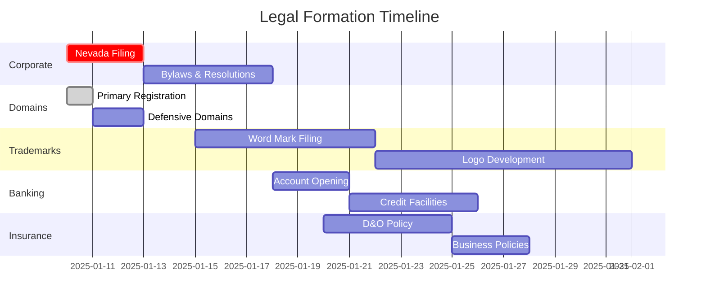
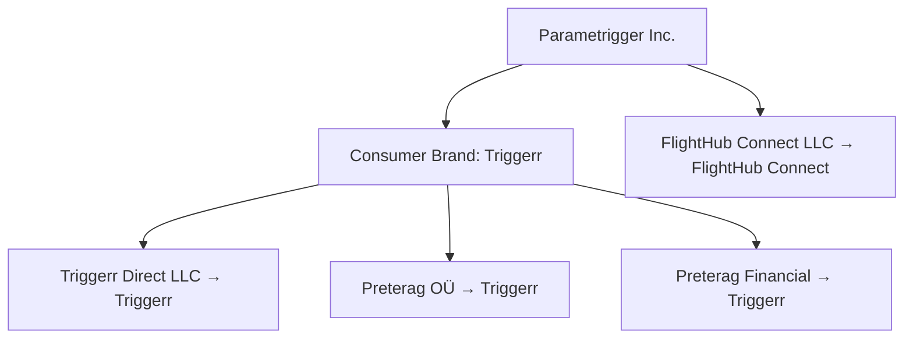

# Parametrigger Business Structure & Architecture Report

## Executive Summary

### Corporate Structure
**Parametrigger Inc.** (Nevada Corporation) operates as the parent company developing parametric insurance technology platforms. The flagship product **Triggerr** provides consumer-facing parametric insurance solutions, while the corporate entity focuses on B2B infrastructure and enterprise partnerships.

### Open Core Strategic Framework
Parametrigger employs a sophisticated **Open Core Strategy** designed to achieve market dominance through strategic open-sourcing while protecting core intellectual property. This approach creates multiple competitive advantages and establishes Parametrigger as the de facto standard in parametric insurance infrastructure.

**For comprehensive analysis, competitive positioning, SWOT analysis, and implementation roadmap, see: [Open Core Strategy Document](./04_OPEN_CORE_STRATEGY.md)**

## Business Model Overview

Parametrigger Inc. is being built as a decentralized insurance protocol, initially launching with parametric flight delay insurance through the **Triggerr** product. The platform operates on a protocol-provider model, where **Triggerr Direct** serves as the inaugural regulated insurance provider, with the infrastructure designed to support additional providers in the future. The platform leverages blockchain technology for transparent, automated policy management while maintaining full regulatory compliance through its provider network.

---

## Legal Entity Structure

### **1. Parametrigger Inc. (Parent Company/Platform)**
- **Legal Name**: Parametrigger Inc.
- **State of Incorporation**: Nevada
- **Entity Type**: C-Corporation
- **Primary Product**: Triggerr (parametric insurance platform)
- **Role**: Platform operator, technology provider, and parametric insurance infrastructure
- **Functions**:
  - Operates the marketplace platform
  - Manages customer relationships and branding
  - Collects platform fees and commissions
  - Handles technology infrastructure
  - Revenue aggregation point
  - Develops open-source aggregation framework
  - Manages intellectual property portfolio

### **Decentralized Protocol Layer**
- **Role**: Open infrastructure for insurance operations
- **Functions**:
  - Hosts smart contracts for policy management and claims processing
  - Provides non-custodial wallet integration for users
  - Facilitates decentralized oracle network for flight data verification
  - Maintains transparent, immutable records of all transactions
  - Operates as technology infrastructure (not a financial service)
- **Data Management**:
  - All sensitive customer and policy data is owned and managed by `triggerr Direct`
  - Protocol stores only essential on-chain data for transparency and automation
  - Clear separation between protocol (decentralized) and data (centralized) layers

### **2. Triggerr Direct LLC (First-Party Provider)**
- **Legal Name**: Triggerr Direct LLC
- **State of Formation**: Nevada
- **Entity Type**: Limited Liability Company
- **Parent Company**: Parametrigger Inc. (100% ownership)
- **Role**: Primary insurance provider, operating as an independent entity on the Triggerr platform. While it may have off-platform affiliations with the Parametrigger brand, on the platform, it functions as a distinct provider.
- **Functions**:
  - Issues insurance policies directly to customers
  - Serves as a key launch provider on the platform
  - Aims to provide a competitive, integrated experience
  - Pays standard platform marketplace fees, ensuring platform neutrality and fair competition
  - Manages its direct customer relationships
  - Maintains insurance licenses and regulatory compliance

### **3. Preterag Financial Solutions Inc. (Financial Services & Risk Solutions Provider)**
- **Legal Name**: Preterag Financial Solutions Inc.
- **State of Incorporation**: Nevada
- **Entity Type**: C-Corporation
- **Relationship**: Strategic partner with equity stake in Parametrigger Inc.
- **Role**: A specialized provider offering financial and risk management services on the Triggerr platform. Operates as an independent entity on-platform.
- **Functions**:
  - Offers B2B products such as reinsurance to other insurance providers on the platform
  - May provide risk assessment tools or data products
  - Manages its own capital and operational reserves for the products it offers
  - Handles its own regulatory compliance for the financial services it provides
  - Its underwriting support for other providers (e.g., Triggerr Direct) is typically managed via off-platform contractual agreements or through the purchase of its on-platform reinsurance products

### **4. FlightHub Connect LLC (OTA Entity - Phase 3)**
- **Legal Name**: FlightHub Connect LLC
- **State of Formation**: Nevada
- **Entity Type**: Limited Liability Company
- **Parent Company**: Parametrigger Inc. (100% ownership)
- **Role**: A separate Online Travel Agency (OTA) entity, planned for launch in Phase 3, dedicated to flight search and booking services. It will operate with a distinct brand identity to maintain Triggerr's primary focus as an insurance specialist.
- **Functions (Phase 3 onwards)**:
  - Flight aggregation from multiple GDS/NDC sources (e.g., Duffel, Amadeus)
  - Execution of flight bookings and ticket issuance
  - Management of payment processing for flight tickets (typically via integrated OTA API provider solutions)
  - Handling airline and GDS/aggregator partnerships
  - Ensuring compliance with all OTA-specific regulations (e.g., IATA licensing if applicable, seller of travel laws)
- **Platform Integration**: FlightHub Connect services will be seamlessly integrated into the triggerr.com user experience, allowing users to search for flights and optionally bundle them with Triggerr insurance products. It will likely operate on a revenue-sharing or referral fee model with the Triggerr platform.

---

## Legal Incorporation & Trademark Todo List

### **Phase 1: Immediate Actions (Week 1)**

#### **Corporate Formation**
- [ ] **Nevada Corporation Filing**
  - [ ] File Articles of Incorporation for "Parametrigger Inc." with Nevada Secretary of State
  - [ ] Registered Agent: Nevada Registered Agent LLC ($199/year)
  - [ ] Initial Directors: Founder + 2 board members
  - [ ] Authorized Shares: 10,000,000 Common Stock, 1,000,000 Preferred Stock
  - [ ] Par Value: $0.001 per share
  - [ ] Filing Fee: $275 + $50 expedited processing

#### **Domain Registration**
- [ ] **Primary Domains**
  - [ ] Register parametrigger.com ($12/year)
  - [ ] Register parametrigger.co ($35/year) - backup
  - [ ] Register parametrigger.net ($12/year) - defensive
  - [ ] Maintain triggerr.co (current product domain)
- [ ] **Defensive Domains**
  - [ ] Register parametrigger.org ($15/year)
  - [ ] Register parametrigger.ai ($89/year)
  - [ ] Register parametrigger.io ($49/year)

#### **Social Media Handles**
- [ ] **Primary Platforms**
  - [ ] @parametrigger on Twitter/X
  - [ ] @parametrigger on Instagram
  - [ ] @parametrigger on LinkedIn
  - [ ] @parametrigger on TikTok
  - [ ] @parametrigger on YouTube
- [ ] **Product Handles**
  - [ ] @triggerr on all platforms (if available)
  - [ ] @usetriggerr as fallback

### **Phase 2: Legal Documentation (Week 2-3)**

#### **Corporate Governance**
- [ ] **Bylaws**
  - [ ] Draft Nevada-compliant corporate bylaws
  - [ ] Include statutory business judgment rule provisions
  - [ ] Director liability limitations per NRS 78.138
  - [ ] Shareholder inspection rights (15% threshold)
- [ ] **Board Resolutions**
  - [ ] Organizational resolutions
  - [ ] Officer appointment resolutions
  - [ ] Banking resolutions
  - [ ] Equity incentive plan adoption

#### **Equity Structure**
- [ ] **Cap Table Setup**
  - [ ] Initial founder shares allocation
  - [ ] Employee stock option pool (15-20%)
  - [ ] Investor series seed preparation
  - [ ] Vesting schedules (4-year with 1-year cliff)
- [ ] **Stock Option Plan**
  - [ ] 2025 Equity Incentive Plan
  - [ ] ISO and NSO provisions
  - [ ] Early exercise provisions
  - [ ] 409A valuation preparation

### **Phase 3: Trademark & IP Protection (Week 3-4)**

#### **Trademark Applications**
- [ ] **Word Marks**
  - [ ] "PARAMETRIGGER" (Classes 9, 36, 42)
  - [ ] "TRIGGERR" (Classes 9, 36, 42)
  - [ ] "PARAMETRIC INSURANCE EXPERTS" (Classes 36, 42)
  - [ ] Filing Fee: $350 per class per mark = $3,150 total
- [ ] **Logo Marks**
  - [ ] Parametrigger logo design + trademark
  - [ ] Triggerr logo design + trademark
  - [ ] Combined mark applications
- [ ] **International Filings**
  - [ ] Madrid Protocol applications (EU, UK, Canada)
  - [ ] Priority filing strategy

#### **Copyright Protection**
- [ ] **Software Code**
  - [ ] Copyright registration for core platform code
  - [ ] Open source license headers (MIT for open components)
  - [ ] Proprietary license headers (commercial components)
- [ ] **Marketing Materials**
  - [ ] Website content copyright
  - [ ] Marketing copy protection
  - [ ] Video/audio content registration

### **Phase 4: Banking & Financial Setup (Week 4-5)**

#### **Business Banking**
- [ ] **Primary Banking**
  - [ ] Open business checking account (Chase/Wells Fargo)
  - [ ] Business credit card application
  - [ ] Line of credit establishment
  - [ ] ACH/Wire transfer setup
- [ ] **Crypto Infrastructure**
  - [ ] Coinbase Prime account
  - [ ] Circle business account
  - [ ] Multi-sig wallet setup
  - [ ] Custody solutions evaluation

#### **Tax & Compliance**
- [ ] **Federal Registration**
  - [ ] EIN application (IRS Form SS-4)
  - [ ] Delaware tax registration (if conducting business)
  - [ ] Nevada tax registration
- [ ] **State Registrations**
  - [ ] Foreign corporation registration in states of operation
  - [ ] Sales tax registration where applicable
  - [ ] Employment tax registration

### **Phase 5: Insurance & Risk Management (Week 5-6)**

#### **Corporate Insurance**
- [ ] **Directors & Officers Insurance**
  - [ ] D&O policy ($1M-$5M coverage)
  - [ ] Employment practices liability
  - [ ] Fiduciary liability coverage
- [ ] **General Business Insurance**
  - [ ] General liability insurance
  - [ ] Professional liability (E&O)
  - [ ] Cyber liability insurance
  - [ ] Workers' compensation (when hiring employees)

#### **Regulatory Compliance**
- [ ] **Insurance Licensing**
  - [ ] Research state insurance licensing requirements
  - [ ] Surplus lines broker licensing (if applicable)
  - [ ] Money transmitter licensing analysis
- [ ] **Securities Compliance**
  - [ ] SEC registration analysis
  - [ ] Blue sky law compliance
  - [ ] Investor accreditation requirements

### **Phase 6: Subsidiary Formation (Week 6-8)**

#### **Triggerr Direct LLC**
- [ ] **Nevada LLC Formation**
  - [ ] Articles of Organization filing
  - [ ] Operating Agreement drafting
  - [ ] Single-member LLC structure
  - [ ] Filing Fee: $75
- [ ] **Insurance Licensing**
  - [ ] Captive insurance company evaluation
  - [ ] Surplus lines licensing
  - [ ] State-specific insurance requirements

#### **Future Subsidiaries**
- [ ] **Preterag Financial Solutions Inc.**
  - [ ] Partnership structure negotiation
  - [ ] Equity stake determination
  - [ ] Separate incorporation or acquisition
- [ ] **FlightHub Connect LLC**
  - [ ] Phase 3 formation planning
  - [ ] OTA licensing requirements
  - [ ] IATA accreditation research

### **Budget Estimate**

| **Category** | **Cost Range** | **Timeline** |
|--------------|----------------|--------------|
| **Corporate Formation** | $500-$1,000 | Week 1 |
| **Domains** | $300-$500 | Week 1 |
| **Legal Fees** | $15,000-$25,000 | Weeks 2-4 |
| **Trademark Filings** | $5,000-$8,000 | Weeks 3-4 |
| **Insurance** | $3,000-$7,000/year | Week 5 |
| **Banking Setup** | $500-$1,000 | Week 4 |
| **Accounting/Tax** | $2,000-$4,000 | Week 4 |
| **Total Initial** | **$26,300-$46,500** | **6-8 weeks** |

### **Critical Path Dependencies**



### **Legal Counsel Recommendations**

#### **Nevada Corporate Counsel**
- **Fennemore Craig** (Las Vegas) - Business formation specialist
- **Hutchison & Steffen** (Las Vegas) - Corporate law focus
- **McDonald Carano** (Las Vegas) - Full-service business law

#### **IP/Trademark Counsel**
- **Cooley LLP** - Tech company specialist
- **Wilson Sonsini** - Startup/VC experience
- **Fenwick & West** - IP and corporate combined

#### **Insurance Regulatory Counsel**
- **Covington & Burling** - Insurance regulation expertise
- **Sidley Austin** - Financial services regulation
- **Locke Lord** - Insurance licensing specialist

### **Next Immediate Actions**

1. **Today**: Register parametrigger.com and defensive domains
2. **This Week**: File Nevada Articles of Incorporation
3. **Week 2**: Engage Nevada corporate counsel
4. **Week 3**: Begin trademark applications
5. **Week 4**: Open business banking accounts

---

## Market Strategy & Target Segments

### Primary Target: Crypto Industry Professionals
- **Initial Focus**: Crypto teams and conference attendees
- **Value Proposition**:
  - Comprehensive travel insurance tailored for frequent conference travelers
  - Specialized coverage for crypto-related travel risks
  - Seamless integration with crypto payment options
  - Non-custodial wallet support for full asset control
  - Transparent, on-chain policy management

### Nevada Incorporation Advantages

Our Nevada incorporation provides significant competitive advantages:

1. **Predictable Governance**: Statutory business judgment rule (NRS 78.138) provides certainty
2. **Director Protection**: Strong liability protections for officers and directors
3. **Shareholder Limits**: 15% threshold for books and records access (vs. any shareholder in Delaware)
4. **Modern Courts**: Business court reforms (AB 239, AJR 8) creating specialized venues
5. **Cost Efficiency**: Lower franchise taxes and reduced litigation exposure
6. **Founder Protection**: Explicit safeguards for "moonshot" grants and founder control
7. **Regulatory Stability**: Bipartisan legislative support for business-friendly policies

### DeFi Integration
- **Target Segments**:
  - Crypto-native travelers and digital nomads
  - Web3 organizations with travel needs
  - Traditional travelers seeking transparency
- **Key Differentiators**:
  - Non-custodial wallet integration
  - Transparent, on-chain policy management
  - Automated claims via smart contracts
  - Lower operational costs through decentralization

### Go-to-Market Approach
- **Conference Partnerships**: Target major crypto events (e.g., ETHDenver, Consensus)
- **Marketing Campaign**: "50% Flight Price Back on Delays" promotion
- **Community Building**: Engage with crypto communities and DAOs

### Brand Positioning & DBA Strategy

**Simple Brand Architecture:**


**DBA Implementation Strategy:**
- **Consumer Brand**: "Triggerr" for all customer-facing operations
- **Corporate Parent**: "Parametrigger Inc." for legal/investor contexts
- **Travel Vertical**: "FlightHub Connect" for OTA operations
- **Legal Entities**: Maintain separate legal names for regulatory arbitrage

**Benefits of Simple Approach:**
| Advantage | Value |
|-----------|-------|
| Brand Clarity | Triggerr = insurance, clear and memorable |
| SEO Authority | Unified search presence |
| Marketing Efficiency | One consumer brand message |
| Customer Recognition | No confusion across markets |
| Cost Optimization | Single consumer trademark |

### Brand Implementation
- **Brand Personality**: Relatable, approachable, and tech-savvy
- **Tagline**: "Give us your flight risks!"
- **Visual Identity**: Modern, clean design with a friendly tone

## Business Model Architecture

### **Open Core Repository Strategy**

Our package ecosystem evolves through three strategic phases:

1. **Integrated Monorepo (Q1-Q2 2025)**: All code in single repo with license segmentation
2. **Community Foundation (Q3-Q4 2025)**: Core packages move to dedicated OSS repositories  
3. **Adapter Marketplace (Q1-Q2 2026)**: Community-contributed data sources in certified registry

**Repository Structure Evolution**:
```
triggerr-platform/                    # Main proprietary monorepo
├── packages/services/                # Proprietary business logic
├── packages/core/                   # Proprietary core functionality
└── packages/integrations/           # Proprietary integrations

triggerr-oss/                        # Open source organization
├── flight-aggregator/               # MIT licensed
├── weather-aggregator/              # MIT licensed
├── canonical-models/                # MIT licensed
└── adapter-interface/               # MIT licensed

triggerr-community/                  # Community contributions
├── adapters/                       # Community-built adapters
└── examples/                       # Usage examples
```

### **Platform Strategy**
- **Automated Escrow & Payouts**: PayGo blockchain for transparent policy escrows and automated claim payouts.
- **Custodial Wallets (MVP)**: System-managed, secure PayGo wallets for users to simplify onboarding and transactions, with a planned evolution towards user self-custody options (Phase 2).
- **Insurance-First Brand (`triggerr`)**: Establish `triggerr` as the leading brand for parametric travel insurance, starting with flight delay.
- **Conversational Quoting Engine**: LLM-assisted, chat-first interface for intuitive insurance quoting and information.
- **Phased Expansion**:
    - **Phase 1 (MVP)**: Launch with `triggerr Direct` as the sole insurer.
    - **Phase 2**: Introduce new parametric insurance products, onboard third-party insurers to create a marketplace.
    - **Phase 3**: Integrate flight booking services via `FlightHub Connect`.

### **Revenue Streams**

#### **First-Party Provider (triggerr Direct)**
- **Premium Revenue**: Retains the majority of customer premiums after paying standard platform fees.
- **Pays Standard Marketplace Fees**: Contributes to platform revenue like any other provider, ensuring fairness and neutrality.
- **Direct Customer Value**: Aims for competitive pricing and enhanced service through platform integration.

#### **Insurance Products**
- **Flight Delay Insurance**: Percentage-based fees on premiums
- **Ticket Price Protection**: Options-based insurance for price fluctuations
- **Device Insurance**: Coverage for crypto hardware wallets and devices
- **Portfolio Insurance**: Protection for crypto asset values

#### **Monetization**
- **Premium Fees**: 10-15% of insurance premiums
- **Transaction Fees**: Fixed fees on policy transactions
- **Escrow Services**: 2% of coverage amounts held in escrow
- **Data Analytics**: Monetizing anonymized travel and claim data
- **Underwriting Partnerships**: Revenue sharing with traditional insurers
- **API Access**: Fees for third-party integrations

#### **Third-Party Providers**
- **Marketplace Fees**: 10% of provider premiums
- **Premium Service Fees**: 12% of customer premiums
- **Escrow Service Fees**: 2% of coverage amounts
- **Transaction Fees**: Fixed per transaction

#### **Platform Operations**
- **Airline Commissions**: 8% of ticket prices (where applicable).
- **Flight Booking Revenue (Phase 3 via `FlightHub Connect`)**: Commissions or markups on flight tickets sold through `FlightHub Connect` integrated services.
- **Technology Licensing**: Platform licensing to providers
- **Data & Analytics**: Premium insights and risk analytics services
- Revenue from `triggerr Direct`'s insurance product sales is primary in MVP.
- Future: Platform fees from third-party insurers (Phase 2).
- Future: Fees/revenue sharing from `FlightHub Connect` for using the platform/referrals (Phase 3).

---

## Development & Implementation Timeline

### Phase 1: Core Insurance Platform (June - August 2025)
**Product Focus**:
- Flight delay insurance
- Basic travel insurance packages
- Crypto payment integration

**Technical Implementation**:
- Wallet management (create, fund, view balance)
- Policy purchase and management system
- Automated payouts via Paygo
- Flight status verification (Aviationstack API)

**Success Metrics**:
- End-to-end policy lifecycle demonstrated
- Non-custodial fund handling
- Initial user testing completed

### Phase 2: Financial Products & Marketplace Foundation (August - October 2025)
**Product Expansion**:
- Put/call options on flight prices
- Conference-specific insurance packages
- Multi-asset portfolio insurance

**Technical Implementation**:
- Provider data model and service layer
- Dual-purpose escrow ID system
- Policy verification codes
- Revenue tracking and fee management

**Success Metrics**:
- Multiple product lines operational
- Working verification system
- Revenue collection system in place

### Phase 3: Platform Expansion & Integration (October - December 2025)
**Product Features**:
- Integration with flight booking services
- AI-powered travel assistant
- Expanded insurance marketplace

**Technical Implementation**:
- Provider onboarding and verification
- Marketplace UI and discovery
- Public verification portal
- Enhanced admin tools

**Success Metrics**:
- 3+ active insurance providers
- 10,000+ active users
- 50,000+ policies
- $5M+ total value locked (TVL)

## Future Expansion Roadmap

### Phase 3: Ecosystem Development and OTA Integration - `FlightHub Connect` Launch
- **Multiple Providers**: Full marketplace with 5+ providers
- **Advanced Products**: Custom parametric insurance, NFT policies
- **Open Protocol**: Infrastructure for third-party insurance providers to offer products
- **DeFi Integration**: Capital efficiency through DeFi protocols for yield optimization
- **New Escrow Models**: Advanced multi-signature and time-locked escrows
- **`FlightHub Connect`**: Seamless flight booking integration with insurance bundling
- **Expanded Coverage**: Global reach with localized compliance through licensed providers
- **Enhanced Automation**: AI-driven underwriting and claims processing

### Phase 4: Product Innovation & Market Expansion (2026)
- **Insurance Products**:
  - AI agent insurance
  - DeFi protection products
  - Advanced escrow models
  - Customizable policy options
- **Market Growth**:
  - Developer API platform
  - White-label solutions
  - Global market entry

### Phase 5: Ecosystem Growth & Maturity (2026-2027)
- **Advanced Capabilities**:
  - AI-powered risk assessment
  - Automated claims processing
  - Cross-chain compatibility
  - Decentralized governance
- **Market Leadership Goals**:
  - 100,000+ active users
  - $50M+ TVL
  - 20+ insurance providers
  - 5+ supported blockchains

---

## Technical Architecture

### **Open Core Architecture**

**Open Source Components (Community-Driven)**:
- Flight & Weather Aggregation Framework
- Canonical Data Models & Standards  
- API Adapter Interfaces
- Cache Management Systems

**Proprietary Components (Revenue-Generating)**:
- Risk Calculation Engines
- Policy Management Systems
- Pricing Algorithms
- Blockchain Integration
- Customer Analytics

### **Core Components**

#### **1. Provider Management System**
- **Multi-tier Provider Support**: Startup, Standard, Premium, Enterprise tiers
- **Escrow Model Flexibility**: 14+ different escrow models supported
- **Commission & Fee Management**: Configurable rate structures
- **Regulatory Compliance Tracking**: Business registration, addresses, licensing

#### **2. Escrow & Blockchain Integration**
- **PayGo Integration**: Decentralized escrow management
- **Multiple Escrow Types**: Policy escrows (funded by `triggerr Direct` or user's custodial wallet for MVP). User custodial wallets managed by the platform for receiving payouts and making payments.
- **Escrow Purposes**: Deposits, withdrawals, stakes, bonds, collateral, investments
- **Smart Contract Automation**: Automated payout conditions

#### **3. Flight Data & Risk Management**
- **Multi-Source Data**: AviationStack, FlightAware, OpenSky Network
- **Real-Time Monitoring**: Flight status tracking and delay detection
- **Risk Analytics**: Historical data analysis and predictive modeling
- **Automated Claims Processing**: Blockchain-based payout triggers

#### **4. Product & Pricing Engine**
- **Parametric Products**: Flight delay, weather, travel comprehensive
- **Dynamic Pricing**: Real-time risk-based premium calculation
- **Coverage Tiers**: Economy ($500-$1,000), Business ($3,000-$5,000), Premium ($7,500+)
- **Flexible Terms**: Configurable delay thresholds (60, 120, 180+ minutes)

---

## Current Schema Implementation Analysis

### **Strengths**
1. **Comprehensive Provider Model**: Supports multiple provider types and tiers
2. **Flexible Escrow System**: 14+ escrow models for different business needs
3. **Robust Flight Data Integration**: Multiple data sources with fallback capabilities
4. **Regulatory Compliance Ready**: Business registration, licensing fields included
5. **Revenue Tracking**: Detailed fee and commission structures
6. **Blockchain Integration**: PayGo escrow management with transaction tracking

### **Current Seed Configuration**
- **Single Provider**: Currently seeds "InsureCo" as the primary provider
- **Basic Products**: Flight delay coverage with 60+ and 120+ minute thresholds
- **Admin Infrastructure**: Admin user and system configuration ready
- **Reference Data**: Countries, airlines, airports, aircraft types, runways, routes

---

## Regulatory & Compliance Strategy

All detailed legal requirements, compliance frameworks, and regulatory arbitrage strategies are maintained in our dedicated legal reference document. This separation ensures technical and business teams can focus on implementation while providing comprehensive compliance guidelines for all operational phases.

**Reference**: [Legal & Regulatory Framework](../04_compliance/LEGAL_REFERENCE.md)

### Strategic Overview

### **Nevada Incorporation & Regulatory Arbitrage**
- **Regulatory Arbitrage**: PayGo blockchain escrow reduces direct money handling requirements
- **Distributed Risk**: Multiple legal entities distribute regulatory exposure
- **Technology Focus**: Platform positioned as technology provider rather than direct insurer

### **Compliance Framework Overview**
- **Multi-Jurisdiction Support**: Database ready for multiple business registrations
- **Provider Compliance**: Third-party providers handle their own regulatory requirements
- **Data Protection**: Robust encryption (e.g., AES-256-GCM via KMS) for sensitive data, including encrypted private keys for user custodial PayGo wallets. Adherence to GDPR, CCPA, etc.
- **Audit Trail**: Comprehensive logging and transaction tracking

---

## Market Positioning & Competitive Advantages

### **Open Core Competitive Advantages**

**Network Effects Moat**:
- Developer ecosystem creates self-reinforcing growth
- More data sources → better aggregation → higher quality → more adoption
- Standard adoption creates industry lock-in

**Technical Moat**:
- Canonical models create switching costs
- Deep platform integration makes migration expensive
- Optimized proprietary algorithms provide performance advantages

**Ecosystem Moat**:
- Certified adapter marketplace
- Community investment in our ecosystem
- Accumulated expertise and knowledge base

### Social Media & Digital Presence

**Simple Brand Strategy:**
- **@Triggerr** across all social platforms
- **triggerr.com** as primary domain
- **Consistent messaging** across all jurisdictions
- **Single brand voice** for all insurance products

**Domain Portfolio:**
- triggerr.com (primary)
- triggerr.eu (EU redirect)
- flighthubconnect.com (travel vertical)
- parametrigger.com (corporate/investor site)

### Social Media Dominance

- **Digital Empire**: Strategic ownership of key social media channels
- **Information Control**: Direct access to millions through acquired platforms
- **Algorithm Advantage**: Leveraging existing platform favorability
- **Trust Transfer**: Inheriting credibility of established communities

**For comprehensive digital strategy, see: [Social Media Dominance Strategy](./05_SOCIAL_MEDIA_DOMINANCE.md)**

### **For Customers**
- **Integrated Experience**: Seamless platform with first-party provider
- **Competitive Pricing**: No marketplace fees for triggerr Direct
- **Instant Payouts**: Blockchain-based automatic settlements
- **Transparency**: Verifiable blockchain transactions
- **Choice**: Multiple providers as platform grows

### **For triggerr Business & Entity Structure**
- **Higher Margins**: 600% revenue increase per policy vs. fees-only model
- **Market Control**: Direct influence over pricing and customer experience
- **Brand Building**: Evolution from platform to insurance brand
- **Scalability**: Foundation for geographic and product expansion
- **Data Ownership**: Direct customer relationships and insights

### **For Third-Party Providers**
- **Market Access**: Established platform with customer base
- **Technology Infrastructure**: Advanced platform capabilities
- **Risk Sharing**: InsureCo underwriting support
- **Specialization Opportunities**: Focus on niche markets or regions

---

## MVP Launch Strategy

### Phase 1: Triggerr Launch (Simple Brand)
**Brand Implementation:**
- Launch as "Triggerr" globally
- Triggerr Direct LLC operates as DBA "Triggerr"
- Preterag OÜ operates as DBA "Triggerr" 
- Single customer experience across jurisdictions

**Technical Implementation:**
```typescript
// Simple entity context
const ENTITY_BRANDING = {
  US: { legal: 'Triggerr Direct LLC', brand: 'Triggerr' },
  EU: { legal: 'Preterag OÜ', brand: 'Triggerr' },
  PLATFORM: { legal: 'Parametrigger Inc.', brand: 'Triggerr' }
};
```

### Phase 1: Triggerr Direct Launch
- **Single Provider Focus**: Launch with triggerr Direct as primary provider
- **Core Products**: Flight delay insurance (60+ and 120+ minute thresholds)
- **Target Markets**: Individual travelers, basic business travel
- **Geographic Focus**: Start with single jurisdiction, expand gradually
- Chat-first UI for quoting.
- Custodial PayGo wallets for users (system-managed encrypted keys).
- Payment via Stripe (fiat -> `Direct` funds escrow) and user's custodial PayGo wallet.
- User dashboard for policies and custodial wallet management.
- Anonymous policy tracking.

### **Phase 2: Platform Expansion with Enhanced Insurance Features & User Wallet Evolution**
- **Third-Party Onboarding**: Add 2-3 complementary providers
- **Product Expansion**: Weather insurance, travel comprehensive packages
- **Market Expansion**: Additional geographic markets
- **Enterprise Features**: Corporate travel insurance programs

### **Phase 3: Ecosystem Development and OTA Integration - `FlightHub Connect` Launch**
- **Multiple Providers**: Full marketplace with 5+ providers
- **Advanced Products**: Custom parametric insurance, NFT policies
- **DeFi Integration**: Advanced escrow models, prediction markets
- **Global Operations**: Multi-jurisdiction compliance and operations
---

## Success Metrics & KPIs

### **Open Source Ecosystem Metrics**

**Developer Adoption**:
- GitHub Stars: 10,000+ across all repos by Q4 2025
- Monthly Active Contributors: 500+ by Q2 2026
- Package Downloads: 1M+ monthly by Q4 2025
- API Calls: 100M+ monthly by Q2 2026

**Community Growth**:
- Partner Integrations: 100+ certified adapters by Q2 2026
- Enterprise Customers: 25+ Fortune 500 companies by Q4 2025
- Standard Adoption: 80%+ of industry using canonical models
- Community Revenue: 20%+ of total revenue from ecosystem

### **Business Metrics**
- **Revenue per Policy**: Target 300-500% increase from first-party model
- **Market Share**: 60% platform market share for triggerr Direct
- **Customer Retention**: Direct provider relationship advantages
- **Margin Improvement**: 85-90% premium retention vs. 12-15% fees

### **Operational Metrics**
- **Platform Utilization**: Multi-provider adoption and usage
- **Claims Processing**: Automated payout success rates
- **Data Accuracy**: Flight tracking and delay prediction accuracy
- **System Performance**: Platform uptime and transaction throughput

---

## Open Core Implementation Timeline

### DBA Filing Requirements
**Immediate Actions (Week 1-2):**
1. **Nevada DBA Filings** ($150 each):
   - Triggerr Direct LLC → DBA: "Triggerr"
   - Preterag Financial Solutions → DBA: "Triggerr"

2. **Estonia DBA Filing** (€100):
   - Preterag OÜ → DBA: "Triggerr"

3. **Trademark Applications**:
   - "Triggerr" - US Class 36 ($350)
   - "Triggerr" - EU Class 36 (€1,200)
   - "FlightHub Connect" - US Class 39 ($350)

**Total Cost**: $1,900 + €1,300 = ~$3,300
**Annual Savings**: $1.05-4.5M (regulatory arbitrage preserved)
**ROI**: 32,000%+ first year

### Phase 1: Foundation (Q1-Q2 2025)
- Open source aggregation framework launch
- Developer community building (1,000+ members)
- Strategic partnerships with 5+ major insurers
- Bounty program for adapter development

### **Phase 2: Expansion (Q3-Q4 2025)**  
- Industry standard adoption (20+ companies)
- Ecosystem growth (100+ community adapters)
- Global expansion and regulatory compliance
- TriggerrOSS GitHub organization launch

### **Phase 3: Domination (Q1-Q2 2026)**
- 60%+ market share achievement
- Essential infrastructure status
- AI-powered risk assessment capabilities
- Exclusive partnerships with key data providers

## Conclusion

triggerr represents a sophisticated approach to travel insurance that combines:

1. **Technology Innovation**: Blockchain escrow and automated claims processing
2. **Business Model Innovation**: First-party provider within marketplace platform
3. **Regulatory Innovation**: Decentralized architecture for compliance flexibility
4. **Market Innovation**: Brand-first approach to parametric insurance

The current schema and architecture provide a solid foundation for this multi-faceted business model, with comprehensive support for the planned entity structure and growth strategy.
