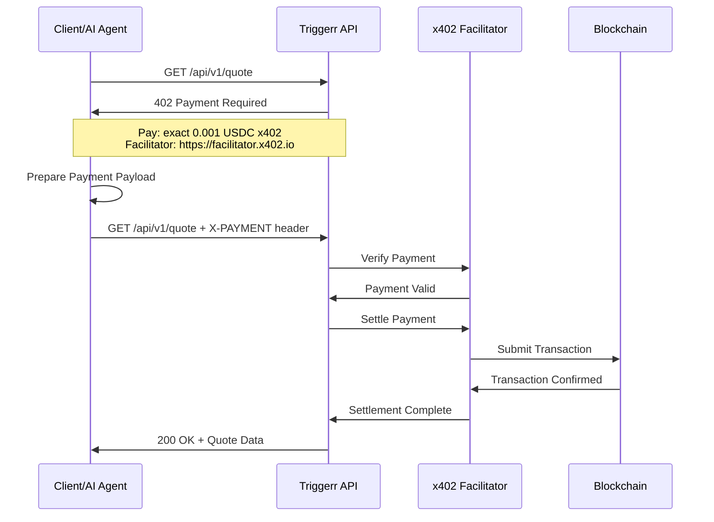
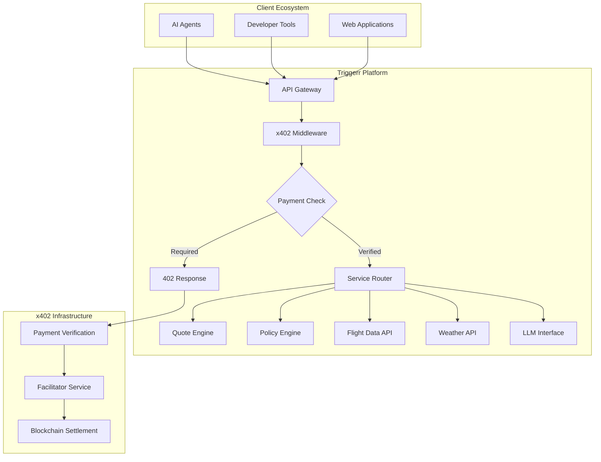

# x402 Protocol Integration Architecture - Triggerr Platform

## Table of Contents
1. [Executive Summary](#executive-summary)
2. [x402 Protocol Overview](#x402-protocol-overview)
3. [Strategic Alignment](#strategic-alignment)
4. [Technical Architecture](#technical-architecture)
5. [Implementation Strategy](#implementation-strategy)
6. [Revenue Model Integration](#revenue-model-integration)
7. [Security & Compliance](#security--compliance)
8. [Deployment Phases](#deployment-phases)
9. [Risk Assessment & Mitigation](#risk-assessment--mitigation)
10. [Success Metrics](#success-metrics)
11. [Future Considerations](#future-considerations)

## Executive Summary

The x402 protocol represents a revolutionary approach to programmatic payments that aligns perfectly with Triggerr's vision of an API-first, machine-to-machine payment ecosystem. This document outlines the comprehensive integration strategy for implementing x402 alongside our existing payment infrastructure to enable micropayments, AI agent compatibility, and frictionless B2B API monetization.

**Key Benefits:**
- Enable micropayments as low as $0.001 per API call
- Native support for AI agents and autonomous systems
- Reduced payment friction through stateless HTTP-based transactions
- Enhanced revenue opportunities through usage-based pricing
- Competitive differentiation in the insurance platform market

**Strategic Recommendation:** Proceed with phased integration starting Q2 2024, positioning x402 as a complementary payment method alongside existing Stripe and PayGo infrastructure.

## x402 Protocol Overview

### What is x402?

x402 is an open payment standard built around the HTTP `402 Payment Required` status code, enabling services to charge for API access and content directly over HTTP. The protocol is designed for:

- **Machine-to-Machine Payments**: AI agents and automated systems
- **Micropayments**: Transactions as low as $0.001
- **Stateless Interactions**: No account management or session state
- **Crypto-Native Payments**: Blockchain-based settlement

### Core Components

1. **HTTP 402 Status Code**: Signals payment requirement
2. **Payment Payloads**: Signed transaction data
3. **Facilitator Services**: Verification and settlement infrastructure
4. **Wallet Integration**: Crypto wallet connectivity

### Protocol Flow



## Strategic Alignment

### Vision Alignment Matrix

| Triggerr Vision Component | x402 Capability | Alignment Score |
|---------------------------|-----------------|-----------------|
| API-First Architecture | Native HTTP 402 integration | 100% |
| Machine-to-Machine Payments | Core x402 design principle | 100% |
| Micropayment Support | Designed for sub-cent transactions | 100% |
| Anonymous User Journey | Stateless, no account required | 95% |
| AI Agent Integration | Primary x402 target market | 100% |
| B2B Partner Ecosystem | Simplified API monetization | 100% |
| Usage-Based Pricing | Pay-per-call model | 100% |
| Crypto-Native Infrastructure | Blockchain-first approach | 100% |

### Business Model Enhancement

**Current Revenue Streams:**
- Platform fees: 2-3% of premiums
- Provider shares: 10-15% of premiums
- Transaction fees: Fixed amounts

**x402 Enhanced Revenue Streams:**
- **API Usage Fees**: $0.001-0.01 per API call
- **Data Access Fees**: $0.001 per flight/weather data point
- **AI Agent Interactions**: $0.01-0.05 per LLM query
- **Microservice Fees**: $0.001 per quote calculation
- **Premium API Tiers**: $0.05-0.10 per advanced feature

## Technical Architecture

### System Integration Points



### Implementation Components

#### 1. x402 Adapter Package
```
packages/
  blockchain/
    x402-adapter/
      src/
        index.ts           # Main adapter implementation
        types.ts           # TypeScript definitions
        middleware.ts      # Express/Fastify middleware
        facilitator.ts     # Facilitator service integration
        payment-handler.ts # Payment processing logic
        schemas.ts         # Validation schemas
      __tests__/
        unit/             # Unit tests
        integration/      # Integration tests
      package.json
      README.md
```

#### 2. API Middleware Integration
```typescript
// apps/api/src/middleware/x402-middleware.ts
import { X402Adapter } from '@triggerr/x402-adapter';

export interface X402RouteConfig {
  path: string;
  method: string;
  price: string;
  currency: 'USDC' | 'ETH';
  network: 'base' | 'base-sepolia';
  description?: string;
}

export const x402Middleware = (routes: X402RouteConfig[]) => {
  return async (req: Request, res: Response, next: NextFunction) => {
    const route = findMatchingRoute(req, routes);
    if (!route) return next();
    
    const paymentHeader = req.headers['x-payment'];
    
    if (!paymentHeader) {
      return res.status(402).json({
        error: 'Payment Required',
        accepts: [{
          scheme: 'exact',
          amount: route.price,
          currency: route.currency,
          network: route.network,
          facilitator: process.env.X402_FACILITATOR_URL
        }]
      });
    }
    
    try {
      const isValid = await X402Adapter.verifyPayment(paymentHeader, route);
      if (!isValid) {
        return res.status(402).json({
          error: 'Invalid Payment',
          message: 'Payment verification failed'
        });
      }
      
      // Log payment for analytics
      await X402Adapter.logPayment(req, route);
      
      next();
    } catch (error) {
      console.error('x402 payment verification error:', error);
      return res.status(500).json({
        error: 'Payment Processing Error'
      });
    }
  };
};
```

#### 3. Service Integration Points

**Quote Engine API:**
```typescript
// packages/services/quote-engine/src/routes/quotes.ts
const x402Routes: X402RouteConfig[] = [
  {
    path: '/api/v1/quotes',
    method: 'POST',
    price: '0.005',
    currency: 'USDC',
    network: 'base',
    description: 'Generate insurance quote'
  },
  {
    path: '/api/v1/quotes/:id',
    method: 'GET',
    price: '0.001',
    currency: 'USDC',
    network: 'base',
    description: 'Retrieve quote details'
  }
];

app.use('/api/v1/quotes', x402Middleware(x402Routes));
```

**Flight Data API:**
```typescript
// packages/aggregators/flight-aggregator/src/routes/flights.ts
const x402Routes: X402RouteConfig[] = [
  {
    path: '/api/v1/flights/search',
    method: 'GET',
    price: '0.002',
    currency: 'USDC',
    network: 'base',
    description: 'Search flight data'
  },
  {
    path: '/api/v1/flights/:id/status',
    method: 'GET',
    price: '0.001',
    currency: 'USDC',
    network: 'base',
    description: 'Get flight status'
  }
];
```

### Database Schema Extensions

#### Payment Tracking Table
```sql
CREATE TABLE x402_payments (
    id UUID PRIMARY KEY DEFAULT gen_random_uuid(),
    payment_token TEXT NOT NULL,
    user_id TEXT NULL,
    anonymous_session_id TEXT NULL,
    api_endpoint TEXT NOT NULL,
    amount DECIMAL(18,6) NOT NULL,
    currency TEXT NOT NULL,
    network TEXT NOT NULL,
    transaction_hash TEXT NULL,
    status TEXT NOT NULL DEFAULT 'pending',
    verified_at TIMESTAMP NULL,
    settled_at TIMESTAMP NULL,
    created_at TIMESTAMP DEFAULT now(),
    updated_at TIMESTAMP DEFAULT now(),
    
    CONSTRAINT fk_x402_payments_user_id 
        FOREIGN KEY (user_id) REFERENCES "user"(id) ON DELETE SET NULL
);

CREATE INDEX idx_x402_payments_user_id ON x402_payments(user_id);
CREATE INDEX idx_x402_payments_session_id ON x402_payments(anonymous_session_id);
CREATE INDEX idx_x402_payments_status ON x402_payments(status);
CREATE INDEX idx_x402_payments_created_at ON x402_payments(created_at);
```

#### API Usage Analytics Table
```sql
CREATE TABLE api_usage_analytics (
    id UUID PRIMARY KEY DEFAULT gen_random_uuid(),
    user_id TEXT NULL,
    anonymous_session_id TEXT NULL,
    api_endpoint TEXT NOT NULL,
    payment_method TEXT NOT NULL, -- 'stripe', 'paygo', 'x402'
    amount DECIMAL(18,6) NULL,
    currency TEXT NULL,
    response_time_ms INTEGER NOT NULL,
    response_size_bytes INTEGER NOT NULL,
    success BOOLEAN NOT NULL,
    error_type TEXT NULL,
    created_at TIMESTAMP DEFAULT now(),
    
    CONSTRAINT fk_api_usage_user_id 
        FOREIGN KEY (user_id) REFERENCES "user"(id) ON DELETE SET NULL
);

CREATE INDEX idx_api_usage_user_id ON api_usage_analytics(user_id);
CREATE INDEX idx_api_usage_endpoint ON api_usage_analytics(api_endpoint);
CREATE INDEX idx_api_usage_payment_method ON api_usage_analytics(payment_method);
CREATE INDEX idx_api_usage_created_at ON api_usage_analytics(created_at);
```

## Implementation Strategy

### Phase 1: Foundation (Weeks 1-2)
**Objective:** Establish core x402 infrastructure

**Deliverables:**
- x402 adapter package
- Basic middleware implementation
- Local facilitator setup (testnet)
- Unit test coverage

**Technical Tasks:**
1. Create `@triggerr/x402-adapter` package
2. Implement `X402Provider` class
3. Create Express middleware
4. Set up Base Sepolia testnet integration
5. Implement payment verification logic

### Phase 2: Service Integration (Weeks 3-4)
**Objective:** Integrate x402 with core APIs

**Deliverables:**
- Quote Engine x402 integration
- Flight Data API x402 integration
- Payment tracking database
- Integration tests

**Technical Tasks:**
1. Add x402 routes to Quote Engine
2. Add x402 routes to Flight Aggregator
3. Implement payment logging
4. Create database migrations
5. Build monitoring dashboards

### Phase 3: Production Readiness (Weeks 5-6)
**Objective:** Prepare for production deployment

**Deliverables:**
- Mainnet facilitator integration
- Security audit
- Performance optimization
- Documentation

**Technical Tasks:**
1. Integrate with CDP facilitator (mainnet)
2. Implement rate limiting
3. Add security headers
4. Performance benchmarking
5. Create developer documentation

### Phase 4: Rollout (Weeks 7-8)
**Objective:** Gradual production deployment

**Deliverables:**
- Beta partner integration
- Monitoring and alerting
- User feedback collection
- Performance metrics

**Technical Tasks:**
1. Deploy to staging environment
2. Conduct beta testing with partners
3. Implement monitoring and alerting
4. Collect usage analytics
5. Optimize based on feedback

## Revenue Model Integration

### Pricing Strategy

#### API Endpoint Pricing Tiers

**Tier 1: Basic Data Access**
- Quote generation: $0.005 USDC
- Flight status lookup: $0.001 USDC
- Weather data point: $0.001 USDC
- Policy lookup: $0.001 USDC

**Tier 2: Advanced Services**
- Complex quote calculations: $0.01 USDC
- Real-time flight tracking: $0.005 USDC
- Weather predictions: $0.003 USDC
- Risk assessment: $0.01 USDC

**Tier 3: Premium Features**
- AI-powered insights: $0.05 USDC
- Custom policy generation: $0.10 USDC
- Advanced analytics: $0.02 USDC
- Priority support: $0.01 USDC

#### Volume Discounts

**Prepaid Credits System:**
- $10 credit: 5% bonus
- $50 credit: 10% bonus
- $100 credit: 15% bonus
- $500+ credit: 20% bonus

### Revenue Projections

#### Conservative Estimate (Year 1)
```
Monthly API Calls: 500,000
Average Revenue per Call: $0.003
Monthly x402 Revenue: $1,500
Annual x402 Revenue: $18,000
```

#### Moderate Estimate (Year 2)
```
Monthly API Calls: 2,000,000
Average Revenue per Call: $0.004
Monthly x402 Revenue: $8,000
Annual x402 Revenue: $96,000
```

#### Optimistic Estimate (Year 3)
```
Monthly API Calls: 5,000,000
Average Revenue per Call: $0.005
Monthly x402 Revenue: $25,000
Annual x402 Revenue: $300,000
```

### Revenue Distribution

- **Platform Revenue**: 70% of x402 payments
- **Network Fees**: 5% of x402 payments
- **Partner Incentives**: 15% of x402 payments
- **Development Fund**: 10% of x402 payments

## Security & Compliance

### Security Measures

#### Payment Verification
- Cryptographic signature validation
- Timestamp verification (prevent replay attacks)
- Amount validation against route configuration
- Network verification (prevent cross-chain attacks)

#### Rate Limiting
- Per-IP rate limiting: 100 requests/minute
- Per-wallet rate limiting: 1000 requests/hour
- Global rate limiting: 10,000 requests/minute

#### Fraud Prevention
- Payment token uniqueness validation
- Suspicious pattern detection
- Automated blocking of malicious addresses

### Compliance Considerations

#### Regulatory Framework
- **AML/KYC**: Anonymous payments below $10 threshold
- **Tax Reporting**: Automated transaction reporting
- **Data Protection**: GDPR-compliant logging
- **Financial Regulations**: Compliance with local payment laws

#### Audit Trail
- Complete payment history logging
- Transaction verification records
- User interaction tracking
- Compliance reporting automation

## Deployment Phases

### Phase 1: Internal Testing (Month 1)
**Scope:** Internal APIs only
**Users:** Triggerr development team
**Features:** Basic payment verification

**Success Criteria:**
- 99%+ payment verification accuracy
- <500ms average response time
- Zero security vulnerabilities

### Phase 2: Developer Beta (Month 2)
**Scope:** Public APIs with beta access
**Users:** Partner developers and early adopters
**Features:** Full payment flow with testnet

**Success Criteria:**
- 20+ active beta users
- 95%+ payment success rate
- Positive developer feedback

### Phase 3: Limited Production (Month 3)
**Scope:** Select production APIs
**Users:** Partner developers and AI agents
**Features:** Mainnet integration with volume limits

**Success Criteria:**
- $1,000+ monthly x402 revenue
- 99.5%+ uptime
- <1% support ticket rate

### Phase 4: Full Production (Month 4)
**Scope:** All public APIs
**Users:** All users and partners
**Features:** Complete x402 integration

**Success Criteria:**
- 50+ active x402 users
- $5,000+ monthly x402 revenue
- 99.9%+ uptime

## Risk Assessment & Mitigation

### Technical Risks

#### Risk: Facilitator Service Downtime
**Impact:** High - Payments cannot be processed
**Probability:** Medium
**Mitigation:** 
- Multi-facilitator support
- Automatic failover mechanisms
- Local verification fallback

#### Risk: Blockchain Network Congestion
**Impact:** Medium - Delayed payment settlement
**Probability:** High
**Mitigation:**
- Dynamic fee adjustment
- Multiple network support
- Payment queuing system

#### Risk: Integration Complexity
**Impact:** Medium - Development delays
**Probability:** Medium
**Mitigation:**
- Phased implementation
- Comprehensive testing
- Expert consultation

### Business Risks

#### Risk: Limited Market Adoption
**Impact:** High - Low ROI on development
**Probability:** Medium
**Mitigation:**
- Dual payment model
- Strong developer documentation
- Partner incentive programs

#### Risk: Regulatory Challenges
**Impact:** High - Potential compliance issues
**Probability:** Low
**Mitigation:**
- Legal review and compliance
- Proactive regulatory engagement
- Compliance-first architecture

### Operational Risks

#### Risk: Support Complexity
**Impact:** Medium - Increased support burden
**Probability:** Medium
**Mitigation:**
- Comprehensive documentation
- Automated troubleshooting
- Training programs

## Success Metrics

### Key Performance Indicators

#### Technical KPIs
- **Payment Success Rate**: >99%
- **API Response Time**: <500ms
- **System Uptime**: >99.9%
- **Payment Verification Time**: <2 seconds

#### Business KPIs
- **Monthly x402 Revenue**: >$1,000 (Month 3)
- **Active x402 Users**: >100 (Month 6)
- **API Call Volume**: >1M calls/month
- **Revenue per API Call**: >$0.003

#### User Experience KPIs
- **Payment Completion Rate**: >95%
- **Developer Satisfaction**: >4.5/5
- **Support Ticket Volume**: <1% of transactions
- **Integration Time**: <2 hours for new developers

### Monitoring and Analytics

#### Real-time Dashboards
- Payment processing metrics
- API usage analytics
- Revenue tracking
- Error rate monitoring

#### Alerting System
- Payment verification failures
- High error rates
- Unusual transaction patterns
- System performance degradation

## Future Considerations

### Roadmap Alignment

#### Q2 2024: Foundation
- Core x402 implementation
- Basic API integration
- Testnet deployment

#### Q3 2024: Expansion
- Additional payment schemes (`upto`)
- Multi-token support
- Advanced analytics

#### Q4 2024: Optimization
- Performance improvements
- Additional blockchain networks
- Enhanced security features

### Technology Evolution

#### x402 Protocol Development
- Monitor protocol updates
- Participate in standards development
- Contribute to ecosystem growth

#### Blockchain Integration
- Explore Layer 2 solutions
- Implement cross-chain payments
- Support emerging token standards

#### AI Agent Integration
- Develop AI-specific features
- Implement automatic negotiation
- Support agent marketplace integration

### Competitive Positioning

#### Market Leadership
- First-mover advantage in insurance
- Thought leadership in programmable payments
- Developer community building

#### Innovation Pipeline
- Research advanced payment schemes
- Explore DeFi integration
- Develop proprietary enhancements

## Conclusion

The integration of x402 protocol into Triggerr's platform represents a strategic opportunity to lead the programmable payments revolution in the insurance industry. By enabling micropayments, supporting AI agents, and providing frictionless API monetization, x402 aligns perfectly with our vision of an API-first, machine-to-machine payment ecosystem.

The phased implementation approach minimizes risk while maximizing learning opportunities, ensuring that Triggerr can adapt and optimize the integration based on real-world usage patterns and market feedback.

**Recommendation:** Proceed with x402 integration as outlined in this document, with regular milestone reviews and the flexibility to adjust based on market conditions and technical learnings.

---

*This document will be updated quarterly to reflect implementation progress, market changes, and protocol evolution.*

**Document Version:** 1.0  
**Last Updated:** December 2024  
**Next Review:** March 2025