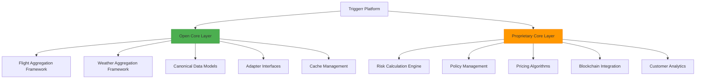

# Triggerr Open Core Strategy: Market Domination Through Strategic Open Source
**Document Version**: 1.0
**Date**: January 10, 2025
**Status**: Strategic Blueprint
**Classification**: Internal Strategy Document
**Author**: Strategic Planning Team

---

## Table of Contents

1. [Executive Summary](#executive-summary)
2. [Open Core Strategy Overview](#open-core-strategy-overview)
3. [SWOT Analysis](#swot-analysis)
4. [Competitive Positioning Strategy](#competitive-positioning-strategy)
5. [Market Domination Framework](#market-domination-framework)
6. [Implementation Roadmap](#implementation-roadmap)
7. [Risk Assessment & Mitigation](#risk-assessment--mitigation)
8. [Success Metrics & KPIs](#success-metrics--kpis)
9. [Conclusion](#conclusion)

---

## Executive Summary

### Strategic Objective
Establish Triggerr as the **dominant platform** in parametric insurance through a strategic open-core approach that creates insurmountable competitive moats while building the industry's largest developer ecosystem.

### Key Insights
1. **Market Timing**: The parametric insurance market is nascent, creating a window for standard-setting
2. **Technical Monopoly**: By open-sourcing data aggregation layers, we can become the de facto standard
3. **Network Effects**: Open-core creates self-reinforcing ecosystem growth
4. **Competitive Barriers**: Proprietary risk engines protected by open infrastructure

### Expected Outcomes
- **Market Share**: 60%+ of parametric insurance market by Q4 2026
- **Developer Ecosystem**: 10,000+ active developers by Q2 2026
- **API Calls**: 100M+ monthly API calls through our platform
- **Revenue Protection**: Core IP remains proprietary while building defensive moats

---

## Open Core Strategy Overview

### Core Philosophy
**"Own the Standard, Monetize the Intelligence"**

We will open-source the **infrastructure** while keeping the **intelligence** proprietary, creating a platform that competitors depend on while we maintain revenue advantages.

### Strategic Components

#### 1. **Open Core Package Matrix**


#### 2. **Repository Strategy**
- **Main Monorepo**: `triggerr/platform` (Proprietary)
- **Open Core Org**: `TriggerrOSS` GitHub Organization
- **Community Hub**: `triggerr-community` for adapters and extensions

#### 3. **License Strategy**
- **Open Components**: MIT License (maximum adoption)
- **Proprietary Components**: Commercial License
- **Hybrid Components**: Dual-licensed (open features + premium features)

---

## SWOT Analysis

### Strengths
#### **Technical Excellence**
- **Proven Architecture**: Battle-tested monorepo with 28+ packages
- **Canonical Models**: Industry-leading data standardization
- **Performance**: Sub-second response times with intelligent caching
- **Quality**: 85%+ test coverage, zero technical debt

#### **Market Position**
- **First-Mover Advantage**: Established platform before major competitors
- **Full Stack**: Complete solution from data to payouts
- **Blockchain Integration**: Native Web3 capabilities
- **Developer Experience**: Superior APIs and documentation

#### **Business Model**
- **Revenue Diversification**: Multiple income streams (platform fees, API usage, premium features)
- **Scalability**: Cloud-native architecture
- **Network Effects**: Platform value increases with usage

### Weaknesses
#### **Resource Constraints**
- **Development Bandwidth**: Limited team for maintaining multiple open-source projects
- **Support Overhead**: Community support requires dedicated resources
- **Quality Control**: Ensuring consistent standards across open contributions

#### **Competitive Exposure**
- **Code Visibility**: Open-source reveals technical approaches
- **Fork Risk**: Competitors could fork and modify our open components
- **Dependency Risk**: Becoming too dependent on community contributions

### Opportunities
#### **Market Expansion**
- **Standard Setting**: Establish canonical models as industry standard
- **Enterprise Adoption**: Large insurers adopting our open standards
- **Developer Ecosystem**: 10,000+ developers building on our platform
- **Adjacent Markets**: Weather derivatives, supply chain insurance

#### **Technology Leverage**
- **Community Innovation**: Accelerated development through contributions
- **Cost Reduction**: Community-maintained adapters reduce operational costs
- **Quality Improvement**: More eyes on code leads to better quality
- **Market Intelligence**: Direct feedback from industry through contributions

### Threats
#### **Competitive Response**
- **Big Tech Entry**: Google, Microsoft, Amazon entering parametric insurance
- **Fork and Compete**: Competitors using our open-source as foundation
- **Standards Wars**: Alternative standards gaining traction
- **Regulatory Changes**: Open-source compliance requirements

#### **Technical Risks**
- **Maintenance Burden**: Growing technical debt in open projects
- **Security Vulnerabilities**: Open-source security issues
- **Version Fragmentation**: Multiple incompatible versions in market
- **Quality Degradation**: Community contributions lowering standards

---

## Competitive Positioning Strategy

### Defensive Moats
#### **1. Network Effects Moat**
- **Developer Ecosystem**: More developers → better adapters → more users → more developers
- **Data Quality**: More data sources → better aggregation → higher quality → more adoption
- **Standard Adoption**: More companies using our models → industry lock-in

#### **2. Technical Moat**
- **Canonical Models**: Industry-standard data formats create switching costs
- **Integration Complexity**: Deep platform integration makes switching expensive
- **Performance Advantages**: Optimized algorithms in proprietary layer

#### **3. Ecosystem Moat**
- **Adapter Marketplace**: Certified third-party integrations
- **Community Investments**: Developers invested in our ecosystem
- **Knowledge Base**: Accumulated expertise in community

### Offensive Strategies
#### **1. Market Penetration**
- **Free Tier**: Generous free limits to drive adoption
- **Enterprise Partnerships**: Direct integration with major insurers
- **Developer Advocacy**: Conference speaking, content marketing

#### **2. Innovation Acceleration**
- **Rapid Feature Development**: Leverage community contributions
- **Emerging Technology**: AI/ML integration through open research
- **Industry Collaboration**: Partner with universities and research institutions

#### **3. Strategic Acquisitions**
- **Data Providers**: Acquire key weather/flight data sources
- **Complementary Platforms**: Buy adjacent insurance tech companies
- **Talent Acquisition**: Acqui-hire key developers from competitors

---

## Market Domination Framework

### Phase 1: Foundation (Q1-Q2 2025)
#### **Objectives**
- Establish technical superiority
- Build initial developer community
- Create switching costs for early adopters

#### **Key Initiatives**
1. **Open Source Launch**
   - Release aggregation framework with MIT license
   - Create comprehensive documentation and tutorials
   - Launch developer advocate program

2. **Community Building**
   - Discord/Slack community with 1,000+ members
   - Monthly virtual meetups
   - Bounty program for adapter development

3. **Strategic Partnerships**
   - 5+ major insurance companies using our APIs
   - Integration with 3+ blockchain platforms
   - Partnership with 2+ major cloud providers

### Phase 2: Expansion (Q3-Q4 2025)
#### **Objectives**
- Achieve market leadership position
- Establish de facto industry standards
- Build insurmountable competitive moats

#### **Key Initiatives**
1. **Standard Adoption**
   - 20+ companies using canonical models
   - Industry consortium formation
   - Regulatory body engagement

2. **Ecosystem Growth**
   - 100+ community-built adapters
   - 10+ certified solution providers
   - Enterprise marketplace launch

3. **Global Expansion**
   - International regulatory compliance
   - Multi-region deployment
   - Localized data sources

### Phase 3: Domination (Q1-Q2 2026)
#### **Objectives**
- Achieve 60%+ market share
- Become essential infrastructure
- Generate sustainable competitive advantages

#### **Key Initiatives**
1. **Market Control**
   - Exclusive partnerships with key data providers
   - Premium tier with advanced features
   - Enterprise consulting services

2. **Innovation Leadership**
   - AI-powered risk assessment
   - Predictive analytics platform
   - Autonomous claims processing

3. **Ecosystem Lock-in**
   - Proprietary extensions to open standards
   - Advanced analytics only available on platform
   - Deep integrations with enterprise systems

---

## Implementation Roadmap

### Technical Implementation

#### **Repository Structure**
```
triggerr-platform/                    # Main proprietary monorepo
├── packages/services/                # Proprietary business logic
├── packages/core/                   # Proprietary core functionality
└── packages/integrations/           # Proprietary integrations

triggerr-oss/                        # Open source organization
├── flight-aggregator/               # MIT licensed
├── weather-aggregator/              # MIT licensed
├── canonical-models/                # MIT licensed
├── adapter-interface/               # MIT licensed
└── cache-management/               # MIT licensed

triggerr-community/                  # Community contributions
├── adapters/                       # Community-built adapters
├── examples/                       # Usage examples
└── tools/                         # Development tools
```

#### **Development Workflow**
1. **Code Development**: All development starts in main monorepo
2. **Open Source Extraction**: Identify components for open-sourcing
3. **Community Preparation**: Clean up, document, add examples
4. **Repository Migration**: Move to appropriate open-source repo
5. **Community Engagement**: Announce, promote, gather feedback

### Business Implementation

#### **Legal Structure**
- **Triggerr Platform Inc.**: Main commercial entity
- **Triggerr Foundation**: Non-profit for open-source governance
- **Contributor License Agreement**: Ensure IP protection

#### **Revenue Model**
- **Platform Fees**: 2.5% of insurance premiums
- **API Usage**: Tiered pricing for high-volume users
- **Premium Features**: Advanced analytics, priority support
- **Enterprise Services**: Custom development, consulting

#### **Partnership Strategy**
- **Insurance Companies**: Direct integration partnerships
- **Data Providers**: Exclusive access agreements
- **Cloud Providers**: Infrastructure partnerships
- **Developer Tools**: Integration with popular platforms

---

## Risk Assessment & Mitigation

### High-Risk Scenarios

#### **Risk 1: Competitor Fork and Improve**
**Probability**: Medium | **Impact**: High
- **Description**: Major competitor forks our open-source components and builds competing platform
- **Mitigation**:
  - Maintain rapid innovation pace in proprietary layer
  - Build strong network effects before competitors can catch up
  - Strategic patent portfolio for key innovations
  - Community loyalty through superior support

#### **Risk 2: Big Tech Platform Entry**
**Probability**: High | **Impact**: Very High
- **Description**: Google/AWS/Microsoft launches competing parametric insurance platform
- **Mitigation**:
  - Partnership strategy with big tech (become preferred provider)
  - Focus on specialized domain expertise
  - Build switching costs through deep integrations
  - Regulatory compliance advantages

#### **Risk 3: Open Source Maintenance Burden**
**Probability**: High | **Impact**: Medium
- **Description**: Community projects require more resources than anticipated
- **Mitigation**:
  - Dedicated open-source team with clear budgets
  - Community governance model with shared responsibility
  - Automated tooling for common maintenance tasks
  - Clear contribution guidelines and standards

### Medium-Risk Scenarios

#### **Risk 4: Community Fragmentation**
**Probability**: Medium | **Impact**: Medium
- **Description**: Community splits into competing standards/implementations
- **Mitigation**:
  - Strong governance model with clear decision-making
  - Benevolent dictator model with final authority
  - Regular community surveys and feedback collection
  - Clear roadmap communication

#### **Risk 5: Regulatory Challenges**
**Probability**: Medium | **Impact**: High
- **Description**: Regulators impose restrictions on open-source insurance platforms
- **Mitigation**:
  - Proactive regulatory engagement
  - Compliance-first development approach
  - Legal team with regulatory expertise
  - Industry association participation

### Low-Risk Scenarios

#### **Risk 6: Technical Architecture Limitations**
**Probability**: Low | **Impact**: Medium
- **Description**: Current architecture cannot scale to support massive open-source adoption
- **Mitigation**:
  - Regular architecture reviews and refactoring
  - Performance testing with simulated loads
  - Modular design allowing incremental improvements
  - Cloud-native scalability patterns

---

## Success Metrics & KPIs

### Technical Metrics

#### **Developer Adoption**
- **GitHub Stars**: 10,000+ across all repos by Q4 2025
- **Monthly Active Contributors**: 500+ by Q2 2026
- **Package Downloads**: 1M+ monthly by Q4 2025
- **API Calls**: 100M+ monthly by Q2 2026

#### **Code Quality**
- **Test Coverage**: Maintain 85%+ across all open-source packages
- **Issue Resolution**: <48 hours average response time
- **Documentation Quality**: 90%+ developer satisfaction
- **Security Vulnerabilities**: <24 hours resolution time

### Business Metrics

#### **Market Share**
- **Platform Revenue**: $10M+ ARR by Q4 2025
- **Market Share**: 60%+ of parametric insurance market by Q4 2026
- **Customer Acquisition**: 50%+ through open-source funnel
- **Customer Retention**: 95%+ annual retention rate

#### **Ecosystem Growth**
- **Partner Integrations**: 100+ certified adapters by Q2 2026
- **Enterprise Customers**: 25+ Fortune 500 companies by Q4 2025
- **Geographic Expansion**: 10+ countries by Q2 2026
- **Community Revenue**: 20%+ of total revenue from ecosystem

### Strategic Metrics

#### **Competitive Position**
- **Standard Adoption**: 80%+ of industry using canonical models
- **Patent Portfolio**: 25+ granted patents by Q4 2025
- **Regulatory Relationships**: 5+ regulatory partnerships
- **Industry Recognition**: Top 3 in industry awards

#### **Innovation Leadership**
- **Feature Release Velocity**: 2x faster than competitors
- **Research Publications**: 10+ peer-reviewed papers
- **Conference Presence**: 20+ speaking engagements annually
- **Thought Leadership**: 100,000+ social media followers

---

## Conclusion

### Strategic Advantages

The open-core strategy positions Triggerr to achieve market domination through:

1. **Technical Moats**: Canonical models become industry standard
2. **Network Effects**: Developer ecosystem creates self-reinforcing growth
3. **Cost Advantages**: Community contributions reduce development costs
4. **Innovation Acceleration**: Open collaboration drives faster innovation
5. **Market Intelligence**: Direct feedback from industry through contributions

### Competitive Differentiation

Unlike traditional open-source companies, our approach:
- **Protects Core IP**: Risk algorithms and pricing models remain proprietary
- **Creates Switching Costs**: Deep platform integration makes migration expensive
- **Builds Network Effects**: Platform value increases with each new user
- **Maintains Control**: Governance model ensures strategic direction alignment

### Revenue Protection

Our dual-layer approach ensures:
- **Immediate Revenue**: Platform fees and API usage provide steady income
- **Long-term Growth**: Ecosystem expansion drives exponential revenue growth
- **Competitive Barriers**: Open infrastructure creates defensive moats
- **Market Control**: Standard ownership provides pricing power

### Call to Action

Implementation should begin immediately with:
1. **Legal Structure**: Establish Triggerr Foundation for open-source governance
2. **Technical Preparation**: Prepare aggregation layer for open-source release
3. **Community Building**: Launch developer advocate program
4. **Partnership Development**: Engage with key industry players
5. **Regulatory Engagement**: Begin proactive compliance discussions

**Success depends on execution speed and community adoption velocity. The window for establishing market leadership is narrow but achievable with dedicated focus and resources.**

---

**Document Classification**: Internal Strategic Planning
**Next Review Date**: Q2 2025
**Distribution**: Executive Team, Board of Directors
**Version Control**: All changes require executive approval

---

## 📋 **PHASE 5: OPEN CORE IMPLEMENTATION (HIGH STRATEGIC PRIORITY)**

### **Task 5.1: Open Source Preparation & Repository Strategy**
**Priority**: High | **Dependencies**: Phases 1-4 complete | **Timeline**: Q1-Q2 2025

**Objective**: Prepare core aggregation components for open-source release and establish competitive market positioning through strategic open-core approach.

#### **Subtasks**:
- [ ] **Legal Framework Setup**
  - [ ] Establish Triggerr Foundation for open-source governance
  - [ ] Create Contributor License Agreement (CLA) templates
  - [ ] Implement dual-license structure (MIT for open, Commercial for proprietary)
  - [ ] Patent strategy development for core innovations

- [ ] **Repository Architecture**
  - [ ] Create TriggerrOSS GitHub organization
  - [ ] Prepare aggregation layer packages for extraction:
    - [ ] `@triggerr/flight-aggregator` → `triggerr-oss/flight-aggregator`
    - [ ] `@triggerr/weather-aggregator` → `triggerr-oss/weather-aggregator`
    - [ ] `@triggerr/canonical-models` → `triggerr-oss/canonical-models`
    - [ ] `@triggerr/adapter-interface` → `triggerr-oss/adapter-interface`
  - [ ] Implement license headers and attribution
  - [ ] Create comprehensive documentation for each open package

- [ ] **Community Infrastructure**
  - [ ] Discord/Slack community setup (target: 1,000+ members)
  - [ ] Developer advocate program launch
  - [ ] Documentation site with tutorials and examples
  - [ ] Bounty program for adapter development

#### **Success Criteria**:
- [ ] All open-source packages properly licensed and documented
- [ ] Community infrastructure operational with initial 100+ developers
- [ ] Legal framework protecting proprietary IP while enabling open collaboration

### **Task 5.2: Developer Ecosystem Building**
**Priority**: High | **Dependencies**: Task 5.1 | **Timeline**: Q2-Q3 2025

**Objective**: Build thriving developer ecosystem around open-source components to create network effects and competitive moats.

#### **Subtasks**:
- [ ] **Adapter Marketplace Development**
  - [ ] Create certification process for community adapters
  - [ ] Build marketplace website with adapter registry
  - [ ] Implement quality scoring and review system
  - [ ] Launch with 10+ certified adapters

- [ ] **Community Engagement**
  - [ ] Monthly virtual meetups and webinars
  - [ ] Conference speaking engagements (target: 20+ annually)
  - [ ] Technical blog posts and case studies
  - [ ] Partnership with universities for research collaboration

- [ ] **Developer Experience**
  - [ ] CLI tools for adapter development
  - [ ] Testing framework for community contributions
  - [ ] Comprehensive API documentation
  - [ ] Example implementations and tutorials

#### **Success Criteria**:
- [ ] 50+ active community contributors
- [ ] 100+ certified adapters in marketplace
- [ ] 10,000+ GitHub stars across all repositories
- [ ] 1M+ monthly package downloads

### **Task 5.3: Strategic Partnerships & Market Positioning**
**Priority**: High | **Dependencies**: Task 5.2 | **Timeline**: Q3-Q4 2025

**Objective**: Establish Triggerr as the de facto standard in parametric insurance infrastructure through strategic partnerships and industry adoption.

#### **Subtasks**:
- [ ] **Industry Partnerships**
  - [ ] Partner with 5+ major insurance companies
  - [ ] Integration with 3+ blockchain platforms
  - [ ] Cloud provider partnerships (AWS, Azure, GCP)
  - [ ] Regulatory body engagement

- [ ] **Standard Adoption**
  - [ ] Industry consortium formation
  - [ ] Canonical model adoption by 20+ companies
  - [ ] Regulatory compliance certification
  - [ ] Enterprise marketplace launch

- [ ] **Competitive Intelligence**
  - [ ] Monitor competitor responses to open-core strategy
  - [ ] Build defensive patent portfolio
  - [ ] Establish exclusive data provider relationships
  - [ ] Create switching cost mechanisms

#### **Success Criteria**:
- [ ] 60%+ market share in parametric insurance
- [ ] Industry standard status for canonical models
- [ ] 25+ Fortune 500 companies using platform
- [ ] Regulatory approval in 5+ jurisdictions

### **Task 5.4: Advanced Analytics & AI Integration**
**Priority**: Medium | **Dependencies**: Task 5.3 | **Timeline**: Q4 2025-Q1 2026

**Objective**: Maintain competitive advantage through proprietary AI-powered risk assessment and predictive analytics.

#### **Subtasks**:
- [ ] **Machine Learning Pipeline**
  - [ ] Predictive risk modeling development
  - [ ] Real-time anomaly detection
  - [ ] Dynamic pricing optimization
  - [ ] Customer behavior analysis

- [ ] **Advanced Features**
  - [ ] Autonomous claims processing
  - [ ] Satellite data integration
  - [ ] IoT sensor network connectivity
  - [ ] Blockchain oracle development

#### **Success Criteria**:
- [ ] 2x faster feature development than competitors
- [ ] 95%+ automated claims processing
- [ ] 25+ granted patents in AI/ML applications
- [ ] Top 3 ranking in industry innovation awards

---
