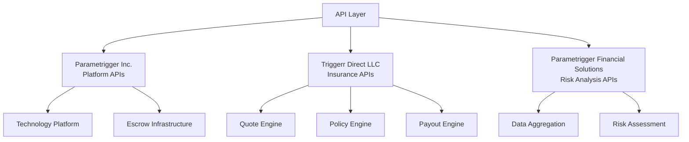

# 01_TECHNICAL_OVERVIEW: System Architecture & Technology Stack

This document provides a high-level overview of the triggerr project's technical architecture and the technologies employed. It focuses on how the system is structured and the roles of its various components within our Nevada-based entity structure and regulatory framework.

> **Legal Framework**: Comprehensive regulatory compliance strategy and technical architecture legal considerations documented in [Legal Reference](../04_compliance/LEGAL_REFERENCE.md)

## 1. System Architecture Overview

The triggerr platform follows a modular, monorepo-based architecture designed for scalability, maintainability, and clear separation of concerns.

### Monorepo Structure:

The project is organized into several top-level directories:

*   **`apps/`**: Contains standalone applications (e.g., `web` for the Next.js frontend).
*   **`packages/`**: Houses reusable code modules and services shared across applications.
*   **`docs/`**: Project documentation, including architectural diagrams, plans, and reference materials.
*   **`scripts/`**: Utility scripts for development, deployment, and data management.
*   **`supabase/`**: Configuration and migration files for Supabase services if used.
*   **`drizzle/`**: Drizzle ORM specific configurations and migrations.

### Core Components:

The system is broadly divided into:

*   **Web Application (`apps/web/`)**: The Next.js frontend responsible for the user interface, routing, and client-side logic.
*   **Core Packages (`packages/core/`)**: Fundamental utilities, database access layers, authentication helpers, and common shared logic with entity-aware components.
*   **Business Services (`packages/services/`)**: Encapsulate specific business domains (e.g., `escrow-engine`, `wallet-service`, `policy-engine`, `quote-engine`) with clear entity boundaries and regulatory compliance.
*   **Data Aggregation (`packages/aggregators/`)**: Services responsible for fetching and normalizing data from external sources (e.g., flight data, weather data) supporting multi-jurisdictional operations.
*   **External Integrations (`packages/integrations/`)**: Modules for interacting with third-party APIs (e.g., Stripe, external flight data providers) with compliance-aware implementations.
*   **Blockchain Integration (`packages/blockchain/`)**: Modules specific to blockchain interaction and protocols (e.g., PayGo adapter) leveraging Nevada's blockchain-friendly regulations.
*   **API Layer (`packages/api/`)**: Defines API contracts (DTOs, validators) and may contain API client SDKs with entity-aware response structures.
*   **Shared Packages (`packages/shared/`)**: General utilities and types shared across the monorepo, including compliance utilities.
*   **Configuration (`packages/config/`)**: Centralized configuration management with entity-specific settings and regulatory parameters.

### Web Application Navigation:

The `apps/web` application uses a hybrid Next.js App Router and React Router navigation model, allowing for rich client-side routing within a server-rendered application.

## 2. Technology Stack

The triggerr platform leverages a modern TypeScript-first technology stack:

*   **Frontend**: Next.js (React), Tailwind CSS, shadcn/ui.
*   **Backend (API Routes)**: Next.js API Routes (Edge Runtime where applicable).
*   **Database**: PostgreSQL with Drizzle ORM.
*   **Authentication**: Better-Auth (with Google OAuth).
*   **Blockchain Interaction**: PayGo Protocol (`@witnessco/paygo-ts-client`).
*   **Language**: TypeScript across the entire monorepo.
*   **Package Manager**: Bun.

## 3. Core Packages & Infrastructure

This section details the foundational packages that underpin the entire platform:

*   **`/triggerr/packages/core/`**:
    *   **Database**: Contains Drizzle ORM schema definitions and migration utilities. It centralizes database interactions and ensures type safety for data models.
    *   **Auth**: Provides `getAuthContext`, `setRLSContext`, and session management utilities for consistent authentication and Row Level Security enforcement.
*   **`/triggerr/packages/api/`**:
    *   **Contracts**: Defines all API interfaces, DTOs (Data Transfer Objects), and Zod validation schemas. This ensures a contract-first approach and type-safety across frontend and backend.
    *   **SDK**: Provides a client-side SDK for interacting with the backend APIs.
*   **`/triggerr/packages/integrations/stripe/`**: Encapsulates all Stripe-related payment processing logic, including checkout session creation and webhook handling.

## 4. Database Architecture

The system utilizes PostgreSQL with Drizzle ORM. Key aspects include:

*   **Schema Overview**: Centralized schema definition in `packages/core/database/schema.ts` for all entities (users, policies, flights, escrows, etc.).
*   **Row Level Security (RLS)**: Extensively applied to ensure data isolation between anonymous sessions and authenticated users.
*   **Reference Data**: Comprehensive seeding of reference data (airlines, airports, countries, etc.) for enriched data and validation.

## 5. API Structure & Entity Architecture

APIs are organized into versioned paths (`/api/v1/`) and categorized by functionality (Public, Authenticated User, Internal System, Webhooks). A consistent response format is enforced using `createApiResponse` and `createApiError` helpers with entity-aware metadata.

### Entity-Aware API Design

### Regulatory Compliance Integration
- **Nevada Entity Benefits**: APIs leverage Nevada's business-friendly regulations and blockchain laws
- **Multi-Jurisdictional Support**: API responses include entity context and compliance metadata
- **Regulatory Arbitrage**: Entity separation optimizes regulatory burden across different API functions

## 6. Security Model & Compliance Framework

Security is built-in with entity-aware compliance:
*   **Better-Auth**: For user authentication with entity context tracking.
*   **Row Level Security (RLS)**: Enforced at the database layer for data isolation and regulatory compliance.
*   **Environment Variable Management**: Secure handling of sensitive credentials with entity-specific configurations.
*   **Regulatory Compliance**: Built-in compliance monitoring and audit trails for multi-jurisdictional operations.
*   **Entity Isolation**: Security boundaries aligned with corporate entity structure for liability protection.

> **Legal Framework**: Detailed security requirements, compliance standards, and entity-specific security policies documented in [Legal Reference](../04_compliance/LEGAL_REFERENCE.md)