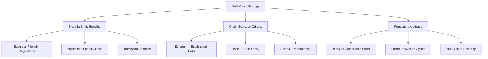

# Multi-Chain Expansion Strategy: Ethereum, Base & Solana

**Document Version**: 1.0
**Date**: June 27, 2024
**Status**: Strategic Architectural Blueprint
**Objective**: To provide a definitive technical strategy for expanding the platform's blockchain support beyond the initial PayGo MVP to include Ethereum, Base, and Solana.

> **Legal Framework**: Comprehensive regulatory compliance strategy and multi-chain legal considerations documented in [Legal Reference](../04_compliance/LEGAL_REFERENCE.md)

---

## 1. **Executive Summary**

With the foundational architecture now supporting a generic `IBlockchainService` interface, the platform is technically poised for multi-chain expansion. This document outlines the strategic and technical requirements to onboard new chains, fulfilling our core vision of being a truly platform-agnostic, multi-chain service.

Our strategy is predicated on a crucial understanding: **supporting a new, non-native blockchain requires us to replicate the on-chain business logic (escrow, delegation) that is provided out-of-the-box by the PayGo network.** This involves developing, deploying, and maintaining our own set of smart contracts for each new ecosystem we enter.

This document details the on-chain requirements and the corresponding off-chain "adapter" implementation needed for each target blockchain, while considering the regulatory advantages of our Nevada-based entity structure.

---

## 2. **The Core Principle: The `IBlockchainService` Contract**

Our ability to expand is entirely dependent on our `IBlockchainService` interface. Every new blockchain integration is simply a new "plug" that fits our existing "socket." Any new adapter we build **must** implement every method defined in this interface.

**Reference Methods from `IBlockchainService`**:
*   `generateNewWallet(): Promise<BlockchainWallet>`
*   `getAccountInfo(address: string): Promise<BlockchainAccountInfo>`
*   `createEscrow(params: GenericEscrowParams, privateKey: string): Promise<TransactionResult>`
*   `fulfillEscrow(escrowId: string, privateKey: string): Promise<TransactionResult>`
*   `releaseEscrow(escrowId: string, privateKey: string): Promise<TransactionResult>`
*   `prepareCreateEscrowTransaction(params: GenericEscrowParams): Promise<any>`
*   `submitSignedTransaction(signedTx: any): Promise<TransactionResult>`
*   *(And all other methods for transfers, delegations, etc.)*

---

## 3. **On-Chain Requirements: Custom Smart Contracts**

For each new blockchain (Ethereum/Base and Solana), we must develop, audit, and deploy a suite of smart contracts to handle our core business logic.

### **3.1. EVM Smart Contracts (for Ethereum & Base)**

Since Base is an EVM-compatible L2, a single set of Solidity smart contracts can be deployed to both chains.

*   **`TriggerrEscrow.sol` (Escrow Contract)**
    *   **Language**: Solidity
    *   **Standard**: ERC-721 (optional, for representing policies as NFTs) or custom structs.
    *   **Core Functions**:
        *   `function createEscrow(address recipient, uint256 amount, uint256 expirationTimestamp)`: Locks `amount` of a specific token (e.g., USDC) and sets the `recipient` and `expiration`.
        *   `function fulfillEscrow(bytes32 escrowId)`: Allows the designated `recipient` to claim the funds before expiration.
        *   `function releaseEscrow(bytes32 escrowId)`: Allows the original sender to reclaim the funds after `expirationTimestamp`.
    *   **Events**: Must emit events for `EscrowCreated`, `EscrowFulfilled`, and `EscrowReleased` for off-chain indexing.

*   **`TriggerrDelegation.sol` (Delegation Contract)**
    *   **Language**: Solidity
    *   **Standard**: Could leverage existing standards like EIP-2612 for `permit` or build a custom delegation mapping.
    *   **Core Functions**:
        *   `function setDelegate(address delegate, uint256 allowance)`: Grants a `delegate` the permission to spend up to `allowance` of the owner's tokens.

*   **`TriggerrFaucet.sol` (Testnet Faucet)**
    *   **Language**: Solidity
    *   **Standard**: ERC-20 (for a custom testnet token).
    *   **Core Functions**: `function drip(address recipient, uint256 amount)`.

### **3.2. Solana On-Chain Programs**

*   **`triggerr_escrow` (Escrow Program)**
    *   **Language**: Rust (using Anchor framework)
    *   **Logic**: The program will manage the creation of Program Derived Addresses (PDAs) to act as temporary escrow accounts.
    *   **Instructions**:
        *   `create_escrow`: Initializes a new escrow PDA, seeds it with the policy/user details, and transfers SPL tokens into it.
        *   `fulfill_escrow`: Verifies the signer is the designated recipient and transfers the tokens from the PDA to their wallet.
        *   `release_escrow`: Verifies the expiration has passed and returns the tokens from the PDA to the original sender.

*   **Delegation on Solana**:
    *   **Strategy**: No custom contract needed. We will leverage the **built-in `approve` and `transfer` instructions of the SPL Token program**. Our `SolanaClientService` will be responsible for creating these instructions.

---

## 3. **Capital Provisioning Strategy: DeFi Integration**

A critical component of our multi-chain strategy is solving the capital provisioning problem: how to fund the insurance coverage we offer. Instead of providing this capital ourselves, we will leverage established DeFi lending protocols to create a decentralized, yield-bearing reserve fund. This creates a two-sided market where DeFi users can provide liquidity and earn yield from the premiums paid by our insurance customers.

This approach allows Triggerr to underwrite a significant amount of coverage with minimal upfront capital, creating a highly scalable and Web3-native business model.

### **3.1. The "Policy Fund" Smart Contract**

For each ecosystem (EVM and Solana), we will deploy a simple intermediary smart contract that acts as our main treasury. This contract provides a secure, single point of interaction between our platform and the underlying DeFi protocol.

*   **Responsibilities**:
    *   Accept premium deposits (in USDC or equivalent stablecoin) from our backend.
    *   Immediately supply those deposits as liquidity to the chosen DeFi protocol (Morpho or Perena).
    *   Provide a secure `executePayout` function, callable only by our authorized backend wallet, which withdraws funds from the DeFi protocol and sends them to the insured user.

### **3.2. DeFi Protocol Integration**

*   **For EVM Chains (Ethereum & Base)**:
    *   **Protocol**: **Morpho Blue**.
    *   **Action**: We will configure and deploy a dedicated lending market on Morpho. DeFi liquidity providers will supply USDC to this market to earn yield. Our `PolicyFund.sol` contract will interact with this specific Morpho market.

*   **For Solana**:
    *   **Protocol**: **Perena**.
    *   **Action**: We will use Perena's framework to create a similar yield-bearing pool for USDC on the Solana network. Our Solana-based "Policy Fund" program will interact with this Perena pool.

---

## 4. **On-Chain Requirements: Custom Smart Contracts**

For each new chain, we will create a new package within `packages/blockchain/`.

### **4.1. `@triggerr/ethereum-adapter` (for Ethereum & Base)**

*   **Primary Dependency**: `ethers.js` or `viem`.
*   **Class**: `EthereumClientService implements IBlockchainService`.
*   **Responsibilities**:
    *   **`generateNewWallet`**: Will use `ethers.Wallet.createRandom()` to generate a new EVM-compatible wallet.
    *   **`createEscrow`**: Will create an `ethers.Contract` instance of our deployed `TriggerrEscrow.sol` contract and call its `createEscrow` function.
    *   **`getAccountInfo`**: Will use an `ethers.JsonRpcProvider` to call `provider.getBalance()` and `provider.getTransactionCount()`.
    *   **`prepareCreateEscrowTransaction`**: Will populate an `UnsignedTransaction` object with the correct `to` (our smart contract address), `data` (the encoded function call), and `value`.

### **4.2. `@triggerr/solana-adapter`**

*   **Primary Dependency**: `@solana/web3.js`.
*   **Class**: `SolanaClientService implements IBlockchainService`.
*   **Responsibilities**:
    *   **`generateNewWallet`**: Will use `Keypair.generate()` to create a new Solana keypair.
    *   **`createEscrow`**: Will use `@solana/web3.js` to build a `Transaction` containing the instruction to call our `triggerr_escrow` on-chain program.
    *   **`getAccountInfo`**: Will use a `Connection` object to call `connection.getBalance(publicKey)` and `connection.getTransactionCount()`.
    *   **`prepareCreateEscrowTransaction`**: Will return a `Transaction` object (from `@solana/web3.js`) that is fully constructed but not yet signed.

---

## 6. **Regulatory Considerations & Chain Selection**

### **6.1. Jurisdictional Mapping**

### **6.2. Chain-Specific Regulatory Advantages**

| Blockchain | Regulatory Benefits | Nevada Entity Advantage | Strategic Value |
|------------|-------------------|------------------------|-----------------|
| **Ethereum** | Established DeFi regulations | Nevada blockchain laws (NRS 719) | High liquidity, mature ecosystem |
| **Base** | L2 regulatory clarity | Reduced gas costs for compliance | Cost-efficient operations |
| **Solana** | Performance-focused regulation | Innovation-friendly jurisdiction | High-throughput applications |

### **6.3. Compliance Strategy Per Chain**

**Entity Structure Benefits**:
- **Parametrigger Inc.**: Technology platform development across all chains
- **Triggerr Direct LLC**: Insurance risk bearing with multi-chain escrow support
- **Parametrigger Financial Solutions Inc.**: Cross-chain risk analysis and DeFi integration

**Regulatory Arbitrage**:
- Nevada's blockchain-friendly legislation supports multi-chain operations
- Entity separation isolates smart contract risks from insurance operations
- DeFi integration benefits from Nevada's crypto-friendly regulatory environment

> **Detailed Legal Framework**: Multi-chain regulatory strategy, smart contract compliance, and cross-chain legal considerations documented in [Legal Reference](../04_compliance/LEGAL_REFERENCE.md)

---

## 7. **Implementation Phasing**

This expansion will be tackled sequentially after the PayGo MVP is launched and stable.

1.  **Phase A: Ethereum & Base Integration**
    *   Develop and audit the Solidity smart contracts under Nevada entity structure
    *   Deploy contracts to Sepolia (for Ethereum) and Base Goerli (for Base) testnets
    *   Build and test the `@triggerr/ethereum-adapter` package
    *   Update the `BlockchainServiceRegistry` to include the new `EthereumClientService` and `BaseClientService`
    *   Implement regulatory compliance monitoring for multi-chain operations

2.  **Phase B: Solana Integration**
    *   Develop and audit the Rust-based on-chain escrow program
    *   Deploy the program to the Solana Devnet
    *   Build and test the `@triggerr/solana-adapter` package
    *   Update the `BlockchainServiceRegistry` to include the new `SolanaClientService`
    *   Establish cross-chain compliance framework

3.  **Phase C: Regulatory Optimization**
    *   Leverage Nevada's blockchain-friendly regulations across all chains
    *   Implement entity-specific compliance monitoring
    *   Optimize cross-chain operations for regulatory arbitrage benefits
    *   Establish multi-chain audit and reporting infrastructure

This document provides the strategic clarity needed to guide our multi-chain development efforts. It ensures that as we expand, we do so in a way that is consistent, scalable, and true to our core architectural principles while maximizing regulatory advantages through our Nevada-based entity structure.

**Key Success Factors**:
1. **Regulatory Arbitrage**: Leverage Nevada's blockchain-friendly regulations across all chains
2. **Entity Optimization**: Utilize appropriate entities for each blockchain function
3. **Compliance Efficiency**: Minimize regulatory burden through strategic implementation
4. **Cross-Chain Coordination**: Maintain consistent legal framework across all blockchains
5. **Innovation Flexibility**: Preserve ability to adapt to regulatory changes

> **Legal Framework**: Comprehensive multi-chain regulatory strategy, entity coordination, and compliance requirements documented in [Legal Reference](../04_compliance/LEGAL_REFERENCE.md)
