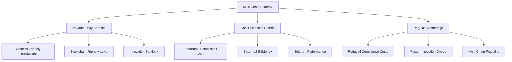

# Dual-Chain Foundation Strategy: Ethereum + Base with Multi-Chain Expansion

**Document Version**: 2.0
**Date**: January 2025
**Status**: Strategic Architectural Blueprint - MVP Implementation
**Objective**: To provide a definitive technical strategy for our dual-chain Ethereum + Base MVP foundation with seamless user abstraction, while maintaining expansion capabilities to Solana and other blockchains.

> **Legal Framework**: Comprehensive regulatory compliance strategy and multi-chain legal considerations documented in [Legal Reference](../04_compliance/LEGAL_REFERENCE.md)

---

## 1. **Executive Summary**

The Triggerr platform launches with a **dual-chain foundation** featuring Ethereum and Base, providing users with seamless blockchain abstraction while maintaining the full benefits of smart contract ownership. This strategic approach combines Ethereum's security and ecosystem maturity with Base's cost efficiency and scalability.

Our MVP strategy centers on **complete smart contract ownership** across both chains, moving beyond third-party blockchain services to establish our own on-chain infrastructure. This includes our TriggerrEscrowFactory, PolicyRegistry, and PolicyFund contracts deployed simultaneously on both networks.

**Key Strategic Advantages:**
- **User Abstraction**: Users interact with Triggerr without needing to understand or choose blockchains
- **Cost Optimization**: Base as default for cost efficiency, Ethereum for high-value transactions
- **Investment Appeal**: True Web3-native company with owned infrastructure
- **Regulatory Arbitrage**: Nevada-based entity structure optimizing compliance across dual-chain operations

This document details our dual-chain implementation strategy and expansion roadmap to additional blockchains, while leveraging our Nevada-based entity structure for optimal regulatory positioning.

---

## 2. **The Core Principle: The `IBlockchainService` Contract**

Our ability to expand is entirely dependent on our `IBlockchainService` interface. Every new blockchain integration is simply a new "plug" that fits our existing "socket." Any new adapter we build **must** implement every method defined in this interface.

**Reference Methods from `IBlockchainService`**:
*   `generateNewWallet(): Promise<BlockchainWallet>`
*   `getAccountInfo(address: string): Promise<BlockchainAccountInfo>`
*   `createEscrow(params: GenericEscrowParams, privateKey: string): Promise<TransactionResult>`
*   `fulfillEscrow(escrowId: string, privateKey: string): Promise<TransactionResult>`
*   `releaseEscrow(escrowId: string, privateKey: string): Promise<TransactionResult>`
*   `prepareCreateEscrowTransaction(params: GenericEscrowParams): Promise<any>`
*   `submitSignedTransaction(signedTx: any): Promise<TransactionResult>`
*   *(And all other methods for transfers, delegations, etc.)*

---

## 3. **Dual-Chain Smart Contract Foundation**

For our MVP launch, we deploy identical smart contract suites on both Ethereum and Base networks, ensuring feature parity while optimizing for each network's characteristics.

### **3.1. Unified EVM Smart Contract Suite (Ethereum + Base MVP)**

Our dual-chain strategy leverages identical Solidity smart contracts deployed on both Ethereum and Base, providing feature parity with network-specific optimizations.

*   **`TriggerrEscrow.sol` (Escrow Contract)**
    *   **Language**: Solidity
    *   **Standard**: ERC-721 (optional, for representing policies as NFTs) or custom structs.
    *   **Core Functions**:
        *   `function createEscrow(address recipient, uint256 amount, uint256 expirationTimestamp)`: Locks `amount` of a specific token (e.g., USDC) and sets the `recipient` and `expiration`.
        *   `function fulfillEscrow(bytes32 escrowId)`: Allows the designated `recipient` to claim the funds before expiration.
        *   `function releaseEscrow(bytes32 escrowId)`: Allows the original sender to reclaim the funds after `expirationTimestamp`.
    *   **Events**: Must emit events for `EscrowCreated`, `EscrowFulfilled`, and `EscrowReleased` for off-chain indexing.

*   **`TriggerrDelegation.sol` (Delegation Contract)**
    *   **Language**: Solidity
    *   **Standard**: Could leverage existing standards like EIP-2612 for `permit` or build a custom delegation mapping.
    *   **Core Functions**:
        *   `function setDelegate(address delegate, uint256 allowance)`: Grants a `delegate` the permission to spend up to `allowance` of the owner's tokens.

*   **`TriggerrFaucet.sol` (Testnet Faucet)**
    *   **Language**: Solidity
    *   **Standard**: ERC-20 (for a custom testnet token).
    *   **Core Functions**: `function drip(address recipient, uint256 amount)`.

### **3.2. Chain Abstraction Layer**

Our user abstraction system automatically routes transactions to the optimal chain based on:

*   **Transaction Cost**: Base for cost-sensitive operations, Ethereum for high-value transactions
*   **Network Congestion**: Dynamic routing based on real-time network conditions  
*   **User Preferences**: Optional manual chain selection for advanced users
*   **Liquidity Requirements**: Chain selection based on available DeFi liquidity

**Implementation Components:**
*   **Chain Router Service**: Intelligent transaction routing algorithm
*   **Unified API Interface**: Single API endpoints abstracting dual-chain complexity
*   **Cross-Chain State Sync**: Policy and escrow state consistency across chains
*   **Gas Optimization**: Automatic chain selection for optimal user costs

---

## 3. **Capital Provisioning Strategy: DeFi Integration**

A critical component of our multi-chain strategy is solving the capital provisioning problem: how to fund the insurance coverage we offer. Instead of providing this capital ourselves, we will leverage established DeFi lending protocols to create a decentralized, yield-bearing reserve fund. This creates a two-sided market where DeFi users can provide liquidity and earn yield from the premiums paid by our insurance customers.

This approach allows Triggerr to underwrite a significant amount of coverage with minimal upfront capital, creating a highly scalable and Web3-native business model.

### **3.1. The "Policy Fund" Smart Contract**

For each ecosystem (EVM and Solana), we will deploy a simple intermediary smart contract that acts as our main treasury. This contract provides a secure, single point of interaction between our platform and the underlying DeFi protocol.

*   **Responsibilities**:
    *   Accept premium deposits (in USDC or equivalent stablecoin) from our backend.
    *   Immediately supply those deposits as liquidity to the chosen DeFi protocol (Morpho or Perena).
    *   Provide a secure `executePayout` function, callable only by our authorized backend wallet, which withdraws funds from the DeFi protocol and sends them to the insured user.

### **3.2. DeFi Protocol Integration**

*   **For EVM Chains (Ethereum & Base)**:
    *   **Protocol**: **Morpho Blue**.
    *   **Action**: We will configure and deploy a dedicated lending market on Morpho. DeFi liquidity providers will supply USDC to this market to earn yield. Our `PolicyFund.sol` contract will interact with this specific Morpho market.

*   **For Solana**:
    *   **Protocol**: **Perena**.
    *   **Action**: We will use Perena's framework to create a similar yield-bearing pool for USDC on the Solana network. Our Solana-based "Policy Fund" program will interact with this Perena pool.

---

## 4. **On-Chain Requirements: Custom Smart Contracts**

For each new chain, we will create a new package within `packages/blockchain/`.

### **4.1. `@triggerr/ethereum-adapter` (for Ethereum & Base)**

*   **Primary Dependency**: `ethers.js` or `viem`.
*   **Class**: `EthereumClientService implements IBlockchainService`.
*   **Responsibilities**:
    *   **`generateNewWallet`**: Will use `ethers.Wallet.createRandom()` to generate a new EVM-compatible wallet.
    *   **`createEscrow`**: Will create an `ethers.Contract` instance of our deployed `TriggerrEscrow.sol` contract and call its `createEscrow` function.
    *   **`getAccountInfo`**: Will use an `ethers.JsonRpcProvider` to call `provider.getBalance()` and `provider.getTransactionCount()`.
    *   **`prepareCreateEscrowTransaction`**: Will populate an `UnsignedTransaction` object with the correct `to` (our smart contract address), `data` (the encoded function call), and `value`.

### **4.2. `@triggerr/solana-adapter`**

*   **Primary Dependency**: `@solana/web3.js`.
*   **Class**: `SolanaClientService implements IBlockchainService`.
*   **Responsibilities**:
    *   **`generateNewWallet`**: Will use `Keypair.generate()` to create a new Solana keypair.
    *   **`createEscrow`**: Will use `@solana/web3.js` to build a `Transaction` containing the instruction to call our `triggerr_escrow` on-chain program.
    *   **`getAccountInfo`**: Will use a `Connection` object to call `connection.getBalance(publicKey)` and `connection.getTransactionCount()`.
    *   **`prepareCreateEscrowTransaction`**: Will return a `Transaction` object (from `@solana/web3.js`) that is fully constructed but not yet signed.

---

## 6. **Dual-Chain Regulatory Framework & Future Expansion**

### **6.1. Jurisdictional Mapping**

### **6.2. Chain-Specific Regulatory Advantages**

| Blockchain | Regulatory Benefits | Nevada Entity Advantage | Strategic Value |
|------------|-------------------|------------------------|-----------------|
| **Ethereum** | Established DeFi regulations | Nevada blockchain laws (NRS 719) | High liquidity, mature ecosystem |
| **Base** | L2 regulatory clarity | Reduced gas costs for compliance | Cost-efficient operations |
| **Solana** | Performance-focused regulation | Innovation-friendly jurisdiction | High-throughput applications |

### **6.3. Compliance Strategy Per Chain**

**Entity Structure Benefits**:
- **Parametrigger Inc.**: Technology platform development across all chains
- **Triggerr Direct LLC**: Insurance risk bearing with multi-chain escrow support
- **Parametrigger Financial Solutions Inc.**: Cross-chain risk analysis and DeFi integration

**Regulatory Arbitrage**:
- Nevada's blockchain-friendly legislation supports multi-chain operations
- Entity separation isolates smart contract risks from insurance operations
- DeFi integration benefits from Nevada's crypto-friendly regulatory environment

> **Detailed Legal Framework**: Multi-chain regulatory strategy, smart contract compliance, and cross-chain legal considerations documented in [Legal Reference](../04_compliance/LEGAL_REFERENCE.md)

---

## 7. **Implementation Phasing**

Our implementation follows a strategic dual-chain foundation approach with systematic expansion.

1.  **Phase 1.5: Dual-Chain MVP Foundation (Current)** ⭐ **ACTIVE**
    *   Develop and audit unified Solidity smart contracts under Nevada entity structure
    *   Deploy contracts to Ethereum Mainnet and Base Mainnet (with Sepolia/Base Sepolia testnets)
    *   Implement `@triggerr/ethereum-adapter` and `@triggerr/base-adapter` packages
    *   Build `@triggerr/chain-router` for seamless user abstraction
    *   Establish dual-chain regulatory compliance monitoring
    *   Integrate DeFi protocols: Morpho Blue (Ethereum) and Base lending protocols
    *   Launch with complete user chain abstraction

2.  **Phase 2.0: Enhanced Dual-Chain Features**
    *   Cross-chain escrow coordination for complex financial products
    *   Advanced chain routing algorithms based on user behavior
    *   Multi-chain analytics and reporting dashboard
    *   Enhanced DeFi integration across both networks

3.  **Phase 2.5: Solana Integration**
    *   Develop and audit Rust-based on-chain escrow programs
    *   Deploy programs to Solana Mainnet
    *   Build and test `@triggerr/solana-adapter` package
    *   Extend chain router to include Solana in user abstraction
    *   Integrate Solana DeFi protocols (Perena)

4.  **Phase 3.0: Multi-Chain Expansion**
    *   Additional EVM chains (Arbitrum, Optimism, Polygon)
    *   Advanced cross-chain interoperability
    *   Multi-chain governance and optimization
    *   Enterprise multi-chain API and SDK features

This document provides the strategic clarity for our dual-chain foundation and multi-chain expansion roadmap. Our Ethereum + Base MVP establishes a robust, user-abstracted foundation that maximizes both technical capabilities and regulatory advantages through our Nevada-based entity structure, while positioning us for systematic expansion to additional blockchains.

**Key Success Factors**:
1. **Regulatory Arbitrage**: Leverage Nevada's blockchain-friendly regulations across all chains
2. **Entity Optimization**: Utilize appropriate entities for each blockchain function
3. **Compliance Efficiency**: Minimize regulatory burden through strategic implementation
4. **Cross-Chain Coordination**: Maintain consistent legal framework across all blockchains
5. **Innovation Flexibility**: Preserve ability to adapt to regulatory changes

> **Legal Framework**: Comprehensive multi-chain regulatory strategy, entity coordination, and compliance requirements documented in [Legal Reference](../04_compliance/LEGAL_REFERENCE.md)
