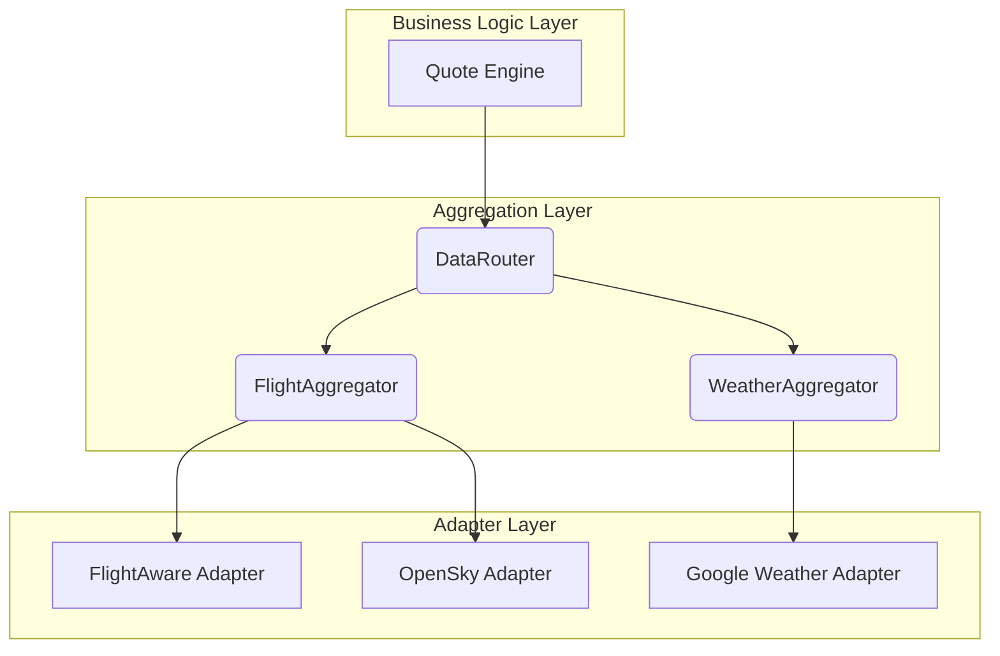

# Data Aggregation Layer: Architectural Design

**Document Version**: 1.0
**Date**: June 30, 2024
**Status**: Technical Blueprint
**Objective**: To provide the definitive technical design for the Triggerr Data Aggregation Layer. This document consolidates all previous architectural notes and serves as the master blueprint for implementing the `DataRouter`, `FlightAggregator`, and `WeatherAggregator`.

---

## 1. **Core Philosophy & Architectural Goals**

The Data Aggregation Layer is a critical "firewall" between our core business logic and the volatile, inconsistent world of external third-party APIs. Its primary purpose is to ensure **Data Independence**. Our `QuoteEngine`, `PolicyEngine`, and `PayoutEngine` must remain completely unaware of which specific external APIs (e.g., FlightAware, OpenSky) are being used to source data.

This architecture is designed to be:
*   **Resilient**: It can handle the failure of one or more data providers by intelligently falling back to others.
*   **Scalable**: New data providers (for flights, weather, or other future verticals) can be added with minimal changes.
*   **Efficient**: It uses caching and intelligent routing to minimize API costs and latency.
*   **Consistent**: It transforms messy, non-standard data from multiple sources into a single, clean, **Canonical Data Model** that the rest of our application can reliably use.

---

## 2. **System Architecture: The Three Layers**

The aggregation layer is composed of three distinct, hierarchical components: the **Data Router**, the **Aggregators**, and the **Adapters**.



### **2.1. Layer 1: The `DataRouter` (The Orchestrator)**
*   **Package**: `@triggerr/data-router`
*   **Responsibility**: The `DataRouter` is the single entry point for the business logic layer. It understands the data requirements for different insurance products and orchestrates the necessary calls to the specialized aggregators.
*   **Example Flow**: When asked for data for a `HURRICANE_FLIGHT_CANCELLATION` policy, it knows it must call *both* the `FlightAggregator` (to get flight details) and the `WeatherAggregator` (to get the hurricane forecast) and return a combined result.

### **2.2. Layer 2: The `Aggregators` (The Domain Experts)**
*   **Packages**: `@triggerr/flight-aggregator`, `@triggerr/weather-aggregator`
*   **Responsibility**: Each aggregator is an expert in one specific data domain (e.g., "flights"). Its job is to manage multiple external sources for that domain to produce a single, authoritative, canonical data object. It uses its internal components (`SourceRouter`, `ConflictResolver`, `CacheManager`) to do this.

### **2.3. Layer 3: The `Adapters` (The Translators)**
*   **Packages**: `@triggerr/flightaware-adapter`, `@triggerr/opensky-adapter`, etc.
*   **Responsibility**: Each adapter has one, simple job: make a raw API call to a specific third-party service and translate the unique response into our internal, **Canonical Data Model**. It knows nothing about other sources or business rules.

---

## 3. **Detailed Component Design: `flight-aggregator`**

This is the most critical aggregator for the MVP.

### **3.1. `CacheManager`**
*   **File**: `src/cache-manager.ts`
*   **Class**: `CacheManager`
*   **Logic**: Implements a time-aware, in-memory cache using a `Map`.
    *   `set(key: string, value: any, ttl: number)`: Stores a value with a Time-to-Live in milliseconds.
    *   `get(key: string): any | null`: Retrieves a value if it exists and has not expired.
    *   `has(key: string): boolean`: Checks for a valid, non-expired entry.

### **3.2. `SourceRouter`**
*   **File**: `src/source-router.ts`
*   **Class**: `SourceRouter`
*   **Logic**: Determines the order in which to query data sources.
    *   **MVP Logic**: Will contain a hardcoded, prioritized list: `[FlightAwareClient, OpenSkyClient, AviationStackClient]`.
    *   **Future Logic**: Can be enhanced to use the `CostOptimizer` and `HealthChecker` from the `DataRouter` package to make dynamic decisions.

### **3.3. `ConflictResolver`**
*   **File**: `src/conflict-resolver.ts`
*   **Class**: `ConflictResolver`
*   **Logic**: Merges multiple canonical data objects into one.
    *   **MVP Logic**: A simple "first successful source wins" strategy.
    *   **Future Logic**: Can be enhanced with field-level priority (e.g., "trust FlightAware for status, but trust OpenSky for altitude").

### **3.4. `FlightAggregator` (The Orchestrator)**
*   **File**: `src/aggregator.ts`
*   **Class**: `FlightAggregator`
*   **Constructor**: Will be injected with instances of `CacheManager`, `SourceRouter`, and `ConflictResolver`.
*   **Primary Method**: `async getFlightStatus(flightIdentifier: object): Promise<CanonicalFlightData>`
    1.  Generate a cache key from the `flightIdentifier`.
    2.  Check `cacheManager.get(key)`. If it exists, return the cached data.
    3.  If not cached, call `sourceRouter.getSources()` to get the prioritized list of adapter clients.
    4.  Loop through the sources:
        *   Call the adapter's `fetchFlight` method.
        *   If successful, add the result to a `responses` array.
        *   Continue to the next source if configured (e.g., to gather more data) or break the loop if a single good response is sufficient.
    5.  If `responses` array is not empty, pass it to `conflictResolver.resolve()` to get the final, authoritative data object.
    6.  Call `cacheManager.set(key, finalData, ...)` to store the result.
    7.  Return the final data.

---

## 4. **Canonical Data Models**

This is the cornerstone of the entire strategy. We must have a single, internal representation for our data.

### **4.1. `CanonicalFlightData`**
*   **Defined In**: A new package, likely `packages/core/src/models/`
*   **Structure**:
    ```typescript
    interface CanonicalFlightData {
      sourceProvider: string; // The authoritative source after conflict resolution
      flightNumber: string;
      status: 'SCHEDULED' | 'ACTIVE' | 'LANDED' | 'DELAYED' | 'CANCELLED';
      departure: {
        airportIATA: string;
        timezone: string; // e.g., 'America/New_York'
        scheduledUTC: Date;
        actualUTC?: Date;
        delayMinutes?: number;
        gate?: string;
      };
      arrival: {
        airportIATA: string;
        timezone: string; // e.g., 'America/Los_Angeles'
        scheduledUTC: Date;
        estimatedUTC?: Date;
        actualUTC?: Date;
        delayMinutes?: number;
        gate?: string;
        baggage_claim?: string;
      };
      rawSourceData: any[]; // An array of the raw responses from the source APIs
    }
    ```

### **4.2. `CanonicalWeatherData`**
*   **Defined In**: `packages/core/src/models/`
*   **Structure**:
    ```typescript
    interface CanonicalWeatherData {
      sourceProvider: string;
      location: {
        latitude: number;
        longitude: number;
      };
      timestamp: Date;
      temperatureCelsius: number;
      windSpeedKPH: number;
      precipitationProbability: number; // 0.0 to 1.0
      condition: 'CLEAR' | 'CLOUDY' | 'RAIN' | 'SNOW' | 'STORM';
      rawSourceData: any[];
    }
    ```

This document provides the complete technical blueprint for building our data aggregation layer. By adhering to this design, we will create a system that is robust, scalable, and perfectly aligned with our long-term vision of data independence.
