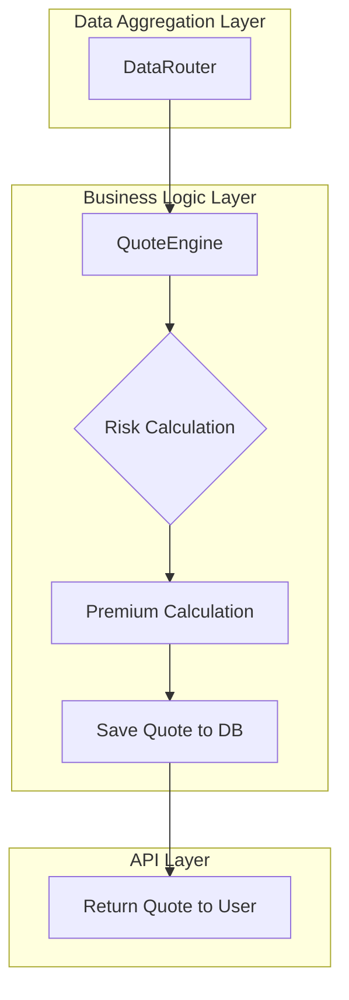
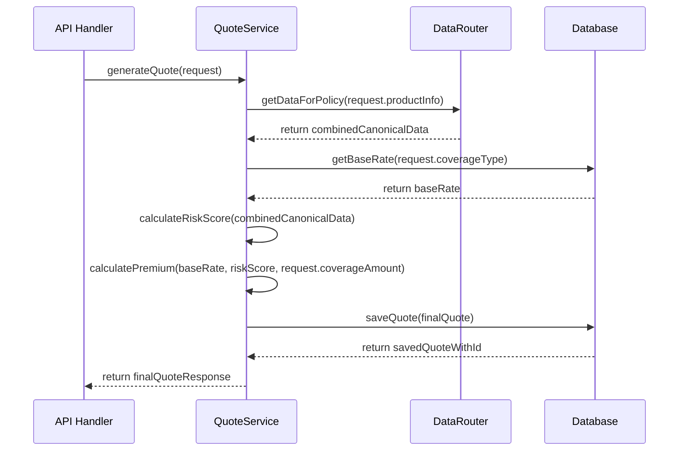

# Quote Engine: Architectural Design

**Document Version**: 1.0
**Date**: June 25, 2024
**Status**: Technical Blueprint
**Objective**: To provide the definitive technical design for the Triggerr `QuoteEngine`. This document details its role as a core business logic service, its interaction with the Data Aggregation Layer, and its methodology for risk and premium calculation.

---

## 1. **Core Philosophy & Architectural Placement**

The `QuoteEngine` is the primary "brain" of our insurance platform's pricing mechanism. It embodies the principle of **Data-Driven Decision Making**. Its sole responsibility is to consume clean, canonical data from the aggregation layer and apply a sophisticated risk model to generate a fair and accurate insurance premium.

It is fundamentally decoupled from all external data sources and all blockchain-specific logic.



---

## 2. **Component Design: `quote-engine`**

*   **Package**: `@triggerr/quote-engine`
*   **Primary Class**: `QuoteService`

### **2.1. Dependencies & Constructor**

The `QuoteService` will be instantiated with the following dependencies injected into its constructor, allowing for a high degree of testability and decoupling:

```typescript
import { DataRouter } from '@triggerr/data-router';
import { Drizzle } from 'drizzle-orm/pg-core'; // Example DB client

export class QuoteService {
  constructor(
    private dataRouter: DataRouter,
    private db: Drizzle, // For fetching base rates, etc.
    private logger: Logger // For structured logging
  ) {}
}
```

### **2.2. Primary Method: `generateQuote`**

This will be the main public method of the service.

*   **Signature**: `async generateQuote(request: InsuranceQuoteRequest): Promise<InsuranceQuoteResponse>`
*   **`InsuranceQuoteRequest`**: This is a structured object containing all necessary information for a quote, such as flight details, desired coverage amount, and product type.

### **2.3. Internal Workflow of `generateQuote`**



---

## 3. **Risk Calculation & Premium Formula**

The core intellectual property of the `QuoteEngine` resides in its risk and pricing models.

### **3.1. Risk Score Calculation**

The `calculateRiskScore` method will be a private method that takes the combined data payload from the `DataRouter`.

*   **Multi-Factor Model**: The risk score will be a weighted average of multiple factors.
*   **Flight Risk**: Calculated based on data from the `FlightAggregator`, including historical on-time performance, airline reliability, and route congestion.
*   **Weather Risk**: Calculated based on data from the `WeatherAggregator`, including precipitation probability, wind speed, and severe weather warnings (e.g., hurricane forecasts).
*   **Example Model**:
    ```typescript
    function calculateRiskScore(data) {
      const flightRisk = calculateFlightRisk(data.flightPerformance); // e.g., returns 0.15
      const weatherRisk = calculateWeatherRisk(data.weatherForecast); // e.g., returns 0.30

      // Product-specific weighting
      const totalRiskScore = (flightRisk * 0.6) + (weatherRisk * 0.4);

      return totalRiskScore; // e.g., returns 0.21
    }
    ```

### **3.2. Premium Calculation Formula**

The `calculatePremium` method will use the final risk score to determine the price.

*   **Base Rate**: A base percentage fetched from the `system_configuration` or `products` table in our database.
*   **Formula**:
    ```
    Base Premium = Coverage Amount * Base Rate
    Risk-Adjusted Premium = Base Premium * (1 + Total Risk Score)
    Final Premium = Risk-Adjusted Premium + Platform Fee
    ```

---

## 4. **Database Interaction: The `quotes` Table**

The `QuoteEngine` is responsible for persisting every generated quote to ensure price integrity at the time of purchase.

*   **Schema**: A `quotes` table will be added to `packages/core/src/database/schema.ts`.
*   **Key Fields**:
    *   `id`: Unique Quote ID (e.g., `quote_...`)
    *   `productType`: e.g., 'FLIGHT_DELAY'
    *   `coverageAmount`: The requested coverage.
    *   `premiumAmount`: The final calculated premium.
    *   `riskScore`: The calculated risk score (for analytics).
    *   `expiresAt`: A timestamp after which the quote is no longer valid (e.g., 15 minutes).
    *   `flightDetails`: A JSONB column containing the specific flight data used for the quote.
    *   `weatherDetails`: A JSONB column containing the specific weather data used.

---

This document provides the complete technical blueprint for the `QuoteEngine`. Its implementation will provide the core pricing logic for the entire Triggerr platform, built cleanly on top of our new, robust data aggregation layer.