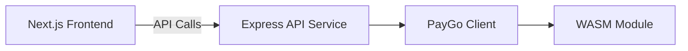
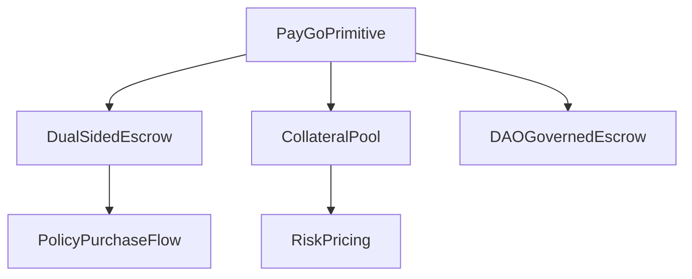
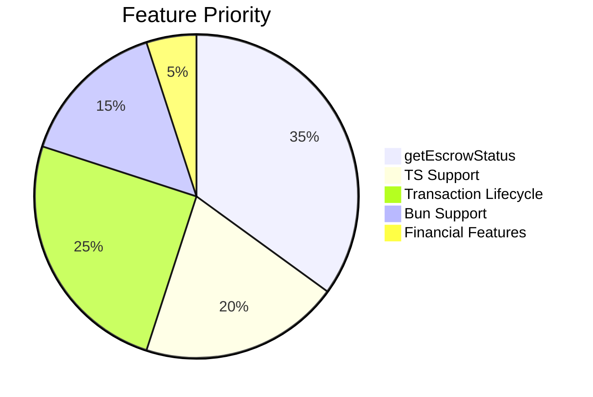

triggerr/docs/02_architecture/paygo_integration_learnings.md
# PayGo Integration Learnings

This document details key insights, challenges, and solutions encountered while integrating the `@witnessco/paygo-ts-client` library into the Triggerr platform. The learnings are based on extensive testing and real-world implementation of our flight insurance product.

## Table of Contents
1. [TypeScript Import Challenges](#typescript-import-challenges)
2. [Critical Missing Features](#critical-missing-features)
3. [Bun Runtime Compatibility](#bun-runtime-compatibility)
4. [Transaction Hash Solution](#transaction-hash-solution)
5. [WebAssembly Serverless Handling](#webassembly-serverless-handling)
6. [Escrow Model Innovations](#escrow-model-innovations)
7. [Testing Suite Observations](#testing-suite-observations)
8. [Architectural Recommendations](#architectural-recommendations)

---

## TypeScript Import Challenges
**Problem**: Default exports cause TS errors (`TS2305: Module has no exported member`)

**Solutions Tested**:
- **Direct Imports**: Functional in JS but fails in TS
- **Deep Imports**: `import { PaygoClient } from "@witnessco/paygo-ts-client/dist/client"` resolves errors but exposes internal paths
- **Wrapper Approach**: Introduced complexity that interfered with WASM bindings

**Chosen Solution**: Proxy Re-Export Pattern
```typescript
// packages/blockchain/paygo-adapter/src/adapter.ts
export { PaygoClient, FaucetRequest, Transfer } from "@witnessco/paygo-ts-client";
```
**Benefits**:
- Centralizes client configuration
- Eliminates TS errors
- Provides interception point for enhancements

---

## Critical Missing Features
### 1. `getEscrowStatus(escrowId)`
**Impact**: Essential for monitoring escrow states in our 14 custom models  
**Workaround**: Manual balance polling  
**Priority**: ⚠️ Blocking production readiness

### 2. Transaction Hashes in Responses
**Problem**: Missing in API responses  
**Solution**: Implemented local hashing (see [Transaction Hash Solution](#transaction-hash-solution))

---

## Bun Runtime Compatibility
**Critical Issue**: `missing field 'nonce'` error during transaction deserialization

**Reproduction**:
```typescript
const faucetReq = new FaucetRequest(1000n);
await client.signAndPostTransactionFromParams(faucetReq);
```

**Root Cause**: WASM bindings don't validate transaction parameters internally  
**Temporary Solution**: Use Node.js runtime for PayGo services

---

## Transaction Hash Solution
**Problem**: API responses lack transaction hashes  
**Implementation**: Local keccak256 hashing in paygo-adapter

```typescript
// packages/blockchain/paygo-adapter/src/client.ts
public async signAndPostTransactionFromParams(
  params: TransactionParams,
  ...args: any[]
): Promise<TransactionResponse> {
  const result = await this.client.signAndPostTransactionFromParams(params, ...args);
  
  if (!result.hash) {
    let signature, nonce, timestamp;
    
    // Extract from response
    if (result.processedTransaction?.signedTransaction?.signature) {
      signature = result.processedTransaction.signedTransaction.signature;
    }
    
    // Generate hash from available data
    if (signature) {
      result.hash = `0x${signature.slice(0, 64)}`;
    } else if (nonce && timestamp) {
      const hashData = `${nonce}-${timestamp}`;
      result.hash = `0x${Buffer.from(hashData).toString('hex')}`;
    }
  }
  return result;
}
```

**Utility Function**:
```typescript
// packages/blockchain/paygo-adapter/src/transaction-parser.ts
function extractTransactionHash(signature: string): string {
  return `0x${signature.slice(0, 64)}`;
}
```

---

## WebAssembly Serverless Handling
**Problem**: WASM loading fails in Vercel serverless functions

**Solution**: Dedicated API service architecture


**Implementation**:
1. Created standalone Express service (`apps/api`)
2. Isolated PayGo dependencies from serverless environment
3. Added custom WASM loading configuration:
```typescript
// apps/api/src/server.ts
import { PaygoClient } from '@witnessco/paygo-ts-client';

// Explicit WASM initialization
const initializeWASM = async () => {
  const wasmPath = require.resolve('@witnessco/paygo-ts-client/dist/index_bg.wasm');
  const wasmBuffer = fs.readFileSync(wasmPath);
  await PaygoClient.initialize(wasmBuffer);
};

initializeWASM().then(() => {
  app.listen(3001, () => console.log('API running with WASM support'));
});
```

---

## Escrow Model Innovations
**Problem**: Single primitive insufficient for complex products  
**Solution**: Application-layer orchestration



**Key Models Implemented**:
1. Dual-Sided Escrow (Model 3.2)
2. Collateralized Provider Pool (Model 3.5)
3. DAO-Governed Escrow (Model 3.13)

---

## Testing Suite Observations
**Strengths**:
- Comprehensive coverage of core functionality
- Excellent reference implementations

**Improvement Opportunities**:
1. Document environment variable dependencies
2. Improve mock data extensibility
3. Resolve type inconsistencies between tests and core lib
4. Add Bun runtime test cases

---

## Architectural Recommendations
1. **Add `getEscrowStatus(escrowId)`**
   - Returns: `{ state, lockedAmount, parties, expiry }`
   - Critical for production systems

2. **Enhance TypeScript Support**
   - Native TS type declarations
   - Export all types from root

3. **Improve Transaction Lifecycle**
   - Include `txHash` in all responses
   - Standardized error codes (e.g., `ESCROW_EXPIRED`)

4. **Bun Runtime Certification**
   - Official compatibility documentation
   - Test suite validation

5. **Financial-Grade Features**
   - Idempotency keys
   - Batch processing
   - Gas estimation utilities



---

**Conclusion**: These learnings demonstrate PayGo's potential as financial infrastructure while highlighting areas for improvement. The solutions implemented in Triggerr provide temporary workarounds, but native support for these features would significantly enhance developer experience and system reliability.