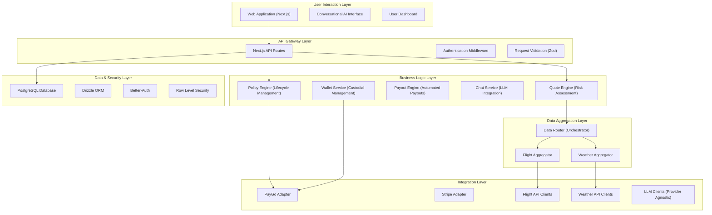

# 01_MASTER_PLAN: triggerr Project Comprehensive Development Blueprint & Context Repository

**Document Version**: 2.0 (Complete Architectural Context)
**Last Updated**: December 2024
**Status**: Master Architectural Blueprint & Context Repository (Definitive Source of Truth)
**Primary Goal**: Serve as the complete context repository for the triggerr project, ensuring no loss of context during development and providing comprehensive architectural understanding

---

## 📋 **TABLE OF CONTENTS**

1. [Executive Summary & Current Status](#executive-summary)
2. [Strategic Vision & Business Context](#strategic-vision)
3. [Technical Architecture Overview](#technical-architecture)
4. [Current Implementation Status](#implementation-status)
5. [Comprehensive Reference Documentation Map](#reference-docs)
6. [Phase F Completion Context](#phase-f-context)
7. [Active Development Tasks](#active-tasks)
8. [Build System & Package Architecture](#build-system)
9. [Data Architecture & Database Design](#data-architecture)
10. [API Architecture & Contracts](#api-architecture)
11. [Business Logic Services](#business-services)
12. [External Integration Strategy](#integration-strategy)
13. [Multi-Chain Blockchain Strategy](#blockchain-strategy)
14. [Development Patterns & Best Practices](#dev-patterns)
15. [Testing & Quality Assurance](#testing)
16. [Future Expansion Roadmap](#future-roadmap)

---

## I. 📊 **EXECUTIVE SUMMARY & CURRENT STATUS** {#executive-summary}

### **Primary Objective**
Implement the Minimal Viable Product (MVP) of the triggerr platform, focusing on Flight Delay Insurance with Automatic Payouts, built on a robust API-first architecture with seamless B2B integration capabilities.

### **Current Status**: **PHASE F COMPLETION → PHASE 2 SERVICE IMPLEMENTATION** 🎯
- **Foundation Status**: ✅ **100% COMPLETE** - All infrastructure, build system, API contracts, and core services are stable
- **Current Focus**: Completing the final business logic services (Quote Engine & Policy Engine) for MVP completion
- **Next Milestone**: Complete Task 2.2 (Quote Service Interface Alignment) and Task 2.3 (Policy Engine Integration)

### **Key Achievements Summary**
- ✅ **Enterprise-Grade Build System & Deep Import Removal**: TypeScript Project References with 28/28 packages building successfully. Eliminated 56+ deep imports, enabling a clean, domain-driven barrel export architecture.
- ✅ **API-First Architecture**: Complete API contracts, validators, and a framework-agnostic, enterprise-ready SDK.
- ✅ **Stable Test Suite**: 147 tests passing, ensuring reliability across the platform.
- ✅ **PayGo Integration**: Functional wallet, escrow, and transaction history services.
- ✅ **Authentication System**: Better-Auth with JWT, API keys, and anonymous sessions.
- ✅ **Database Foundation**: Comprehensive schema with seeded reference data, now including `beneficiaries` and `endorsements`.
- ✅ **Developer Experience**: Live dev-dashboard and system health monitoring, now with robust import validation scripts.

---

## II. 🎯 **STRATEGIC VISION & BUSINESS CONTEXT** {#strategic-vision}

### **Business Model Overview**
triggerr is positioned as "The Parametric Insurance Experts" with a clear phased rollout strategy:

#### **Phase 1: Insurance Platform Launch (Months 1-4)**
- **Goal**: Establish triggerr.com as the premier parametric flight delay insurance platform
- **Product Focus**: Flight delay insurance offered by "triggerr Direct"
- **Wallet Strategy**: Custodial PayGo wallets for seamless user onboarding
- **Key Features**:
  - Conversational AI for quote generation and support
  - Automated flight monitoring and parametric payouts
  - Stripe (fiat) and PayGo (crypto) payment options
  - Anonymous policy tracking via verification codes

#### **Phase 2: Enhanced Features & Wallet Evolution (Months 5-8)**
- **Goal**: Expand product suite and introduce user wallet self-custody options
- **New Features**:
  - Additional parametric insurance products (weather, baggage delay)
  - Secure private key export for custodial wallets
  - User education on self-custody
  - B2B analytics and provider onboarding capabilities

#### **Phase 3: OTA Integration - FlightHub Connect (Months 9-14)**
- **Goal**: Launch comprehensive flight search and booking via "FlightHub Connect"
- **Entity Strategy**: Separate brand (flighthubconnect.com) integrated into triggerr.com
- **Technology**: Duffel (primary) and Amadeus (secondary) for flight operations

### **B2B API Strategy**
**Primary Distribution Model**: API-First with Enterprise SDK
- **Target Partners**: Travel agencies, airlines, financial services, booking platforms
- **Value Proposition**: Seamless parametric insurance integration without blockchain complexity
- **Secondary Model**: Future enterprise library for large strategic partners

### **Revenue Streams**
1. **Insurance Premiums**: Core parametric insurance products
2. **Platform Fees**: Transaction fees on all insurance purchases
3. **B2B API Licensing**: Partner integration fees
4. **x402 Micropayments**: Future API monetization (Phase 2.5)
5. **OTA Commissions**: Flight booking commissions (Phase 3)

---

## III. 🏗️ **TECHNICAL ARCHITECTURE OVERVIEW** {#technical-architecture}

### **Architectural Philosophy**
The triggerr platform follows a **hybrid approach** that balances the best of Web2 and Web3:
- **On-Chain**: Simple, secure settlement and escrow management
- **Off-Chain**: Complex business logic, real-world data integration, and rapid iteration capability

### **System Architecture Layers**



### **Technology Stack**
- **Frontend**: Next.js 14, React, TailwindCSS, shadcn/ui
- **Backend**: Next.js API Routes (Edge Runtime)
- **Database**: PostgreSQL with Drizzle ORM
- **Authentication**: Better-Auth with Google OAuth
- **Blockchain**: PayGo Protocol (`@witnessco/paygo-ts-client`)
- **Language**: TypeScript (100% type-safe)
- **Package Manager**: Bun
- **Build System**: TypeScript Project References

---

## IV. 📈 **CURRENT IMPLEMENTATION STATUS** {#implementation-status}

### **Phase F Completion Status (Foundation)**
**Overall Progress**: 95% Complete - Moving to Service Implementation

| Component | Status | Notes |
|-----------|--------|-------|
| **API Contracts Foundation** | ✅ **COMPLETED** | Stable DTOs, validators, schemas |
| **API SDK Development** | ✅ **COMPLETED** | Framework-agnostic SDK with 147 tests |
| **API Server Implementation** | ✅ **LARGELY COMPLETE** | All routes structured, core endpoints functional |
| **Escrow Engine & PayGo Integration** | ✅ **LARGELY COMPLETE** | PayGo adapter and escrow engine functional |
| **Anonymous Session Management** | 🚧 **IN PROGRESS** | SDK integration complete, client-side pending |

### **Current Active Phase**: **Service Implementation & Integration**
**Focus**: Complete the final business logic services required for MVP

#### **Immediate Tasks**
- **Task 2.2**: Quote Service Interface Alignment (🚧 **ACTIVE**)
- **Task 2.3**: Policy Engine Integration (📋 **NEXT**)

#### **Service Implementation Status**
```
packages/services/
├── escrow-engine/                 # ✅ FUNCTIONAL
├── wallet-service/                # ✅ FUNCTIONAL
├── policy-engine/                 # 🚧 NEEDS INTEGRATION
├── quote-engine/                  # 🚧 NEEDS COMPLETION
├── payout-engine/                 # 🚧 PLACEHOLDER
└── chat-service/                  # 🚧 PLACEHOLDER
```

---

## V. 📚 **COMPREHENSIVE REFERENCE DOCUMENTATION MAP** {#reference-docs}

### **Core Strategic Documents**
- **`docs/01_vision/01_VISION_MASTER.md`**: Complete strategic vision and phased roadmap
- **`docs/03_development/01_MASTER_PLAN.md`**: This document - comprehensive context
- **`docs/03_development/COMPREHENSIVE_TODO_MVP_COMPLETION.md`**: Detailed task breakdown
- **`docs/03_development/phase_f_completion_plan.md`**: Foundation completion status

### **Technical Architecture Documents**
- **`docs/02_architecture/01_TECHNICAL_OVERVIEW.md`**: High-level system architecture
- **`docs/02_architecture/02_API_PATTERNS.md`**: "The Cookbook" - development patterns
- **`docs/02_architecture/03_PACKAGE_ANALYSIS.md`**: Detailed package analysis
- **`docs/02_architecture/04_MULTI_CHAIN_EXPANSION_STRATEGY.md`**: Blockchain expansion plan
- **`docs/02_architecture/05_ESCROW_ARCHITECTURE_STRATEGY.md`**: Hybrid escrow approach
- **`docs/02_architecture/06_DATA_AGGREGATION_DESIGN.md`**: Data layer architecture
- **`docs/02_architecture/07_QUOTE_ENGINE_DESIGN.md`**: Quote engine specifications

### **Implementation & Development Documents**
- **`docs/03_development/03_CHAT_IMPLEMENTATION_PLAN.md`**: Chat service architecture
- **`docs/03_development/04_BUILD_SYSTEM_ARCHITECTURE.md`**: Build system design

### **Package Templates & Standards**
- **`templates/package-templates/README.md`**: Enterprise package creation guide
- **`templates/package-templates/tsconfig.*.json`**: TypeScript configuration templates

---

## VI. 🎯 **PHASE F COMPLETION CONTEXT** {#phase-f-context}

### **What Phase F Achieved**
Phase F established the complete **foundation** for the triggerr platform:

#### **F.1: API Contracts Foundation** ✅
- Complete API contract definitions with DTOs and validators
- Type-safe request/response schemas using Zod
- Standardized error handling and response formats

#### **F.2: API SDK Development** ✅
- Framework-agnostic SDK for B2B partners
- 147 passing tests ensuring reliability
- Anonymous session handling for seamless user experience

#### **F.3: API Server Implementation** ✅
- Next.js API routes with Edge Runtime optimization
- Better-Auth integration for secure authentication
- Anonymous session support via `X-Anonymous-Session-ID` headers

#### **F.4: Escrow Engine & PayGo Integration** ✅
- Complete PayGo adapter implementation
- Escrow lifecycle management (create, fulfill, release)
- Wallet operations including faucet functionality

#### **F.5: Anonymous Session Client Management** 🚧
- SDK integration for session header handling
- Client-side session manager for carts/conversations (pending)

### **Post-Phase F Readiness**
The platform now has:
- ✅ **True B2B-Ready API Architecture**
- ✅ **Complete Anonymous-to-Authenticated User Journey**
- ✅ **Production-Ready Documentation**
- ✅ **Comprehensive Testing Infrastructure**

---

## VII. 🚧 **ACTIVE DEVELOPMENT TASKS** {#active-tasks}

### **Current Sprint: Service Implementation & Integration**

#### **Task 2.2: Quote Service Interface Alignment** 🚧 **ACTIVE**
**Problem**: Type mismatch between API expectations and QuoteService implementation

**API Contract Expects**:
```typescript
{
  coverageTypes: Array<"DELAY" | "CANCELLATION" | "BAGGAGE_LOSS" | "MEDICAL_EMERGENCY">;
  coverageAmounts: Record<string, number>;
  // Multi-coverage request format
}
```

**QuoteService Currently Expects**:
```typescript
{
  coverageType: "FLIGHT_DELAY" | "FLIGHT_CANCELLATION" | "WEATHER_DISRUPTION";
  coverageAmount: string; // Single coverage format
}
```

**Solution Strategy**:
1. **Transform API requests** in the route handler to map multiple coverage types to individual service calls
2. **Complete QuoteService implementation** with proper risk calculation logic
3. **Implement database integration** for quote persistence
4. **Align response formats** with API contract expectations

#### **Task 2.3: Policy Engine Integration** 📋 **NEXT**
**Goal**: Complete PolicyEngine integration with API routes

**Requirements**:
1. **Service Initialization**: Proper dependency injection in API handlers
2. **Error Handling**: Align with API contract error responses
3. **Database Integration**: Complete policy lifecycle management
4. **Escrow Integration**: Seamless connection with EscrowManager

### **Quote Engine Implementation Details**

#### **Risk Calculation Model**
The QuoteEngine implements a sophisticated multi-factor risk assessment:

```typescript
interface RiskCalculationResult {
  flightRiskScore: number;     // 0-1 based on historical performance
  weatherRiskScore: number;    // 0-1 based on weather conditions
  overallRiskScore: number;    // Combined weighted risk
  confidence: number;          // Model confidence level
}
```

**Risk Factors**:
- **Flight Risk**: Historical delay rates, airline reliability, route complexity, aircraft type, time of day, seasonal patterns
- **Weather Risk**: Precipitation probability, wind conditions, visibility, storm warnings, seasonal weather patterns

**Premium Formula**:
```
Base Premium = Coverage Amount × Base Rate
Risk-Adjusted Premium = Base Premium × (1 + Overall Risk Score)
Final Premium = Risk-Adjusted Premium + Platform Fee
```

#### **Data Dependencies**
The QuoteEngine requires:
- **DataRouter**: Orchestrates flight and weather data aggregation
- **FlightAggregator**: Canonical flight data from multiple sources
- **WeatherAggregator**: Weather data for departure/arrival airports
- **Database**: Historical data and base rate configuration

---

## VIII. 🏗️ **BUILD SYSTEM & PACKAGE ARCHITECTURE** {#build-system}

### **Enterprise TypeScript Project References**
The triggerr monorepo uses **TypeScript Project References** for enterprise-grade builds:

#### **Package Categories & Templates**
1. **Core/Shared Packages** (`tsconfig.core.json`)
   - **Use**: Foundation packages (shared, core, utils)
   - **Features**: Strictest type checking, maximum safety
   - **Setting**: `skipLibCheck: false`, `exactOptionalPropertyTypes: true`

2. **Integration Packages** (`tsconfig.integration.json`)
   - **Use**: External API adapters (FlightAware, Stripe, PayGo)
   - **Features**: Flexible type handling for external APIs
   - **Setting**: `skipLibCheck: true`, `exactOptionalPropertyTypes: false`

3. **Standard Packages** (`tsconfig.base.json`)
   - **Use**: Business logic services and aggregators
   - **Features**: Balanced type safety and development speed
   - **Setting**: Strategic dependency handling

#### **Build Architecture**
```
Root tsconfig.json
├── packages/shared/              # Core shared types
├── packages/core/                # Database, auth, utils
├── packages/api/contracts/       # API contracts & validation
├── packages/api/sdk/             # Client SDK
├── packages/blockchain/          # Blockchain interfaces
├── packages/integrations/        # External API adapters
├── packages/aggregators/         # Data aggregation layer
├── packages/services/            # Business logic services
└── apps/                         # Applications
```

#### **Build Commands**
```bash
# Full clean build
tsc --build

# Watch mode for development
tsc --build --watch

# Validation
bun run scripts/validate-build.ts
```

### **Package Standards**
#### **Dependency Principles**
- **Internal Packages**: Use `@triggerr/package-name` imports
- **Import Patterns**: Package-level imports only, no deep imports
- **Type-Only Imports**: Use `import type` for types, regular imports for runtime values

#### **Common Build Issues & Solutions**
1. **Module Resolution Errors**: Clean dist folders and rebuild
2. **Type Declaration Issues**: Verify `composite: true` and proper references
3. **Circular Dependencies**: Extract shared types to common packages
4. **ExactOptionalPropertyTypes Errors**: Use conditional spreading patterns

---

## IX. 🗄️ **DATA ARCHITECTURE & DATABASE DESIGN** {#data-architecture}

### **Database Philosophy**
The triggerr database is designed with **comprehensive reference data** and **multi-provider marketplace** support:

#### **Core Entity Relationships**
```
Users ──→ Policies ──→ Quotes
  │         │           │
  │         │           └── Flights ──→ Airlines/Airports
  │         │
  │         └── Escrows ──→ Blockchain Transactions
  │
  └── Conversations ──→ Messages
```

#### **Key Tables Overview**
- **Core Entities**: `user`, `policy`, `quote`, `escrow`, `payout`
- **Reference Data**: `countries`, `regions`, `airlines`, `airports`, `aircraft_types`, `routes`
- **Historical Data**: `historical_flight_segments`, `historical_weather_observations`
- **System**: `provider`, `provider_product`, `system_configuration`
- **Communication**: `conversations`, `conversation_messages`

#### **Advanced Features**
- **Row Level Security (RLS)**: Complete data isolation between users
- **Anonymous Support**: Policies can be anonymous or authenticated
- **Multi-Chain Support**: Blockchain-agnostic escrow and wallet management
- **Comprehensive Seeding**: Production-ready reference data

### **Canonical Data Models**

#### **CanonicalFlightData**
```typescript
interface CanonicalFlightData {
  sourceProvider: string;
  flightNumber: string;
  status: 'SCHEDULED' | 'ACTIVE' | 'LANDED' | 'DELAYED' | 'CANCELLED';
  departure: {
    airportIATA: string;
    timezone: string;
    scheduledUTC: Date;
    actualUTC?: Date;
    delayMinutes?: number;
    gate?: string;
  };
  arrival: {
    airportIATA: string;
    timezone: string;
    scheduledUTC: Date;
    estimatedUTC?: Date;
    actualUTC?: Date;
    delayMinutes?: number;
  };
  rawSourceData: any[];
}
```

#### **CanonicalWeatherData**
```typescript
interface CanonicalWeatherData {
  sourceProvider: string;
  location: { latitude: number; longitude: number; };
  timestamp: Date;
  temperatureCelsius: number;
  windSpeedKPH: number;
  precipitationProbability: number; // 0.0 to 1.0
  condition: 'CLEAR' | 'CLOUDY' | 'RAIN' | 'SNOW' | 'STORM';
  rawSourceData: any[];
}
```

---

## X. 🔌 **API ARCHITECTURE & CONTRACTS** {#api-architecture}

### **API-First Architecture Principles**
- **Design**: RESTful APIs with OpenAPI specifications
- **Versioning**: Structured versioning (`/api/v1/`, `/api/v2/`)
- **Documentation**: Auto-generated via Swagger/OpenAPI tools
- **B2B Focus**: Designed for external partner integrations

### **API Structure & Organization**

#### **Public APIs** (`/api/v1/`)
```
POST /chat/message              # Conversational AI interactions
POST /insurance/quote           # Structured quote requests  
GET  /insurance/products        # Available insurance products
POST /policy/track              # Anonymous policy tracking
```

#### **Authenticated User APIs** (`/api/v1/user/`)
```
POST /user/complete-signup      # Complete user onboarding
GET  /user/conversations        # User conversation history
POST /user/sync-conversation    # Sync anonymous to authenticated
GET  /user/policies             # User policy list
POST /user/policy/purchase      # Policy purchase endpoint
GET  /user/wallet/info          # Custodial wallet information
POST /user/wallet/faucet        # Testnet faucet request
```

#### **Internal System APIs** (`/api/v1/internal/`)
```
POST /internal/flight/context   # Flight data for LLM context
POST /internal/flight/status    # Flight status checks
POST /internal/payouts/process  # Automated payout processing
```

#### **B2B Integration APIs** (`/api/v1/b2b/`)
```
GET  /b2b/products              # Partner product catalog
POST /b2b/quote                 # Partner quote requests
POST /b2b/webhook/register      # Webhook registration
```

#### **System Health APIs** (`/api/v1/health/`)
```
GET  /health/system             # Overall system health
GET  /health/database           # Database connectivity
GET  /health/blockchain         # PayGo service status
GET  /health/external-apis      # External API status
```

### **API Response Standards**
All APIs use standardized response formats:

```typescript
// Success Response
{
  success: true,
  timestamp: "2024-12-XX...",
  version: "1.0",
  data: { /* response data */ }
}

// Error Response  
{
  success: false,
  timestamp: "2024-12-XX...",
  version: "1.0",
  error: {
    code: "ERROR_CODE",
    message: "Human-readable message",
    details?: { /* additional context */ }
  }
}
```

### **Authentication & Security**
- **Better-Auth**: JWT-based sessions with Google OAuth
- **Anonymous Sessions**: Via `X-Anonymous-Session-ID` header
- **API Keys**: For B2B partner authentication
- **Rate Limiting**: Per-endpoint rate limits
- **Input Validation**: Comprehensive Zod schema validation

---

## XI. ⚙️ **BUSINESS LOGIC SERVICES** {#business-services}

### **Service Architecture Overview**
Business logic is organized into focused, injectable services:

```
packages/services/
├── quote-engine/               # Risk assessment & premium calculation
├── policy-engine/              # Policy lifecycle management  
├── payout-engine/              # Automated payout processing
├── escrow-engine/              # Blockchain escrow operations
├── wallet-service/             # Custodial wallet management
└── chat-service/               # LLM integration & conversation
```

### **Quote Engine Service**
**Responsibility**: Risk assessment and premium calculation

#### **Core Methods**
```typescript
class QuoteService {
  async generateQuote(request: InsuranceQuoteRequest): Promise<InsuranceQuoteResponse>
  private async collectPolicyData(request): Promise<PolicyData>
  private async calculateRiskScores(data): Promise<RiskCalculationResult>
  private calculateFlightRisk(flightData): number
  private calculateWeatherRisk(weatherData): number
  private async generateQuoteOptions(riskResult): Promise<QuoteOption[]>
  private async saveQuoteToDatabase(quote): Promise<string>
}
```

#### **Risk Assessment Model**
- **Multi-Factor Analysis**: Flight performance + weather conditions
- **Historical Data Integration**: Leverages historical flight and weather data
- **Confidence Scoring**: Model confidence levels for risk assessment
- **Premium Calculation**: Base rate + risk adjustment + platform fee

### **Policy Engine Service**
**Responsibility**: Quote-to-policy conversion and lifecycle management

#### **Core Workflow**
1. **Quote Validation**: Ensure quote exists, is valid, and hasn't been used
2. **Quote Locking**: Prevent double-spending via atomic updates
3. **Policy Creation**: Create database record with PENDING status
4. **Escrow Funding**: Create and fund on-chain escrow via EscrowManager
5. **Policy Activation**: Update status to ACTIVE upon successful escrow

#### **Error Handling**
```typescript
class QuoteNotFoundError extends Error
class QuoteExpiredError extends Error  
class QuoteAlreadyUsedError extends Error
class EscrowCreationFailedError extends Error
```

### **Escrow Engine Service**
**Responsibility**: Blockchain escrow operations

#### **Supported Escrow Models**
The platform supports 14 escrow models, with MVP focusing on:
- **Single-Sided Escrow**: User pays premium, automated payout on trigger
- **Future Models**: Dual-sided, provider collateral, pool-based, etc.

#### **Multi-Chain Support**
- **Current**: PayGo Protocol (MVP)
- **Planned**: Ethereum, Base, Solana (future phases)

### **Wallet Service**
**Responsibility**: Custodial wallet management

#### **Phase 1 Features**
- **Custodial Wallets**: triggerr manages private keys securely
- **Key Management**: Encrypted storage with KMS integration
- **Faucet Operations**: Testnet token distribution
- **Transaction History**: Complete audit trail

#### **Phase 2 Evolution**
- **Private Key Export**: Secure key export for user self-custody
- **External Wallet Linking**: Connect user-managed wallets
- **Self-Custody Education**: User education on wallet security

---

## XII. 🔗 **EXTERNAL INTEGRATION STRATEGY** {#integration-strategy}

### **Data Integration Architecture**
The platform uses a **3-layer aggregation architecture** for external data:

#### **Layer 1: DataRouter (Orchestrator)**
- **Package**: `@triggerr/data-router`
- **Responsibility**: Understand product requirements and orchestrate calls
- **Features**: Cost optimization, health checking, fallback management

#### **Layer 2: Aggregators (Domain Experts)**
- **Flight Aggregator**: Multi-source flight data aggregation
- **Weather Aggregator**: Weather data from multiple providers
- **Features**: Source routing, conflict resolution, caching

#### **Layer 3: Adapters (API Clients)**
- **Flight APIs**: FlightAware, AviationStack, OpenSky
- **Weather APIs**: Google Weather, other providers
- **Features**: API-specific translation to canonical models

### **Flight Data Providers**
#### **Primary Providers**
- **FlightAware**: Real-time flight tracking and historical data
- **AviationStack**: Comprehensive flight information API
- **OpenSky**: Open-source flight tracking network

#### **Data Normalization**
All flight data is normalized to `CanonicalFlightData` format for consistent consumption by business logic services.

### **Weather Data Integration**
#### **Providers**
- **Google Weather API**: Primary weather data provider
- **Future**: Additional weather APIs for redundancy

#### **Use Cases**
- **Risk Assessment**: Weather conditions affecting flight delays
- **Historical Analysis**: Weather pattern analysis for risk modeling
- **Real-Time Monitoring**: Current weather for active policies

### **Payment Integration**
#### **Stripe Integration**
- **Fiat Payments**: Credit card processing for premium payments
- **Webhook Handling**: Payment confirmation and failure handling
- **Dispute Management**: Chargeback and refund processing

#### **PayGo Integration**
- **Crypto Payments**: Direct crypto premium payments
- **Escrow Management**: Automated escrow creation and release
- **Multi-Chain Support**: Foundation for future blockchain expansion

### **LLM Integration Strategy**
#### **Provider Agnostic Architecture**
```typescript
interface ILLMClient {
  getChatCompletion(messages: ChatMessage[], options?: LLMQueryOptions): Promise<LLMResponse>
}
```

#### **Supported Providers**
- **DeepSeek**: Primary LLM provider (cost-effective)
- **OpenAI**: Backup provider for high-quality responses
- **Future**: Self-hosted models for complete control

#### **Use Cases**
- **Entity Extraction**: Extract flight details from natural language
- **Response Generation**: Generate human-friendly quote presentations
- **Customer Support**: AI-powered customer service automation

---

## XIII. ⛓️ **MULTI-CHAIN BLOCKCHAIN STRATEGY** {#blockchain-strategy}

### **Hybrid Architecture Philosophy**
The platform uses a **hybrid approach** balancing on-chain security with off-chain flexibility:

- **On-Chain**: Simple, secure settlement and escrow management
- **Off-Chain**: Complex business logic, real-world data integration, rapid iteration

### **Current Implementation: PayGo**
#### **PayGo Advantages for MVP**
- **Built-in Escrow Primitives**: Native escrow functionality
- **Low Transaction Costs**: Efficient for frequent operations
- **Developer-Friendly**: Simple API and good documentation
- **Parametric Insurance Focus**: Designed for automated, data-driven contracts

#### **PayGo Integration**
```typescript
// Escrow Operations
await paygoClient.createEscrow(escrowParams)
await paygoClient.fulfillEscrow(escrowId, recipientKey)
await paygoClient.releaseEscrow(escrowId, senderKey)

// Wallet Operations  
const wallet = await paygoClient.generateWallet()
const balance = await paygoClient.getBalance(address)
await paygoClient.transfer(fromKey, toAddress, amount)
```

### **Future Multi-Chain Expansion**

#### **Phase A: Ethereum & Base Integration**
**Timeline**: Post-MVP (Phase 2)

**Requirements**:
- **Smart Contracts**: Custom Solidity contracts for escrow, delegation, faucet
- **Adapter Implementation**: `@triggerr/ethereum-adapter` package
- **DeFi Integration**: Morpho Blue for capital provisioning

**Smart Contract Suite**:
```solidity
contract TriggerrEscrow {
  function createEscrow(address recipient, uint256 amount, uint256 expiration)
  function fulfillEscrow(bytes32 escrowId)  
  function releaseEscrow(bytes32 escrowId)
}

contract TriggerrDelegation {
  function setDelegate(address delegate, uint256 allowance)
}

contract TriggerrFaucet {
  function drip(address recipient, uint256 amount)
}
```

#### **Phase B: Solana Integration** 
**Timeline**: Post-Ethereum integration

**Requirements**:
- **On-Chain Programs**: Rust programs using Anchor framework
- **Adapter Implementation**: `@triggerr/solana-adapter` package  
- **DeFi Integration**: Perena for yield-bearing pools

**Program Architecture**:
```rust
// Anchor Program Instructions
#[program]
pub mod triggerr_escrow {
    pub fn create_escrow(ctx: Context<CreateEscrow>, params: EscrowParams) -> Result<()>
    pub fn fulfill_escrow(ctx: Context<FulfillEscrow>) -> Result<()>
    pub fn release_escrow(ctx: Context<ReleaseEscrow>) -> Result<()>
}