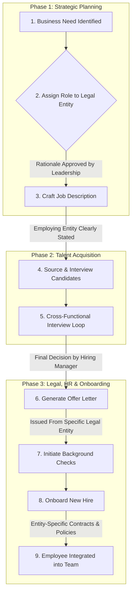

# Strategic Hiring & Onboarding Framework - Dual-Chain Smart Contract Operations

**Document Version**: 2.0  
**Date**: January 2025  
**Status**: Final, Implementation Ready - Dual-Chain Integration  
**Owner**: Chief Compliance Officer & Head of People  
**Objective**: To provide the definitive framework for all hiring and onboarding activities across the Parametrigger Inc. group of companies, ensuring strategic alignment with our dual-chain smart contract operations, legal structure and regulatory advantages.

---

## 1. Executive Summary & Core Principle

Our hiring philosophy is a direct extension of our corporate strategy, particularly as we deploy and operate dual-chain smart contracts on Ethereum and Base. We do not hire all employees into a single parent company. Instead, **every role is hired by the specific legal entity whose function, jurisdiction, and liability it directly serves.**

This principle of **Entity-Based Hiring** is not administrative overhead; it is the operational execution of our regulatory firewall. It is fundamental to:
- **Preserving Regulatory Arbitrage**: Maintaining the legal separation that underpins our $1.05M - $4.5M annual arbitrage value across dual-chain operations.
- **Isolating Smart Contract Liability**: Ensuring that risks associated with smart contract development and blockchain operations are properly isolated within Parametrigger Inc.
- **Isolating Operational Liability**: Ensuring that risks associated with business functions (e.g., insurance underwriting) do not contaminate the parent company or smart contract operations.
- **Ensuring Dual-Chain Compliance**: Aligning employment with the correct legal and tax frameworks for blockchain operations in different jurisdictions (e.g., Nevada vs. Estonia).
- **Creating Corporate Clarity**: Building a clean, auditable structure for investors, regulators, and potential acquirers that clearly separates smart contract ownership from operational risks.

Adherence to this framework is mandatory for all hiring managers and executives.

---

## 2. The Hiring Process Framework

This end-to-end process ensures every new hire reinforces our strategic corporate structure.

---

## 3. Detailed Step-by-Step Hiring Process

### Step 1: Identify the Need
- A team lead identifies a requirement for a new role and drafts a business case.

### Step 2: Assign to Legal Entity (Critical Gate)
- Before any external posting, leadership must approve the assignment of the role to a specific legal entity based on the following criteria:
    - **Primary Function**: Does the role build the core platform, sell insurance, analyze risk data, or manage travel partnerships?
    - **Jurisdiction**: Will the employee primarily operate in the US, EU, or globally?
    - **Data Access**: What is the primary type of data the role will handle (e.g., PII of US insurance customers, internal risk models, platform source code)?
    - **Liability Focus**: If this role's actions lead to a legal or financial issue, which entity should logically and legally bear that liability?

### Step 3: Craft Job Description
- The job description must include a clear, unambiguous statement identifying the hiring entity.
- *Example: "This is a full-time position with **Triggerr Direct LLC**, a US-based subsidiary of Parametrigger Inc. You will be an employee of Triggerr Direct LLC."*

### Step 4: Source & Interview
- Talent Acquisition sources candidates. The hiring manager for the role must be an employee of the same target legal entity.
- Interview loops can be cross-functional, involving stakeholders from other entities, but the direct reporting line will remain within a single entity.

### Step 5: Offer Letter & Employment Agreement
- The official offer letter is generated using the template specific to the hiring entity (e.g., `Triggerr Direct LLC Offer Letter.docx`).
- The employment agreement is specific to the entity and its jurisdiction (e.g., Nevada employment law for US entities, Estonian law for Parametrigger OÜ).

### Step 6: Onboarding
- The new hire is onboarded into the systems (HRIS, payroll) associated with their specific legal entity.
- Onboarding includes a mandatory session on the corporate legal structure.

---

## 4. Role-to-Entity Mapping Guide

This guide is the source of truth for assigning roles. Exceptions require written approval from the CEO and Chief Compliance Officer.

| Role Title | Hiring Entity | Rationale & Justification |
| :--- | :--- | :--- |
| **CEO, CFO, CTO, General Counsel** | **Parametrigger Inc.** | Corporate officers overseeing the entire group. Their function and liability are at the parent level. |
| **Core Platform Engineer / DevOps**| **Parametrigger Inc.** | Builds and maintains the shared technology infrastructure used by all subsidiaries. Not tied to a specific product line. |
| **Chief Compliance Officer** | **Parametrigger Inc.** | A corporate function that sets policy for all subsidiaries but is employed by the parent to maintain independence. |
| **Senior Solidity Engineer** | **Parametrigger Inc.** | Develops and maintains dual-chain smart contracts on Ethereum and Base. Owns smart contract IP and technical architecture. |
| **Blockchain Security Auditor** | **Parametrigger Inc.** | Conducts internal security reviews of smart contracts before external audits. Ensures compliance with security best practices across both networks. |
| **Smart Contract DevOps Engineer** | **Parametrigger Inc.** | Manages dual-chain deployment pipelines, monitoring, and upgrade mechanisms for Ethereum and Base smart contracts. |
| **Solidity Engineer (Dual-Chain)** | **Parametrigger Inc.** | Develops and maintains smart contracts on Ethereum and Base. Smart contract IP and liability must remain with the parent company to protect subsidiary operations. |
| **Smart Contract Security Auditor** | **Parametrigger Inc.** | Reviews and audits dual-chain smart contract security. Critical function that must be independent from operational subsidiaries to maintain audit integrity. |
| **Blockchain Protocol Engineer** | **Parametrigger Inc.** | Builds chain abstraction layer and cross-chain infrastructure. Core technology platform function supporting all subsidiaries. |
| **Smart Contract Architect** | **Parametrigger Inc.** | Designs upgradeable contract patterns and dual-chain deployment strategies. Senior technical role responsible for smart contract IP architecture. |
| **Product Marketing Manager (US)** | **Triggerr Direct LLC** | Directly responsible for acquiring customers for the `Triggerr` consumer insurance product in the US market. |
| **US Customer Support Rep** | **Triggerr Direct LLC** | Interacts directly with US insurance policyholders, handling their PII under US regulations. |
| **Blockchain Operations Specialist** | **Triggerr Direct LLC** | Manages dual-chain escrow operations, monitors smart contract performance, and handles blockchain-related customer support. |
| **Data Scientist (Risk Modeling)** | **Parametrigger Financial Solutions Inc.** | Analyzes sensitive risk and flight data. This function is firewalled from the consumer business to act as a B2B service provider. |
| **External API Integration Engineer** | **Parametrigger Financial Solutions Inc.**| Works on the data aggregation layer, a core function of the internal risk-analysis service provider. |
| **DeFi Integration Engineer** | **Parametrigger Financial Solutions Inc.** | Develops and maintains integrations with DeFi protocols (Morpho Blue, Base lending) for yield generation and liquidity management. |
| **DeFi Integration Specialist** | **Parametrigger Financial Solutions Inc.** | Manages PolicyFund DeFi operations across Ethereum and Base. Financial services function requiring specialized regulatory framework. |
| **EU Sales Director / Manager** | **Parametrigger OÜ** | Operates within the EU jurisdiction and is responsible for EU market growth under EU regulations. |
| **EU Customer Support Rep**| **Parametrigger OÜ** | Handles PII for EU customers under GDPR, employed by the EU-based legal entity. |
| **Travel Partnership Manager**| **FlightHub Connect LLC**| Role is dedicated to the non-insurance travel vertical, isolating its operations and liabilities. |

---

## 5. Required Systems, Tools & Documentation

To execute this framework professionally, including dual-chain smart contract operations, the following must be in place:

1.  **HRIS / PEO (Professional Employer Organization)**:
    - **Tool**: We will use a service like **Deel**, **Rippling**, or **TriNet**.
    - **Configuration**: Each legal entity (`Parametrigger Inc.`, `Triggerr Direct LLC`, etc.) will be registered as a separate client company within the PEO. This is non-negotiable and ensures clean payroll, tax, and benefits administration per entity.
    - **Smart Contract Personnel**: Special consideration for blockchain engineers requiring enhanced security clearance and hardware security key management.

2.  **Applicant Tracking System (ATS)**:
    - **Tool**: A system like **Greenhouse** or **Lever**.
    - **Configuration**: Job openings must be configured with mandatory custom fields: `Hiring Legal Entity` and `Blockchain Security Clearance Level`.

3.  **Entity-Specific Document Templates**:
    - Offer Letter Templates (one for each legal entity).
    - Employment Agreement Templates (tailored to Nevada and Estonian law).
    - Employee Handbook with entity-specific addenda.
    - **Smart Contract IP Assignment Agreements**: Special agreements for blockchain engineers ensuring smart contract IP remains with Parametrigger Inc.
    - **Enhanced NDAs**: Additional confidentiality provisions for smart contract development and private key management.
    - **Security Protocols**: Hardware security key management and multi-signature wallet access protocols for blockchain personnel.

---

## 6. Financial & Strategic Implications

### Budgets & Payroll
- Each legal entity maintains its own headcount budget and P&L statement.
- The PEO will run distinct payrolls for each entity, ensuring clean financial records for tax and audit purposes.
- **Smart Contract Personnel**: Premium compensation packages for blockchain engineers reflecting specialized skills and security responsibilities.

### Stock Options
- To foster a unified culture and shared sense of ownership, stock options will be granted to all employees from the parent company, **Parametrigger Inc.**
- The grant agreement will clearly state the relationship between the parent company (grantor) and the subsidiary (employer).
- **Smart Contract Developers**: Additional equity incentives tied to successful smart contract deployments and security milestones to retain critical blockchain talent.
- **Enhanced Equity**: Additional equity consideration for smart contract engineers whose work directly creates valuable IP for Parametrigger Inc.

### Onboarding
- The onboarding process, managed by the People team, must include a dedicated module titled "Our Corporate Structure: How We Protect Our Business."
- This module will explain the rationale behind the entity separation and the employee's role within it.
- **Blockchain Developer Onboarding**: Additional modules covering smart contract security best practices, dual-chain architecture, and intellectual property responsibilities for blockchain development roles.
- **Blockchain Security Training**: Mandatory security training for smart contract personnel covering private key management, multi-signature protocols, and incident response procedures.
- **Smart Contract Governance**: Training on upgrade procedures, audit processes, and regulatory compliance for dual-chain operations.

---

## 7. Conclusion

This entity-based hiring framework is a cornerstone of our corporate strategy. It transforms a standard administrative process into a powerful tool for risk mitigation and value preservation. By strictly adhering to this framework, we ensure our organizational growth systematically reinforces the legal and regulatory architecture that gives us our competitive edge.