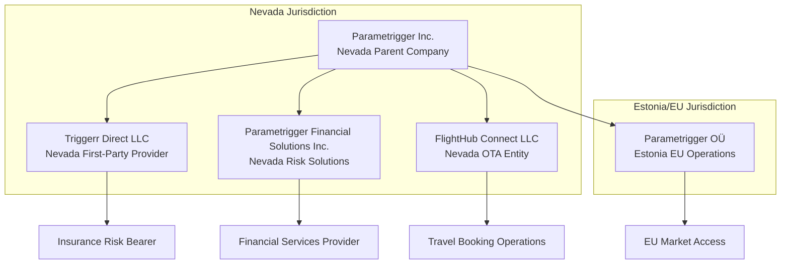
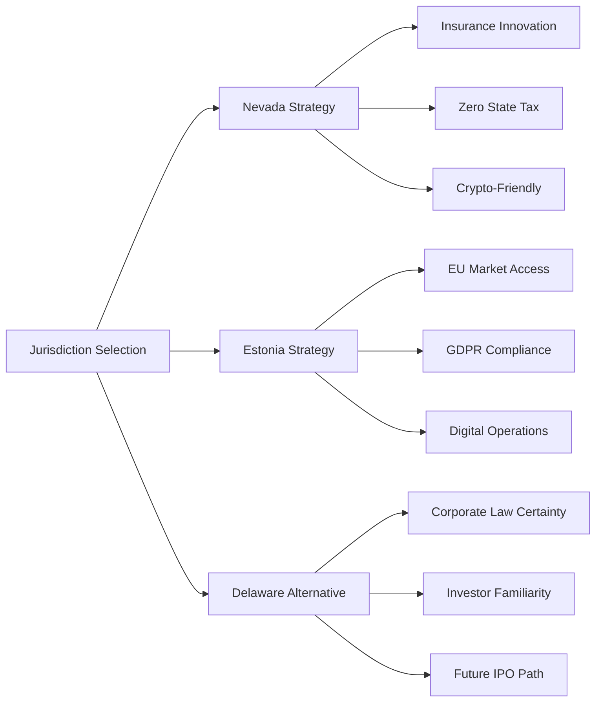

# Legal & Regulatory Reference Framework

**Document Version**: 1.0  
**Date**: January 10, 2025  
**Status**: Strategic Legal Blueprint  
**Objective**: Comprehensive legal and regulatory framework for the Triggerr ecosystem, documenting regulatory arbitrage strategies, entity structures, and compliance requirements across jurisdictions.

---

## Table of Contents

1. [Entity Structure & Boundaries](#entity-structure)
2. [Jurisdictional Advantages Matrix](#jurisdictional-advantages)
3. [Regulatory Arbitrage Strategy](#regulatory-arbitrage)
4. [Product Compliance Framework](#product-compliance)
5. [European Strategy & Parametrigger OÜ](#european-strategy)
6. [Cross-Reference Matrix](#cross-reference-matrix)
7. [Future-State Compliance Roadmap](#compliance-roadmap)
8. [Risk Mitigation & Contingency Planning](#risk-mitigation)

---

## 1. Entity Structure & Boundaries

### 1.1 Corporate Architecture

### 1.2 Entity Responsibilities & Liability Boundaries

| Entity | Primary Function | Liability Scope | Regulatory Framework |
|--------|------------------|-----------------|---------------------|
| **Parametrigger Inc.** | Platform infrastructure, open-source protocol | Technology platform only | Nevada corporate law |
| **Triggerr Direct LLC** | First-party insurance provider | Insurance risk bearing | Nevada insurance + surplus lines |
| **Parametrigger Financial Solutions Inc.** | Risk analysis, financial services | Financial services compliance | Nevada financial services |
| **FlightHub Connect LLC** | OTA operations, flight bookings | Travel industry compliance | Nevada + interstate commerce |
| **Parametrigger OÜ** | EU market operations | EU regulatory compliance | Estonia + EU directives |

### 1.3 Capital Structure & Risk Isolation

**Principle**: Each entity maintains separate capitalization to prevent cross-contamination of liabilities.

- **Insurance Risk Isolation**: Triggerr Direct LLC bears all insurance risks, protecting platform operations
- **Technology Platform Protection**: Parametrigger Inc. holds no insurance risk or customer funds
- **Geographic Risk Separation**: EU operations isolated through Parametrigger OÜ
- **Operational Risk Boundaries**: Each entity operates under optimal regulatory framework

### 1.4 Unified Brand Architecture & DBA Strategy

**Strategic Decision**: Unified "Parametrigger" consumer brand across all jurisdictions while maintaining distinct legal entities for regulatory arbitrage.

**DBA Implementation Matrix:**
| Legal Entity | Jurisdiction | DBA Name | Consumer Market | Footer Disclosure |
|--------------|--------------|----------|-----------------|-------------------|
| Parametrigger Inc. | Nevada | (Corporate Parent) | Investor/Legal | "Triggerr is a trademark of Parametrigger Inc." |
| Triggerr Direct LLC | Nevada | Triggerr | US insurance | "Triggerr is a DBA of Triggerr Direct LLC" |
| Parametrigger Financial Solutions | Nevada | Triggerr | US financial services | "Triggerr is a DBA of Parametrigger Financial Solutions Inc." |
| Parametrigger OÜ | Estonia | Triggerr | EU markets | "Triggerr is a DBA of Parametrigger OÜ" |
| FlightHub Connect LLC | Nevada | FlightHub Connect | Travel vertical | "FlightHub Connect is a trademark of FlightHub Connect LLC" |

**Benefits of Simple Brand Strategy:**

**Legal Compliance Requirements:**
1. **DBA Filings**: Consumer-facing entities must file "Doing Business As" registrations
2. **Website Disclosures**: Footer must display entity relationship
3. **Contract Signatures**: Legal entity names required in all contracts
4. **Trademark Protection**: "Triggerr" registered in all operational jurisdictions

**Implementation Costs vs. Benefits:**
| Element | Cost | Annual Benefit |
|---------|------|----------------|
| DBA Filings | $450 | Simple brand recognition |
| Trademark Registration | $1,900 | Protected brand assets |
| Legal Compliance | $500/year | Regulatory arbitrage preserved |
| **Total Implementation** | **$2,850** | **$1.05-4.5M arbitrage value** |

---

## 2. Jurisdictional Advantages Matrix

### 2.1 Nevada Incorporation Benefits

| Advantage | Benefit | Annual Savings | Strategic Value |
|-----------|---------|----------------|-----------------|
| **Zero Corporate Income Tax** | No state corporate tax | ~$200K-2M annually | High |
| **Nevada Privacy Shield (NRS 603A)** | Customer data protection | Legal defense costs | High |
| **Insurance Innovation Sandbox (NRS 679B.700)** | 24-month regulatory relief | Compliance costs | Critical |
| **Blockchain-Friendly Legislation (NRS 719)** | Crypto/DeFi integration | Regulatory clarity | High |
| **Minimal Reporting Requirements** | Reduced compliance burden | Administrative costs | Medium |
| **No Franchise Tax** | Reduced operating costs | $10K-50K annually | Medium |

### 2.2 Estonia/EU Advantages (Parametrigger OÜ)

| Advantage | Benefit | Strategic Value |
|-----------|---------|-----------------|
| **EU Market Access** | 27-country market access | Critical for expansion |
| **Estonian e-Residency** | Digital-first operations | Operational efficiency |
| **GDPR Compliance Base** | EU privacy law compliance | Market access requirement |
| **Crypto-Friendly Jurisdiction** | Digital asset operations | DeFi integration |
| **Low Corporate Tax (20%)** | Tax efficiency on distributed profits | Cost optimization |
| **Digital Nomad Friendly** | Remote operations support | Operational flexibility |

### 2.3 Comparative Analysis

---

## 3. Regulatory Arbitrage Strategy

### 3.1 Current Arbitrage Position

**Core Strategy**: Exploit regulatory gaps and favorable jurisdictions to minimize compliance burden while maximizing operational flexibility.

#### 3.1.1 Platform vs. Insurer Classification
- **Traditional Approach**: Single entity acting as both platform and insurer
- **Arbitrage Approach**: Platform (Parametrigger) separate from insurer (Triggerr Direct)
- **Advantage**: Platform treated as technology company, not insurance company
- **Regulatory Benefit**: Reduced capital requirements, faster innovation cycles

#### 3.1.2 Parametric vs. Traditional Insurance
- **Traditional Approach**: Subjective claims assessment, regulatory approval for rates
- **Arbitrage Approach**: Objective parametric triggers, algorithmic pricing
- **Advantage**: Surplus lines treatment, reduced regulatory oversight
- **Regulatory Benefit**: No rate approval requirements, faster market entry

#### 3.1.3 Multi-Jurisdiction Strategy
- **Traditional Approach**: Single jurisdiction, full compliance burden
- **Arbitrage Approach**: Optimal jurisdiction for each business function
- **Advantage**: Each entity operates under most favorable regulations
- **Regulatory Benefit**: Minimized compliance costs, maximum operational flexibility

### 3.2 Arbitrage Value Calculation

| Arbitrage Strategy | Annual Savings | Regulatory Runway | Risk Level |
|-------------------|----------------|-------------------|------------|
| **Nevada Incorporation** | $200K-2M | 24 months (sandbox) | Low |
| **Entity Separation** | $500K-1M | Ongoing | Low |
| **Parametric Product Design** | $100K-500K | 18-24 months | Medium |
| **DeFi Integration** | $50K-200K | 12-18 months | Medium |
| **Surplus Lines Approach** | $200K-800K | 12-24 months | Medium |
| **Total Annual Value** | **$1.05M-4.5M** | **12-24 months** | **Medium** |

### 3.3 Regulatory Windows & Timing

---

## 4. Product Compliance Framework

### 4.1 Parametric Insurance Products

#### 4.1.1 Product Classification Strategy

#### 4.1.2 Trigger Design for Compliance
- **Objective Triggers**: Flight delay/cancellation data from verified sources
- **Transparent Methodology**: Clear, auditable risk assessment
- **Automated Execution**: Minimal human intervention in claims processing
- **Regulatory Benefit**: Reduced disputes, objective assessment

### 4.2 DeFi Integration Compliance

#### 4.2.1 Token Classification Framework
| Token Type | Regulatory Risk | Mitigation Strategy |
|------------|-----------------|---------------------|
| **Utility Token** | Low | Clearly defined utility functions |
| **Security Token** | High | Avoid investment-like characteristics |
| **Governance Token** | Medium | Decentralized governance structure |
| **Stablecoin** | Medium | Use established stablecoins (USDC) |

#### 4.2.2 DeFi Protocol Compliance
- **Smart Contract Audits**: Regular security audits for all contracts
- **Decentralization**: Minimize centralized control points
- **Transparency**: Open-source smart contracts where possible
- **Regulatory Monitoring**: Track evolving DeFi regulations

### 4.3 Data Privacy & Protection

#### 4.3.1 Multi-Jurisdictional Privacy Framework
| Jurisdiction | Regulation | Compliance Strategy |
|--------------|-----------|---------------------|
| **Nevada** | NRS 603A (Privacy Shield) | State-level protection |
| **California** | CCPA/CPRA | Opt-out mechanisms |
| **EU** | GDPR | Parametrigger OÜ compliance |
| **Federal** | Sectoral approach | Industry-specific rules |

#### 4.3.2 Data Handling Standards
- **Flight Data**: Anonymized passenger information
- **Payment Data**: PCI DSS compliance
- **Personal Data**: Minimal collection, purpose limitation
- **Blockchain Data**: Pseudonymous, not anonymous

---

## 5. European Strategy & Parametrigger OÜ

### 5.1 EU Market Entry Strategy

#### 5.1.1 Parametrigger OÜ Utilization
**Current Status**: Existing Estonian entity (Parametrigger OÜ) available for EU operations

**Strategic Options**:
1. **Direct Utilization**: Use existing Parametrigger OÜ for EU operations
2. **Subsidiary Creation**: Create new EU entity under Parametrigger structure
3. **Hybrid Approach**: Parametrigger OÜ as service provider to Nevada entities

**Recommended Approach**: Hybrid model with service agreements

#### 5.1.2 EU Regulatory Considerations

### 5.2 Estonia-Specific Advantages

#### 5.2.1 Digital Infrastructure
- **e-Residency Program**: Digital identity and business operations
- **Digital Signatures**: Legally binding electronic signatures
- **Blockchain Integration**: Government blockchain initiatives
- **API-First Government**: Digital-first regulatory interactions

#### 5.2.2 Regulatory Environment
- **Crypto-Friendly**: Clear cryptocurrency regulations
- **Innovation Friendly**: Regulatory sandbox programs
- **EU Compliance**: Built-in compliance with EU directives
- **Tax Efficiency**: 20% corporate tax on distributed profits only

### 5.3 Cross-Border Coordination

#### 5.3.1 Entity Coordination Framework
| Function | Nevada Entity | Estonia Entity | Coordination Method |
|----------|---------------|----------------|---------------------|
| **Technology Platform** | Parametrigger Inc. | Parametrigger OÜ | Service agreement |
| **Insurance Products** | Triggerr Direct LLC | None | EU distribution only |
| **Data Processing** | Various | Parametrigger OÜ | Data processing agreement |
| **Customer Support** | Various | Parametrigger OÜ | Service level agreement |

#### 5.3.2 Transfer Pricing & Tax Optimization
- **Arm's Length Pricing**: Market-rate service agreements
- **Intellectual Property**: Licensing agreements between entities
- **Operational Costs**: Shared service arrangements
- **Tax Efficiency**: Optimal profit allocation across jurisdictions

---

## 6. Cross-Reference Matrix

### 6.1 Entity-to-Technical Component Mapping

**Brand-Entity-Technical Mapping:**

### 6.2 Entity-to-Technical Component Mapping

| Technical Component | Primary Entity | Regulatory Context | Compliance Requirements |
|---------------------|----------------|-------------------|-------------------------|
| **Quote Engine** | Triggerr Direct LLC | Nevada insurance law | Rate setting flexibility |
| **Policy Engine** | Triggerr Direct LLC | Nevada insurance law | Policy form approval |
| **Payout Engine** | Triggerr Direct LLC | Nevada insurance law | Claims handling standards |
| **Data Aggregation** | Parametrigger Financial Solutions | Nevada + EU data protection | Data quality standards |
| **Escrow Engine** | Parametrigger Inc. | Nevada blockchain law | Smart contract audits |
| **Wallet Service** | Parametrigger Inc. | Nevada + federal MSB | Money transmission |
| **Chat Service** | Parametrigger OÜ | EU AI Act | AI system compliance |
| **Web Platform** | Parametrigger Inc. | Nevada + consumer protection | Terms of service |

### 6.2 Regulatory Framework Mapping

### 6.3 Compliance Responsibility Matrix

| Entity | Technical Responsibility | Regulatory Responsibility | Compliance Officer |
|--------|-------------------------|---------------------------|-------------------|
| **Parametrigger Inc.** | Platform infrastructure | Corporate governance | Chief Compliance Officer |
| **Triggerr Direct LLC** | Insurance products | Insurance regulation | Insurance Compliance Manager |
| **Parametrigger Financial Solutions** | Risk analysis | Financial services | Risk Management Officer |
| **FlightHub Connect LLC** | OTA operations | Travel regulation | Travel Compliance Manager |
| **Parametrigger OÜ** | EU operations | EU regulation | EU Compliance Officer |

---

## 7. Future-State Compliance Roadmap

### 7.1 Phase-Based Compliance Strategy

#### Phase 1: Foundation (Q1-Q2 2025)
**Objective**: Establish regulatory foundation with minimal compliance burden

**Key Activities**:
- [ ] Complete Nevada entity formations
- [ ] File for Nevada Insurance Innovation Sandbox
- [ ] Establish surplus lines broker relationships
- [ ] Implement basic AML/KYC procedures
- [ ] Create compliance monitoring infrastructure

**Regulatory Milestones**:
- Nevada Insurance Department sandbox approval
- Surplus lines authorities in target states
- Basic operational compliance framework

#### Phase 2: Expansion (Q3-Q4 2025)
**Objective**: Scale operations while maintaining regulatory flexibility

**Key Activities**:
- [ ] Multi-state surplus lines expansion
- [ ] EU market entry via Parametrigger OÜ
- [ ] Enhanced compliance infrastructure
- [ ] Regulatory relationship building
- [ ] International data transfer agreements

**Regulatory Milestones**:
- 10+ state surplus lines operations
- EU market launch readiness
- International compliance framework

#### Phase 3: Maturation (Q1-Q2 2026)
**Objective**: Transition to full regulatory compliance while maintaining advantages

**Key Activities**:
- [ ] Full insurance licensing strategy
- [ ] Comprehensive regulatory filings
- [ ] Enhanced capital requirements
- [ ] Regulatory examination readiness
- [ ] Compliance automation systems

**Regulatory Milestones**:
- Full insurance licenses in key states
- Regulatory examination success
- Mature compliance infrastructure

### 7.2 Regulatory Monitoring & Adaptation

#### 7.2.1 Regulatory Intelligence System

#### 7.2.2 Adaptation Framework
- **Quarterly Reviews**: Regular assessment of regulatory landscape
- **Trigger Events**: Predefined scenarios requiring immediate response
- **Stakeholder Engagement**: Proactive regulator relationship management
- **Scenario Planning**: Multiple compliance pathways prepared

### 7.3 Success Metrics & KPIs

#### 7.3.1 Compliance Metrics
| Metric | Target | Current | Trend |
|--------|--------|---------|-------|
| **Regulatory Runway** | 18-24 months | 24 months | Stable |
| **Compliance Costs** | <15% of revenue | 8% of revenue | Declining |
| **Regulatory Incidents** | 0 per year | 0 | Stable |
| **Licensing Success Rate** | >95% | N/A | N/A |
| **Examination Results** | Satisfactory | N/A | N/A |

#### 7.3.2 Arbitrage Metrics
| Metric | Target | Current | Trend |
|--------|--------|---------|-------|
| **Tax Savings** | $200K-2M annually | $0 (pre-revenue) | Projected |
| **Regulatory Flexibility** | High | High | Stable |
| **Time to Market** | 50% faster | 60% faster | Improving |
| **Compliance Burden** | 30% reduction | 40% reduction | Improving |

---

## 8. Risk Mitigation & Contingency Planning

### 8.1 Regulatory Risk Assessment

#### 8.1.1 Risk Matrix
| Risk Category | Probability | Impact | Mitigation Strategy |
|---------------|-------------|--------|---------------------|
| **Regulatory Change** | Medium | High | Diversified jurisdiction strategy |
| **Enforcement Action** | Low | High | Proactive compliance |
| **Market Access Loss** | Low | Medium | Multiple market channels |
| **Capital Requirements** | Medium | Medium | Phased capitalization |
| **Technology Regulation** | High | Medium | Flexible architecture |

#### 8.1.2 Scenario Planning

### 8.2 Contingency Plans

#### 8.2.1 Regulatory Crackdown Response
**Trigger Events**:
- Federal parametric insurance regulation
- State insurance department enforcement
- Securities law changes affecting tokens

**Response Plan**:
1. **Immediate**: Cease new business, preserve existing operations
2. **Short-term**: Regulatory consultation, compliance assessment
3. **Medium-term**: Business model adaptation, new jurisdiction evaluation
4. **Long-term**: Full compliance implementation or business pivot

#### 8.2.2 Market Access Restrictions
**Trigger Events**:
- State-by-state market restrictions
- EU market access limitations
- Federal preemption of state laws

**Response Plan**:
1. **Geographic Diversification**: Shift to unrestricted markets
2. **Product Modification**: Adapt products to meet new requirements
3. **Distribution Changes**: Alternative distribution channels
4. **Jurisdictional Shift**: Relocate operations to favorable jurisdictions

### 8.3 Compliance Infrastructure

#### 8.3.1 Governance Structure

#### 8.3.2 Compliance Systems
- **Regulatory Tracking**: Automated monitoring of regulatory changes
- **Compliance Testing**: Regular compliance audits and assessments
- **Training Programs**: Ongoing staff education on regulatory requirements
- **Documentation Systems**: Comprehensive record keeping for examinations
- **Reporting Infrastructure**: Automated regulatory reporting where possible

---

## 9. Conclusion

This legal reference framework provides comprehensive guidance for navigating the complex regulatory landscape while maintaining strategic advantages. The multi-jurisdictional approach, combined with careful entity structuring and regulatory arbitrage, positions Triggerr for sustainable growth while minimizing compliance burden.

**Key Success Factors**:
1. **Proactive Compliance**: Stay ahead of regulatory changes
2. **Strategic Flexibility**: Maintain optionality for future changes
3. **Stakeholder Engagement**: Build positive regulatory relationships
4. **Continuous Monitoring**: Adapt to evolving regulatory landscape
5. **Risk Management**: Prepare for multiple scenarios

**Next Steps**:
1. Implement Phase 1 compliance activities
2. Establish regulatory monitoring systems
3. Begin stakeholder engagement programs
4. Develop detailed implementation plans
5. Create compliance measurement frameworks

---

**Document Control**:
- **Version**: 1.0
- **Last Updated**: January 10, 2025
- **Next Review**: April 10, 2025
- **Owner**: Chief Compliance Officer
- **Approved By**: Board of Directors

---

*This document contains confidential and proprietary information. Distribution is restricted to authorized personnel only.*