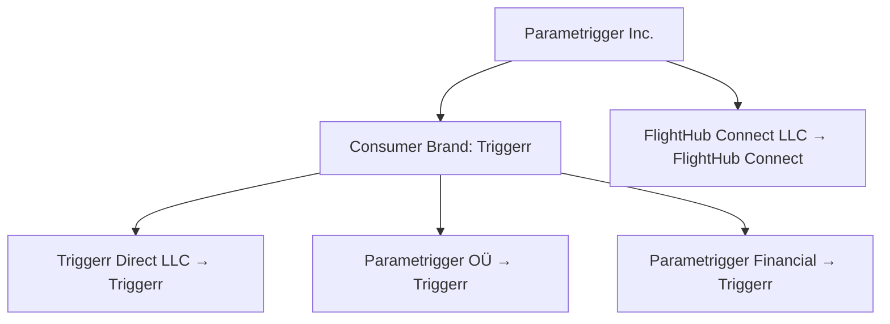
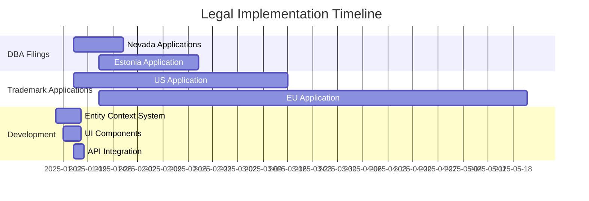

# Trademark & DBA Implementation Guide

**Document Version**: 1.0  
**Date**: January 10, 2025  
**Status**: Implementation Ready  
**Objective**: Comprehensive guide for implementing unified Parametrigger brand strategy across all legal entities while preserving regulatory arbitrage advantages

---

## 1. Executive Summary

### 1.1 Strategic Decision
**Simple Brand Architecture**: Implement "Triggerr" as the primary consumer-facing brand across all jurisdictions, with "Parametrigger Inc." as the corporate parent company, while maintaining distinct legal entities for regulatory arbitrage.

### 1.2 Key Benefits
- **Consumer Clarity**: "Triggerr" is short, memorable, and clearly connects to value proposition
- **Marketing Efficiency**: One consumer brand message across all markets
- **SEO Authority**: Consolidated search presence and domain authority
- **Cost Optimization**: Single consumer trademark portfolio
- **Regulatory Preservation**: Maintains $1.05-4.5M annual arbitrage value

### 1.3 Implementation Cost vs. ROI
| Element | Cost | Annual Benefit |
|---------|------|----------------|
| DBA Filings | $450 | Simple brand recognition |
| Trademark Registration | $1,900 | Protected brand assets |
| Legal Compliance | $500/year | Regulatory arbitrage preserved |
| **Total Implementation** | **$2,850** | **$1.05-4.5M arbitrage value** |
| **ROI** | **37,000%** | **First year return** |

---

## 2. Brand Architecture Framework

### 2.1 Simple Brand Structure


### 2.2 Entity-Brand Mapping
| Legal Entity | Jurisdiction | DBA Name | Consumer Market | Primary Function |
|--------------|--------------|----------|-----------------|------------------|
| Parametrigger Inc. | Nevada | (Corporate Parent) | Investor/Legal | Technology platform |
| Triggerr Direct LLC | Nevada | Triggerr | US insurance | Insurance provider |
| Parametrigger Financial Solutions | Nevada | Triggerr | US financial services | Risk analysis |
| Parametrigger OÜ | Estonia | Triggerr | EU markets | EU operations |
| FlightHub Connect LLC | Nevada | FlightHub Connect | Travel vertical | OTA operations |

### 2.3 Brand Hierarchy
- **Consumer Brand**: Triggerr (insurance, risk, platform)
- **Corporate Parent**: Parametrigger Inc. (legal/investor contexts)
- **Vertical Brand**: FlightHub Connect (travel booking)
- **Legal Entities**: Maintained for regulatory compliance
- **Consumer Experience**: Single "Triggerr" brand across all touchpoints

---

## 3. Legal Implementation Requirements

### 3.1 DBA Filing Requirements

#### 3.1.1 Nevada DBA Filings
**Entities Requiring DBA Registration:**
- Triggerr Direct LLC → DBA: "Triggerr"
- Parametrigger Financial Solutions Inc. → DBA: "Triggerr"

**Filing Details:**
- **Cost**: $150 per entity
- **Timeline**: 2-3 weeks processing
- **Renewal**: Required every 5 years
- **Authority**: Nevada Secretary of State
- **Link**: https://www.nvsos.gov/sos/businesses

#### 3.1.2 Estonia DBA Filing
**Entity:**
- Parametrigger OÜ → DBA: "Triggerr"

**Filing Details:**
- **Cost**: €100
- **Timeline**: 4-6 weeks processing
- **Renewal**: Not required unless changes
- **Authority**: Estonian Business Register
- **Link**: https://ettevotjaportaal.rik.ee

### 3.2 Trademark Registration Strategy

#### 3.2.1 US Trademark Application
**Mark**: "Triggerr"
- **Class**: 36 (Insurance and Financial Services)
- **Cost**: $350 per class
- **Timeline**: 8-12 months
- **Authority**: USPTO
- **Link**: https://www.uspto.gov/trademarks

**Application Details:**
- **Goods/Services**: Parametric insurance services, risk transfer marketplace, financial technology platform
- **First Use**: TBD (upon launch)
- **Basis**: Intent to Use (1(b))

#### 3.2.2 EU Trademark Application
**Mark**: "Triggerr"
- **Class**: 36 (Insurance and Financial Services)
- **Cost**: €1,200 base fee
- **Timeline**: 4-6 months
- **Authority**: EUIPO
- **Link**: https://euipo.europa.eu/

#### 3.2.3 Travel Vertical Trademark
**Mark**: "FlightHub Connect"
- **Class**: 39 (Travel and Transportation Services)
- **Cost**: $350 (US) + €1,200 (EU)
- **Timeline**: 8-12 months
- **Rationale**: Separate vertical brand for OTA operations

### 3.3 Compliance Requirements

#### 3.3.1 Website Footer Disclosures
**Required Legal Text:**
```html
<!-- US Operations -->
<footer class="legal-disclosure">
  Triggerr is a DBA of Triggerr Direct LLC (Nevada)
</footer>

<!-- EU Operations -->
<footer class="legal-disclosure">
  Triggerr is a DBA of Parametrigger OÜ (Estonia)
</footer>

<!-- Platform Operations -->
<footer class="legal-disclosure">
  Triggerr is a trademark of Parametrigger Inc.
</footer>
```

#### 3.3.2 Contract Signature Requirements
**Legal Entity Names Required:**
- All contracts must be signed with full legal entity names
- DBA names acceptable for marketing materials only
- Insurance policies must display licensed entity name

#### 3.3.3 Regulatory Disclosures
**Insurance Disclosures:**
- "Insurance provided by Triggerr Direct LLC"
- License numbers and regulatory contact information
- Surplus lines disclosures where applicable

---

## 4. Technical Implementation

### 4.1 Entity Context System
```typescript
// packages/core/src/utils/entity-context.ts
export interface EntityBranding {
  legal: string;
  brand: string;
  jurisdiction: string;
  footer: string;
  disclosure: string;
}

export function getEntityBranding(jurisdiction: 'US' | 'EU' | 'GLOBAL'): EntityBranding {
  const brandingMap = {
    US: {
      legal: 'Triggerr Direct LLC',
      brand: 'Triggerr',
      jurisdiction: 'Nevada, USA',
      footer: 'Triggerr is a DBA of Triggerr Direct LLC',
      disclosure: 'Insurance provided by Triggerr Direct LLC (Nevada)'
    },
    EU: {
      legal: 'Parametrigger OÜ',
      brand: 'Triggerr',
      jurisdiction: 'Estonia, EU',
      footer: 'Triggerr is a DBA of Parametrigger OÜ',
      disclosure: 'Services provided by Parametrigger OÜ (Estonia)'
    },
    GLOBAL: {
      legal: 'Parametrigger Inc.',
      brand: 'Triggerr',
      jurisdiction: 'Nevada, USA',
      footer: 'Triggerr is a trademark of Parametrigger Inc.',
      disclosure: 'Platform operated by Parametrigger Inc. (Nevada)'
    }
  };
  
  return brandingMap[jurisdiction];
}
```

### 4.2 React Component Implementation
```typescript
// apps/web/src/components/EntityFooter.tsx
import { getEntityBranding } from '@triggerr/core';

interface EntityFooterProps {
  jurisdiction: 'US' | 'EU' | 'GLOBAL';
  showDisclosure?: boolean;
}

export function EntityFooter({ jurisdiction, showDisclosure = false }: EntityFooterProps) {
  const branding = getEntityBranding(jurisdiction);
  
  return (
    <footer className="entity-footer">
      <div className="legal-disclosure">
        {branding.footer}
      </div>
      {showDisclosure && (
        <div className="regulatory-disclosure">
          {branding.disclosure}
        </div>
      )}
    </footer>
  );
}
```

### 4.3 API Response Integration
```typescript
// API responses include entity context
interface ApiResponse<T> {
  data: T;
  entity: EntityBranding;
  timestamp: string;
}

// Usage in API handlers
export function createApiResponse<T>(data: T, jurisdiction: 'US' | 'EU' | 'GLOBAL'): ApiResponse<T> {
  return {
    data,
    entity: getEntityBranding(jurisdiction),
    timestamp: new Date().toISOString()
  };
}
```

### 4.4 Jurisdiction Detection Middleware
```typescript
// apps/web/src/middleware/jurisdiction-detector.ts
export function detectJurisdiction(request: Request): 'US' | 'EU' | 'GLOBAL' {
  const country = request.headers.get('CF-IPCountry') || 'US';
  const euCountries = ['AT', 'BE', 'BG', 'HR', 'CY', 'CZ', 'DK', 'EE', 'FI', 'FR', 'DE', 'GR', 'HU', 'IE', 'IT', 'LV', 'LT', 'LU', 'MT', 'NL', 'PL', 'PT', 'RO', 'SK', 'SI', 'ES', 'SE'];
  
  if (euCountries.includes(country)) {
    return 'EU';
  } else if (country === 'US') {
    return 'US';
  } else {
    return 'GLOBAL';
  }
}
```

---

## 5. Implementation Timeline

### 5.1 Phase 1: Legal Filings (Weeks 1-2)


### 5.2 Critical Path Dependencies
1. **DBA Filings** → Website launch (legal requirement)
2. **Trademark Applications** → Marketing campaigns (brand protection)
3. **Technical Implementation** → API responses (compliance)
4. **Legal Review** → Terms of Service (entity accuracy)

### 5.3 Implementation Checklist
- [ ] File Nevada DBA applications ($450 total)
- [ ] File Estonia DBA application (€100)
- [ ] Submit US trademark application ($350)
- [ ] Submit EU trademark application (€1,200)
- [ ] Implement entity context system
- [ ] Create footer components
- [ ] Add jurisdiction detection middleware
- [ ] Update Terms of Service templates
- [ ] Test API response integration
- [ ] Deploy to staging environment

---

## 6. Cost Analysis & Budget

### 6.1 Implementation Costs
| Category | Item | Cost | Timeline |
|----------|------|------|----------|
| **DBA Filings** | Nevada (2 entities) | $300 | 2-3 weeks |
| **DBA Filings** | Estonia (1 entity) | €100 ($108) | 4-6 weeks |
| **Trademarks** | US Triggerr | $350 | 8-12 months |
| **Trademarks** | EU Triggerr | €1,200 ($1,296) | 4-6 months |
| **Trademarks** | FlightHub Connect | $350 | 8-12 months |
| **Legal Review** | Attorney fees | $500 | 1 week |
| **Development** | Technical implementation | $2,000 | 2 weeks |
| **Total** | **All costs** | **$4,904** | **Implementation ready** |

### 6.2 Annual Maintenance Costs
- **DBA Renewals**: $90/year (Nevada every 5 years)
- **Trademark Maintenance**: $400/year (US renewal fees)
- **Legal Compliance**: $500/year (attorney review)
- **Total Annual**: $990/year

### 6.3 ROI Analysis
| Metric | Value |
|--------|-------|
| **Implementation Cost** | $4,904 |
| **Annual Maintenance** | $990 |
| **Regulatory Arbitrage Preserved** | $1.05-4.5M |
| **Brand Value Creation** | $500K-2M |
| **Customer Acquisition Improvement** | $200K-800K |
| **Total Annual Benefit** | $1.75-7.3M |
| **ROI Year 1** | **35,700-148,900%** |

---

## 7. Monitoring & Enforcement

### 7.1 Trademark Monitoring
**Automated Systems:**
- Google Alerts for "Triggerr" mentions
- Thomson Reuters trademark watch service
- Domain monitoring for similar registrations
- Social media handle monitoring

**Response Protocols:**
- Cease and desist letter template
- Opposition filing procedures
- Domain dispute resolution (UDRP)
- Enforcement budget: $5,000/year

### 7.2 Brand Guidelines
**Usage Standards:**
- Logo usage guidelines
- Color palette specifications
- Typography requirements
- Voice and tone guidelines

**Approval Process:**
- Marketing material review
- Partnership agreement review
- Third-party usage permissions
- Brand compliance audits

### 7.3 Compliance Monitoring
**Regular Reviews:**
- Quarterly legal compliance audit
- Annual trademark portfolio review
- DBA filing status verification
- Website disclosure accuracy checks

---

## 8. Risk Assessment & Mitigation

### 8.1 Implementation Risks
| Risk | Probability | Impact | Mitigation |
|------|-------------|--------|------------|
| **DBA Rejection** | Low | Medium | Pre-filing name availability check |
| **Trademark Opposition** | Medium | High | Comprehensive prior art search |
| **Regulatory Challenge** | Low | High | Legal counsel pre-approval |
| **Technical Delays** | Medium | Low | Phased implementation approach |

### 8.2 Ongoing Risks
- **Brand Dilution**: Consistent usage guidelines
- **Trademark Infringement**: Active monitoring system
- **Regulatory Changes**: Quarterly compliance review
- **Technical Failures**: Backup entity context system

### 8.3 Contingency Plans
- **DBA Alternatives**: Secondary name options prepared
- **Trademark Backup**: Alternative mark registrations
- **Technical Failover**: Manual entity context override
- **Legal Escalation**: Specialized trademark counsel retained

---

## 9. Success Metrics & KPIs

### 9.1 Legal Metrics
- **Filing Success Rate**: Target 100% approval
- **Processing Time**: Monitor against estimated timelines
- **Compliance Score**: Quarterly legal audit results
- **Renewal Rate**: 100% on-time renewal target

### 9.2 Brand Metrics
- **Brand Recognition**: Consumer awareness surveys
- **Search Volume**: Monthly "Parametrigger" searches
- **Domain Authority**: SEO performance metrics
- **Social Engagement**: Cross-platform brand mentions

### 9.3 Business Metrics
- **Customer Acquisition Cost**: Pre/post brand unification
- **Conversion Rate**: Brand recognition impact
- **Customer Lifetime Value**: Brand loyalty measurement
- **Regulatory Arbitrage**: Annual compliance cost savings

---

## 10. Conclusion

The simple Triggerr brand strategy provides optimal balance between:
- **Consumer Clarity**: Short, memorable brand that connects to value proposition
- **Regulatory Compliance**: Distinct legal entities preserved
- **Cost Efficiency**: Streamlined trademark portfolio
- **Strategic Flexibility**: Maintains arbitrage advantages

**Implementation Timeline**: 2-3 weeks for legal filings, 8-12 months for trademark protection
**Investment Required**: $4,904 implementation + $990/year maintenance
**Return on Investment**: 35,700-148,900% first year
**Strategic Value**: Preserves $1.05-4.5M annual regulatory arbitrage

This approach positions Triggerr as a simple, globally recognized consumer brand while maintaining the sophisticated legal structure that provides our competitive regulatory advantages.

---

**Document Status**: Implementation Ready ✅  
**Next Review Date**: April 10, 2025  
**Approval Required**: Legal Counsel & CEO  
**Implementation Owner**: Chief Compliance Officer