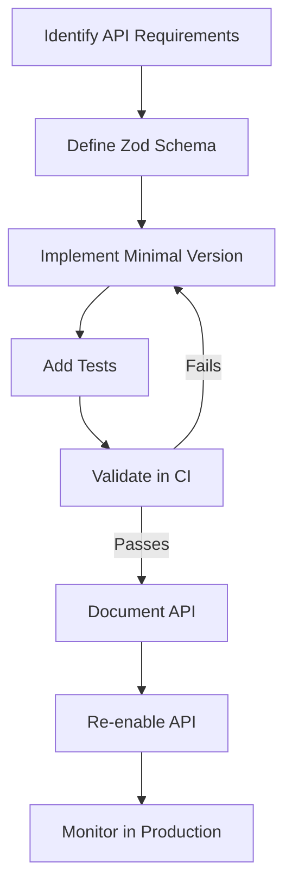

# triggerr API Development Plan

## Current Status and Challenge

The triggerr project currently faces challenges with CI build failures due to placeholder API routes that contain validation errors, unresolved dependencies, or incomplete implementations. These issues prevent successful builds in the CI pipeline, blocking progress on other aspects of the project.

## Strategic Approach

We've adopted a systematic approach to address these issues:

1. **Identify Essential APIs**: We've identified the Stripe webhook API as essential for payment processing and will keep it active.

2. **Simplify Problematic APIs**: For APIs that are needed but causing build failures (like the chat quote API), we've created simplified versions that maintain functionality without breaking the build.

3. **Disable Placeholder APIs**: For other placeholder APIs, we're temporarily disabling them by renaming them with a `.disabled.ts` extension and documenting their intended functionality.

4. **Document Everything**: We're maintaining comprehensive documentation of all APIs, including their purpose, current status, and implementation plans.

5. **Incremental Implementation**: We'll re-implement each API one by one, ensuring they build correctly and pass validation before re-enabling them.

## API Status Tracking

| Category | Status | Count | Notes |
|----------|--------|-------|-------|
| Essential APIs | Active | 1 | Stripe webhook API |
| Simplified APIs | Active | 1 | Chat quote API (simplified version) |
| Placeholder APIs | Disabled | ~34 | Documented in `docs/api-development/placeholders/` |

## Implementation Roadmap

### Phase 1: Stabilize CI Build (Current)
- ✅ Fix build script ordering in CI workflow
- ✅ Simplify chat quote API
- ✅ Disable placeholder APIs
- ✅ Document API development strategy

### Phase 2: Core API Implementation
1. User authentication APIs
2. Policy management APIs
3. Insurance quote APIs
4. Chat interface APIs

### Phase 3: Advanced Features
1. Wallet integration APIs
2. Flight monitoring APIs
3. Payout processing APIs

## Best Practices for API Development

1. **Schema-First Approach**: Define and validate schemas using Zod before implementing API logic
2. **Comprehensive Testing**: Write unit and integration tests for each API endpoint
3. **Error Handling**: Implement consistent error handling across all APIs
4. **Documentation**: Update API documentation as implementation progresses
5. **Incremental Validation**: Ensure each API passes validation before merging to main branch

## Re-enabling Process

When re-implementing a disabled API:

1. Review the documentation in `docs/api-development/placeholders/`
2. Create a new implementation based on the documented requirements
3. Test thoroughly to ensure it works as expected
4. Rename from `.disabled.ts` back to `.ts` to re-enable
5. Update the API status in this document

## Monitoring and Maintenance

- Regular review of API status and implementation progress
- Periodic testing of all active APIs to ensure continued functionality
- Update this document as APIs are implemented and re-enabled

---

*Last updated: $(date +"%Y-%m-%d")*

## Mermaid Diagram: API Development Workflow

