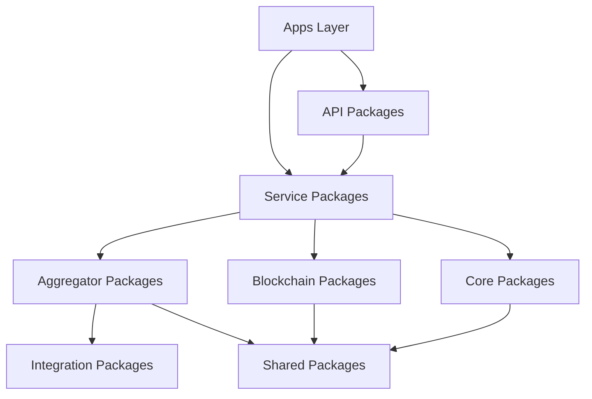

# Improved Monorepo Structure for triggerr

## Overview
This document outlines the enhanced monorepo structure designed for modularity, scalability, and API-first development. The structure supports the MVP while preparing for multi-provider marketplace expansion.

## Current vs. Proposed Structure

### Current Structure
```
triggerr/
├── apps/web/              # Next.js application
├── packages/
│   ├── config/           # Configuration utilities
│   ├── ui/               # UI components
│   └── utils/            # General utilities
```

### Proposed Enhanced Structure
```
triggerr/
├── apps/
│   ├── web/                          # Next.js web application
│   ├── admin/                        # Admin dashboard (future)
│   └── docs/                         # API documentation site
├── packages/
│   ├── core/
│   │   ├── auth/                     # Authentication service
│   │   ├── database/                 # Prisma schema & migrations
│   │   ├── types/                    # Shared TypeScript types
│   │   └── config/                   # Configuration management
│   ├── services/
│   │   ├── quote-engine/             # Quote calculation service
│   │   ├── policy-engine/            # Policy management service
│   │   ├── payout-engine/            # Payout processing service
│   │   ├── user-service/             # User management service
│   │   ├── wallet-service/           # Wallet operations service
│   │   └── provider-service/         # Provider management service
│   ├── aggregators/
│   │   ├── flight-aggregator/        # Flight data aggregation
│   │   ├── weather-aggregator/       # Weather data aggregation
│   │   └── data-router/              # Data source routing
│   ├── blockchain/
│   │   ├── paygo-adapter/            # Paygo blockchain adapter
│   │   ├── blockchain-interface/     # Blockchain abstraction layer
│   │   └── escrow-manager/           # Escrow operations manager
│   ├── api/
│   │   ├── public-api/               # Public API definitions
│   │   ├── provider-api/             # Provider integration API
│   │   ├── webhook-api/              # Webhook handlers
│   │   └── api-types/                # API type definitions
│   ├── integrations/
│   │   ├── aviationstack/            # AviationStack integration
│   │   ├── flightaware/              # FlightAware integration
│   │   ├── opensky/                  # OpenSky Network integration
│   │   └── weather-apis/             # Weather API integrations
│   ├── shared/
│   │   ├── ui/                       # Shared UI components
│   │   ├── utils/                    # Utility functions
│   │   ├── constants/                # Application constants
│   │   ├── validators/               # Data validation schemas
│   │   └── notifications/            # Notification service
│   └── infrastructure/
│       ├── scheduler/                # Task scheduling
│       ├── monitoring/               # Health checks & metrics
│       └── logging/                  # Structured logging
├── docs/
│   ├── api/                          # API documentation
│   ├── architecture/                 # Architecture documentation
│   ├── integration/                  # Provider integration guides
│   └── deployment/                   # Deployment guides
└── tools/
    ├── scripts/                      # Build & deployment scripts
    ├── generators/                   # Code generators
    └── testing/                      # Testing utilities
```

## Package Details

### Core Packages

#### `packages/core/auth`
**Purpose**: Centralized authentication and authorization
**Contents**:
- NextAuth.js configuration
- JWT token management
- Permission-based access control
- Provider authentication interfaces

#### `packages/core/database`
**Purpose**: Database schema and data access layer
**Contents**:
- Prisma schema definitions
- Database migrations
- Connection management
- Query utilities

#### `packages/core/types`
**Purpose**: Shared TypeScript type definitions
**Contents**:
- Domain models (User, Policy, Provider, etc.)
- API request/response types
- Event types
- Blockchain transaction types

### Service Packages

#### `packages/services/quote-engine`
**Purpose**: Insurance quote calculation logic
**Contents**:
- Risk assessment algorithms
- Premium calculation formulas
- Quote generation workflows
- Provider-specific quote adapters

#### `packages/services/policy-engine`
**Purpose**: Policy lifecycle management
**Contents**:
- Policy creation and validation
- Status tracking and updates
- Policy verification system
- Event emission for state changes

#### `packages/services/payout-engine`
**Purpose**: Automated payout processing
**Contents**:
- Condition monitoring
- Payout calculation
- Blockchain transaction handling
- Payment notification system

### Aggregator Packages

#### `packages/aggregators/flight-aggregator`
**Purpose**: Unified flight data access
**Contents**:
- Multi-source flight data fetching (AviationStack, FlightAware, OpenSky)
- Data normalization and validation across providers
- Failover and redundancy logic for high availability
- Real-time status monitoring and data freshness tracking
- Intelligent caching and data persistence to reduce API dependency

#### `packages/aggregators/weather-aggregator`
**Purpose**: Weather data integration
**Contents**:
- Multiple weather API integration
- Weather impact assessment
- Location-based data retrieval
- Historical weather analysis

#### `packages/aggregators/data-router`
**Purpose**: Intelligent data source routing
**Contents**:
- Source selection algorithms (AviationStack, FlightAware, OpenSky)
- Load balancing across APIs
- Rate limit management and quota optimization
- Cost optimization logic with free-tier prioritization
- Data quality scoring and source reliability tracking

### Blockchain Packages

#### `packages/blockchain/blockchain-interface`
**Purpose**: Blockchain abstraction layer
**Contents**:
- Generic blockchain operations interface
- Transaction building and signing
- Network configuration management
- Multi-chain support architecture

#### `packages/blockchain/paygo-adapter`
**Purpose**: Paygo-specific implementation
**Contents**:
- Paygo client integration
- Escrow creation and management
- Transaction handling
- Wallet operations

### API Packages

#### `packages/api/public-api`
**Purpose**: Public-facing API definitions
**Contents**:
- REST API route definitions
- Request/response validation
- Rate limiting configuration
- API versioning support

#### `packages/api/provider-api`
**Purpose**: Provider integration API
**Contents**:
- Provider onboarding endpoints
- Product creation APIs
- Revenue sharing APIs
- Webhook subscription management

### Integration Packages

#### `packages/integrations/aviationstack`
**Purpose**: AviationStack API integration
**Contents**:
- API client implementation
- Data transformation logic
- Error handling and retry logic
- Rate limit compliance

#### `packages/integrations/flightaware`
**Purpose**: FlightAware API integration
**Contents**:
- Real-time flight tracking
- Historical flight data
- Airport delay information
- Premium data access management

#### `packages/integrations/opensky`
**Purpose**: OpenSky Network API integration
**Contents**:
- Free flight state data access
- Aircraft position tracking
- Flight path reconstruction
- Crowd-sourced flight information

## Development Workflow

### Package Dependencies


### Build Strategy
- **Independent Package Builds**: Each package can be built and tested independently
- **Dependency Management**: Shared packages are automatically rebuilt when dependencies change
- **Type Safety**: TypeScript ensures compile-time validation across package boundaries
- **Testing Strategy**: Unit tests at package level, integration tests at service level

### Deployment Strategy
- **Monorepo Deployment**: Single deployment with selective package inclusion
- **API Versioning**: Independent versioning for public and provider APIs
- **Database Migrations**: Centralized migration management through core/database package
- **Environment Management**: Configuration through core/config package

## Migration Plan

### Phase 1: Core Infrastructure (Week 1-2)
1. Set up new package structure
2. Migrate existing code to appropriate packages
3. Establish build and dependency management
4. Set up shared types and utilities

### Phase 2: Service Extraction (Week 3-4)
1. Extract quote engine from existing code
2. Create policy engine with current functionality
3. Set up blockchain abstraction layer
4. Implement basic API structure

### Phase 3: Data Aggregation (Week 5-6)
1. Create flight aggregator with all three integrations (AviationStack, FlightAware, OpenSky)
2. Set up data router for intelligent source selection and failover
3. Implement weather aggregator with multiple providers
4. Add comprehensive monitoring and health checks
5. Implement data persistence layer to reduce external API dependency

### Phase 4: API Enhancement (Week 7-8)
1. Complete public API implementation
2. Create provider API foundation
3. Set up webhook system
4. Add API documentation

## Benefits

### For MVP Development
- **Faster Development**: Clear package boundaries reduce confusion
- **Better Testing**: Isolated testing of individual components
- **Code Reusability**: Shared packages eliminate duplication
- **Type Safety**: Strong typing across all packages
- **Data Independence**: Comprehensive data storage reduces external API dependency

### For Future Scaling
- **Provider Integration**: Clear APIs for external provider onboarding
- **Service Extraction**: Easy migration to microservices if needed
- **Team Scalability**: Teams can own specific packages
- **Technology Flexibility**: Packages can use different technologies as needed

### For Maintenance
- **Dependency Management**: Clear understanding of package relationships
- **Debugging**: Isolated concerns make issues easier to trace
- **Updates**: Targeted updates to specific functionality
- **Documentation**: Package-level documentation improves understanding

## Implementation Guidelines

### Package Creation Standards
1. Each package should have a clear, single responsibility
2. Packages should export clean, well-typed interfaces
3. Internal implementation details should not leak between packages
4. Each package should include comprehensive tests
5. Package documentation should explain purpose and usage

### Dependency Rules
1. Apps can depend on any package
2. Service packages should not depend on other service packages directly
3. Core packages should have minimal external dependencies
4. Integration packages should be self-contained
5. Shared packages should have no business logic

### API Design Principles
1. All APIs should be versioned from the start
2. Request/response schemas should be strongly typed
3. Error handling should be consistent across all APIs
4. APIs should support both internal and external usage
5. Webhook APIs should follow industry standards

This structure provides a solid foundation for MVP development while preparing for future marketplace expansion and external integrations.