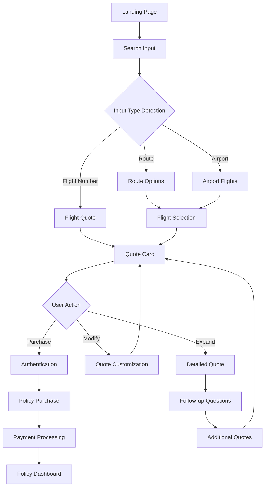

# PRD-APP-001: Web Application (MVP)

**Version**: 1.0  
**Status**: Draft  
**Author**: Development Team  
**Created**: 2025-01-27  
**Dependencies**: PRD-API-001 (Public API), PRD-CORE-002 (Authentication), PRD-ENGINE-001 (Quote Engine)  
**Priority**: Critical

## 1. Overview

This PRD defines the primary web application for the triggerr parametric insurance platform. The application features a chat0-inspired search interface that provides an intuitive, conversational approach to flight insurance quote generation and policy management.

### 1.1 Strategic Goals
- **Conversational Insurance**: Make insurance accessible through natural, search-like interactions
- **Instant Quotes**: Provide immediate quote generation with transparent risk factors
- **Visual Discovery**: Card-based results that expand for detailed information
- **Progressive Enhancement**: Guide users from search to purchase with minimal friction
- **Mobile-First**: Responsive design optimized for all devices
- **Trust & Transparency**: Clear explanations of coverage, risks, and automated payouts

### 1.2 Reference Implementation
This PRD is inspired by the chat0 interface patterns and user experience design.

### 1.3 Technology Stack
- **Package Location**: `apps/web`
- **Framework**: Next.js 15 with App Router
- **Runtime**: Bun
- **UI Components**: React with shadcn/ui
- **Styling**: Tailwind CSS
- **Authentication**: Better-auth with Google OAuth
- **State Management**: Zustand + React Context
- **API Integration**: Custom hooks with React Query
- **Deployment**: Vercel

## 2. User Experience Design

### 2.1 Core User Journey



### 2.2 Interface Design Principles

#### Chat0-Inspired Search Interface
- **Single Input Field**: Universal search that accepts flight numbers, routes, or airports
- **Smart Normalization**: Automatically detect and format different input types
- **Instant Feedback**: Real-time validation and suggestions
- **Conversational Flow**: Guide users naturally through the insurance process

#### Card-Based Results
- **Collapsed View**: Essential quote information at a glance
- **Expandable Details**: Comprehensive coverage information on demand
- **Interactive Elements**: Modify coverage, see risk factors, compare options
- **Action-Oriented**: Clear paths to purchase or get more information

## 3. Application Architecture

### 3.1 Directory Structure
```
apps/web/
├── src/
│   ├── app/                    # Next.js App Router
│   │   ├── (auth)/            # Authentication pages
│   │   ├── (dashboard)/       # User dashboard
│   │   ├── api/               # API routes
│   │   ├── globals.css
│   │   ├── layout.tsx
│   │   └── page.tsx          # Landing page
│   ├── components/
│   │   ├── insurance/         # Insurance-specific components
│   │   ├── search/           # Search interface components
│   │   ├── quote/            # Quote display components
│   │   ├── policy/           # Policy management components
│   │   └── ui/               # Shared UI components
│   ├── hooks/                # Custom React hooks
│   ├── stores/               # State management
│   ├── lib/                  # Utilities and configurations
│   └── types/                # TypeScript type definitions
├── public/                   # Static assets
├── package.json
└── README.md
```

### 3.2 Core Components

#### Search Interface
```typescript
interface SearchInterfaceProps {
  onQuoteGenerated: (quote: Quote) => void;
  onError: (error: SearchError) => void;
}

export function SearchInterface({ onQuoteGenerated, onError }: SearchInterfaceProps) {
  const [input, setInput] = useState('');
  const [isLoading, setIsLoading] = useState(false);
  const [suggestions, setSuggestions] = useState<SearchSuggestion[]>([]);
  
  const { normalizeInput, detectInputType } = useInputNormalizer();
  const { generateQuote } = useQuoteEngine();
  
  const handleSearch = async (searchInput: string) => {
    setIsLoading(true);
    
    try {
      // Normalize input based on type detection
      const inputType = detectInputType(searchInput);
      const normalizedInput = await normalizeInput(searchInput, inputType);
      
      // Generate quote based on normalized input
      const quote = await generateQuote(normalizedInput);
      onQuoteGenerated(quote);
    } catch (error) {
      onError(error as SearchError);
    } finally {
      setIsLoading(false);
    }
  };

  return (
    <div className="w-full max-w-3xl mx-auto">
      <SearchInput
        value={input}
        onChange={setInput}
        onSubmit={handleSearch}
        suggestions={suggestions}
        isLoading={isLoading}
        placeholder="Search flights (e.g., 'BA245', 'London to New York', 'LHR')"
      />
      
      <SearchExamples onExampleClick={setInput} />
    </div>
  );
}
```

#### Quote Card Component
```typescript
interface QuoteCardProps {
  quote: Quote;
  onExpand: () => void;
  onPurchase: () => void;
  onModify: () => void;
  isExpanded?: boolean;
}

export function QuoteCard({ quote, onExpand, onPurchase, onModify, isExpanded }: QuoteCardProps) {
  return (
    <Card className="w-full max-w-3xl mx-auto transition-all duration-300">
      <CardHeader>
        <div className="flex justify-between items-start">
          <div>
            <CardTitle>{quote.flight.flightNumber}</CardTitle>
            <CardDescription>
              {quote.flight.route} • {formatDate(quote.flight.departureTime)}
            </CardDescription>
          </div>
          <div className="text-right">
            <div className="text-2xl font-bold">${quote.premium}</div>
            <div className="text-sm text-muted-foreground">
              ${quote.coverage} coverage
            </div>
          </div>
        </div>
      </CardHeader>
      
      <CardContent>
        {!isExpanded && (
          <QuoteCardSummary 
            quote={quote}
            onExpand={onExpand}
          />
        )}
        
        {isExpanded && (
          <QuoteCardDetails
            quote={quote}
            onModify={onModify}
          />
        )}
      </CardContent>
      
      <CardFooter className="flex gap-2">
        <Button variant="outline" onClick={onExpand}>
          {isExpanded ? 'Collapse' : 'View Details'}
        </Button>
        <Button onClick={onPurchase} className="flex-1">
          Purchase Policy
        </Button>
      </CardFooter>
    </Card>
  );
}
```

#### Conversational Follow-up
```typescript
export function ConversationalInterface({ quote }: { quote: Quote }) {
  const [followUpInput, setFollowUpInput] = useState('');
  const [conversation, setConversation] = useState<ConversationMessage[]>([]);
  
  const handleFollowUp = async (input: string) => {
    const intent = detectIntent(input);
    
    switch (intent.type) {
      case 'MODIFY_COVERAGE':
        return await modifyCoverage(quote, intent.parameters);
      case 'EXPLAIN_RISK':
        return await explainRiskFactors(quote, intent.parameters);
      case 'COMPARE_OPTIONS':
        return await generateComparisons(quote, intent.parameters);
      case 'DIFFERENT_FLIGHT':
        return await searchRelatedFlights(quote, intent.parameters);
      default:
        return await generateContextualResponse(input, quote);
    }
  };

  return (
    <div className="space-y-4">
      <div className="text-sm font-medium">Have questions about this quote?</div>
      
      <ConversationHistory messages={conversation} />
      
      <ChatInput
        value={followUpInput}
        onChange={setFollowUpInput}
        onSubmit={handleFollowUp}
        placeholder="Ask about coverage, risks, or search for other flights..."
        suggestions={generateQuestionSuggestions(quote)}
      />
    </div>
  );
}
```

### 3.3 Better-auth Client Setup

#### Client Configuration
```typescript
// packages/core/auth/client.ts
import { createAuthClient } from "better-auth/react";

export const authClient = createAuthClient({
  baseURL: process.env.NEXT_PUBLIC_BETTER_AUTH_URL || "http://localhost:3000",
  plugins: [
    // Add any client-side plugins here
  ],
});

export const {
  useSession,
  signIn,
  signOut,
  useListSessions,
} = authClient;
```

#### Provider Setup
```typescript
// apps/web/app/layout.tsx
import { AuthProvider } from '@triggerr/auth/react';

export default function RootLayout({
  children,
}: {
  children: React.ReactNode;
}) {
  return (
    <html lang="en">
      <body>
        <AuthProvider>
          {children}
        </AuthProvider>
      </body>
    </html>
  );
}
```

#### Authentication Components
```typescript
// apps/web/components/auth/SignInButton.tsx
import { signIn, useSession } from '@triggerr/auth/react';

export function SignInButton() {
  const { data: session, isPending } = useSession();
  
  if (isPending) return <div>Loading...</div>;
  
  if (session?.user) {
    return (
      <div className="flex items-center gap-2">
        
        <span>{session.user.name}</span>
      </div>
    );
  }
  
  return (
    <button
      onClick={() => signIn.social({ provider: 'google' })}
      className="px-4 py-2 bg-blue-600 text-white rounded-lg hover:bg-blue-700"
    >
      Sign in with Google
    </button>
  );
}
```

#### Session Hook Usage
```typescript
// apps/web/hooks/useAuth.ts
import { useSession, signOut } from '@triggerr/auth/react';
import { useRouter } from 'next/navigation';

export function useAuth() {
  const { data: session, isPending, error } = useSession();
  const router = useRouter();
  
  const handleSignOut = async () => {
    await signOut();
    router.push('/');
  };
  
  const requireAuth = () => {
    if (!isPending && !session?.user) {
      router.push('/auth/signin');
      return false;
    }
    return true;
  };
  
  return {
    user: session?.user || null,
    session: session?.session || null,
    isLoading: isPending,
    isAuthenticated: !!session?.user,
    error,
    signOut: handleSignOut,
    requireAuth,
  };
}
```

## 4. Page Structure & Routes

### 4.1 Core Pages

#### Landing Page (`/`)
```typescript
export default function HomePage() {
  const [quotes, setQuotes] = useState<Quote[]>([]);
  const [activeQuote, setActiveQuote] = useState<Quote | null>(null);
  
  return (
    <div className="min-h-screen">
      <Header />
      
      <main className="container mx-auto px-4 pt-20 pb-12">
        <Hero />
        
        <SearchInterface
          onQuoteGenerated={(quote) => {
            setQuotes(prev => [quote, ...prev]);
            setActiveQuote(quote);
          }}
          onError={(error) => toast.error(error.message)}
        />
        
        {quotes.length > 0 && (
          <QuoteResults
            quotes={quotes}
            activeQuote={activeQuote}
            onQuoteSelect={setActiveQuote}
          />
        )}
        
        {activeQuote && (
          <ConversationalInterface quote={activeQuote} />
        )}
      </main>
      
      <Footer />
    </div>
  );
}
```

#### Policy Purchase Flow (`/purchase/[quoteId]`)
```typescript
export default function PurchasePage({ params }: { params: { quoteId: string } }) {
  const { quote, isLoading } = useQuote(params.quoteId);
  const [purchaseStep, setPurchaseStep] = useState<PurchaseStep>('REVIEW');
  
  if (isLoading) return <PurchaseLoading />;
  if (!quote) return <QuoteNotFound />;
  
  return (
    <div className="container mx-auto px-4 py-8">
      <PurchaseProgress currentStep={purchaseStep} />
      
      {purchaseStep === 'REVIEW' && (
        <QuoteReview
          quote={quote}
          onConfirm={() => setPurchaseStep('AUTH')}
        />
      )}
      
      {purchaseStep === 'AUTH' && (
        <AuthenticationStep
          onComplete={() => setPurchaseStep('PAYMENT')}
        />
      )}
      
      {purchaseStep === 'PAYMENT' && (
        <PaymentStep
          quote={quote}
          onComplete={() => setPurchaseStep('CONFIRMATION')}
        />
      )}
      
      {purchaseStep === 'CONFIRMATION' && (
        <PurchaseConfirmation quote={quote} />
      )}
    </div>
  );
}
```

#### User Dashboard (`/dashboard`)
```typescript
export default function DashboardPage() {
  const { data: session, isPending } = useSession();
  const { policies, isLoading } = usePolicies();
  
  // Redirect if not authenticated
  useEffect(() => {
    if (!isPending && !session?.user) {
      redirect('/auth/signin');
    }
  }, [session, isPending]);
  
  if (isPending) {
    return <div className="flex justify-center items-center h-screen">Loading...</div>;
  }
  
  if (!session?.user) {
    return null; // Will redirect
  }
  
  return (
    <DashboardLayout>
      <div className="space-y-6">
        <DashboardHeader user={session.user} />
        
        <div className="grid gap-6 md:grid-cols-2 lg:grid-cols-3">
          <ActivePoliciesCard policies={policies} />
          <RecentPayoutsCard />
          <QuickActionsCard />
        </div>
        
        <PolicyList policies={policies} />
      </div>
    </DashboardLayout>
  );
}
```

## 5. Input Normalization System

### 5.1 Input Type Detection
```typescript
export enum InputType {
  FLIGHT_NUMBER = 'flight_number',
  ROUTE = 'route',
  AIRPORT = 'airport',
  CITY_PAIR = 'city_pair',
  NATURAL_LANGUAGE = 'natural_language'
}

export function detectInputType(input: string): InputType {
  const cleaned = input.trim().toUpperCase();
  
  // Flight number patterns
  if (/^[A-Z]{2,3}\d{1,4}[A-Z]?$/.test(cleaned)) {
    return InputType.FLIGHT_NUMBER;
  }
  
  // Airport code patterns
  if (/^[A-Z]{3}$/.test(cleaned)) {
    return InputType.AIRPORT;
  }
  
  // Route patterns (XXX to YYY, XXX-YYY)
  if (/^[A-Z]{3}[\s\-]*(TO|-)[\s\-]*[A-Z]{3}$/i.test(cleaned)) {
    return InputType.ROUTE;
  }
  
  // City pair patterns
  if (/\s+TO\s+/i.test(input) || /\s*-\s*/.test(input)) {
    return InputType.CITY_PAIR;
  }
  
  return InputType.NATURAL_LANGUAGE;
}

export async function normalizeInput(input: string, type: InputType): Promise<NormalizedInput> {
  switch (type) {
    case InputType.FLIGHT_NUMBER:
      return normalizeFlightNumber(input);
    case InputType.ROUTE:
      return normalizeRoute(input);
    case InputType.AIRPORT:
      return normalizeAirport(input);
    case InputType.CITY_PAIR:
      return normalizeCityPair(input);
    case InputType.NATURAL_LANGUAGE:
      return parseNaturalLanguage(input);
    default:
      throw new Error(`Unsupported input type: ${type}`);
  }
}
```

### 5.2 Smart Suggestions
```typescript
export function useSearchSuggestions(input: string) {
  const [suggestions, setSuggestions] = useState<SearchSuggestion[]>([]);
  
  useEffect(() => {
    const generateSuggestions = async () => {
      if (input.length < 2) {
        setSuggestions([]);
        return;
      }
      
      const type = detectInputType(input);
      const suggestions = await fetchSuggestions(input, type);
      setSuggestions(suggestions);
    };
    
    const timeoutId = setTimeout(generateSuggestions, 300);
    return () => clearTimeout(timeoutId);
  }, [input]);
  
  return suggestions;
}

async function fetchSuggestions(input: string, type: InputType): Promise<SearchSuggestion[]> {
  switch (type) {
    case InputType.FLIGHT_NUMBER:
      return await suggestFlights(input);
    case InputType.AIRPORT:
      return await suggestAirports(input);
    case InputType.CITY_PAIR:
      return await suggestRoutes(input);
    default:
      return [];
  }
}
```

## 6. State Management

### 6.1 Global State Structure
```typescript
// Search State
interface SearchState {
  currentInput: string;
  inputType: InputType | null;
  suggestions: SearchSuggestion[];
  isLoading: boolean;
  recentSearches: string[];
  setInput: (input: string) => void;
  setLoading: (loading: boolean) => void;
  addRecentSearch: (search: string) => void;
}

// Quote State
interface QuoteState {
  quotes: Quote[];
  activeQuote: Quote | null;
  quotesHistory: Quote[];
  addQuote: (quote: Quote) => void;
  setActiveQuote: (quote: Quote | null) => void;
  updateQuote: (quoteId: string, updates: Partial<Quote>) => void;
}

// User State (Better-auth session structure)
interface UserState {
  user: {
    id: string;
    email: string;
    name?: string;
    image?: string;
    createdAt: Date;
  } | null;
  session: {
    id: string;
    expiresAt: Date;
    token: string;
  } | null;
  policies: Policy[];
  wallet: WalletInfo | null;
  isAuthenticated: boolean;
  setUser: (user: UserState['user']) => void;
  setSession: (session: UserState['session']) => void;
  updatePolicies: (policies: Policy[]) => void;
}
```

### 6.2 Store Implementation
```typescript
export const useSearchStore = create<SearchState>((set, get) => ({
  currentInput: '',
  inputType: null,
  suggestions: [],
  isLoading: false,
  recentSearches: [],
  
  setInput: (input: string) => set({
    currentInput: input,
    inputType: detectInputType(input)
  }),
  
  setLoading: (loading: boolean) => set({ isLoading: loading }),
  
  addRecentSearch: (search: string) => set(state => ({
    recentSearches: [search, ...state.recentSearches.slice(0, 9)]
  }))
}));
```

## 7. API Integration

### 7.1 Custom Hooks with Better-auth Session
```typescript
import { useSession } from '@triggerr/auth/react';

export function useQuoteGeneration() {
  const { data: session } = useSession();
  
  const mutation = useMutation({
    mutationFn: async (input: NormalizedInput) => {
      const response = await fetch('/api/quotes', {
        method: 'POST',
        headers: { 'Content-Type': 'application/json' },
        credentials: 'include', // Include Better-auth session cookie
        body: JSON.stringify(input)
      });
      
      if (!response.ok) {
        const error = await response.json();
        throw new Error(error.error?.message || 'Failed to generate quote');
      }
      
      return response.json();
    },
    onSuccess: (quote) => {
      useQuoteStore.getState().addQuote(quote);
      useSearchStore.getState().addRecentSearch(quote.searchInput);
    }
  });
  
  return {
    generateQuote: mutation.mutate,
    isLoading: mutation.isPending,
    error: mutation.error,
    isAuthenticated: !!session?.user
  };
}

export function usePolicyPurchase() {
  const { data: session } = useSession();
  
  const mutation = useMutation({
    mutationFn: async (purchaseData: PolicyPurchaseData) => {
      if (!session?.user) {
        throw new Error('Authentication required to purchase policy');
      }
      
      const response = await fetch('/api/policies', {
        method: 'POST',
        headers: { 'Content-Type': 'application/json' },
        credentials: 'include', // Include Better-auth session cookie
        body: JSON.stringify(purchaseData)
      });
      
      if (!response.ok) {
        const error = await response.json();
        throw new Error(error.error?.message || 'Failed to purchase policy');
      }
      
      return response.json();
    },
    onSuccess: (policy) => {
      useUserStore.getState().updatePolicies([policy]);
      toast.success('Policy purchased successfully!');
    }
  });
  
  return {
    purchasePolicy: mutation.mutate,
    isLoading: mutation.isPending,
    error: mutation.error
  };
}
```

## 8. Responsive Design

### 8.1 Mobile-First Approach
```typescript
// Responsive search interface
export function ResponsiveSearchInterface() {
  return (
    <div className="w-full">
      {/* Mobile: Stack vertically */}
      <div className="block lg:hidden space-y-4">
        <MobileSearchInput />
        <MobileQuoteCards />
        <MobileConversation />
      </div>
      
      {/* Desktop: Side-by-side layout */}
      <div className="hidden lg:grid lg:grid-cols-3 lg:gap-6">
        <div className="lg:col-span-2">
          <DesktopSearchInterface />
          <QuoteGrid />
        </div>
        <div className="lg:col-span-1">
          <ConversationSidebar />
        </div>
      </div>
    </div>
  );
}
```

### 8.2 Breakpoint Strategy
```css
/* Tailwind CSS custom breakpoints */
@media (min-width: 640px) {
  /* sm: Small tablets */
  .quote-card { @apply grid-cols-2; }
}

@media (min-width: 768px) {
  /* md: Large tablets */
  .search-interface { @apply max-w-2xl; }
}

@media (min-width: 1024px) {
  /* lg: Laptops */
  .main-layout { @apply grid-cols-3; }
}

@media (min-width: 1280px) {
  /* xl: Large screens */
  .quote-details { @apply grid-cols-4; }
}
```

## 9. Performance Optimization

### 9.1 Code Splitting
```typescript
// Lazy load heavy components
const QuoteDetails = lazy(() => import('./QuoteDetails'));
const PolicyPurchase = lazy(() => import('./PolicyPurchase'));
const Dashboard = lazy(() => import('./Dashboard'));

// Route-based code splitting
const routes = [
  {
    path: '/',
    component: lazy(() => import('./pages/HomePage'))
  },
  {
    path: '/dashboard',
    component: lazy(() => import('./pages/DashboardPage'))
  },
  {
    path: '/purchase/:quoteId',
    component: lazy(() => import('./pages/PurchasePage'))
  }
];
```

### 9.2 Data Fetching Strategy
```typescript
// React Query configuration
export const queryClient = new QueryClient({
  defaultOptions: {
    queries: {
      staleTime: 5 * 60 * 1000, // 5 minutes
      cacheTime: 10 * 60 * 1000, // 10 minutes
      retry: 2,
      refetchOnWindowFocus: false
    }
  }
});

// Prefetch popular routes
export function usePrefetchPopularRoutes() {
  const queryClient = useQueryClient();
  
  useEffect(() => {
    const popularRoutes = ['LHR-JFK', 'LAX-LHR', 'DXB-LHR'];
    
    popularRoutes.forEach(route => {
      queryClient.prefetchQuery({
        queryKey: ['route-flights', route],
        queryFn: () => fetchRouteFlights(route)
      });
    });
  }, [queryClient]);
}
```

## 10. Security Implementation

### 10.1 Authentication Flow
```typescript
import { useSession, signIn, signOut } from '@triggerr/auth/react';

export function useAuthProtection() {
  const { data: session, isPending } = useSession();
  const router = useRouter();
  
  useEffect(() => {
    if (isPending) return;
    
    if (!session?.user && protectedRoutes.includes(router.pathname)) {
      router.push('/auth/signin');
    }
  }, [session, isPending, router]);
  
  return { session, isLoading: isPending };
}

// Better-auth sign in/out helpers
export function useBetterAuth() {
  const handleSignIn = () => {
    signIn.social({ provider: 'google' });
  };
  
  const handleSignOut = async () => {
    await signOut();
    router.push('/');
  };
  
  return { signIn: handleSignIn, signOut: handleSignOut };
}

// Wallet security with Better-auth
export function useSecureWallet() {
  const [wallet, setWallet] = useState<WalletInfo | null>(null);
  const { data: session } = useSession();
  
  const createWallet = async () => {
    if (!session?.user) {
      throw new Error('Authentication required');
    }
    
    // Client-side wallet creation with session-based auth
    const response = await fetch('/api/wallet/create', {
      method: 'POST',
      credentials: 'include', // Include Better-auth session cookie
      headers: {
        'Content-Type': 'application/json'
      }
    });
    
    if (!response.ok) {
      throw new Error('Failed to create wallet');
    }
    
    const walletData = await response.json();
    setWallet(walletData);
    return walletData;
  };
  
  return { wallet, createWallet };
}
```

## 11. Testing Strategy

### 11.1 Component Testing
```typescript
// Jest + Testing Library
describe('SearchInterface', () => {
  it('detects flight number input correctly', async () => {
    render(<SearchInterface onQuoteGenerated={jest.fn()} onError={jest.fn()} />);
    
    const input = screen.getByPlaceholder(/search flights/i);
    await userEvent.type(input, 'BA245');
    
    expect(screen.getByText(/flight number detected/i)).toBeInTheDocument();
  });
  
  it('generates quote for valid flight', async () => {
    const mockQuoteGenerated = jest.fn();
    render(<SearchInterface onQuoteGenerated={mockQuoteGenerated} onError={jest.fn()} />);
    
    const input = screen.getByPlaceholder(/search flights/i);
    await userEvent.type(input, 'BA245');
    await userEvent.click(screen.getByRole('button', { name: /search/i }));
    
    await waitFor(() => {
      expect(mockQuoteGenerated).toHaveBeenCalledWith(
        expect.objectContaining({
          flightNumber: 'BA245'
        })
      );
    });
  });
});
```

### 11.2 E2E Testing
```typescript
// Playwright tests
test('complete quote to purchase flow', async ({ page }) => {
  await page.goto('/');
  
  // Search for flight
  await page.fill('[placeholder*="Search flights"]', 'BA245');
  await page.click('button:has-text("Search")');
  
  // Wait for quote to load
  await page.waitForSelector('[data-testid="quote-card"]');
  
  // Expand quote details
  await page.click('button:has-text("View Details")');
  await expect(page.locator('[data-testid="risk-factors"]')).toBeVisible();
  
  // Purchase policy
  await page.click('button:has-text("Purchase Policy")');
  
  // Authentication
  await page.fill('[name="email"]', 'test@example.com');
  await page.fill('[name="password"]', 'testpassword');
  await page.click('button:has-text("Sign In")');
  
  // Complete purchase
  await page.waitForSelector('[data-testid="purchase-form"]');
  await page.click('button:has-text("Complete Purchase")');
  
  // Verify success
  await expect(page.locator('text=Policy purchased successfully')).toBeVisible();
});
```

## 12. Deployment & Configuration

### 12.1 Environment Configuration
```typescript
// Environment variables
export const config = {
  apiUrl: process.env.NEXT_PUBLIC_API_URL!,
  authSecret: process.env.NEXTAUTH_SECRET!,
  paygoApiUrl: process.env.PAYGO_API_URL!,
  
  // Feature flags
  features: {
    conversationalInterface: process.env.NEXT_PUBLIC_ENABLE_CONVERSATION === 'true',
    advancedQuotes: process.env.NEXT_PUBLIC_ENABLE_ADVANCED_QUOTES === 'true',
    realTimeTracking: process.env.NEXT_PUBLIC_ENABLE_REAL_TIME === 'true'
  },
  
  // API endpoints
  endpoints: {
    quotes: '/api/quotes',
    policies: '/api/policies',
    flights: '/api/flights',
    payments: '/api/payments'
  }
};
```

### 12.2 Build Configuration
```javascript
// next.config.js
/** @type {import('next').NextConfig} */
const nextConfig = {
  experimental: {
    appDir: true,
    serverComponentsExternalPackages: ['@witnessco/paygo-ts-client']
  },
  images: {
    domains: ['images.unsplash.com']
  },
  env: {
    CUSTOM_KEY: process.env.CUSTOM_KEY,
  },
  async rewrites() {
    return [
      {
        source: '/api/v1/:path*',
        destination: '/api/:path*'
      }
    ];
  }
};

module.exports = nextConfig;
```

## 13. Implementation Timeline

### Week 1: Foundation
- [ ] Setup Next.js project with TypeScript and Tailwind
- [ ] Implement basic search interface
- [ ] Create core UI components
- [ ] Setup authentication with NextAuth.js

### Week 2: Search & Normalization
- [ ] Implement input type detection
- [ ] Build normalization system
- [ ] Add search suggestions
- [ ] Create quote card components

### Week 3: Quote Generation
- [ ] Integrate with quote engine API
- [ ] Build quote details interface
- [ ] Implement conversational follow-up
- [ ] Add risk factor explanations

### Week 4: Purchase Flow
- [ ] Create policy purchase pages
- [ ] Integrate payment processing
- [ ] Build user dashboard
- [ ] Add policy management

### Week 5: Enhancement
- [ ] Implement responsive design
- [ ] Add performance optimizations
- [ ] Create comprehensive testing
- [ ] Deploy to production

## 14. Success Metrics

- **User Engagement**: > 60% of visitors generate at least one quote
- **Conversion Rate**: > 15% of quotes result in policy purchase
- **Search Success**: > 90% of searches return valid results
- **Page Load Speed**: < 2 seconds initial page load
- **Mobile Usage**: > 70% mobile-responsive experience
- **User Satisfaction**: > 4.5/5 user rating

## 15. Accessibility & Compliance

### 15.1 WCAG 2.1 AA Compliance
- **Keyboard Navigation**: Full keyboard accessibility
- **Screen Reader Support**: Proper ARIA labels and semantic HTML
- **Color Contrast**: Minimum 4.5:1 contrast ratio
- **Focus Management**: Clear focus indicators and logical tab order

### 15.2 Performance Standards
- **Core Web Vitals**: LCP < 2.5s, FID < 100ms, CLS < 0.1
- **SEO Optimization**: Semantic HTML, meta tags, structured data
- **Progressive Enhancement**: Works without JavaScript
- **Offline Support**: Service worker for critical functionality

## 16. Dependencies

- **Requires**: PRD-API-001 (Public API) for data integration
- **Requires**: PRD-CORE-002 (Authentication) for user management
- **Requires**: PRD-ENGINE-001 (Quote Engine) for quote generation
- **Requires**: PRD-BLOCKCHAIN-002 (PayGo Adapter) for payments
- **Integrates**: All data aggregator and integration PRDs
- **Enables**: Complete user-facing insurance platform

---

**Status**: Ready for implementation  
**Next PRD**: PRD-ENGINE-001 (Quote Engine)