# triggerr Project Context Reference

**Last Updated**: [Current Date - User to Fill]
**Status**: Master Vision v1.0 Finalized. Prerequisite Documentation & Foundational Code (Schema/Seed) Alignment In Progress. Next: Phase 1 (MVP) API Development.
**Core Technologies (MVP Focus)**: Next.js (App Router Shell + React Router), Drizzle ORM, Better-Auth (Google OAuth), PayGo Protocol, Stripe, AviationStack, FlightAware, OpenSky, LLM (Managed API like Gemini/Claude for MVP), KMS for key encryption.

## 🎯 Project Overview

### What is triggerr?
triggerr is a user-centric platform architected to initially specialize in transparent, automated, and efficient parametric flight delay insurance via `triggerr.com`. For its MVP, it features a chat-first interface, custodial PayGo wallets for users (with system-managed encrypted keys), and leverages the PayGo blockchain for automated escrow management and payouts. The long-term vision includes expansion into a broader travel ecosystem with flight bookings managed by a distinct entity, `FlightHub Connect`.

### Core Value Proposition
- **Automatic & Instant Payouts**: Core value, leveraging PayGo for efficient and transparent settlement of validated flight delay claims to user's custodial wallet.
- **Utmost User Simplicity**: No complex claims forms. Intuitive, conversational UX for quoting and policy management.
- **Transparency**: Clear policy terms. Escrowed funds and payouts are conceptually verifiable via PayGo Policy Verification Codes (Escrow IDs).
- **Seamless Custodial Wallet Experience (MVP)**: Hassle-free onboarding with system-managed PayGo wallets, ensuring ease of use for all users.
- **Insurance Specialization**: Deep focus on providing the best parametric flight delay insurance experience.
- **Data-Driven Quoting**: Utilizes aggregated flight data (AviationStack, FlightAware, OpenSky) for contextual and risk-informed insurance quoting.

### Strategic Vision
To establish `triggerr.com` as the leading platform for parametric flight delay insurance (Phase 1), focusing on user experience and automated PayGo payouts via custodial wallets. Subsequently, to expand insurance offerings, introduce user self-custody wallet options (Phase 2), and integrate flight booking services via a distinct entity, `FlightHub Connect` (Phase 3). The long-term vision is a comprehensive, decentralized travel and insurance ecosystem.

## 🏗️ Architecture Overview

### System Architecture
The system is a modular monorepo Next.js application. The `apps/web` directory houses the Next.js frontend (App Router shell bootstrapping a client-side React Router app) and backend API routes. Shared logic is organized into `packages/` for `core` (database, auth), `integrations` (third-party API clients like PayGo, Stripe, KMS, flight data, LLM), `services` (core business logic like UserWalletService, PolicyService, ConversationService), and `shared` (constants, types, validators, notifications).

```mermaid
graph TD
    subgraph "User Interaction Layer (Client: apps/web/src/frontend)"
        WebApp["Web Application (Next.js Frontend + React Router)"]
    end

    subgraph "API Gateway Layer (apps/web/app/api/v1)"
        APIRoutes["Next.js API Routes"]
    end

    subgraph "Authentication & Session Management"
        BetterAuth["Better-Auth Library (Google OAuth, Session JWTs)"]
    end

    subgraph "Core Business Services (packages/services)"
        ConversationService["ConversationService (LLM, Chat Logic)"]
        QuoteEngineService["QuoteEngineService (Insurance Premium Calc)"]
        PolicyService["PolicyService (Lifecycle, Escrow Orchestration, Payouts)"]
        UserWalletService["UserWalletService (Custodial Wallets, Faucet)"]
        PaymentService["PaymentService (Stripe Orchestration)"]
        FlightDataService["FlightDataService (Flight Info for Insurance)"]
        FlightMonitorService["FlightMonitorService (Background Task - Flight Tracking)"]
    end

    subgraph "Integration Layer (packages/integrations)"
        PayGoService["PayGoService (Direct `@witnessco/paygo-ts-client` Usage)"]
        StripeService["StripeService"]
        LLMService["LLMService (e.g., Gemini/Claude Client or Self-Hosted Llama Wrapper)"]
        KmsService["KmsService (Key Encryption/Decryption for Custodial Wallets)"]
        AviationStackClient["AviationStackClient"]
        FlightAwareClient["FlightAwareClient"]
        OpenSkyClient["OpenSkyClient"]
    end

    subgraph "Shared Core & Data Layer (packages/core, packages/shared)"
        Database["Database (PostgreSQL + Drizzle ORM - `schema.ts`)"]
        SharedTypes["Shared Types (`packages/shared-types`)"]
        SharedConstants["Constants (`packages/shared/constants`)"]
        SharedValidators["Validators (`packages/shared/validators`)"]
        SharedNotifications["Notifications (`packages/shared/notifications`)"]
    end

    %% User to API
    WebApp -->|HTTP Requests| APIRoutes

    %% API Routes to Services & Auth
    APIRoutes -->|User Requests: Chat, Quote, Policy| ConversationService
    APIRoutes -->|Policy Purchase, User Data| PolicyService
    APIRoutes -->|Wallet Info, Faucet| UserWalletService
    APIRoutes -->|Stripe Payment Intent, Webhooks| PaymentService
    APIRoutes -->|Authentication Handling| BetterAuth

    %% Service to Service Interactions
    ConversationService -->|Get Flight Context via internal API| FlightDataService
    ConversationService -->|Request Quotes| QuoteEngineService
    ConversationService -->|LLM Interaction| LLMService
    ConversationService -->|Save/Load Chat| Database

    PolicyService -->|Manage User Wallet for Escrow| UserWalletService
    PolicyService -->|Stripe Payment Confirmation| PaymentService
    PolicyService -->|Create/Release PayGo Escrow| PayGoService
    PolicyService -->|Store/Update Policy| Database
    PolicyService -->|Triggered by| FlightMonitorService

    UserWalletService -->|Create/Manage PayGo Wallet Ops| PayGoService
    UserWalletService -->|Encrypt/Decrypt Private Keys| KmsService
    UserWalletService -->|Store/Update Wallet Info| Database

    QuoteEngineService -->|Get Flight Risk Data| FlightDataService
    QuoteEngineService -->|Access Product Rules| Database

    PaymentService -->|Stripe API Calls| StripeService
    PaymentService -->|Store Payment Records| Database

    FlightMonitorService -->|Get Flight Status| FlightDataService

    %% Services to Integration Layer
    FlightDataService -->|Fetch Data| AviationStackClient
    FlightDataService -->|Fetch Data| FlightAwareClient
    FlightDataService -->|Fetch Data| OpenSkyClient

    %% Services to Core Infrastructure
    UserWalletService --> Database
    PolicyService --> Database
    ConversationService --> Database
    QuoteEngineService --> Database
    PaymentService --> Database

    %% Shared Packages Usage (Conceptual - Many services use these)
    ConversationService --> SharedTypes
    PolicyService --> SharedTypes
    UserWalletService --> SharedTypes
    SharedValidators --> APIRoutes
    SharedNotifications --> PolicyService
    SharedNotifications --> UserWalletService

    classDef service fill:#D6EAF8,stroke:#3498DB,stroke-width:2px;
    classDef integration fill:#D1F2EB,stroke:#1ABC9C,stroke-width:2px;
    classDef core fill:#FCF3CF,stroke:#F1C40F,stroke-width:2px;
    classDef api fill:#EBDEF0,stroke:#8E44AD,stroke-width:2px;
    classDef user fill:#FDEDEC,stroke:#E74C3C,stroke-width:2px;
    classDef auth fill:#E8DAEF,stroke:#9B59B6,stroke-width:2px;

    class WebApp user;
    class APIRoutes api;
    class BetterAuth auth;
    class ConversationService,QuoteEngineService,PolicyService,UserWalletService,PaymentService,FlightDataService,FlightMonitorService service;
    class PayGoService,StripeService,LLMService,KmsService,AviationStackClient,FlightAwareClient,OpenSkyClient integration;
    class Database,SharedTypes,SharedConstants,SharedValidators,SharedNotifications core;
```



#### Web Application Navigation
Key Frontend Routes (Managed by React Router within Next.js shell for MVP):

- `/`: `HomePage.tsx` (Landing page with insurance-focused smart search).
- `/insurance-chat` (or `/quote`): `InsuranceChatPage.tsx` (Conversational quoting UI, potentially reached after search on `/`).
- `/checkout`: `CheckoutPage.tsx` (For purchasing selected insurance policies).
- `/dashboard`: `DashboardPage.tsx` (User dashboard: "My Policies," "My Wallet" with custodial info, "Settings").
- `/track`: `TrackPolicyPage.tsx` (Anonymous policy status tracking).
- `/auth/signin`, `/auth/callback`, etc.: Handled by Better-Auth and Next.js routing for authentication.
- Static Pages: `/about`, `/faq`, `/terms`, `/privacy`, `/contact`.
(Phase 3 will introduce routes like `/flights` for `FlightHub Connect`.)

### Technology Stack
- **Frontend**: Next.js 15 (App Router acting as shell, client-side routing with React Router), React 19, Tailwind CSS, Shadcn/UI.
- **Backend**: Next.js API Routes (versioned, e.g., `/api/v1/...`).
- **Authentication**: Better-Auth (Google OAuth provider, Drizzle adapter).
- **Database**: PostgreSQL with Drizzle ORM.
- **Types & Validation**: TypeScript, Zod (for API input validation via `packages/shared/validators`).
- **Blockchain Integration**: PayGo Protocol (via `@witnessco/paygo-ts-client`, abstracted by `PayGoService`).
- **Payment Gateway (MVP)**: Stripe.
- **Flight Data Sources (MVP - for Insurance Logic)**: AviationStack, FlightAware, OpenSky Network.
- **Conversational AI (MVP)**: LLM (Managed API like Deepseek (We are using Deepseek and then self-host fine-tuned model like Llama-3-8B), Google Gemini Flash/Anthropic Claude Haiku recommended for MVP).
- **Key Management (for Custodial Wallets)**: Dedicated KMS (e.g., HashiCorp Vault, AWS KMS, Google Cloud KMS).
- **Monorepo Tooling**: PNPM or Turborepo (if used, good to note).
- **Runtime**: Bun (or Node.js, confirm primary target).
- **Client-Side State Management**: Zustand, Jotai, or React Context (as appropriate).
- **Client-Side Data Fetching**: React Query or SWR.

## 📁 Project Structure & File Locations

### Repository Structure
(Refer to `docs/IMPROVED_MONOREPO_STRUCTURE.md` and `docs/file.md` for detailed file structure)
- `apps/web/`: Main Next.js application, including API routes and frontend.
- `packages/core/auth/`: Better-auth server and client configuration.
- `packages/core/database/`: Drizzle schema, client, migrations, seeds.
- `packages/core/types/`: Shared Drizzle-generated types, custom API/business types.
- `packages/core/utils/`: Utility functions, including `escrow-id-generator.ts`.
- `packages/services/*`: Business logic engines (Quote, Policy, Payout, Escrow Manager).
- `packages/aggregators/*`: Data aggregation services.
- `packages/integrations/*`: External API clients.
- `packages/blockchain/paygo-adapter/`: PayGo client integration.
- `docs/`: All project documentation, including PRDs.

### Key Configuration Files
- `triggerr/drizzle.config.ts`: Drizzle ORM configuration.
- `triggerr/packages/core/database/schema.ts`: Drizzle schema definition.
- `triggerr/packages/core/auth/index.ts`: Better-auth server configuration.
- `triggerr/packages/core/auth/client.ts`: Better-auth client configuration.
- `triggerr/apps/web/middleware.ts`: Next.js middleware for Better-auth route protection.
- `triggerr/.env.example`: Environment variable template.

## 📋 Current Implementation State

### ✅ Completed
- **Robust Data Foundation**:
    - Defined Drizzle schema for ALL reference data tables (`countries`, `regions`, `airlines`, `airports` (enhanced), `runways`, `aircraft_types`, `routes`).
    - Enhanced `escrow` table schema for multi-model and user/policy escrows, including discriminator and purpose fields.
    - Defined Drizzle relations for all reference data and enhanced tables.
    - Developed and successfully executed comprehensive seeding script (`packages/core/database/seed.ts`) for ALL reference data tables.
    - Successfully seeded basic application data (Users, Providers, Products, Data Sources).
    - Resolved key implementation issues during schema and seeding work (parsing, batching, DB function errors).
- **Row Level Security (RLS) Implementation**:
    - Comprehensive RLS policies implemented for all database tables (`packages/core/database/RLS_sql.txt`).
    - Anonymous access model: Unauthenticated users can search flights, view reference data, and get quotes.
    - Authentication required only for policy purchases and user data management.
    - Service role isolation for backend operations and secure data management.
    - Public read access to reference data (countries, regions, airlines, airports, aircraft types, routes).
    - Public flight search capabilities while maintaining data security.
- **Documentation**:
    - 27 PRDs with technical specifications.
    - Escrow Models Guide (`docs/escrow-models-drizzle.md`).
    - PRD-CORE-003 (Shared Types) updated for Drizzle & Escrow ID utilities.
    - PRD-API-001 (Public API) updated for Better-auth middleware.
    - PRD-APP-001 (Web App) updated for Better-auth client.
- **Project Structure**: Monorepo setup with all package directories configured.
- **Database Schema (Initial Operational)**: Complete Drizzle ORM implementation with 14 escrow models, all necessary tables, and relationships for core operational data. Seed data for InsureCo provider (part of the broader successful seeding).
- **Authentication System (Configuration)**: Better-auth configured with Google OAuth provider and Drizzle adapter. Environment variables set up.
- **Core Types (Foundation)**: Drizzle schema types generated. Escrow ID generator types defined.
- **Escrow ID Generator**: Sophisticated system in `packages/core/utils/escrow-id-generator.ts` for unique internal and blockchain escrow IDs, supporting policy and user escrows with multiple purposes, checksum validation, parsing, and ownership verification. Duplicate export errors resolved.
- **Working Patterns**: Tested integration code snippets for PayGo and all external data APIs (AviationStack, FlightAware, OpenSky, Weather).

### 🚧 Partially Implemented
- **Core Types Package**: Drizzle types and Escrow ID utilities ✅. API request/response types and business logic types ❌.
- **Authentication Integration (PRD Docs)**: PRD-API-001 and PRD-APP-001 updated with Better-auth patterns.
- **Web Application Structure**: Next.js App Router structure ✅. Insurance flow pages and components ❌.
- **UI Components**: shadcn/ui setup ✅. Insurance-specific and auth-related UI components ❌.
- **Data Foundation Documentation**: Updating data-related PRDs (`PRD-DATA-004`, `PRD-CORE-003`, etc.) and PROJECT_CONTEXT.md to reflect completed schema and seeding is in progress.
- **Historical Data Persistence Schema**: Defining Drizzle schema for historical tables (`historical_flight_segments`, `historical_weather_observations`, `raw_api_call_logs`) is pending or in progress.

### ❌ Not Implemented (Critical Gaps)
- **CURRENT PRIORITY - Better-Auth Integration (Code Implementation)**:
    - Next.js Middleware (`apps/web/middleware.ts`) for route protection.
    - API Routes update to use Better-auth session management.
    - Frontend Authentication Components update to use Better-auth client.
- **External API Client Implementations**: Porting working patterns for AviationStack, FlightAware, OpenSky, Weather APIs into `packages/integrations/`.
- **Flight Data Aggregator**: Implementation of multi-source intelligent routing, conflict resolution, and caching.
- **Business Logic Engines**: Quote, Policy, Payout engines (integrating Escrow ID generator, multi-escrow models, and data aggregators).
- **PayGo Adapter & Escrow Manager**: Full integration of PayGo client and multi-escrow model management logic.
- **Frontend Insurance Flows**: UI for quote generation, policy purchase, user dashboard.
- **Provider Management (MVP)**: Basic setup for InsureCo; UI for escrow model selection by providers (post-MVP for new providers).

## 🔧 Key Implementation Resources

### Working Test Files (Reference Implementations)
Located in `working_tests/` (relative to project root):
- `test-paygo-full.js`: Demonstrates PayGo escrow lifecycle.
- `testAviationstack.js`, `testFlightAware.js`, `testOpensky.js`, `testWeather.js`: Client code for external data APIs.

### PayGo Integration
- **Working Pattern**: `working_tests/test-paygo-full.js`.
- **Key Learnings**: Use direct imports from `@witnessco/paygo-ts-client`; `CreateEscrow` requires all parameters.
- **Escrow ID System**: `packages/core/utils/escrow-id-generator.ts` provides robust `internalId` and `blockchainId` pairs. This system is critical for linking on-chain escrows to off-chain policy data.
    - **Policy Escrows**: `INS-{PROVIDER_SHORT}-{POLICY_SHORT}-{TIMESTAMP}-{RANDOM}-{CHECKSUM}`
    - **User Escrows**: `USR-{USER_SHORT}-{PURPOSE}-{TIMESTAMP}-{RANDOM}-{CHECKSUM}`
    - Supports 9 escrow purposes (DEPOSIT, WITHDRAW, STAKE, etc.), enhancing platform financial capabilities.

### Reference Implementations (External if applicable)
- **Chat0 Frontend**: (Local path) Reference for Next.js + shadcn/ui.
- **Titan Better-Auth**: (Local path) Reference for Better-auth + Drizzle.

## 📊 Product Requirements Documents (PRDs)
All 27 PRDs are located in `docs/PRDs/`. Status reflects code implementation or recent documentation updates.

### Core Infrastructure (Foundation Schema & Seeding Complete, PRD Documentation Pending)
- **PRD-CORE-001**: Database Schema & Data Models ✅ (Implemented comprehensive Drizzle schema including core operational, 14 escrow models, and ALL reference data tables; needs documentation update).
- **PRD-CORE-002**: Authentication & Authorization System ✅ (Better-auth configured).
- **PRD-CORE-003**: Shared Types & Validation Schemas ✅ (Updated for Drizzle types, Escrow ID utilities, includes new Escrow enums; needs documentation update for Canonical Models & API types).

### Business Logic Engines (Escrow Integration Pending)
- **PRD-ENGINE-001**: Quote Engine 📝 (Spec complete; needs escrow model pricing integration).
- **PRD-ENGINE-002**: Policy Engine 📝 (Spec updated for multi-escrow support; needs Escrow ID integration).
- **PRD-ENGINE-003**: Payout Engine 📝 (Spec complete; needs multi-escrow release patterns, Escrow ID validation).
- **PRD-ENGINE-004**: Provider Management System 📝 (Spec complete; foundation ready with InsureCo).

### Data & Integration (Schema & Reference Data Seeding Complete, PRD Documentation & Code Implementation Pending)
- All PRDs (DATA-001 to 004, INTEGRATION-001 to 004) are documented.
- ✅ **Schema & Reference Data Seeding**: Drizzle schema for all reference tables is defined and successfully seeded (`packages/core/database/schema.ts`, `packages/core/database/seed.ts`).
- 🔄 **PRD Documentation Update Pending**: These PRDs (DATA-001 to 004, INTEGRATION-001 to 004) require documentation updates to reflect the implemented data structures, seeding strategy, and data points captured for persistence.
- ❌ **Code Implementation Pending**: Implementation of API clients, aggregator, and data router logic is pending.

### API & Blockchain (Specs Updated/Ready, Implementation Pending)
- **PRD-API-001**: Public API Specification ✅ (Updated for Better-auth middleware & session management).
- **PRD-BLOCKCHAIN-002**: PayGo Adapter Implementation 📝 (Spec complete; foundation ready with Escrow ID system).
- Other API/Blockchain PRDs (API-002, API-003, BLOCKCHAIN-001, BLOCKCHAIN-003) are documented.

### Applications (Specs Updated/Ready, Implementation Pending)
- **PRD-APP-001**: Web Application ✅ (Updated for Better-auth client integration patterns).
- Other Application PRDs (APP-002, APP-003) are documented.

### Infrastructure (Specs Complete, Implementation Pending)
- All Infrastructure PRDs (INFRA-001 to 003) are documented.

## 🔄 Development Workflow

### Implementation Priority Order (Reflecting Current State)

**Phase 1: Foundation (✅ COMPLETE)**
1.  **Database Schema (Operational & Reference)**: Comprehensive Drizzle schema including core operational, 14 escrow models, and ALL reference data tables defined.
2.  **Core Types**: Shared Drizzle types generated and Escrow ID utilities implemented.
3.  **Authentication System**: Better-auth configuration with Google OAuth complete.
4.  **Escrow ID Generation**: System for unique escrow IDs implemented.
5.  **Comprehensive Seeding Script**: Script for ALL reference and basic application data developed and successfully executed.
6.  **PRD Updates (Initial Foundation)**: PRD-CORE-003, PRD-API-001, PRD-APP-001 updated for Drizzle/Better-auth & Escrow IDs.

**Phase 2: Better-Auth Integration (🔄 CURRENT PRIORITY)**
1.  **Next.js Middleware**: Implement Better-auth for route protection.
2.  **API Routes Update**: Integrate Better-auth session management into all API routes.
3.  **Frontend Auth Components**: Update UI components to use Better-auth client.

**Phase 3: Data Foundation Documentation & Historical Schema (Follows Better-Auth Integration)**
1.  **Update All Data-Related PRDs**: Update PRDs (DATA-001 to 004, INTEGRATION-001 to 004) and PROJECT_CONTEXT.md to reflect implemented schema, seeding strategy, and data points captured for persistence. Define Canonical Models in PRD-CORE-003.
2.  **Define Historical Data Persistence Schemas**: Ensure schemas for historical tables (`historical_flight_segments`, `historical_weather_observations`, `raw_api_call_logs`) are fully defined with relations and indexes.

**Phase 4: External Integrations & Data Aggregation (Follows Data Foundation Documentation)**
1.  **External API Clients**: Implement clients for AviationStack, FlightAware, OpenSky, Weather APIs, ensuring data capture for persistence.
2.  **Flight Data Aggregator**: Develop normalization to Canonical Models and data flow to persistence layer.

**Phase 4: Blockchain & Escrow Logic (Week 6 of MVP Roadmap)**
1.  **PayGo Adapter**: Integrate PayGo client, utilizing the Escrow ID system.
2.  **Escrow Manager**: Develop logic for multi-escrow model management.

**Subsequent Phases (Weeks 7-12 of MVP Roadmap)**: Business Logic Engines, API Layer Completion, Frontend Implementation, Provider Foundation (InsureCo setup), Testing.

### Critical Dependencies
- **✅ Comprehensive Data Foundation (DB Schema, Seeding, Core Types, Auth Config, Escrow IDs) → All Subsequent Phases** .
- **🔄 Better-Auth Code Integration (Current Priority) → Secure API Layer & Frontend User Context** .
- **External API Clients → Flight Data Aggregator**.
- **Flight Data Aggregator → Quote Engine**.
- **PayGo Adapter & Escrow Manager → Policy & Payout Engines** (critical use of Escrow IDs).

## 🗄️ Database Schema Overview ✅ Comprehensive Schema Defined

This document details the structure of the triggerr database as defined by the Drizzle ORM schema in `packages/core/database/schema.ts`. The schema is now comprehensive, encompassing operational, reference, and historical data.

### Core Models (Drizzle Schema - `packages/core/database/schema.ts`)

The database schema is defined in `packages/core/database/schema.ts` and includes definitions for the following table categories:

*   **Core Operational Tables:** `user`, `session`, `account`, `verification` (see "Critical Decisions Made" for `identifier` usage), `apiKey`, `provider`, `providerProduct`, `flight` (operational), `quote`, `policy`, `policyVerificationCode`, `escrow`, `payout`, `escrowPool`, `escrowPoolParticipant`, `auditLog`.
*   **Reference Data Tables:** `countries`, `regions`, `airline`, `airport`, `runways`, `aircraftTypes`, `routes`. These tables are populated by the seeding script from external files.
*   **Historical Data Tables:** `historicalFlightSegments`, `historicalWeatherObservations`, `rawApiCallLogs`. These tables store data fetched from external APIs over time.

Relationships between tables are explicitly defined using Drizzle's `relations` function within the schema file.
    - `escrowModel` field uses `escrowModelEnum` (14 types).
    - Links to `users`, `providers`, `policies` as appropriate.


- **users**: User accounts (managed by Better-auth via Drizzle adapter).
- **providers**: Insurance providers (e.g., InsureCo), including their chosen `escrowModel`.
- **policies**: Insurance policies, linked to user, provider, flight, and a primary escrow (via its `internalEscrowId`).
- **escrows**: Stores all escrow instances, crucial for tracking funds and status for various purposes (policy, user deposit, provider collateral).
- Other tables like `flights`, `quotes`, `payouts`, `api_keys` support the core logic.

#### Enhanced Escrow Table (`escrow`)

The `escrow` table is a critical component, designed to support a flexible multi-escrow architecture and user-initiated wallet functions. Key features and enhancements:

*   **Discriminator Column (`escrowType`):** Uses a `pgEnum` to clearly distinguish between `POLICY` and `USER_WALLET` escrows.
*   **Purpose Column (`purpose`):** Uses a `pgEnum` to categorize the intent of user-wallet escrows (e.g., DEPOSIT, WITHDRAW, STAKE).
*   **Flexible Foreign Keys:** The `userId`, `policyId`, and `providerId` foreign keys are nullable, allowing escrows to be linked to a user, a policy, a provider, or a combination, accommodating different escrow types.
*   **Drizzle Relations:** Explicit relations are defined to `user`, `policy`, and `provider`.
*   **ULID Primary Key:** Uses the `generate_ulid()` database function for unique IDs.

### Encryption Strategy
- Fields like API keys, sensitive provider details may require application-level encryption before database storage if not handled by KMS. Drizzle itself does not encrypt; this is an application/infrastructure concern.

## 🌐 API Structure

### Authentication Methods (Defined in PRD-API-001)
- **Better-auth Session Authentication (Primary)**: Secure HTTP-only cookies manage sessions post-OAuth (Google). Next.js middleware protects routes.
- **API Key Authentication (External Services)**: `Authorization: Bearer YOUR_API_KEY` for server-to-server or third-party app integrations.

### Core Endpoints (from PRD-API-001)
- **Authentication Endpoints**: Handled by Better-auth defaults (e.g., `/api/auth/session`, `/api/auth/signin/google`, `/api/auth/signout`). Custom login logic is removed.
- **Protected Endpoints** (e.g., `/quotes`, `/policies`, `/users/profile`):
    - Require valid Better-auth session.
    - User context (e.g., `userId`) is derived from the session by the backend, not passed by the client for self-referential data.
    - Escrow IDs will be part of policy creation requests/responses and used to manage escrow operations.

### Response Format (Defined in PRD-CORE-003 & PRD-API-001)
Standardized JSON: `APIResponse { success: boolean, data?: T, error?: APIError, metadata?: ResponseMetadata }`.

## ⚡ Business Logic Flow

### Quote Generation Flow
1. User requests quote (via Web App -> Public API).
2. API (auth by Better-auth) calls Quote Engine.
3. Quote Engine uses Flight Aggregator (fetches data from AviationStack, etc.) and Weather Aggregator.
4. Calculates risk, premium (considering provider rules and potential escrow model costs).
5. Returns quote to user. (Quote ID does not involve Escrow ID yet).

### Policy Creation Flow
1. User accepts quote and initiates policy creation.
2. API (auth by Better-auth) calls Policy Engine.
3. Policy Engine:
    - Validates quote.
    - Generates unique `EscrowIdPair` using `escrow-id-generator.ts` for the policy.
    - Calls Escrow Manager to determine specific escrow parameters based on provider's chosen `escrowModel` and policy terms.
    - Calls PayGo Adapter to create the on-chain escrow using the `blockchainId`.
    - Stores policy data along with `internalEscrowId` and `blockchainEscrowId` in the database (Drizzle).
4. Returns policy details (including `policyId` and `internalEscrowId`) to user.

### Payout Flow
1. Scheduler/Monitor (or external trigger) detects a payout event (e.g., flight delay confirmed by Flight Aggregator).
2. Calls Payout Engine with policy details (including `internalEscrowId`).
3. Payout Engine:
    - Verifies payout conditions.
    - Uses `internalEscrowId` to find `blockchainEscrowId` and escrow details.
    - Calls Escrow Manager to handle release logic for the specific `escrowModel`.
    - Calls PayGo Adapter to trigger on-chain escrow release/fulfillment.
4. Updates policy and payout status in the database. Notifies user.

## 🔐 Security & Compliance

### Data Protection
- **Row Level Security (RLS)**: Comprehensive RLS policies implemented for all database tables
- **Anonymous Access Model**: Unauthenticated users can search flights and get quotes, authentication required only for purchases
- **Secure session management** via Better-auth (HTTP-only cookies) for authenticated operations
- **Hashing of blockchain-related Escrow IDs** for internal use
- **Input validation** using Zod schemas (defined in PRD-CORE-003)
- **Service role isolation** for backend operations and data management
- Adherence to data privacy best practices

### Rate Limiting Tiers
- Defined in PRD-API-001, to be implemented at the API gateway or middleware level.

## 🧪 Testing Strategy

### Test Categories
- **Unit Tests**: For individual functions, components, Drizzle queries, Escrow ID generator logic.
- **Integration Tests**: For interactions between services (e.g., Policy Engine with Escrow Manager and PayGo Adapter). Testing Better-auth middleware.
- **End-to-End (E2E) Tests**: Simulating full user flows (quote -> policy -> payout).

### Critical Test Scenarios
- Successful Google OAuth login and session establishment via Better-auth.
- Correct generation and validation of Escrow IDs for various scenarios.
- End-to-end policy creation with on-chain escrow setup for different escrow models (starting with single-sided).
- Automated payout processing and on-chain escrow release.
- API route protection by Better-auth middleware.

## 🚀 Development Environment

### Prerequisites
- Bun (runtime, package manager)
- Node.js (for some tooling if needed)
- Docker (for PostgreSQL, local PayGo testnet if applicable)
- Access to external API keys (AviationStack, FlightAware, etc.)
- Google OAuth client credentials.

### Environment Variables
(Refer to `.env.example` and Better-auth/Drizzle documentation)
- `DATABASE_URL`
- `BETTER_AUTH_SECRET`, `BETTER_AUTH_URL`
- `GOOGLE_CLIENT_ID`, `GOOGLE_CLIENT_SECRET`
- API keys for external services.

### Local Development
- `bun install`
- `bun run dev` (to start Next.js app)
- `bun run db:generate`, `bun run db:migrate`, `bun run db:seed` (for Drizzle database operations)

## 📈 Success Metrics

### MVP Success Criteria (Marketplace Foundation & Core Flow)
- Users can sign in with Google (via Better-auth).
- Users can get flight delay insurance quotes using aggregated data.
- Users can purchase policies with automatic PayGo escrow creation (InsureCo provider, single-sided escrow model initially, utilizing the Escrow ID system).
- System automatically monitors flight status and triggers payouts for valid claims.
- End-to-end flow is functional and robust.

### Performance Targets
- Quote generation: < 3 seconds.
- Policy creation (including escrow setup): < 10 seconds.
- API response times (p95): < 500ms.

## 🔄 Next Steps Reference

### Immediate Implementation (Phase 2: Better-Auth Integration - CURRENT PRIORITY)
- **Next.js Middleware**: Implement Better-auth for route protection.
- **API Routes Update**: Integrate Better-auth session management into all API routes.
- **Frontend Auth Components**: Update UI components to use Better-auth client.

### Subsequent Priorities (Following Better-Auth)
1.  **Documentation Update (Data Foundation)**: Thoroughly update all data-related PRDs (`PRD-CORE-001`, `PRD-CORE-003`, `PRD-DATA-001`, `PRD-DATA-003`, `PRD-DATA-004`, `PRD-INTEGRATION-00X`) and `PROJECT_CONTEXT.md` to reflect the completed schema, seeding, and data strategies.
2.  **Define Historical Data Persistence Schemas**: Finalize and implement Drizzle schemas for `historical_flight_segments`, `historical_weather_observations`, and `raw_api_call_logs` if not already fully completed and migrated.
3.  **External API Clients & Data Aggregation**: Implement clients and initial aggregator logic for data ingestion into historical tables.
4.  **Blockchain & Escrow Logic**: PayGo adapter and Escrow Manager development.
5.  **Business Logic Engines**: Quote, Policy, Payout engines.
6.  **API Layer Completion & Frontend Implementation**.

### Context Maintenance Workflow
- PRDs and this `PROJECT_CONTEXT.md` should be updated as each major phase (like Better-Auth integration, API client implementation) is completed.

### Critical Decisions Made
- Strategic decision to build and prioritize a comprehensive internal persistent data store and reference dataset from API data and public sources for long-term independence, advanced analytics, and cost optimization from day one. **(✅ Data Foundation Phase 1 - Reference Data Schema & Seeding Complete)**.
- Adoption of Better-auth for authentication.
- Utilization of Drizzle ORM for database interaction.
- Multi-escrow architecture supported from the schema level, with PayGo for MVP.
- **`verification.identifier` Usage for RLS:** To simplify Row Level Security (RLS) for the `verification` table, the `identifier` column is designated to store the user's ID (as text, matching `auth.uid()` and `public.user.id`). This allows for a direct RLS policy: `USING (auth.uid() = identifier::uuid)`. Application logic creating verification records must populate `identifier` accordingly.

### Known Issues to Address
- Full implementation of all 14 escrow models in the Escrow Manager and PayGo Adapter (MVP will focus on triggerr Direct's chosen model, single-sided).
- Comprehensive test coverage for all new systems (Drizzle, Better-auth, Escrow ID).
- Performance tuning for data aggregation and blockchain interactions under load.

## Navigation Model Overview

The `triggerr` web application (`apps/web/`) utilizes a **hybrid navigation model**, combining Next.js for initial server-side handling and React Router for subsequent client-side navigation. This approach provides the benefits of Next.js's optimized initial page loads and API capabilities, with the flexibility of a client-side single-page application (SPA) experience.

### How it Works:

1.  **Next.js Initial Handling & Rewrite:**
    *   The Next.js configuration (`triggerr/apps/web/next.config.js`) contains a rewrite rule:
        ```javascript
        async rewrites() {
          return [
            {
              source: "/((?!api|_next/static|_next/image|favicon.ico|robots.txt).*)",
              destination: "/shell",
            },
          ];
        }
        ```
    *   This rule directs almost all incoming requests (excluding API calls and static Next.js assets) to an internal Next.js route: `/shell`.

2.  **Next.js Shell Page (App Router):**
    *   The `/shell` route is served by the Next.js App Router page located at `triggerr/apps/web/src/app/shell/page.tsx`.
    *   This page is a minimal client component. Its primary responsibility is to dynamically load the main React Router application using `next/dynamic` with Server-Side Rendering (SSR) explicitly disabled (`ssr: false`).
        ```typescript
        // triggerr/apps/web/src/app/shell/page.tsx
        "use client";
        import dynamic from "next/dynamic";
        const App = dynamic(() => import("@/frontend/app"), { ssr: false });
        export default function Shell() { return <App />; }
        ```

3.  **React Router Client-Side Application:**
    *   The `App` component, imported from `@/frontend/app` (which resolves to `triggerr/apps/web/src/frontend/app.tsx`), is the heart of the client-side application.
    *   `triggerr/apps/web/src/frontend/app.tsx` initializes `BrowserRouter` from `react-router-dom`. It defines the main application layout (including a persistent `Navbar`) and sets up all client-side routes using `<Routes>` and `<Route>`.
    *   Once this `App` component is loaded, React Router takes full control of navigation within the browser. All subsequent link clicks and route changes are handled client-side, providing a fast SPA experience without further full-page reloads from the Next.js server.

### Current Frontend Structure (as of [Current Date]):

The client-side React Router application currently defines and displays the following main views, primarily using placeholder content from `triggerr/apps/web/src/components/boilerplate.tsx`:

*   **`/` (Home):** Displays the site title and description from `siteConfig`.
*   **`/docs` (Docs):** Shows a placeholder page for documentation.
*   **`/examples` (Examples):** Presents a grid of placeholder example cards.
*   **`*` (Not Found):** A catch-all route that renders a "Not Found" page.

A persistent `Navbar` component is visible across all these views. This setup provides the foundational navigation structure upon which further features and actual page content will be built.
