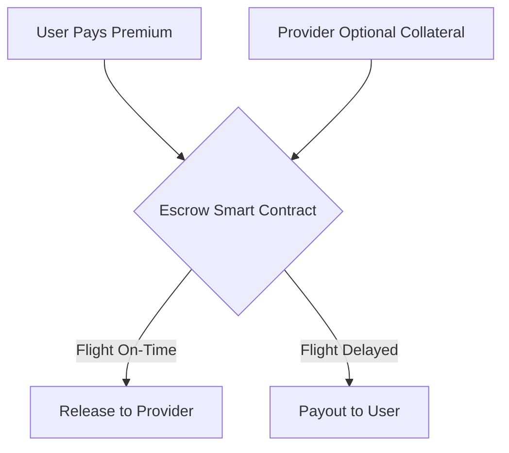

# triggerr Escrow Models (v3 - Drizzle Implementation)

**Document Version**: 3.0
**Last Updated**: 2025-01-27
**Technology Stack**: Drizzle ORM + PostgreSQL + PayGo Blockchain
**Status**: Ready for Implementation

## 1. Introduction

This document outlines the comprehensive escrow model architecture for triggerr's parametric insurance marketplace. Our system supports multiple escrow models to accommodate different provider strategies, user preferences, and regulatory requirements.

### 1.1. Core Objectives

- **Flexibility**: Support multiple escrow models from MVP through enterprise scale
- **Trust**: Minimize counterparty risk through transparent blockchain escrows
- **Capital Efficiency**: Optimize capital requirements for providers
- **Scalability**: Enable efficient pooling and risk distribution
- **Innovation**: Prepare for DeFi integration and advanced mechanisms

### 1.2. Common Fee Structure

- **Platform Fee**: 2.5% of premium (deducted before escrow)
- **Transaction Fee**: Gas costs covered by provider
- **Provider Commission**: Variable per provider (default 5%)

### 1.3. Premium Return Policy

Each escrow model supports two premium return policies:
- **Provider Keeps Premium** (Default): Provider retains premium regardless of payout
- **Return to Customer**: Premium returned to customer along with coverage payout

### 1.4. Escrow Identification Strategy

Escrows are identified using a multi-layer approach:
- **Internal ID**: Database primary key (`text` in Drizzle)
- **Blockchain ID**: PayGo escrow hash
- **Policy Reference**: Links to specific policy for audit trails

## 2. Escrow Model Categories

We've grouped models into three main categories based on their mechanics and complexity:

1. **Basic Escrow Models**: Simple, direct fund handling.
2. **Pooled Escrow Models**: Shared capital pools for efficiency.
3. **Advanced & Innovative Models**: Leveraging DeFi, NFTs, and novel structures.

### 2.1. Drizzle Enum for Escrow Models

The following `escrowModelEnum` in `packages/core/database/schema.ts` defines all supported models:

```typescript
export const escrowModelEnum = pgEnum('escrow_model_type', [
  // Basic Models
  'SINGLE_SIDED',                // User premium only in escrow
  'DUAL_SIDED',                  // User premium and provider coverage in separate escrows
  'COMBINED',                    // User premium and provider coverage in a single escrow
  'HYBRID_PARTIAL_COLLATERAL',   // User premium + partial provider collateral in escrow

  // Pooled Models
  'COLLATERALIZED_PROVIDER_POOL', // Provider maintains a single, on-chain collateralized pool
  'BONDED_LIABILITY_POOL',        // Collateralized pool with third-party audits
  'PEER_TO_PEER_POOL',           // Users and investors pool funds
  'SUBSCRIPTION_BASED_POOL',      // Users pay recurring fees to a central pool

  // Advanced & Innovative Models
  'DYNAMIC_RISK_POOL',           // Pool collateral adjusted by AI based on real-time risk
  'PREDICTION_MARKET',           // Policies become prediction markets
  'SYNTHETIC_DEFI_COVERAGE',     // Uses DeFi protocols for synthetic assets/CDPs
  'NFT_POLICY',                  // Policy minted as a tradable NFT
  'DAO_GOVERNED_POOL',           // P2P or Collateralized Pool governed by a DAO
  'MULTI_ORACLE_VERIFIED'        // Multi-oracle verified payout system
]);

export const premiumReturnPolicyEnum = pgEnum('premium_return_policy', [
  'PROVIDER_KEEPS_PREMIUM',      // Default: Provider keeps premium regardless of outcome
  'RETURN_TO_CUSTOMER'           // Premium returned to customer on payout
]);
```

## 3. Detailed Model Descriptions

### Category 1: Basic Escrow Models

These models involve straightforward escrow mechanisms, typically on a per-policy basis.



#### 3.1. Single-Sided Escrow (MVP - triggerr Direct Default)

**Drizzle Schema Configuration:**
```typescript
// Provider configuration
export const provider = pgTable("provider", {
  // ... other fields
  escrowModel: escrowModelEnum("escrow_model").notNull().default('SINGLE_SIDED'),
  premiumReturnPolicy: premiumReturnPolicyEnum("premium_return_policy").notNull().default('PROVIDER_KEEPS_PREMIUM'),
  collateralRequirement: decimal("collateral_requirement", { precision: 15, scale: 2 }).default('0.00'),
});

// Escrow record
export const escrow = pgTable("escrow", {
  // ... other fields
  escrowModel: escrowModelEnum("escrow_model").notNull().default('SINGLE_SIDED'),
  amount: decimal("amount", { precision: 15, scale: 6 }).notNull(), // Only premium amount
  collateralAmount: decimal("collateral_amount", { precision: 15, scale: 6 }).default('0.00'), // Always 0 for single-sided
});
```

- **Implementation Difficulty**: Low ⭐⭐☆☆☆
- **Mechanism**:
  - User pays premium into PayGo escrow smart contract
  - Provider maintains separate reserve fund for payouts
  - **On-Time**: Escrow releases premium to provider
  - **Delayed**: Premium handling depends on `premiumReturnPolicy`
- **Pros**: High capital efficiency, simple implementation, proven pattern
- **Cons**: Requires trust in provider reserves, less transparency
- **Capital Efficiency**: ⭐⭐⭐⭐⭐ | **User Trust**: ⭐⭐⭐☆☆ | **Scalability**: ⭐⭐⭐⭐⭐

#### 3.2. Dual-Sided Escrow

**Drizzle Schema Configuration:**
```typescript
export const escrow = pgTable("escrow", {
  // ... other fields
  escrowModel: escrowModelEnum("escrow_model").notNull(),
  amount: decimal("amount", { precision: 15, scale: 6 }).notNull(), // Premium amount
  collateralAmount: decimal("collateral_amount", { precision: 15, scale: 6 }).notNull(), // Provider collateral
  escrowConfiguration: jsonb("escrow_configuration"), // Stores dual escrow IDs
});
```

- **Implementation Difficulty**: Medium ⭐⭐⭐☆☆
- **Mechanism**:
  - Two separate PayGo escrows: premium escrow + provider collateral escrow
  - Both escrows expire simultaneously
  - **On-Time**: Premium → Provider, Collateral → Provider
  - **Delayed**: Premium handling per policy + Collateral → User
- **Pros**: Maximum transparency, full collateralization
- **Cons**: High capital requirements, complex escrow management
- **Capital Efficiency**: ⭐⭐☆☆☆ | **User Trust**: ⭐⭐⭐⭐⭐ | **Scalability**: ⭐⭐⭐☆☆

#### 3.3. Combined Escrow

**Drizzle Schema Configuration:**
```typescript
export const escrow = pgTable("escrow", {
  // ... other fields
  escrowModel: escrowModelEnum("escrow_model").notNull(),
  amount: decimal("amount", { precision: 15, scale: 6 }).notNull(), // Premium + collateral combined
  collateralAmount: decimal("collateral_amount", { precision: 15, scale: 6 }).notNull(), // Portion that's collateral
});
```

- **Implementation Difficulty**: Medium ⭐⭐⭐☆☆
- **Mechanism**: Single escrow containing both premium and provider collateral
- **Pros**: Simpler than dual-sided, still fully collateralized
- **Cons**: Requires careful calculation of amounts
- **Capital Efficiency**: ⭐⭐☆☆☆ | **User Trust**: ⭐⭐⭐⭐☆ | **Scalability**: ⭐⭐⭐☆☆

#### 3.4. Hybrid Partial Collateral Escrow

**Drizzle Schema Configuration:**
```typescript
export const provider = pgTable("provider", {
  // ... other fields
  collateralRequirement: decimal("collateral_requirement", { precision: 15, scale: 2 }).notNull(), // e.g., 50% of coverage
});

export const escrow = pgTable("escrow", {
  // ... other fields
  escrowModel: escrowModelEnum("escrow_model").notNull(),
  amount: decimal("amount", { precision: 15, scale: 6 }).notNull(), // Premium + partial collateral
  collateralAmount: decimal("collateral_amount", { precision: 15, scale: 6 }).notNull(), // Partial collateral amount
});
```

- **Implementation Difficulty**: Medium ⭐⭐⭐☆☆
- **Mechanism**: Premium + partial provider collateral (e.g., 50% of coverage)
- **Pros**: Balance between capital efficiency and trust
- **Cons**: Still requires provider reserves for remaining coverage
- **Capital Efficiency**: ⭐⭐⭐☆☆ | **User Trust**: ⭐⭐⭐⭐☆ | **Scalability**: ⭐⭐⭐⭐☆

### Category 2: Pooled Escrow Models

#### 3.5. Collateralized Provider Pool

**Drizzle Schema Configuration:**
```typescript
export const escrowPool = pgTable("escrow_pool", {
  id: text("id").primaryKey(),
  providerId: text("provider_id").notNull().references(() => provider.id),
  escrowModel: escrowModelEnum("escrow_model").notNull(),
  totalCapacity: decimal("total_capacity", { precision: 15, scale: 2 }).notNull(),
  availableBalance: decimal("available_balance", { precision: 15, scale: 2 }).notNull(),
  poolAddress: text("pool_address").unique(), // PayGo pool contract address
  collateralRatio: decimal("collateral_ratio", { precision: 5, scale: 4 }).notNull().default('1.0000'),
});

export const escrow = pgTable("escrow", {
  // ... other fields
  poolId: text("pool_id").references(() => escrowPool.id), // Links to pool instead of individual escrow
});
```

- **Implementation Difficulty**: High ⭐⭐⭐⭐☆
- **Mechanism**: Provider maintains a large collateralized pool, policies draw from it
- **Pros**: High capital efficiency, fast policy issuance
- **Cons**: Complex pool management, smart contract risk
- **Capital Efficiency**: ⭐⭐⭐⭐☆ | **User Trust**: ⭐⭐⭐⭐☆ | **Scalability**: ⭐⭐⭐⭐⭐

#### 3.6. Bonded Liability Pool (Audited Pool)

**Drizzle Schema Configuration:**
```typescript
export const escrowPool = pgTable("escrow_pool", {
  // ... base pool fields
  escrowModel: escrowModelEnum("escrow_model").notNull(),
  auditedAt: timestamp("audited_at"),
  auditReport: text("audit_report"), // IPFS hash or URL
  bondAmount: decimal("bond_amount", { precision: 15, scale: 2 }),
  bondProvider: text("bond_provider"), // Third-party bond issuer
  healthScore: decimal("health_score", { precision: 5, scale: 4 }).default('1.0000'),
});
```

- **Implementation Difficulty**: High ⭐⭐⭐⭐☆
- **Mechanism**: Collateralized pool + third-party bond + regular audits
- **Pros**: Maximum trust, institutional-grade security
- **Cons**: High overhead, regulatory complexity
- **Capital Efficiency**: ⭐⭐⭐☆☆ | **User Trust**: ⭐⭐⭐⭐⭐ | **Scalability**: ⭐⭐⭐⭐☆

#### 3.7. Peer-to-Peer (P2P) Escrow Pool

**Drizzle Schema Configuration:**
```typescript
export const escrowPoolParticipant = pgTable("escrow_pool_participant", {
  id: text("id").primaryKey(),
  poolId: text("pool_id").notNull().references(() => escrowPool.id),
  userId: text("user_id").references(() => user.id),
  contributionAmount: decimal("contribution_amount", { precision: 15, scale: 2 }).notNull(),
  sharePercentage: decimal("share_percentage", { precision: 8, scale: 6 }).notNull(),
  riskTolerance: text("risk_tolerance"), // 'LOW', 'MEDIUM', 'HIGH'
  preferredCategories: jsonb("preferred_categories").$type<string[]>(),
  totalReturns: decimal("total_returns", { precision: 15, scale: 2 }).default('0.00'),
});
```

- **Implementation Difficulty**: Very High ⭐⭐⭐⭐⭐
- **Mechanism**: Users and investors contribute to shared pool, earn returns from successful policies
- **Pros**: Community-driven, high returns potential
- **Cons**: Complex governance, variable capacity
- **Capital Efficiency**: ⭐⭐⭐⭐☆ | **User Trust**: ⭐⭐⭐☆☆ | **Scalability**: ⭐⭐⭐☆☆

#### 3.8. Subscription-Based Pool

**Drizzle Schema Configuration:**
```typescript
export const escrowPoolParticipant = pgTable("escrow_pool_participant", {
  // ... base participant fields
  contributionAmount: decimal("contribution_amount", { precision: 15, scale: 2 }).notNull(), // Monthly contribution
  lockedUntil: timestamp("locked_until"), // Subscription lock period
  joinedAt: timestamp("joined_at").notNull().defaultNow(),
});
```

- **Implementation Difficulty**: High ⭐⭐⭐⭐☆
- **Mechanism**: Users pay monthly fees to shared pool, unlimited coverage during subscription
- **Pros**: Predictable costs, unlimited policies
- **Cons**: Complex actuarial modeling, subscriber churn risk
- **Capital Efficiency**: ⭐⭐⭐⭐⭐ | **User Trust**: ⭐⭐⭐⭐☆ | **Scalability**: ⭐⭐⭐⭐⭐

### Category 3: Advanced & Innovative Models

#### 3.9. Dynamic Risk Pool (AI-Adjusted Collateral)

**Drizzle Schema Configuration:**
```typescript
export const escrowPool = pgTable("escrow_pool", {
  // ... base pool fields
  escrowModel: escrowModelEnum("escrow_model").notNull(),
  collateralRatio: decimal("collateral_ratio", { precision: 5, scale: 4 }).notNull(), // Dynamically adjusted
  healthScore: decimal("health_score", { precision: 5, scale: 4 }).default('1.0000'), // AI-calculated
  lastRebalanceAt: timestamp("last_rebalance_at"),
  nextRebalanceDue: timestamp("next_rebalance_due"),
  configuration: jsonb("configuration"), // AI model parameters
});
```

- **Implementation Difficulty**: Very High ⭐⭐⭐⭐⭐
- **Mechanism**: AI adjusts pool collateral in real-time based on market conditions
- **Pros**: Optimal capital efficiency, adaptive risk management
- **Cons**: AI dependency, complex modeling
- **Capital Efficiency**: ⭐⭐⭐⭐⭐ | **Innovation**: ⭐⭐⭐⭐⭐ | **Scalability**: ⭐⭐⭐⭐⭐

#### 3.10. Prediction Market Model

**Drizzle Schema Configuration:**
```typescript
export const escrow = pgTable("escrow", {
  // ... base escrow fields
  escrowModel: escrowModelEnum("escrow_model").notNull(),
  escrowConfiguration: jsonb("escrow_configuration"), // Market parameters, odds, etc.
});
```

- **Implementation Difficulty**: Very High ⭐⭐⭐⭐⭐
- **Mechanism**: Policies become tradeable prediction market positions
- **Pros**: Price discovery, liquidity, speculation revenue
- **Cons**: Regulatory uncertainty, complexity
- **Innovation**: ⭐⭐⭐⭐⭐ | **Regulatory Risk**: ⭐⭐⭐⭐⭐

#### 3.11. NFT-Policy (Tradable Policy)

**Drizzle Schema Configuration:**
```typescript
export const policy = pgTable("policy", {
  // ... base policy fields
  nftTokenId: text("nft_token_id").unique(), // NFT identifier
  nftContractAddress: text("nft_contract_address"), // NFT contract
  nftMetadataUri: text("nft_metadata_uri"), // IPFS metadata
});

export const escrow = pgTable("escrow", {
  // ... base escrow fields
  escrowModel: escrowModelEnum("escrow_model").notNull(),
  escrowConfiguration: jsonb("escrow_configuration"), // NFT-specific config
});
```

- **Implementation Difficulty**: Very High ⭐⭐⭐⭐⭐
- **Mechanism**: Policy minted as NFT, can be traded on secondary markets
- **Pros**: Liquidity, transferability, new revenue streams
- **Cons**: Technical complexity, regulatory questions
- **Innovation**: ⭐⭐⭐⭐⭐ | **User Experience**: ⭐⭐⭐☆☆

## 4. Implementation Strategy & Phasing

### Phase 1: Foundation (MVP - Q2 2025)
- **Focus**: Launch with simple, reliable models for InsureCo
- **Models**:
  1. **Single-Sided Escrow** (Primary - InsureCo default)
  2. **Combined Escrow** (Alternative for enhanced trust)
- **Drizzle Implementation**:
  - Core escrow schema with `escrowModelEnum`
  - Provider configuration for escrow model selection
  - PayGo integration via `SingleSidedEscrowEngine`
- **Timeline**: 6-8 weeks

### Phase 2: Enhanced Trust & Multi-Provider (Q3 2025)
- **Focus**: Support additional providers with different escrow preferences
- **Models**:
  1. **Dual-Sided Escrow** (For premium providers)
  2. **Hybrid Partial Collateral** (Balanced approach)
- **Drizzle Implementation**:
  - Extended escrow schema with collateral tracking
  - `DualSidedEscrowEngine` and `HybridEscrowEngine`
  - Provider onboarding with escrow model selection
- **Timeline**: 8-10 weeks

### Phase 3: Pooled Models (Q4 2025)
- **Focus**: Capital efficiency and institutional providers
- **Models**:
  1. **Collateralized Provider Pool**
  2. **Bonded Liability Pool** (Enterprise tier)
- **Drizzle Implementation**:
  - `escrowPool` and `escrowPoolParticipant` tables
  - Pool management engines
  - Audit and compliance tracking
- **Timeline**: 12-16 weeks

### Phase 4: Innovation & DeFi (Q1-Q2 2026)
- **Focus**: Advanced models and DeFi integration
- **Models**:
  1. **P2P Pool** (Community participation)
  2. **Dynamic Risk Pool** (AI-powered)
  3. **NFT-Policy** (Experimental)
- **Drizzle Implementation**:
  - Advanced pool participant management
  - NFT integration tables
  - AI/ML model parameter storage
- **Timeline**: 16-20 weeks

## 5. Consolidated Comparison Table

| Model | Capital Eff. | User Trust | Implementation | Innovation | Regulatory Risk |
|-------|-------------|------------|----------------|-----------|----------------|
| Single-Sided | ⭐⭐⭐⭐⭐ | ⭐⭐⭐☆☆ | ⭐⭐☆☆☆ | ⭐☆☆☆☆ | ⭐☆☆☆☆ |
| Dual-Sided | ⭐⭐☆☆☆ | ⭐⭐⭐⭐⭐ | ⭐⭐⭐☆☆ | ⭐☆☆☆☆ | ⭐☆☆☆☆ |
| Combined | ⭐⭐☆☆☆ | ⭐⭐⭐⭐☆ | ⭐⭐⭐☆☆ | ⭐☆☆☆☆ | ⭐☆☆☆☆ |
| Hybrid Partial | ⭐⭐⭐☆☆ | ⭐⭐⭐⭐☆ | ⭐⭐⭐☆☆ | ⭐⭐☆☆☆ | ⭐☆☆☆☆ |
| Provider Pool | ⭐⭐⭐⭐☆ | ⭐⭐⭐⭐☆ | ⭐⭐⭐⭐☆ | ⭐⭐⭐☆☆ | ⭐⭐☆☆☆ |
| Bonded Pool | ⭐⭐⭐☆☆ | ⭐⭐⭐⭐⭐ | ⭐⭐⭐⭐☆ | ⭐⭐⭐☆☆ | ⭐⭐☆☆☆ |
| P2P Pool | ⭐⭐⭐⭐☆ | ⭐⭐⭐☆☆ | ⭐⭐⭐⭐⭐ | ⭐⭐⭐⭐☆ | ⭐⭐⭐☆☆ |
| Dynamic AI | ⭐⭐⭐⭐⭐ | ⭐⭐⭐⭐☆ | ⭐⭐⭐⭐⭐ | ⭐⭐⭐⭐⭐ | ⭐⭐⭐☆☆ |
| NFT-Policy | ⭐⭐⭐☆☆ | ⭐⭐⭐☆☆ | ⭐⭐⭐⭐⭐ | ⭐⭐⭐⭐⭐ | ⭐⭐⭐⭐☆ |

## 6. Technical Requirements (Summary)

### Drizzle Schema Requirements
1. **Core Enums**: `escrowModelEnum`, `premiumReturnPolicyEnum`
2. **Provider Configuration**: Escrow model selection, collateral requirements
3. **Escrow Tracking**: Model-specific amount tracking, pool references
4. **Pool Management**: Capacity, participants, health monitoring
5. **Audit Trails**: Complete escrow lifecycle logging

### PayGo Integration Requirements
1. **Escrow Engines**: Model-specific PayGo transaction handling
2. **Multi-Escrow Support**: For dual-sided and pooled models
3. **Pool Contracts**: Smart contracts for pooled models
4. **Event Monitoring**: Real-time escrow status tracking

### Infrastructure Requirements
1. **Database**: PostgreSQL with Drizzle ORM
2. **Blockchain**: PayGo network integration
3. **Monitoring**: Escrow health and pool management
4. **APIs**: RESTful endpoints for escrow operations

## 7. Conclusion

This multi-model escrow architecture positions triggerr as the most flexible parametric insurance platform. Starting with Simple Single-Sided escrows for MVP (InsureCo), we can progressively add sophisticated models to attract different provider types and user segments.

The Drizzle-based schema provides strong typing and performance while maintaining flexibility for future model additions. The phased approach ensures we deliver value quickly while building toward innovative DeFi integrations.

**Key Success Factors:**
1. **Start Simple**: Single-sided escrow for MVP
2. **Provider Choice**: Let providers select their preferred model
3. **Transparent Implementation**: Open-source escrow engines
4. **Regulatory Compliance**: Phase advanced models carefully
5. **User Education**: Clear explanations of each model's trade-offs

**Next Steps:**
1. Implement Drizzle schema with escrow model support
2. Build `SingleSidedEscrowEngine` for InsureCo MVP
3. Create provider onboarding with escrow model selection
4. Develop escrow monitoring and management tools
5. Plan Phase 2 models based on provider feedback

---

**Document Maintainers**: Insurance Engineering Team
**Review Schedule**: Monthly during active phases
**Implementation Status**: Phase 1 - Ready for Development
